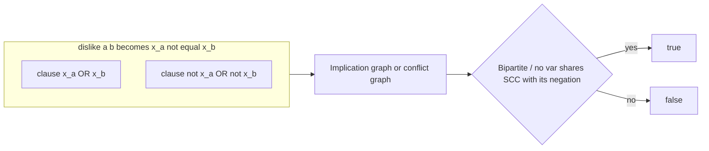
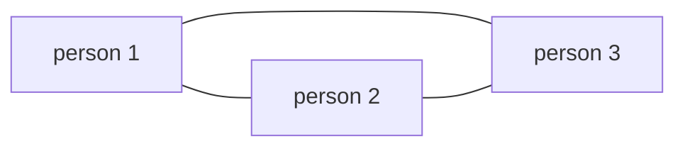

# LeetCode 886 — Possible Bipartition (via 2-SAT / 2-Coloring)

| | |
|---|---|
| **Source** | LeetCode 886 |
| **Difficulty** | Medium |
| **Topics** | 2-SAT, Bipartite 2-Coloring, Implication Graph, Graph, BFS/DFS |
| **Link** | https://leetcode.com/problems/possible-bipartition/ |

---

## Problem Statement

We have $n$ people labeled $1..n$. A list of `dislikes` pairs $[a, b]$ states that person $a$ and person $b$ must **not** be in the same group. Split everyone into **two** groups so that no disliking pair shares a group, or report it is impossible.

- **Input:** integer $n$ and a list `dislikes` of pairs $[a, b]$.
- **Output:** `true` if a valid bipartition exists, else `false`.
- **Constraints:** $1 \le n \le 2000$, $0 \le \text{dislikes.length} \le 10^4$, pairs are distinct, $a \neq b$.

Let $x_i = \text{true}$ mean person $i$ is in **group A** (and false means **group B**). A dislike pair $[a, b]$ demands $a$ and $b$ differ, i.e. $x_a \neq x_b$, which in 2-CNF is the conjunction of two clauses:

$$
x_a \neq x_b \iff (x_a \lor x_b) \land (\neg x_a \lor \neg x_b).
$$

The question "can all constraints hold?" is satisfiability of $\bigwedge_{[a,b]} (x_a \neq x_b)$ — a **2-SAT** instance whose every clause is an *inequality*.

```text
Input
n = 4, dislikes = [[1,2],[1,3],[2,4]]

Output
true

A valid split: group A = {1,4}, group B = {2,3}.
```

```text
Input
n = 3, dislikes = [[1,2],[1,3],[2,3]]

Output
false

The three mutual dislikes form an odd cycle (triangle) — no 2-coloring exists.
```

## Approach (WHY)

Because every clause is an inequality $x_a \neq x_b$, this 2-SAT instance is precisely a **graph 2-coloring** problem: build an undirected "conflict" graph with an edge for each dislike, and a valid bipartition exists **iff** that graph is bipartite (no odd cycle). Two equivalent solutions:

1. **2-SAT modeling.** Add the two inequality clauses per pair into the implication graph and run the SCC criterion. This is the general 2-SAT machine and recovers the actual group assignment.
2. **Direct 2-coloring.** BFS/DFS each component coloring neighbors with the opposite color; a conflict (an edge between same-colored nodes) ⇒ `false`. This is the specialized, lighter solution.

We present **both**: the 2-SAT formulation (faithful to the requested modeling) and the coloring solution (the idiomatic LeetCode answer). For an inequality-only formula the SCC structure mirrors bipartiteness exactly, so the two always agree.



The implication encoding uses the interleaved nodes of [guide 13](../guide/13-two-sat.md); people are stored `0`-indexed internally (`a-1`, `b-1`).

## Solution

### Python

```python
from collections import deque
from typing import List


class Solution:
    def possibleBipartition(self, n: int, dislikes: List[List[int]]) -> bool:
        # ----- Solution 1: direct 2-coloring (BFS) -----
        graph = [[] for _ in range(n)]
        for a, b in dislikes:
            graph[a - 1].append(b - 1)     # undirected conflict edge
            graph[b - 1].append(a - 1)

        color = [0] * n                    # 0 = uncolored, 1 / -1 = groups
        for s in range(n):
            if color[s] != 0:
                continue
            color[s] = 1
            q = deque([s])
            while q:
                u = q.popleft()
                for v in graph[u]:
                    if color[v] == 0:
                        color[v] = -color[u]   # opposite group
                        q.append(v)
                    elif color[v] == color[u]:
                        return False           # same group => conflict
        return True

    def possibleBipartition_2sat(self, n: int, dislikes: List[List[int]]) -> bool:
        # ----- Solution 2: explicit 2-SAT via implication graph + SCC -----
        adj = [[] for _ in range(2 * n)]   # interleaved literal-nodes

        def node(var, is_true):
            return 2 * var + (0 if is_true else 1)

        def add_clause(a, b):              # node ids; (a OR b)
            adj[a ^ 1].append(b)
            adj[b ^ 1].append(a)

        for a, b in dislikes:
            a -= 1; b -= 1
            # x_a != x_b  ==  (x_a OR x_b) AND (not x_a OR not x_b)
            add_clause(node(a, True), node(b, True))
            add_clause(node(a, False), node(b, False))

        N = 2 * n
        disc = [-1] * N
        low = [0] * N
        comp = [-1] * N
        on_stack = [False] * N
        scc_stack = []
        timer = 0
        ncomp = 0

        for start in range(N):
            if disc[start] != -1:
                continue
            work = [(start, 0)]
            while work:
                u, i = work[-1]
                if i == 0:
                    disc[u] = low[u] = timer
                    timer += 1
                    scc_stack.append(u)
                    on_stack[u] = True
                if i < len(adj[u]):
                    work[-1] = (u, i + 1)
                    v = adj[u][i]
                    if disc[v] == -1:
                        work.append((v, 0))
                    elif on_stack[v]:
                        low[u] = min(low[u], disc[v])
                else:
                    if low[u] == disc[u]:
                        while True:
                            w = scc_stack.pop()
                            on_stack[w] = False
                            comp[w] = ncomp
                            if w == u:
                                break
                        ncomp += 1
                    work.pop()
                    if work:
                        p = work[-1][0]
                        low[p] = min(low[p], low[u])

        for i in range(n):
            if comp[2 * i] == comp[2 * i + 1]:
                return False
        return True
```

### C++

```cpp
#include <bits/stdc++.h>
using namespace std;

class Solution {
public:
    // ----- Solution 1: direct 2-coloring (BFS) -----
    bool possibleBipartition(int n, vector<vector<int>>& dislikes) {
        vector<vector<int>> graph(n);
        for (auto& e : dislikes) {
            graph[e[0] - 1].push_back(e[1] - 1);   // undirected conflict edge
            graph[e[1] - 1].push_back(e[0] - 1);
        }
        vector<int> color(n, 0);                   // 0 = uncolored, 1/-1 = groups
        for (int s = 0; s < n; ++s) {
            if (color[s] != 0) continue;
            color[s] = 1;
            queue<int> q;
            q.push(s);
            while (!q.empty()) {
                int u = q.front(); q.pop();
                for (int v : graph[u]) {
                    if (color[v] == 0) {
                        color[v] = -color[u];       // opposite group
                        q.push(v);
                    } else if (color[v] == color[u]) {
                        return false;               // same group => conflict
                    }
                }
            }
        }
        return true;
    }

    // ----- Solution 2: explicit 2-SAT via implication graph + SCC -----
    bool possibleBipartition2SAT(int n, vector<vector<int>>& dislikes) {
        int N = 2 * n;                             // interleaved literal-nodes
        vector<vector<int>> adj(N);

        auto node = [](int var, bool isTrue) { return 2 * var + (isTrue ? 0 : 1); };
        auto addClause = [&](int a, int b) {       // (a OR b)
            adj[a ^ 1].push_back(b);
            adj[b ^ 1].push_back(a);
        };

        for (auto& e : dislikes) {
            int a = e[0] - 1, b = e[1] - 1;
            // x_a != x_b == (x_a OR x_b) AND (not x_a OR not x_b)
            addClause(node(a, true), node(b, true));
            addClause(node(a, false), node(b, false));
        }

        vector<int> disc(N, -1), low(N, 0), comp(N, -1);
        vector<char> onStack(N, 0);
        vector<int> sccStack;
        sccStack.reserve(N);
        int timer = 0, ncomp = 0;

        for (int start = 0; start < N; ++start) {
            if (disc[start] != -1) continue;
            vector<pair<int,int>> work;
            work.push_back({start, 0});
            while (!work.empty()) {
                int u = work.back().first;
                int& i = work.back().second;
                if (i == 0) {
                    disc[u] = low[u] = timer++;
                    sccStack.push_back(u);
                    onStack[u] = 1;
                }
                if (i < (int)adj[u].size()) {
                    int v = adj[u][i++];
                    if (disc[v] == -1) {
                        work.push_back({v, 0});
                    } else if (onStack[v]) {
                        low[u] = min(low[u], disc[v]);
                    }
                } else {
                    if (low[u] == disc[u]) {
                        while (true) {
                            int w = sccStack.back(); sccStack.pop_back();
                            onStack[w] = 0;
                            comp[w] = ncomp;
                            if (w == u) break;
                        }
                        ++ncomp;
                    }
                    work.pop_back();
                    if (!work.empty()) {
                        int p = work.back().first;
                        low[p] = min(low[p], low[u]);
                    }
                }
            }
        }

        for (int i = 0; i < n; ++i)
            if (comp[2 * i] == comp[2 * i + 1]) return false;  // x_i and not x_i collide
        return true;
    }
};
```

## Iteration Trace

Second sample (the impossible triangle): $n = 3$, dislikes `[[1,2],[1,3],[2,3]]`. The **2-coloring** BFS from person 1:

| Step | Pop | Neighbor | Action | Colors $(1,2,3)$ |
|---|---|---|---|---|
| 1 | 1 | — | color 1 = A | (A, ?, ?) |
| 2 | 1 | 2 | color 2 = B | (A, B, ?) |
| 3 | 1 | 3 | color 3 = B | (A, B, B) |
| 4 | 2 | 3 | 3 already B = color(2) | **conflict → false** |

Persons 2 and 3 dislike each other but both landed in group B → not bipartite.

In the **2-SAT** view each pair $[a,b]$ adds inequality clauses; the triangle creates a chain of implications driving some $x_i$ and $\neg x_i$ into the same SCC, so the criterion `comp[2i] != comp[2i+1]` fails. Both methods return `false`.



The odd cycle (triangle) above is the structural reason no 2-coloring / no satisfying assignment exists.

## Complexity

Let $n$ be people and $d$ the number of dislike pairs. The conflict graph (and implication graph) has $O(n)$ nodes and $O(d)$ edges:

$$
T(n, d) = O(n + d), \qquad S(n, d) = O(n + d).
$$

| Approach | Time | Space |
|---|---|---|
| 2-coloring BFS/DFS | $O(n + d)$ | $O(n + d)$ |
| 2-SAT (implication graph + SCC) | $O(n + d)$ | $O(n + d)$ |

## Takeaway

An "inequality-only" 2-SAT (every clause is $x_a \neq x_b$) **is** a 2-coloring / bipartiteness check: the implication-graph SCC criterion and the odd-cycle test give the same answer. Reach for direct 2-coloring when you only need feasibility (see [guide 04](../guide/04-bipartite-2coloring.md)); reach for the full 2-SAT machine of [guide 13](../guide/13-two-sat.md) when clauses are mixed (not all inequalities) or when you must recover the actual group assignment.
