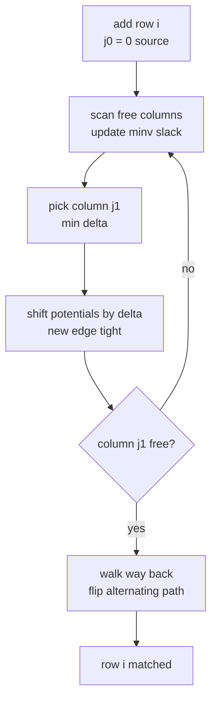
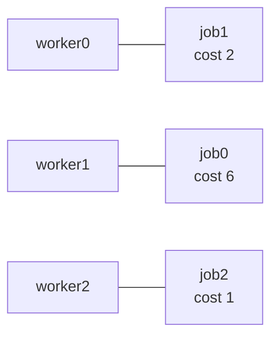

# The Assignment Problem — Hungarian Algorithm ($O(n^3)$)

| Meta | Value |
|------|-------|
| Source | Classic combinatorial optimization (Kuhn–Munkres) |
| Difficulty | Medium–Hard |
| Topics | Assignment, Bipartite Matching, Hungarian Algorithm, LP Duality |
| Link | https://cp-algorithms.com/graph/hungarian-algorithm.html |

---

## Problem Statement

We have $n$ **workers** and $n$ **jobs**. Assigning worker $i$ to job $j$ costs $c_{ij}$, given as a
full $n \times n$ matrix. Assign each worker to exactly one job and each job to exactly one worker
(a **perfect matching** / bijection $\sigma$) so the total cost is minimized:

$$\min_{\sigma \in S_n} \ \sum_{i=1}^{n} c_{i,\sigma(i)}.$$

This complements [assignment-problem-mcmf.md](assignment-problem-mcmf.md), which solves the *same*
problem via min-cost max-flow; here we use the specialized $O(n^3)$ Hungarian algorithm.

**Example**
```
n = 3
cost matrix (rows = workers, cols = jobs):

        job0  job1  job2
work0     9     2     7
work1     6     4     3
work2     5     8     1

Optimal assignment:
  worker0 -> job1   (cost 2)
  worker1 -> job0   (cost 6)
  worker2 -> job2   (cost 1)
  -----------------------------
  total minimum cost = 2 + 6 + 1 = 9
```

---

## Approach (WHY)

By **LP duality** the assignment LP is totally unimodular, so its optimum is an integral perfect
matching. Maintain dual **potentials** $u_i$ (rows) and $v_j$ (columns) that stay *feasible*:

$$u_i + v_j \ \le\ c_{ij} \quad \text{for all } i, j.$$

By **complementary slackness**, an edge may be used only when it is **tight** ($u_i + v_j =
c_{ij}$). The Hungarian algorithm adds one row at a time, runs a Dijkstra-like search over reduced
costs $c_{ij} - u_i - v_j \ge 0$, and shifts potentials by the **minimum slack** $\delta$ to make a
new edge tight, until an augmenting path completes the matching for that row.



See the full derivation in [15-hungarian-general-matching.md](../guide/15-hungarian-general-matching.md).

---

## Solution

### Python

```python
INF = float("inf")

def hungarian(cost):
    """Minimum-cost perfect assignment for an n x n matrix.
    Returns (total_cost, assign) with assign[i] = column chosen for row i."""
    n = len(cost)
    u = [0] * (n + 1)          # row potentials (1-indexed)
    v = [0] * (n + 1)          # column potentials
    p = [0] * (n + 1)          # p[j] = row matched to column j
    way = [0] * (n + 1)        # path reconstruction
    for i in range(1, n + 1):
        p[0] = i
        j0 = 0
        minv = [INF] * (n + 1)
        used = [False] * (n + 1)
        while True:
            used[j0] = True
            i0 = p[j0]
            delta = INF
            j1 = -1
            for j in range(1, n + 1):
                if not used[j]:
                    cur = cost[i0 - 1][j - 1] - u[i0] - v[j]   # reduced cost
                    if cur < minv[j]:
                        minv[j] = cur
                        way[j] = j0
                    if minv[j] < delta:
                        delta = minv[j]
                        j1 = j
            for j in range(n + 1):
                if used[j]:
                    u[p[j]] += delta
                    v[j] -= delta
                else:
                    minv[j] -= delta
            j0 = j1
            if p[j0] == 0:
                break
        while j0:                       # augment along the path
            j1 = way[j0]
            p[j0] = p[j1]
            j0 = j1
    assign = [0] * n
    for j in range(1, n + 1):
        assign[p[j] - 1] = j - 1
    total = sum(cost[i][assign[i]] for i in range(n))
    return total, assign


if __name__ == "__main__":
    cost = [
        [9, 2, 7],
        [6, 4, 3],
        [5, 8, 1],
    ]
    total, assign = hungarian(cost)
    print(total)     # 9
    print(assign)    # [1, 0, 2]
```

### C++

```cpp
#include <bits/stdc++.h>
using namespace std;

// Minimum-cost perfect assignment for an n x n matrix.
// Returns total cost; fills assign[i] = column chosen for row i.
long long hungarian(const vector<vector<long long>>& cost, vector<int>& assign) {
    const long long INF = 1e18;
    int n = (int)cost.size();
    vector<long long> u(n + 1, 0), v(n + 1, 0);
    vector<int> p(n + 1, 0), way(n + 1, 0);     // p[j] = row matched to column j
    for (int i = 1; i <= n; ++i) {
        p[0] = i;
        int j0 = 0;
        vector<long long> minv(n + 1, INF);
        vector<char> used(n + 1, false);
        do {
            used[j0] = true;
            int i0 = p[j0], j1 = -1;
            long long delta = INF;
            for (int j = 1; j <= n; ++j) {
                if (!used[j]) {
                    long long cur = cost[i0 - 1][j - 1] - u[i0] - v[j];  // reduced cost
                    if (cur < minv[j]) { minv[j] = cur; way[j] = j0; }
                    if (minv[j] < delta) { delta = minv[j]; j1 = j; }
                }
            }
            for (int j = 0; j <= n; ++j) {
                if (used[j]) { u[p[j]] += delta; v[j] -= delta; }
                else          minv[j] -= delta;
            }
            j0 = j1;
        } while (p[j0] != 0);
        do {                                    // augment along the path
            int j1 = way[j0];
            p[j0] = p[j1];
            j0 = j1;
        } while (j0);
    }
    assign.assign(n, 0);
    for (int j = 1; j <= n; ++j) assign[p[j] - 1] = j - 1;
    long long total = 0;
    for (int i = 0; i < n; ++i) total += cost[i][assign[i]];
    return total;
}

int main() {
    vector<vector<long long>> cost = {
        {9, 2, 7},
        {6, 4, 3},
        {5, 8, 1},
    };
    vector<int> assign;
    cout << hungarian(cost, assign) << "\n";    // 9
    for (int x : assign) cout << x << ' ';      // 1 0 2
    cout << "\n";
    return 0;
}
```

---

## Iteration Trace

Processing rows of the example matrix one at a time (potentials start at 0):

| Row added | Search picks | New tight edge | Partial assignment `p[j]→row` | Notes |
|-----------|--------------|----------------|-------------------------------|-------|
| 0 | col 1 (cost 2, min in row 0) | (0,1) | job1→w0 | cheapest column for worker 0 |
| 1 | col 0 (cost 6) | (1,0) | job0→w1, job1→w0 | no conflict yet |
| 2 | col 2 (cost 1) | (2,2) | job0→w1, job1→w0, job2→w2 | completes perfect matching |

Final `p`: column 0→worker1, column 1→worker0, column 2→worker2, giving
`assign = [1, 0, 2]` and total $2 + 6 + 1 = 9$.



---

## Complexity

Each of the $n$ rows runs at most $n$ frontier expansions, each scanning $O(n)$ columns:

$$T(n) = O(n^3), \qquad \text{space } O(n^2)\ \text{(the cost matrix)}.$$

| Resource | Bound |
|----------|-------|
| Time | $O(n^3)$ |
| Space | $O(n^2)$ |

---

## Takeaway

The Hungarian algorithm is the **specialized, small-constant** way to solve a square min-cost
assignment: maintain feasible row/column potentials, keep all reduced costs non-negative, and shift
by the minimum slack to expose a new tight edge each step. Negate the matrix for the maximization
variant; pad to a square for non-square inputs. When you need capacities or side constraints
instead, model it as MCMF ([assignment-problem-mcmf.md](assignment-problem-mcmf.md)).
