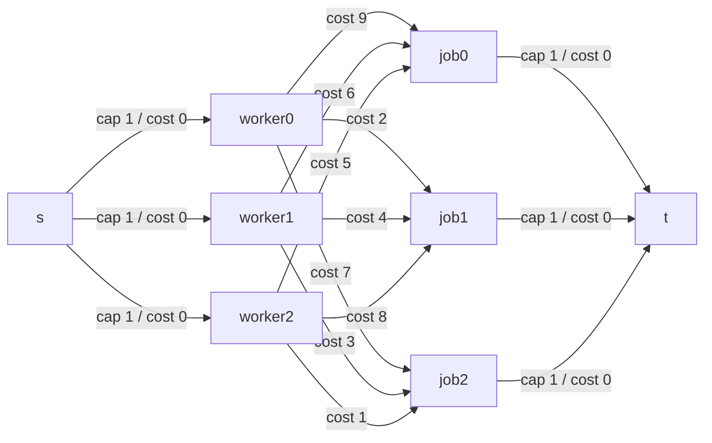

# The Assignment Problem — Min-Cost Max-Flow (and the Hungarian Algorithm)

| Meta | Value |
|------|-------|
| Source | Classic combinatorial optimization (Kőnig / Kuhn–Munkres) |
| Difficulty | Medium–Hard |
| Topics | Min-Cost Max-Flow, Bipartite Matching, Assignment, Hungarian Algorithm |
| Link | https://cp-algorithms.com/graph/min_cost_flow.html |

---

## Problem Statement

We have $n$ **workers** and $n$ **jobs**. Assigning worker $i$ to job $j$ costs $\text{cost}[i][j]$.
Each worker is assigned to **exactly one** job and each job receives **exactly one** worker (a
*perfect matching*). Find an assignment that **minimizes the total cost**.

**Example**
```
n = 3
cost matrix (rows = workers, cols = jobs):

        job0  job1  job2
work0     9     2     7
work1     6     4     3
work2     5     8     1

Optimal assignment:
  worker0 -> job1   (cost 2)
  worker1 -> job0   (cost 6)
  worker2 -> job2   (cost 1)
  -----------------------------
  total minimum cost = 2 + 6 + 1 = 9
```

No other perfect matching beats total cost $9$ (e.g. the greedy "each worker takes their own
cheapest job" picks job1, job2, job2 — a conflict — and is not even feasible).

---

## Approach (WHY)

Model the assignment as a **flow network** and run **min-cost max-flow**:

- A **source** $s$ and a **sink** $t$.
- An edge $s \to \text{worker}_i$ with **cap 1, cost 0** for each worker — each worker supplies one
  unit of "assignment".
- An edge $\text{worker}_i \to \text{job}_j$ with **cap 1, cost $\text{cost}[i][j]$** for every
  pair — choosing this edge means "assign $i$ to $j$".
- An edge $\text{job}_j \to t$ with **cap 1, cost 0** for each job — each job absorbs one unit.

Because all source and sink edges have capacity 1, **each worker sends exactly one unit and each
job receives exactly one unit** — precisely a perfect matching. The **maximum flow equals $n$**
(every worker matched), and minimizing cost over all maximum flows yields the
**minimum-cost perfect matching**. Successive shortest augmenting paths guarantee min-cost at every
flow value, so the value-$n$ flow is the optimal assignment.



(Worker→job edges all have cap 1; only the cost is shown.)

**Alternative — the Hungarian algorithm (Kuhn–Munkres).** This specialized $O(n^3)$ method solves
the assignment problem directly using *dual potentials* on rows and columns, repeatedly augmenting
along equality-subgraph paths. It is the same successive-shortest-path idea specialized to a
complete bipartite graph; MCMF with Johnson potentials achieves the same asymptotic
$O(n^3 \log n)$ and is more flexible (handles non-square / partial assignment, extra constraints).

### Node numbering

We map: `s = 0`, workers `1..n`, jobs `n+1..2n`, `t = 2n+1` — a total of $2n + 2$ nodes.

---

## Solution — Python

```python
from collections import deque

INF = float("inf")

class MCMF:
    """Min-cost max-flow via successive shortest paths (SPFA by cost)."""

    def __init__(self, n):
        self.n = n
        self.graph = [[] for _ in range(n)]
        self.edges = []                       # [to, cap, cost]

    def add_edge(self, u, v, cap, cost):
        self.graph[u].append(len(self.edges))
        self.edges.append([v, cap, cost])
        self.graph[v].append(len(self.edges))
        self.edges.append([u, 0, -cost])      # reverse: cap 0, negated cost

    def _spfa(self, s, t):
        dist = [INF] * self.n
        in_queue = [False] * self.n
        parent = [-1] * self.n
        dist[s] = 0
        q = deque([s]); in_queue[s] = True
        while q:
            u = q.popleft(); in_queue[u] = False
            for eid in self.graph[u]:
                v, cap, cost = self.edges[eid]
                if cap > 0 and dist[u] + cost < dist[v]:
                    dist[v] = dist[u] + cost
                    parent[v] = eid
                    if not in_queue[v]:
                        q.append(v); in_queue[v] = True
        return dist[t], parent

    def min_cost_max_flow(self, s, t):
        total_flow = 0
        total_cost = 0
        while True:
            d, parent = self._spfa(s, t)
            if d == INF:                      # no augmenting path -> done
                break
            push = INF
            v = t
            while v != s:                     # bottleneck along the path
                push = min(push, self.edges[parent[v]][1])
                v = self.edges[parent[v] ^ 1][0]
            v = t
            while v != s:                     # apply flow on residual graph
                self.edges[parent[v]][1] -= push
                self.edges[parent[v] ^ 1][1] += push
                v = self.edges[parent[v] ^ 1][0]
            total_flow += push
            total_cost += push * d
        return total_flow, total_cost


def assignment_min_cost(cost):
    n = len(cost)
    s, t = 0, 2 * n + 1
    mc = MCMF(2 * n + 2)
    for i in range(n):
        mc.add_edge(s, 1 + i, 1, 0)           # source -> worker i
        mc.add_edge(1 + n + i, t, 1, 0)       # job i -> sink
    for i in range(n):
        for j in range(n):
            mc.add_edge(1 + i, 1 + n + j, 1, cost[i][j])  # worker i -> job j
    flow, total = mc.min_cost_max_flow(s, t)
    # recover assignment: worker i -> job j where edge i->j is saturated (cap now 0)
    assign = [-1] * n
    for i in range(n):
        for eid in mc.graph[1 + i]:
            to, cap, c = mc.edges[eid]
            if (1 + n) <= to <= (2 * n) and cap == 0:  # forward edge used up
                assign[i] = to - (1 + n)
                break
    return total, assign


if __name__ == "__main__":
    cost = [
        [9, 2, 7],
        [6, 4, 3],
        [5, 8, 1],
    ]
    total, assign = assignment_min_cost(cost)
    print(total)            # 9
    print(assign)           # [1, 0, 2]
```

## Solution — C++

```cpp
#include <bits/stdc++.h>
using namespace std;

struct MCMF {
    struct Edge { int to; long long cap, cost; };
    int n;
    vector<Edge> edges;                 // edges[i] and edges[i^1] are a pair
    vector<vector<int>> graph;
    const long long INF = (long long)4e18;

    MCMF(int n) : n(n), graph(n) {}

    void add_edge(int u, int v, long long cap, long long cost) {
        graph[u].push_back((int)edges.size());
        edges.push_back({v, cap, cost});
        graph[v].push_back((int)edges.size());
        edges.push_back({u, 0, -cost});      // reverse: cap 0, negated cost
    }

    long long spfa(int s, int t, vector<int>& parent) {
        vector<long long> dist(n, INF);
        vector<char> in_queue(n, 0);
        parent.assign(n, -1);
        dist[s] = 0;
        deque<int> q = {s}; in_queue[s] = 1;
        while (!q.empty()) {
            int u = q.front(); q.pop_front(); in_queue[u] = 0;
            for (int eid : graph[u]) {
                const Edge& e = edges[eid];
                if (e.cap > 0 && dist[u] + e.cost < dist[e.to]) {
                    dist[e.to] = dist[u] + e.cost;
                    parent[e.to] = eid;
                    if (!in_queue[e.to]) { q.push_back(e.to); in_queue[e.to] = 1; }
                }
            }
        }
        return dist[t];
    }

    pair<long long, long long> min_cost_max_flow(int s, int t) {
        long long total_flow = 0, total_cost = 0;
        vector<int> parent;
        while (true) {
            long long d = spfa(s, t, parent);
            if (d == INF) break;             // no augmenting path -> done
            long long push = INF;            // bottleneck along the path
            for (int v = t; v != s; v = edges[parent[v] ^ 1].to)
                push = min(push, edges[parent[v]].cap);
            for (int v = t; v != s; v = edges[parent[v] ^ 1].to) {
                edges[parent[v]].cap     -= push;   // apply flow
                edges[parent[v] ^ 1].cap += push;
            }
            total_flow += push;
            total_cost += push * d;
        }
        return {total_flow, total_cost};
    }
};

int main() {
    int n = 3;
    vector<vector<long long>> cost = {
        {9, 2, 7},
        {6, 4, 3},
        {5, 8, 1},
    };
    int s = 0, t = 2 * n + 1;
    MCMF mc(2 * n + 2);
    for (int i = 0; i < n; i++) {
        mc.add_edge(s, 1 + i, 1, 0);             // source -> worker i
        mc.add_edge(1 + n + i, t, 1, 0);         // job i -> sink
    }
    for (int i = 0; i < n; i++)
        for (int j = 0; j < n; j++)
            mc.add_edge(1 + i, 1 + n + j, 1, cost[i][j]);  // worker -> job

    auto [flow, total] = mc.min_cost_max_flow(s, t);
    cout << total << "\n";                        // 9

    // recover assignment: saturated worker->job edge (forward cap == 0)
    for (int i = 0; i < n; i++)
        for (int eid : mc.graph[1 + i]) {
            auto& e = mc.edges[eid];
            if (e.to >= 1 + n && e.to <= 2 * n && e.cap == 0) {
                cout << "worker " << i << " -> job " << (e.to - (1 + n)) << "\n";
                break;
            }
        }
    return 0;
}
```

---

## Iteration Trace

Running successive shortest paths on the example (`s→worker→job→t`, all source/sink edges cost 0,
worker→job edges carry the matrix cost). Each phase pushes 1 unit (all capacities are 1):

| Phase | Cheapest augmenting path | Path cost | Δ flow | Total flow | Total cost |
|-------|--------------------------|-----------|--------|-----------|-----------|
| 1 | s → w2 → job2 → t | 1 | 1 | 1 | 1 |
| 2 | s → w0 → job1 → t | 2 | 1 | 2 | 3 |
| 3 | s → w1 → job0 → t | 6 | 1 | 3 | 9 |
| 4 | (no s→t path with residual capacity) | — | 0 | 3 | 9 |

Max flow $= 3 = n$ (perfect matching), minimum total cost $= 9$. In general a phase may **reroute**
an earlier assignment by traversing a reverse (refund) edge; on this example the cheapest paths
happen to be conflict-free.

---

## Math

Let $x_{ij} \in \{0, 1\}$ indicate worker $i$ assigned to job $j$. The assignment problem is the
integer program

$$\min \sum_{i=1}^{n} \sum_{j=1}^{n} \text{cost}[i][j] \, x_{ij}$$

subject to $\sum_j x_{ij} = 1$ for all $i$, $\sum_i x_{ij} = 1$ for all $j$, $x_{ij} \ge 0$.

The constraint matrix is **totally unimodular**, so the LP relaxation has an integral optimum —
exactly why the **min-cost max-flow** of value $n$ returns a valid $\{0,1\}$ assignment. With
Johnson potentials each phase Dijkstra runs in $O(E \log V)$, and the **reduced cost**

$$c'(u,v) = c(u,v) + h(u) - h(v) \ge 0$$

keeps it valid despite negative reverse edges.

---

## Complexity

| Method | Time | Space |
|--------|------|-------|
| MCMF + SPFA | $O(n \cdot VE) = O(n \cdot n \cdot n^2) = O(n^4)$ worst | $O(n^2)$ |
| MCMF + Dijkstra/Johnson potentials | $O(n \cdot E \log V) = O(n^3 \log n)$ | $O(n^2)$ |
| Hungarian (Kuhn–Munkres) | $O(n^3)$ | $O(n^2)$ |

Here $V = 2n + 2$, $E = O(n^2)$, and the number of augmenting phases is exactly $n$.

---

## Takeaway

The assignment problem is a **minimum-cost perfect matching**, cleanly expressed as min-cost
max-flow: unit-capacity source→worker and job→sink edges force a perfect matching, while the
worker→job costs drive the objective. MCMF (with potentials) matches the Hungarian algorithm's
asymptotics and generalizes to non-square, partial, and constrained variants — making it the
go-to template whenever "match things at minimum total cost" appears.
