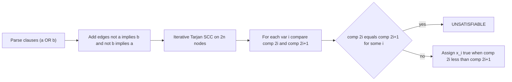
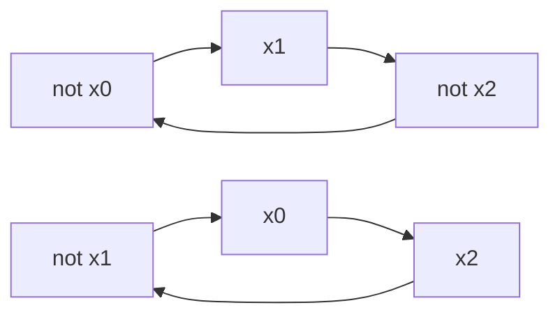

# Boolean Formula Feasibility — Decide a 2-CNF and Output an Assignment

| | |
|---|---|
| **Source** | Classic / Self-contained |
| **Difficulty** | Medium |
| **Topics** | 2-SAT, Implication Graph, Strongly Connected Components, Tarjan |
| **Link** | — (standalone statement) |

---

## Problem Statement

You are given a boolean formula in **conjunctive normal form** with $n$ variables $x_0, \dots, x_{n-1}$ and $m$ clauses, where **every clause has exactly two literals**. A literal is a variable or its negation; a clause $(a \lor b)$ is satisfied when at least one literal is true; the formula is satisfied when every clause is. Decide whether the formula is **satisfiable**, and if so output a satisfying assignment.

- **Input:** first line $n$ $m$. Each of the next $m$ lines holds two literals as signed integers: a value $v$ means variable $|v| - 1$ used positively if $v > 0$ and negatively if $v < 0$ (variables labeled $1..n$ in input).
- **Output:** `SATISFIABLE` followed by a line of $n$ values (`0`/`1`) giving $x_0 \dots x_{n-1}$; or `UNSATISFIABLE`.
- **Constraints:** $1 \le n \le 10^6$, $1 \le m \le 10^6$. Use fast I/O and an iterative SCC.

Formally we decide

$$
\exists\, x \in \{0,1\}^n :\ \bigwedge_{k=1}^{m} (\ell_{k,1} \lor \ell_{k,2}) = \text{true}.
$$

```text
Input
3 3
1 2
-1 3
-2 -3

Output (one valid answer)
SATISFIABLE
1 0 1
```

Clauses: $(x_0 \lor x_1)$, $(\neg x_0 \lor x_2)$, $(\neg x_1 \lor \neg x_2)$. With $x_0=1, x_1=0, x_2=1$: $(1) \land (0 \lor 1) \land (1 \lor 0) = $ true.

```text
Input
1 2
1 1
-1 -1

Output
UNSATISFIABLE
```

Here $(x_0 \lor x_0)$ forces $x_0$ true while $(\neg x_0 \lor \neg x_0)$ forces it false — contradiction.

## Approach (WHY)

This is 2-SAT in its purest form. Rewrite each clause $(a \lor b)$ as the implication pair $\neg a \Rightarrow b$ and $\neg b \Rightarrow a$, build the implication graph on $2n$ literal-nodes, and decompose it into **strongly connected components**. The formula is satisfiable **iff** for every variable its two literal-nodes lie in different SCCs; the model is recovered by comparing component ids (Tarjan numbers SCCs in reverse topological order, so the literal with the *smaller* component id is chosen true).

The bound $n, m \le 10^6$ forces two engineering choices: **fast input parsing** and a strictly **iterative** Tarjan/Kosaraju, since recursion would overflow on implication chains that can be a million edges long.



Interleaved encoding from [guide 13](../guide/13-two-sat.md): node $2i$ = "$x_i$ true", node $2i+1$ = "$x_i$ false", negation `v ^ 1`.

## Solution

### Python

```python
import sys

def main():
    data = sys.stdin.buffer.read().split()
    idx = 0
    n = int(data[idx]); idx += 1       # variables
    m = int(data[idx]); idx += 1       # clauses

    adj = [[] for _ in range(2 * n)]   # implication graph

    def lit_node(v):
        # signed input v: |v|-1 is the variable; positive => true node 2i,
        # negative => false node 2i+1
        var = abs(v) - 1
        return 2 * var + (0 if v > 0 else 1)

    for _ in range(m):
        a = lit_node(int(data[idx])); idx += 1
        b = lit_node(int(data[idx])); idx += 1
        adj[a ^ 1].append(b)           # not a => b
        adj[b ^ 1].append(a)           # not b => a

    # ---- Iterative Tarjan SCC ----
    N = 2 * n
    disc = [-1] * N
    low = [0] * N
    comp = [-1] * N
    on_stack = [False] * N
    scc_stack = []
    timer = 0
    ncomp = 0

    for start in range(N):
        if disc[start] != -1:
            continue
        work = [(start, 0)]
        while work:
            u, i = work[-1]
            if i == 0:
                disc[u] = low[u] = timer
                timer += 1
                scc_stack.append(u)
                on_stack[u] = True
            if i < len(adj[u]):
                work[-1] = (u, i + 1)
                v = adj[u][i]
                if disc[v] == -1:
                    work.append((v, 0))
                elif on_stack[v]:
                    low[u] = min(low[u], disc[v])
            else:
                if low[u] == disc[u]:
                    while True:
                        w = scc_stack.pop()
                        on_stack[w] = False
                        comp[w] = ncomp
                        if w == u:
                            break
                    ncomp += 1
                work.pop()
                if work:
                    p = work[-1][0]
                    low[p] = min(low[p], low[u])

    assignment = []
    for i in range(n):
        if comp[2 * i] == comp[2 * i + 1]:
            sys.stdout.write("UNSATISFIABLE\n")
            return
        assignment.append('1' if comp[2 * i] < comp[2 * i + 1] else '0')

    out = sys.stdout
    out.write("SATISFIABLE\n")
    out.write(' '.join(assignment) + '\n')

main()
```

### C++

```cpp
#include <bits/stdc++.h>
using namespace std;

int main() {
    ios_base::sync_with_stdio(false);
    cin.tie(nullptr);

    int n, m;                          // variables, clauses
    cin >> n >> m;

    int N = 2 * n;
    vector<vector<int>> adj(N);

    auto litNode = [](int v) {
        // signed v: |v|-1 is variable; positive => true (2i), negative => false (2i+1)
        int var = abs(v) - 1;
        return 2 * var + (v > 0 ? 0 : 1);
    };

    for (int k = 0; k < m; ++k) {
        int va, vb; cin >> va >> vb;
        int a = litNode(va), b = litNode(vb);
        adj[a ^ 1].push_back(b);       // not a => b
        adj[b ^ 1].push_back(a);       // not b => a
    }

    // ---- Iterative Tarjan SCC ----
    vector<int> disc(N, -1), low(N, 0), comp(N, -1);
    vector<char> onStack(N, 0);
    vector<int> sccStack;
    sccStack.reserve(N);
    int timer = 0, ncomp = 0;

    for (int start = 0; start < N; ++start) {
        if (disc[start] != -1) continue;
        vector<pair<int,int>> work;
        work.push_back({start, 0});
        while (!work.empty()) {
            int u = work.back().first;
            int& i = work.back().second;
            if (i == 0) {
                disc[u] = low[u] = timer++;
                sccStack.push_back(u);
                onStack[u] = 1;
            }
            if (i < (int)adj[u].size()) {
                int v = adj[u][i++];
                if (disc[v] == -1) {
                    work.push_back({v, 0});
                } else if (onStack[v]) {
                    low[u] = min(low[u], disc[v]);
                }
            } else {
                if (low[u] == disc[u]) {
                    while (true) {
                        int w = sccStack.back(); sccStack.pop_back();
                        onStack[w] = 0;
                        comp[w] = ncomp;
                        if (w == u) break;
                    }
                    ++ncomp;
                }
                work.pop_back();
                if (!work.empty()) {
                    int p = work.back().first;
                    low[p] = min(low[p], low[u]);
                }
            }
        }
    }

    string out;
    for (int i = 0; i < n; ++i) {
        if (comp[2 * i] == comp[2 * i + 1]) {      // contradiction
            cout << "UNSATISFIABLE\n";
            return 0;
        }
        out += (comp[2 * i] < comp[2 * i + 1]) ? '1' : '0';
        if (i + 1 < n) out += ' ';
    }
    cout << "SATISFIABLE\n" << out << '\n';
    return 0;
}
```

## Iteration Trace

First sample: $n = 3$, clauses $(x_0 \lor x_1)$, $(\neg x_0 \lor x_2)$, $(\neg x_1 \lor \neg x_2)$. Nodes: $x_i$ = $2i$, $\neg x_i$ = $2i+1$.

| Clause | $a$ node | $b$ node | Edge $\neg a \Rightarrow b$ | Edge $\neg b \Rightarrow a$ |
|---|---|---|---|---|
| $(x_0 \lor x_1)$ | 0 | 2 | 1 → 2 | 3 → 0 |
| $(\neg x_0 \lor x_2)$ | 1 | 4 | 0 → 4 | 5 → 1 |
| $(\neg x_1 \lor \neg x_2)$ | 3 | 5 | 2 → 5 | 4 → 3 |

After Tarjan, every variable's pair `(2i, 2i+1)` lands in distinct SCCs → SATISFIABLE. Component comparison per variable:

| Variable $i$ | comp($2i$) vs comp($2i+1$) | $x_i$ |
|---|---|---|
| 0 | comp(0) < comp(1) | 1 |
| 1 | comp(2) > comp(3) | 0 |
| 2 | comp(4) < comp(5) | 1 |

Yielding `1 0 1`.



## Complexity

The implication graph has $2n$ nodes and $2m$ edges; every phase is linear:

$$
T(n, m) = O(n + m), \qquad S(n, m) = O(n + m).
$$

| Phase | Time | Space |
|---|---|---|
| Parse + build graph | $O(n + m)$ | $O(n + m)$ |
| Iterative Tarjan SCC | $O(n + m)$ | $O(n + m)$ |
| Check + recover | $O(n)$ | $O(n)$ |
| **Total** | $O(n + m)$ | $O(n + m)$ |

## Takeaway

Deciding a 2-CNF is *exactly* "build the implication graph, run an SCC pass, compare component ids." The satisfiability test ($x$ and $\neg x$ never in one SCC) and the model recovery (smaller Tarjan component id ⇒ literal true) are both single linear scans. At $10^6$ scale the only subtleties are fast I/O and keeping the SCC strictly iterative. Full framework in [guide 13](../guide/13-two-sat.md); SCC internals in [guide 07](../guide/07-scc-tarjan-kosaraju.md).
