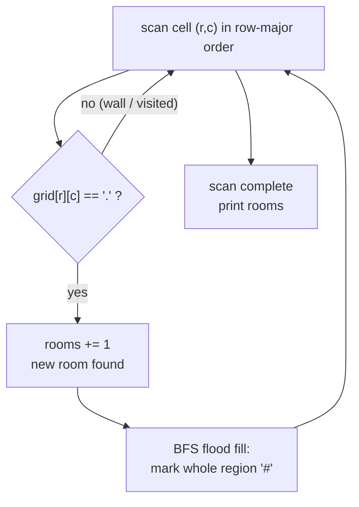

# Counting Rooms

| Meta | Value |
|------|-------|
| Source | CSES Problem Set — Graph Algorithms |
| Difficulty | Easy / Introductory |
| Topics | Graph, Grid, Flood Fill, DFS, BFS, Connected Components |
| Link | https://cses.fi/problemset/task/1192 |

---

## Problem Statement

You are given a map of a building as an $n \times m$ grid. Each square is either **floor**
`.` or **wall** `#`. You can move up, down, left, and right (4-directionally) between floor
squares. Your task is to count the number of **rooms** — a room is a maximal connected
region of floor squares.

**Input:** the dimensions $n$ and $m$, then $n$ rows of $m$ characters.
**Output:** a single integer, the number of rooms.

Constraints: $1 \le n, m \le 1000$, so up to $10^6$ cells.

**Example**

```
Input:
5 8
########
#..#...#
####.#.#
#..#...#
########

A room is a connected blob of '.' cells (4-directional).

Region map (each digit = its room id):
########
#11#222#
####2#2#
#33#222#
########

Output:
3
```

There are three separate floor blobs, so the answer is `3`.

---

## Approach Progression

**Why this is a graph problem.** Treat every floor cell `.` as a vertex. Put an edge between
two floor cells that are orthogonally adjacent. A "room" is then exactly a **connected
component** of this graph. Counting rooms = counting connected components.

**Step 1 — The naive idea.** We could build an explicit adjacency list of up to $10^6$
vertices and $4 \times 10^6$ edges, then run a component count. That works but wastes memory
— the grid *is* the adjacency structure, so we never need to materialize edges.

**Step 2 — Flood fill in place.** Scan the grid row by row. When we hit a floor cell that
hasn't been visited yet, we've discovered a brand-new room: increment the counter and flood
fill its entire connected region (BFS or DFS), marking every reached cell as visited so it's
never counted again. Continue scanning.

**Step 3 — Avoid recursion overflow.** With $10^6$ cells, a recursive DFS can recurse a
million levels deep on a single snake-shaped room and blow the call stack. On CSES this
shows up as a runtime error. **Use iterative BFS or an explicit DFS stack.** We present an
iterative BFS as the primary solution.

To mark visited cells we can mutate the grid itself (turn visited `.` into `#`), which saves
an extra $10^6$-entry boolean array.

---

## Solution — Iterative BFS Flood Fill

```python
import sys
from collections import deque

def main():
    data = sys.stdin.buffer.read().split(b"\n")
    n, m = map(int, data[0].split())
    # Mutable rows so we can mark cells visited by overwriting with '#'.
    grid = [bytearray(data[1 + i]) for i in range(n)]

    DIRS = [(-1, 0), (1, 0), (0, -1), (0, 1)]  # up, down, left, right
    rooms = 0
    DOT = ord('.')

    for sr in range(n):
        for sc in range(m):
            if grid[sr][sc] != DOT:            # wall or already visited
                continue
            rooms += 1                          # found a new room
            grid[sr][sc] = ord('#')             # mark on push
            q = deque([(sr, sc)])
            while q:
                r, c = q.popleft()
                for dr, dc in DIRS:
                    nr, nc = r + dr, c + dc
                    # bounds check BEFORE indexing
                    if 0 <= nr < n and 0 <= nc < m and grid[nr][nc] == DOT:
                        grid[nr][nc] = ord('#')  # mark on push
                        q.append((nr, nc))

    print(rooms)

main()
```

```cpp
#include <bits/stdc++.h>
using namespace std;

int main() {
    ios::sync_with_stdio(false);
    cin.tie(nullptr);

    int n, m;
    cin >> n >> m;
    vector<string> grid(n);
    for (int i = 0; i < n; ++i) cin >> grid[i];

    const int DR[4] = {-1, 1, 0, 0};            // up, down, left, right
    const int DC[4] = {0, 0, -1, 1};
    int rooms = 0;

    for (int sr = 0; sr < n; ++sr) {
        for (int sc = 0; sc < m; ++sc) {
            if (grid[sr][sc] != '.') continue;  // wall or already visited
            ++rooms;                            // found a new room
            grid[sr][sc] = '#';                 // mark on push
            queue<pair<int,int>> q;
            q.push({sr, sc});
            while (!q.empty()) {
                auto [r, c] = q.front(); q.pop();
                for (int k = 0; k < 4; ++k) {
                    int nr = r + DR[k], nc = c + DC[k];
                    // bounds check BEFORE indexing
                    if (nr >= 0 && nr < n && nc >= 0 && nc < m
                            && grid[nr][nc] == '.') {
                        grid[nr][nc] = '#';     // mark on push
                        q.push({nr, nc});
                    }
                }
            }
        }
    }

    cout << rooms << "\n";
    return 0;
}
```

Both mutate the grid to record visited cells, so no separate `visited` array is needed.
Total work is one push and one pop per floor cell, plus constant neighbour checks.

---

## Iteration Trace

Scanning the example grid in row-major order. Cells are labelled `(row, col)`, 0-indexed.
We only show the moments a **new room** is opened and how many cells its flood fill consumes.

| Scan reaches | Cell value | Action | Room id | Cells flooded |
|--------------|-----------|--------|---------|---------------|
| (0,0) | `#` | skip (wall) | — | — |
| (1,1) | `.` | **new room** → BFS | 1 | (1,1),(1,2) |
| (1,2) | `#`* | already visited | — | — |
| (1,4) | `.` | **new room** → BFS | 2 | (1,4),(1,5),(1,6),(2,4),(2,6),(3,4),(3,5),(3,6) |
| (3,1) | `.` | **new room** → BFS | 3 | (3,1),(3,2) |
| (4,*) | `#` | skip (walls) | — | — |

`*` By the time the scan reaches (1,2) the flood fill of room 1 already overwrote it with
`#`, so it is correctly skipped. Final count of rooms opened = **3**.



---

## Why the Count Is Correct

Each connected region of floor is visited by **exactly one** flood fill: the first scan that
lands on any of its cells. Every other cell in that region is marked `#` during the flood,
so subsequent scans skip them. Therefore the number of times we *open* a new room equals the
number of connected components — which is the answer.

Let $F$ be the number of floor cells. Across the whole run, every floor cell is pushed once
and popped once:

$$
\sum_{\text{rooms } R} |R| = F \le n \cdot m,
$$

so the total flood-fill work is $O(nm)$, independent of how the rooms are shaped.

---

## Complexity

| Aspect | Cost | Reason |
|--------|------|--------|
| Time | $O(nm)$ | Each of the $nm$ cells is processed a constant number of times |
| Extra space | $O(nm)$ worst case | BFS queue can hold up to a whole room of cells |
| Recursion depth | $O(1)$ | Iterative BFS — no call-stack growth |

With $n, m \le 1000$ that's at most $10^6$ cells — comfortably fast.

---

## Takeaway

*Counting Rooms* is the canonical **grid connected-components** problem. The recipe:

1. Read the grid; treat `.` cells as graph vertices with 4-directional edges.
2. Scan in row-major order; each unvisited floor cell starts a **new component**.
3. Flood fill (iterative BFS/DFS) to consume the whole room, marking cells visited.
4. The number of flood fills launched is the answer.

Two habits that generalize to every grid problem: **check bounds before indexing**, and on
large CSES grids **prefer iterative traversal** so a single sprawling region can't overflow
the recursion stack.
