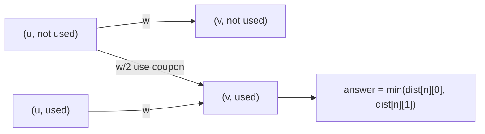

# Flight Discount (CSES — Layered / State Dijkstra with One Halved Edge)

| Meta | Value |
|------|-------|
| Source | CSES Problem Set — Graph Algorithms |
| Difficulty | Medium |
| Topics | Dijkstra, State / Layered Graph, Shortest Path, Two-Dijkstra Combine |
| Link | https://cses.fi/problemset/task/1195 |

---

## Problem Statement

There are `n` cities and `m` **directed** flights, each with a price. You travel from city 1 to city
`n`. You hold **one discount coupon** that **halves the price of exactly one flight** (integer
division / real halving — CSES uses `price / 2` with the price being even-safe under floor). Find the
**minimum total price** from 1 to `n` using the coupon optimally (you may also choose not to use it,
but using it never hurts when a path exists).

- $1 \le n \le 10^5$, $1 \le m \le 2 \times 10^5$, price up to $10^9$.
- Distances reach $\sim 10^{14}$ → use 64-bit integers.

**Example**
```
n = 3, m = 4
flights (a, b, price):
  1 2 3
  2 3 1
  1 3 7
  1 3 6

Best without discount: 1 -> 2 -> 3 = 3 + 1 = 4, or 1 -> 3 = 6.  min = 4
With discount halving one edge:
  halve 1->2: 1 + 1 = 2  (then 2->3:1) total 3 ... wait recompute below
  halve 1->3 (price 6): 6/2 = 3  total 3
  halve 1->2 (price 3): 3/2 = 1, + 2->3:1 = 2   <-- best
Answer: 2
```

---

## Approach (WHY)

The coupon adds a hidden dimension to each city: *have I used the discount yet?* That is a classic
**state / layered Dijkstra**. We expand every node `u` into two states:

- **layer 0** — `(u, discount NOT used)`,
- **layer 1** — `(u, discount ALREADY used)`.

Edge transitions:

| From | Edge | To | Cost |
|------|------|----|------|
| `(u, 0)` | flight `u→v` (price `w`) | `(v, 0)` | `w` (don't use coupon here) |
| `(u, 0)` | flight `u→v` (price `w`) | `(v, 1)` | `w / 2` (**use** coupon on this edge) |
| `(u, 1)` | flight `u→v` (price `w`) | `(v, 1)` | `w` (coupon already spent) |

Run Dijkstra over the `2n` states from `(1, 0)`. The answer is the cheapest way to reach city `n` in
**either** layer: `min(dist[n][0], dist[n][1])`. Since using the coupon on some edge never increases
cost, `dist[n][1]` is the real answer when a path exists, but taking the min is safe and clean.



### Alternative: Two Dijkstras + Combine

Instead of a layered graph you can run **two** Dijkstras:

- `ds[v]` = shortest distance **from source 1** to `v` (on the original graph),
- `dt[v]` = shortest distance **from sink n** to `v` on the **reversed** graph (i.e. shortest from `v`
  to `n`).

Then the best discounted total is obtained by choosing **which edge `(u→v, w)` to halve**:

$$\text{answer} = \min_{(u,v,w)\,\in\,E}\; ds[u] + \left\lfloor \tfrac{w}{2} \right\rfloor + dt[v].$$

Each term is "best way to reach `u`, then take the halved edge `u→v`, then best way from `v` to the
sink." Both methods are $O(m \log n)$; the layered version is shown in full below, the combine method
is summarized after.

---

## Solution

### Python — Layered Dijkstra

```python
import sys, heapq

def main():
    data = sys.stdin.buffer.read().split()
    idx = 0
    n = int(data[idx]); idx += 1
    m = int(data[idx]); idx += 1

    INF = float('inf')
    adj = [[] for _ in range(n + 1)]            # adj[u] = list of (v, w)
    for _ in range(m):
        a = int(data[idx]); b = int(data[idx + 1]); w = int(data[idx + 2])
        idx += 3
        adj[a].append((b, w))                   # directed flight a -> b

    # dist[node][used]: used = 0 (coupon free) or 1 (coupon spent)
    dist = [[INF, INF] for _ in range(n + 1)]
    dist[1][0] = 0
    pq = [(0, 1, 0)]                            # (cost, node, used)

    while pq:
        d, u, used = heapq.heappop(pq)
        if d > dist[u][used]:                   # lazy deletion: stale, skip
            continue
        for v, w in adj[u]:
            # 1) take the flight at full price, coupon state unchanged
            nd = d + w
            if nd < dist[v][used]:
                dist[v][used] = nd
                heapq.heappush(pq, (nd, v, used))
            # 2) if coupon still available, use it on THIS edge -> layer 1
            if used == 0:
                nd2 = d + w // 2
                if nd2 < dist[v][1]:
                    dist[v][1] = nd2
                    heapq.heappush(pq, (nd2, v, 1))

    print(min(dist[n][0], dist[n][1]))

main()
```

### C++ — Layered Dijkstra

```cpp
#include <bits/stdc++.h>
using namespace std;

const long long INF = 1e18;

int main() {
    ios::sync_with_stdio(false);
    cin.tie(nullptr);

    int n, m;
    cin >> n >> m;

    vector<vector<pair<int,long long>>> adj(n + 1);    // adj[u] = {v, w}
    for (int i = 0; i < m; ++i) {
        int a, b; long long w;
        cin >> a >> b >> w;
        adj[a].push_back({b, w});                       // directed flight a -> b
    }

    // dist[node][used]: used = 0 (coupon free) or 1 (coupon spent)
    vector<array<long long,2>> dist(n + 1, {INF, INF});
    dist[1][0] = 0;

    // min-heap of (cost, node, used)
    priority_queue<tuple<long long,int,int>,
                   vector<tuple<long long,int,int>>,
                   greater<tuple<long long,int,int>>> pq;
    pq.push({0, 1, 0});

    while (!pq.empty()) {
        auto [d, u, used] = pq.top(); pq.pop();
        if (d > dist[u][used]) continue;                // lazy deletion: stale, skip
        for (auto [v, w] : adj[u]) {
            // 1) take the flight at full price, coupon state unchanged
            long long nd = d + w;
            if (nd < dist[v][used]) {
                dist[v][used] = nd;
                pq.push({nd, v, used});
            }
            // 2) if coupon still available, use it on THIS edge -> layer 1
            if (used == 0) {
                long long nd2 = d + w / 2;
                if (nd2 < dist[v][1]) {
                    dist[v][1] = nd2;
                    pq.push({nd2, v, 1});
                }
            }
        }
    }

    cout << min(dist[n][0], dist[n][1]) << "\n";
    return 0;
}
```

### Two-Dijkstra Combine (sketch)

```python
import sys, heapq

def dijkstra(n, adj, src):
    INF = float('inf')
    dist = [INF] * (n + 1)
    dist[src] = 0
    pq = [(0, src)]
    while pq:
        d, u = heapq.heappop(pq)
        if d > dist[u]:
            continue
        for v, w in adj[u]:
            if d + w < dist[v]:
                dist[v] = d + w
                heapq.heappush(pq, (d + w, v))
    return dist

def solve(n, m, edges):
    fwd = [[] for _ in range(n + 1)]            # forward graph
    rev = [[] for _ in range(n + 1)]            # reversed graph
    for a, b, w in edges:
        fwd[a].append((b, w))
        rev[b].append((a, w))                   # reverse the edge
    ds = dijkstra(n, fwd, 1)                     # 1 -> v
    dt = dijkstra(n, rev, n)                     # v -> n  (via reversed graph)

    INF = float('inf')
    best = INF
    for a, b, w in edges:                        # choose the halved edge a -> b
        if ds[a] != INF and dt[b] != INF:
            best = min(best, ds[a] + w // 2 + dt[b])
    return best
```

```cpp
#include <bits/stdc++.h>
using namespace std;
using ll = long long;
const ll INF = 1e18;

vector<ll> dijkstra(int n, const vector<vector<pair<int, ll>>>& adj, int src) {
    vector<ll> dist(n + 1, INF);
    dist[src] = 0;
    priority_queue<pair<ll, int>, vector<pair<ll, int>>, greater<>> pq;
    pq.push({0, src});
    while (!pq.empty()) {
        auto [d, u] = pq.top();
        pq.pop();
        if (d > dist[u]) continue;
        for (auto [v, w] : adj[u]) {
            if (d + w < dist[v]) {
                dist[v] = d + w;
                pq.push({dist[v], v});
            }
        }
    }
    return dist;
}

// edges: list of (a, b, w). Returns the best discounted 1 -> n cost.
ll solve(int n, const vector<array<ll, 3>>& edges) {
    vector<vector<pair<int, ll>>> fwd(n + 1), rev(n + 1);  // forward + reversed graphs
    for (auto& e : edges) {
        int a = (int)e[0], b = (int)e[1];
        ll w = e[2];
        fwd[a].push_back({b, w});
        rev[b].push_back({a, w});                          // reverse the edge
    }
    vector<ll> ds = dijkstra(n, fwd, 1);                   // 1 -> v
    vector<ll> dt = dijkstra(n, rev, n);                   // v -> n via reversed graph

    ll best = INF;
    for (auto& e : edges) {                                // choose the halved edge a -> b
        int a = (int)e[0], b = (int)e[1];
        ll w = e[2];
        if (ds[a] != INF && dt[b] != INF)
            best = min(best, ds[a] + w / 2 + dt[b]);
    }
    return best;
}
```

---

## Iteration Trace (Layered Dijkstra)

Graph: `1->2:3`, `2->3:1`, `1->3:7`, `1->3:6`. States are `(node, used)`. `*` = stale pop skipped.
Halving uses floor (`3//2 = 1`, `7//2 = 3`, `6//2 = 3`).

| Step | Pop (d, node, used) | Relaxations | Notable dist updates | Heap (sorted) |
|------|---------------------|-------------|----------------------|---------------|
| init | — | push (0,1,0) | dist[1][0]=0 | (0,1,0) |
| 1 | (0, 1, 0) | 1→2 full→(2,0)=3; 1→2 half→(2,1)=1; 1→3 full→(3,0)=6; 1→3 half→(3,1)=3 (7/2=3 then 6/2=3) | dist[2][0]=3, dist[2][1]=1, dist[3][0]=6, dist[3][1]=3 | (1,2,1),(3,2,0),(3,3,1),(6,3,0) |
| 2 | (1, 2, 1) | 2→3 full→(3,1): 1+1=2 < 3 | dist[3][1]=2 | (2,3,1),(3,2,0),(3,3,1)*,(6,3,0) |
| 3 | (2, 3, 1) | node 3 reached, coupon used | — (final candidate 2) | (3,2,0),(3,3,1)*,(6,3,0) |
| 4 | (3, 2, 0) | 2→3 full→(3,0): 3+1=4 < 6; 2→3 half→(3,1):3+0... 1//... 1/2=0 →3 (not better) | dist[3][0]=4 | (3,3,1)*,(4,3,0),(6,3,0)* |
| 5 | (3, 3, 1)\* | 3 > dist[3][1]=2 → skip | — | (4,3,0),(6,3,0)* |
| 6 | (4, 3, 0) | node 3, coupon unused, cost 4 | — | (6,3,0)* |

Final: `dist[3][0] = 4`, `dist[3][1] = 2` → answer `min(4, 2) = 2`. Steps 2 and 4 show **layer-1**
relaxations improving the used-coupon distance; steps 5–6 show **lazy deletion** discarding stale
entries.

---

## Math

The state graph has $2n$ nodes. Relaxations follow the standard rule with an extra layer index:

$$
dist[v][s] = \min\Bigl(
  dist[v][s],\;
  \underbrace{dist[u][s] + w}_{\text{normal edge}},\;
  \underbrace{dist[u][0] + \lfloor w/2 \rfloor}_{\text{use coupon, only } s=1}
\Bigr)
$$

The combine method instead minimizes over the choice of discounted edge:

$$\text{answer} = \min_{(u,v,w)\in E}\; ds[u] + \left\lfloor \tfrac{w}{2}\right\rfloor + dt[v],$$

where $ds$ is the forward Dijkstra from 1 and $dt$ is the reverse Dijkstra from $n$.

---

## Complexity

| Method | Time | Space | Notes |
|--------|------|-------|-------|
| Layered Dijkstra | $O((2n + 2m)\log n) = O(m \log n)$ | $O(n + m)$ | 2 states per node, ~2× edges |
| Two-Dijkstra combine | $O(m \log n)$ | $O(n + m)$ | forward + reversed graphs |

Both run well within limits for $n \le 10^5$, $m \le 2 \times 10^5$. Use **64-bit** distances.

---

## Takeaway

Flight Discount is the textbook **state / layered Dijkstra**: when an extra one-time choice (a
coupon) modifies costs, **duplicate each node per state** and run Dijkstra on the expanded graph. The
elegant alternative — **forward + reverse Dijkstra**, then minimize `ds[u] + w/2 + dt[v]` over all
edges — reaches the same answer and is a reusable pattern for "best path that must use one special
edge."
