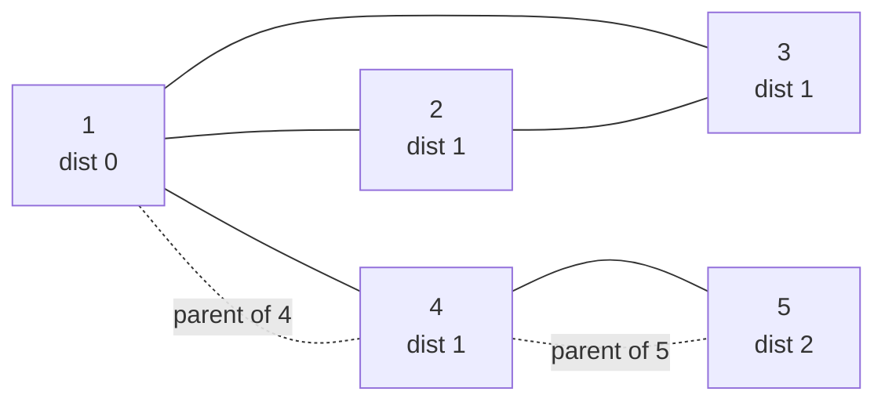

# Message Route

| Meta | Value |
|------|-------|
| Source | CSES Problem Set — Graph Algorithms |
| Difficulty | Easy / Introductory |
| Topics | Graph, BFS, Shortest Path (Unweighted), Path Reconstruction |
| Link | https://cses.fi/problemset/task/1667 |

---

## Problem Statement

Syrjälä has $n$ computers and $m$ connections (undirected edges) between them. You want to
send a message from computer $1$ to computer $n$. Find a route that uses the **minimum
number of connections**, and print one such route.

**Input:** $n$ and $m$, then $m$ lines each with two computers $a$ and $b$ that are
connected.
**Output:** If a route exists, print the number of computers on the route, then the computers
in order from $1$ to $n$. If no route exists, print `IMPOSSIBLE`.

Constraints: $1 \le n, m \le 2\cdot 10^5$.

**Example**

```
Input:
5 5
1 2
1 3
1 4
2 3
5 4

Graph (undirected):
    2 --- 3
    |  \  |
    |   \ |
    1 --- (3 also links 1)
    |
    4 --- 5

Shortest hop count from 1 to 5: 1 -> 4 -> 5  (2 edges, 3 computers)

Output:
3
1 4 5
```

Because every edge has the same cost (one "hop"), the fewest-connections route is exactly the
**shortest path in an unweighted graph** — a textbook BFS.

---

## Approach Progression

**Step 1 — Recognize the structure.** "Minimum number of connections" = minimum number of
edges on a path in an **unweighted** graph. BFS from vertex $1$ computes the shortest hop
distance to every vertex, and the first time BFS reaches vertex $n$ it does so along a
shortest route.

**Step 2 — Why not DFS?** DFS finds *a* path but not necessarily the shortest one — it dives
deep and may wander. Only BFS's layer-by-layer expansion guarantees minimum edge count.

**Step 3 — Reconstruct the actual path.** Distance alone isn't enough; we must print the
vertices. The standard trick: keep a `parent[]` array. When BFS first discovers vertex $w$
from vertex $u$, record `parent[w] = u`. After BFS, walk parents backward from $n$ to $1$,
then reverse to get the forward route.

**Step 4 — Handle impossibility.** If $n$ was never reached (its distance stays "unset"),
print `IMPOSSIBLE`.

**Step 5 — Scale.** With up to $2\cdot 10^5$ vertices/edges, use an adjacency list and fast
I/O. BFS is iterative, so no recursion-depth concerns.

---

## Solution — BFS with Parent Tracking

```python
import sys
from collections import deque

def main():
    data = sys.stdin.buffer.read().split()
    idx = 0
    n = int(data[idx]); idx += 1
    m = int(data[idx]); idx += 1

    adj = [[] for _ in range(n + 1)]        # 1-indexed vertices
    for _ in range(m):
        a = int(data[idx]); b = int(data[idx + 1]); idx += 2
        adj[a].append(b)
        adj[b].append(a)                    # undirected

    parent = [0] * (n + 1)                  # 0 = no parent recorded
    dist = [-1] * (n + 1)                   # -1 = unreached
    dist[1] = 0
    q = deque([1])
    while q:
        u = q.popleft()
        for w in adj[u]:
            if dist[w] == -1:               # first time we see w
                dist[w] = dist[u] + 1
                parent[w] = u               # remember how we got here
                q.append(w)                 # mark on push

    if dist[n] == -1:
        print("IMPOSSIBLE")
        return

    # Reconstruct path by walking parents from n back to 1.
    path = []
    cur = n
    while cur != 0:
        path.append(cur)
        cur = parent[cur]
    path.reverse()                          # 1 ... n order

    out = sys.stdout
    out.write(f"{len(path)}\n")
    out.write(" ".join(map(str, path)) + "\n")

main()
```

```cpp
#include <bits/stdc++.h>
using namespace std;

int main() {
    ios::sync_with_stdio(false);
    cin.tie(nullptr);

    int n, m;
    cin >> n >> m;
    vector<vector<int>> adj(n + 1);         // 1-indexed vertices
    for (int i = 0; i < m; ++i) {
        int a, b;
        cin >> a >> b;
        adj[a].push_back(b);
        adj[b].push_back(a);                // undirected
    }

    vector<int> parent(n + 1, 0);           // 0 = no parent recorded
    vector<int> dist(n + 1, -1);            // -1 = unreached
    dist[1] = 0;
    queue<int> q;
    q.push(1);
    while (!q.empty()) {
        int u = q.front(); q.pop();
        for (int w : adj[u]) {
            if (dist[w] == -1) {            // first time we see w
                dist[w] = dist[u] + 1;
                parent[w] = u;              // remember how we got here
                q.push(w);                  // mark on push
            }
        }
    }

    if (dist[n] == -1) {
        cout << "IMPOSSIBLE\n";
        return 0;
    }

    // Reconstruct path by walking parents from n back to 1.
    vector<int> path;
    for (int cur = n; cur != 0; cur = parent[cur])
        path.push_back(cur);
    reverse(path.begin(), path.end());      // 1 ... n order

    cout << path.size() << "\n";
    for (int i = 0; i < (int)path.size(); ++i)
        cout << path[i] << " \n"[i + 1 == (int)path.size()];
    return 0;
}
```

The `dist[w] == -1` test serves as the "visited" check, and **marking on push** (assigning
`dist`/`parent` before enqueuing) prevents a vertex from entering the queue twice.

---

## Iteration Trace

BFS from vertex `1` on the example graph. Adjacency (undirected):
`1: [2,3,4]`, `2: [1,3]`, `3: [1,2]`, `4: [1,5]`, `5: [4]`.

| Step | Dequeue $u$ | Neighbours examined | Newly discovered (dist, parent) | Queue after |
|------|-------------|---------------------|----------------------------------|-------------|
| 0 | — | — | start: dist[1]=0 | `[1]` |
| 1 | 1 | 2, 3, 4 | 2 (1, p=1), 3 (1, p=1), 4 (1, p=1) | `[2, 3, 4]` |
| 2 | 2 | 1, 3 | none (both seen) | `[3, 4]` |
| 3 | 3 | 1, 2 | none (both seen) | `[4]` |
| 4 | 4 | 1, 5 | 5 (2, p=4) | `[5]` |
| 5 | 5 | 4 | none | `[]` |

`dist[5] = 2`, so the route has 2 edges / 3 vertices.

**Path reconstruction** from `parent`: start at `5`.

$$
5 \xrightarrow{\text{parent}} 4 \xrightarrow{\text{parent}} 1 \xrightarrow{\text{parent}} 0\ (\text{stop})
$$

Collected backward: `[5, 4, 1]`; reversed: `1 4 5`. Output `3` then `1 4 5`. ✓



The dotted edges trace the `parent` pointers that form the shortest route `1 → 4 → 5`.

---

## Why Parent Reconstruction Works

BFS assigns `parent[w]` the moment $w$ is first reached, and that first arrival is along a
shortest path (the BFS invariant: a vertex's distance is final when discovered). The parent
pointers therefore form a **shortest-path tree** rooted at vertex $1$. Following parents from
$n$ upward yields a path whose length equals $dist[n]$, the minimum possible:

$$
|\text{path}| = dist[n] + 1 \text{ vertices}, \qquad \text{edges} = dist[n].
$$

If `dist[n] == -1`, vertex $n$ is in a different connected component from $1$, so no route
exists → `IMPOSSIBLE`.

---

## Complexity

| Aspect | Cost | Reason |
|--------|------|--------|
| Time | $O(n + m)$ | BFS visits each vertex once and scans each edge twice (undirected) |
| Space | $O(n + m)$ | Adjacency list, plus $O(n)$ for `dist`, `parent`, queue |
| Reconstruction | $O(n)$ | Path has at most $n$ vertices |

For $n, m \le 2\cdot 10^5$ this runs well within limits, provided fast I/O is used.

---

## Takeaway

*Message Route* is the canonical **unweighted shortest path + path printing** problem. The
pattern to memorize:

1. Model the network as an undirected adjacency list.
2. **BFS from the source** to get shortest hop distances; never use DFS for shortest paths.
3. Store `parent[w] = u` on first discovery to build the shortest-path tree.
4. **Reconstruct** by walking parents from the target back to the source, then reverse.
5. Unreached target ⇒ `IMPOSSIBLE`.

This BFS-plus-parent template generalizes to *any* "fewest moves and show the moves" problem:
word ladders, knight on a chessboard, sliding puzzles, and grid mazes.
