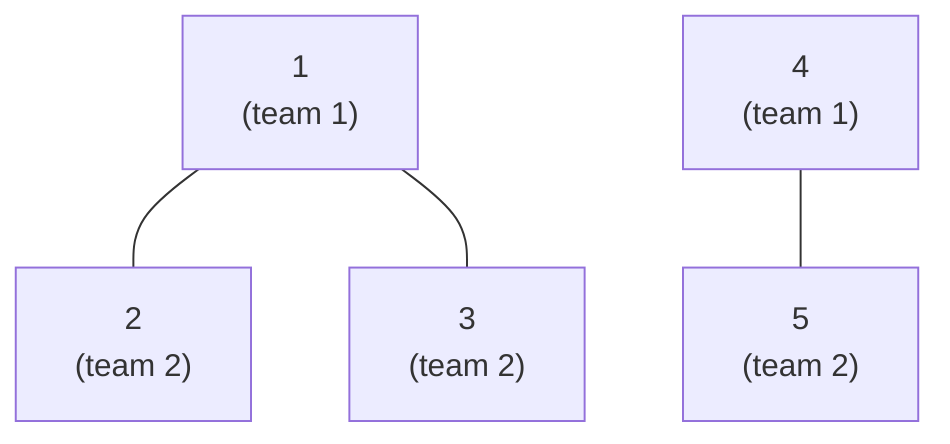

# Building Teams (CSES — Bipartite 2-Coloring)

| Meta | Value |
|------|-------|
| Source | CSES Problem Set — Graph Algorithms |
| Difficulty | Easy–Medium |
| Topics | Bipartite Check, 2-Coloring, BFS, DFS, Connected Components |
| Link | https://cses.fi/problemset/task/1668 |

---

## Problem Statement

There are `n` pupils and `m` friendships. Each pupil must be assigned to **team 1** or **team 2**
such that **every** friendship connects pupils on **different** teams. Print any valid assignment of
the `n` pupils (a line of `1`s and `2`s), or `IMPOSSIBLE` if no valid assignment exists.

**Example**
```
Input
5 3
1 2
1 3
4 5

Friendship edges: 1-2, 1-3, 4-5

A valid assignment:
pupil:  1 2 3 4 5
team:   1 2 2 1 2

Output
1 2 2 1 2
```
Friend pairs `(1,2)`, `(1,3)`, `(4,5)` are all split across teams, so this is valid. (Any other
consistent coloring, e.g. `2 1 1 2 1`, is equally accepted.)

---

## Approach — Why 2-Coloring Solves It

Model pupils as **vertices** and friendships as **undirected edges**. "Friends must be on different
teams" is exactly the constraint "**adjacent vertices get different colors**", with the two teams
being the two colors. So:

> A valid team assignment exists **iff** the friendship graph is **bipartite**.

By the **odd-cycle theorem**, the graph is bipartite iff it has no odd-length cycle. We therefore
**2-color** the graph: seed each component with team `1`, push the opposite team to every neighbor,
and report `IMPOSSIBLE` the moment an edge joins two same-team pupils (an odd cycle witness).

The graph may be **disconnected**, so we restart the search from every still-uncolored pupil. Each
component is colored independently. With $n, m \le 10^5$, we use **BFS** to avoid Python/C++
recursion-depth limits on long chains.



*The example graph: two components, each cleanly 2-colored — so the answer is feasible.*

---

## Solution

### Python (BFS, iterative — safe for large `n`)
```python
import sys
from collections import deque

def main():
    data = sys.stdin.buffer.read().split()
    idx = 0
    n = int(data[idx]); idx += 1
    m = int(data[idx]); idx += 1

    adj = [[] for _ in range(n + 1)]   # 1-indexed adjacency list
    for _ in range(m):
        a = int(data[idx]); b = int(data[idx + 1]); idx += 2
        adj[a].append(b)               # undirected: add both directions
        adj[b].append(a)

    team = [0] * (n + 1)               # 0 = unassigned; teams are 1/2
    for s in range(1, n + 1):
        if team[s]:                    # skip pupils already placed
            continue
        team[s] = 1                    # seed this component with team 1
        q = deque([s])
        while q:
            u = q.popleft()
            for v in adj[u]:
                if team[v] == 0:       # unseen friend -> opposite team
                    team[v] = 3 - team[u]   # flips 1<->2
                    q.append(v)
                elif team[v] == team[u]:
                    print("IMPOSSIBLE") # same team across a friendship
                    return
    sys.stdout.write(" ".join(map(str, team[1:])) + "\n")

main()
```

### C++ (BFS, idiomatic STL)
```cpp
#include <bits/stdc++.h>
using namespace std;

int main() {
    ios::sync_with_stdio(false);
    cin.tie(nullptr);

    int n, m;
    cin >> n >> m;

    vector<vector<int>> adj(n + 1);    // 1-indexed adjacency list
    for (int i = 0; i < m; ++i) {
        int a, b; cin >> a >> b;
        adj[a].push_back(b);           // undirected: add both directions
        adj[b].push_back(a);
    }

    vector<int> team(n + 1, 0);        // 0 = unassigned; teams are 1/2
    for (int s = 1; s <= n; ++s) {
        if (team[s]) continue;         // skip pupils already placed
        team[s] = 1;                   // seed this component with team 1
        queue<int> q;
        q.push(s);
        while (!q.empty()) {
            int u = q.front(); q.pop();
            for (int v : adj[u]) {
                if (team[v] == 0) {    // unseen friend -> opposite team
                    team[v] = 3 - team[u];   // flips 1<->2
                    q.push(v);
                } else if (team[v] == team[u]) {
                    cout << "IMPOSSIBLE\n"; // same team across a friendship
                    return 0;
                }
            }
        }
    }

    for (int i = 1; i <= n; ++i)
        cout << team[i] << " \n"[i == n];
    return 0;
}
```

> **Why BFS over DFS here?** Both are $O(n+m)$, but a friendship chain of length $10^5$ would blow
> the recursion stack in a naive DFS. The iterative BFS queue sidesteps that entirely.

---

## Iteration Trace

Coloring the example (`n=5`, edges `1-2, 1-3, 4-5`). `team[]` starts all `0`; teams flip with
`3 - team[u]`.

| Step | Pop `u` | team[u] | Neighbor `v` | Action | team[] after `(1..5)` | Queue |
|------|---------|---------|--------------|--------|------------------------|-------|
| seed | — | — | — | start comp at 1, team[1]=1 | `1 0 0 0 0` | `[1]` |
| 1 | 1 | 1 | 2 | unseen → team 2 | `1 2 0 0 0` | `[2]` |
| 2 | 1 | 1 | 3 | unseen → team 2 | `1 2 2 0 0` | `[2,3]` |
| 3 | 2 | 2 | 1 | seen, 1≠2 ✓ | `1 2 2 0 0` | `[3]` |
| 4 | 3 | 2 | 1 | seen, 1≠2 ✓ | `1 2 2 0 0` | `[]` |
| seed | — | — | — | comp at 4, team[4]=1 | `1 2 2 1 0` | `[4]` |
| 5 | 4 | 1 | 5 | unseen → team 2 | `1 2 2 1 2` | `[5]` |
| 6 | 5 | 2 | 4 | seen, 1≠2 ✓ | `1 2 2 1 2` | `[]` |

No conflict ever fires → output `1 2 2 1 2`.

---

## Why It's Correct (Math)

Within a single component, fix the BFS root $r$ with team $1$. Every pupil's team is determined by
the **parity of its BFS distance** from $r$:

$$\text{team}(v) = 1 + \big(\operatorname{dist}(r, v) \bmod 2\big).$$

A conflict (`team[v] == team[u]` across an edge $(u,v)$) means $\operatorname{dist}(u)$ and
$\operatorname{dist}(v)$ share parity. Then the two BFS paths from $r$ plus edge $(u,v)$ form a
closed walk of **odd** length, which contains an **odd cycle**. By the odd-cycle theorem the graph
is **not bipartite**, so no valid team split exists — `IMPOSSIBLE` is justified. Conversely, if no
conflict ever fires, the produced coloring *is* a valid assignment by construction. $\blacksquare$

---

## Complexity

| Resource | Bound | Reason |
|----------|-------|--------|
| Time | $O(n + m)$ | Each vertex dequeued once; each edge examined twice (both endpoints). |
| Space | $O(n + m)$ | Adjacency list ($O(n+m)$) + `team[]` and queue ($O(n)$). |

With $n, m \le 10^5$ this is comfortably within limits.

---

## Takeaway

"Split into two teams so that every relationship crosses the divide" is the textbook signal for a
**bipartite 2-coloring**. Color each component by flipping teams along edges; a same-team edge is a
direct witness of an **odd cycle**, which makes the assignment **IMPOSSIBLE**. Prefer **iterative
BFS** so that long friendship chains can't overflow the recursion stack, and never forget to restart
the scan over **every** component.
```
