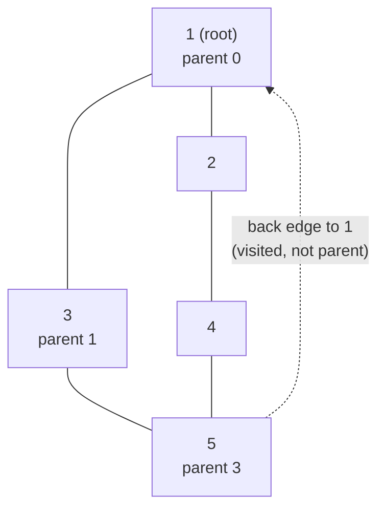

# CSES 1669 — Round Trip (Undirected Cycle, Print It)

| | |
| --- | --- |
| **Source** | CSES Problem Set — Graph Algorithms |
| **Difficulty** | Medium |
| **Topics** | Graphs, DFS, Undirected Cycle Detection, Cycle Reconstruction, (alt: DSU) |
| **Link** | https://cses.fi/problemset/task/1669 |

---

## Problem Statement

You are given an **undirected** graph with $n$ vertices and $m$ edges. Your task
is to design a *round trip* that begins at a vertex, goes through one or more
other vertices, and finally returns to the starting vertex. Every intermediate
vertex must be distinct (a simple cycle).

- If such a round trip exists, print:
  - the number of vertices on the route (including the repeated start vertex),
  - then the vertices in order, starting and ending at the same vertex.
- If no round trip exists, print `IMPOSSIBLE`.

Any valid cycle is accepted.

**Constraints:** $1 \le n \le 10^5$, $1 \le m \le 2 \cdot 10^5$.

### Worked Example

```
Input:
5 6
1 3
1 2
5 3
1 5
2 4
4 5

Graph (undirected):
    1 --- 2
    |  \   \
    5    3   4
    |  \____/ (via 4-5)
    edges: 1-3, 1-2, 5-3, 1-5, 2-4, 4-5

A valid round trip:
    3 -> 1 -> 5 -> 3        (length 4 incl. repeated start)

Output:
4
3 1 5 3
```

Here `3 - 1`, `1 - 5`, and `5 - 3` are all real edges, and `3` is repeated as
the closing vertex. The judge accepts any correct cycle, so `1 2 4 5 1` etc.
would also be fine.

---

## Approach (the WHY)

An undirected graph has a cycle **iff** a DFS finds a *back edge*: an edge to an
already-visited vertex that is **not** the parent we just came from. The reason
we exclude the parent is that every undirected edge `u - v` appears in both
adjacency lists, so we would otherwise "rediscover" the edge we arrived on and
falsely call it a cycle.

When we stand on vertex `u` and look at a neighbor `w` that is already visited
and `w != parent[u]`, then:

- `w` is an **ancestor** of `u` in the DFS tree, and
- the tree path `w -> ... -> u` plus the edge `u - w` forms a cycle.

**To print the cycle (parent pointers + slicing):** we maintain `parent[]`
during DFS. On detecting the back edge `u - w` (with `w` an ancestor), we walk
parent pointers from `u` upward until we reach `w`, collecting vertices, then
append `w` again and reverse. That gives `w ... u w`.

**Iterative DFS is mandatory here.** With $n$ up to $10^5$ and possible long
chains, recursive DFS overflows the call stack. We simulate recursion with an
explicit stack, storing each vertex together with its parent and an index into
its adjacency list so we can resume scanning where we left off.

> Alternative: **DSU**. Process edges; the first edge whose endpoints are
> already in the same set closes a cycle. But DSU loses path info, so to *print*
> the cycle you then BFS over the accepted edges to recover the path. The DFS
> approach prints directly, so we lead with it.

### KaTeX

For an undirected graph with $n$ vertices and $c$ connected components, a forest
has exactly $n - c$ edges. Therefore:

$$
m > n - c \;\Longrightarrow\; \text{at least one cycle exists.}
$$

A single DFS/BFS sweep runs in:

$$
O(n + m)
$$

time and $O(n + m)$ space (adjacency lists + stacks).

---

## Solution: Iterative DFS with Parent Tracking

### Python

```python
import sys
from sys import setrecursionlimit

def main():
    data = sys.stdin.buffer.read().split()
    idx = 0
    n = int(data[idx]); idx += 1
    m = int(data[idx]); idx += 1

    adj = [[] for _ in range(n + 1)]
    for _ in range(m):
        a = int(data[idx]); b = int(data[idx + 1]); idx += 2
        adj[a].append(b)
        adj[b].append(a)

    visited = [False] * (n + 1)
    parent = [0] * (n + 1)
    # 'it[u]' remembers how far we have scanned adj[u] (resume point)
    it = [0] * (n + 1)

    for start in range(1, n + 1):
        if visited[start]:
            continue
        # explicit DFS stack of (vertex, parent)
        stack = [(start, 0)]
        visited[start] = True
        parent[start] = 0

        while stack:
            u, par = stack[-1]
            if it[u] < len(adj[u]):
                w = adj[u][it[u]]
                it[u] += 1
                if w == par:
                    continue                 # skip the edge we arrived on
                if not visited[w]:
                    visited[w] = True
                    parent[w] = u
                    stack.append((w, u))
                else:
                    # back edge u - w with w an ancestor -> reconstruct cycle
                    cycle = [u]
                    x = u
                    while x != w:
                        x = parent[x]
                        cycle.append(x)      # walk parents up to ancestor w
                    cycle.append(u)          # close the loop: w ... u  then back to u
                    # cycle currently = u, parent[u], ..., w, u  -> already valid order
                    out = [str(len(cycle))]
                    out.append(' '.join(map(str, cycle)))
                    sys.stdout.write('\n'.join(out) + '\n')
                    return
            else:
                stack.pop()                  # done with u

    print("IMPOSSIBLE")

main()
```

> Note: the list `u, parent[u], ..., w, u` is itself a valid printed cycle
> (start `u`, end `u`); reversing is optional since the route is undirected.

### C++

```cpp
#include <bits/stdc++.h>
using namespace std;

int main() {
    ios::sync_with_stdio(false);
    cin.tie(nullptr);

    int n, m;
    cin >> n >> m;

    vector<vector<int>> adj(n + 1);
    for (int i = 0; i < m; ++i) {
        int a, b; cin >> a >> b;
        adj[a].push_back(b);
        adj[b].push_back(a);
    }

    vector<char> visited(n + 1, 0);
    vector<int> parent(n + 1, 0);
    vector<int> it(n + 1, 0);          // resume index into adj[u]

    for (int start = 1; start <= n; ++start) {
        if (visited[start]) continue;

        // explicit DFS stack of (vertex, parent)
        vector<pair<int,int>> stk;
        stk.push_back({start, 0});
        visited[start] = 1;
        parent[start] = 0;

        while (!stk.empty()) {
            auto [u, par] = stk.back();
            if (it[u] < (int)adj[u].size()) {
                int w = adj[u][it[u]++];
                if (w == par) continue;       // skip the edge we arrived on
                if (!visited[w]) {
                    visited[w] = 1;
                    parent[w] = u;
                    stk.push_back({w, u});
                } else {
                    // back edge u - w with w an ancestor -> reconstruct cycle
                    vector<int> cycle;
                    cycle.push_back(u);
                    int x = u;
                    while (x != w) {
                        x = parent[x];
                        cycle.push_back(x);   // walk parents up to ancestor w
                    }
                    cycle.push_back(u);       // close the loop back to u
                    cout << cycle.size() << '\n';
                    for (size_t k = 0; k < cycle.size(); ++k)
                        cout << cycle[k] << " \n"[k + 1 == cycle.size()];
                    return 0;
                }
            } else {
                stk.pop_back();               // done with u
            }
        }
    }

    cout << "IMPOSSIBLE\n";
    return 0;
}
```

---

## Iteration Trace

Tracing the worked example, DFS started from vertex `1`. Below is the
`visited` / `parent` evolution. `parent = 0` means "no parent (root)".

| Step | Action | Stack (vertex:parent) | visited set | parent[] updates |
| ---- | ------ | --------------------- | ----------- | ---------------- |
| 1 | push start 1 | `1:0` | {1} | parent[1]=0 |
| 2 | 1 → neighbor 3, new | `1:0, 3:1` | {1,3} | parent[3]=1 |
| 3 | 3 → neighbor 1, but 1 == parent → skip | `1:0, 3:1` | {1,3} | — |
| 4 | 3 → neighbor 5, new | `1:0, 3:1, 5:3` | {1,3,5} | parent[5]=3 |
| 5 | 5 → neighbor 3, **visited & ≠ parent(3?)** | — | — | back edge? |

Careful at step 5: `5`'s parent **is** `3`, so the edge `5 - 3` is skipped.
Continue:

| Step | Action | Stack | visited | note |
| ---- | ------ | ----- | ------- | ---- |
| 5' | 5 → 3 is parent → skip | `1:0, 3:1, 5:3` | {1,3,5} | — |
| 6 | 5 → neighbor 1, **visited & 1 ≠ parent(3)** | — | — | **BACK EDGE** |
| 7 | reconstruct: u=5, w=1 → walk parents | — | — | 5 → parent 3 → parent 1 |
| 8 | cycle = [5, 3, 1, 5] | — | — | print `4` then `5 3 1 5` |

Both `5 3 1 5` and the example's `3 1 5 3` are the same triangle traversed from a
different start — both are accepted.

---

## Diagram



The dashed edge `5 -> 1` reaches an already-visited vertex that is **not** `5`'s
parent (`3`), closing the cycle `1 - 3 - 5 - 1`.

---

## Complexity

| Aspect | Cost | Reason |
| ------ | ---- | ------ |
| Time | $O(n + m)$ | each vertex pushed once, each edge inspected twice (both directions) |
| Space | $O(n + m)$ | adjacency lists $+$ explicit DFS stack $+$ `parent`/`visited`/`it` arrays |
| Output | $O(L)$ | $L$ = cycle length, at most $n + 1$ printed vertices |

The DSU alternative runs in $O(m\,\alpha(n))$ for detection but needs an extra
$O(n + m)$ search to *print* the cycle.

---

## Takeaway

Undirected cycle detection is DFS plus one guard: **ignore the single edge back
to your parent, and any other edge to a visited vertex is a back edge.** Keep
`parent[]` so you can *reconstruct* the cycle by walking pointers from the
current vertex up to the discovered ancestor, then closing the loop. Use an
**iterative** DFS at CSES scale to avoid stack overflow. The parent-skip trick is
correct here only because the graph is simple — with multi-edges you must skip by
*edge id*, not by vertex.
