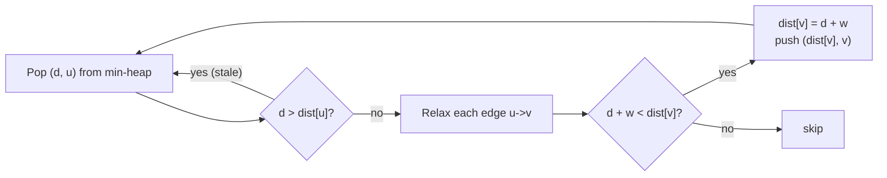

# Shortest Routes I (CSES — Single-Source Dijkstra with a Binary Heap)

| Meta | Value |
|------|-------|
| Source | CSES Problem Set — Graph Algorithms |
| Difficulty | Easy–Medium |
| Topics | Dijkstra, Shortest Path, Binary Heap, Lazy Deletion |
| Link | https://cses.fi/problemset/task/1671 |

---

## Problem Statement

There are `n` cities and `m` **directed** roads. Each road has a length. Compute the **shortest
distance from city 1 to every city** (cities `1 .. n`). All road lengths are **positive**, so
Dijkstra applies.

- $1 \le n \le 10^5$, $1 \le m \le 2 \times 10^5$.
- Road length up to $10^9$ → distances can reach $\approx 10^{14}$, so use 64-bit integers.

**Example**
```
n = 3, m = 4
roads (a, b, w):
  1 2 6
  1 3 2
  3 2 3
  1 3 4      # duplicate edge with larger weight; harmless

Output (dist from city 1): 0 5 2
  dist[1] = 0
  dist[3] = 2          (1 -> 3)
  dist[2] = 5          (1 -> 3 -> 2, i.e. 2 + 3, better than direct 1 -> 2 = 6)
```

---

## Approach (WHY)

Because **all weights are positive**, the greedy invariant of Dijkstra holds: when we pop the
unsettled node with the smallest tentative distance, that distance is final — no later path through
heavier edges can beat it.

We use a **binary min-heap** (`heapq` / `priority_queue<greater<>>`). Since a binary heap lacks an
efficient *decrease-key*, we use **lazy deletion**: every time we improve `dist[v]` we push a fresh
`(dist[v], v)`; stale pairs are recognized on pop when their stored distance exceeds the current best
`dist[v]`, and skipped.



### Why 64-bit

A path can chain up to $\sim 10^5$ edges each of weight up to $10^9$, so the worst-case distance is
about $10^{14}$ — far beyond 32-bit range. Use `long long` in C++ and a large `INF`.

---

## Solution

### Python

```python
import sys, heapq

def main():
    data = sys.stdin.buffer.read().split()
    idx = 0
    n = int(data[idx]); idx += 1
    m = int(data[idx]); idx += 1

    INF = float('inf')
    adj = [[] for _ in range(n + 1)]        # adj[u] = list of (v, w)
    for _ in range(m):
        a = int(data[idx]); b = int(data[idx + 1]); w = int(data[idx + 2])
        idx += 3
        adj[a].append((b, w))               # directed edge a -> b

    dist = [INF] * (n + 1)
    dist[1] = 0
    pq = [(0, 1)]                           # (distance, node) min-heap

    while pq:
        d, u = heapq.heappop(pq)
        if d > dist[u]:                     # lazy deletion: stale entry, skip
            continue
        for v, w in adj[u]:                 # relax every outgoing edge
            nd = d + w
            if nd < dist[v]:                # shorter path to v found
                dist[v] = nd
                heapq.heappush(pq, (nd, v)) # push improved pair

    print(' '.join(str(dist[i]) for i in range(1, n + 1)))

main()
```

### C++

```cpp
#include <bits/stdc++.h>
using namespace std;

const long long INF = 1e18;

int main() {
    ios::sync_with_stdio(false);
    cin.tie(nullptr);

    int n, m;
    cin >> n >> m;

    vector<vector<pair<int,long long>>> adj(n + 1);   // adj[u] = {v, w}
    for (int i = 0; i < m; ++i) {
        int a, b; long long w;
        cin >> a >> b >> w;
        adj[a].push_back({b, w});                      // directed edge a -> b
    }

    vector<long long> dist(n + 1, INF);
    dist[1] = 0;

    // min-heap of (distance, node); greater<> => smallest on top
    priority_queue<pair<long long,int>, vector<pair<long long,int>>,
                   greater<pair<long long,int>>> pq;
    pq.push({0, 1});

    while (!pq.empty()) {
        auto [d, u] = pq.top(); pq.pop();
        if (d > dist[u]) continue;                     // lazy deletion: stale, skip
        for (auto [v, w] : adj[u]) {                   // relax every outgoing edge
            long long nd = d + w;
            if (nd < dist[v]) {                        // shorter path to v found
                dist[v] = nd;
                pq.push({nd, v});                      // push improved pair
            }
        }
    }

    for (int i = 1; i <= n; ++i)
        cout << dist[i] << " \n"[i == n];
    return 0;
}
```

---

## Iteration Trace

Using the example graph (`1->2:6`, `1->3:2`, `3->2:3`). Heap shown after each pop; `*` marks a stale
pop that is skipped.

| Step | Pop (d, u) | Action | dist[1] | dist[2] | dist[3] | Heap after |
|------|-----------|--------|---------|---------|---------|-----------|
| init | — | push (0,1) | 0 | ∞ | ∞ | (0,1) |
| 1 | (0, 1) | relax 1→2 (6), 1→3 (2) | 0 | 6 | 2 | (2,3),(6,2) |
| 2 | (2, 3) | relax 3→2: 2+3=5 < 6 | 0 | 5 | 2 | (5,2),(6,2) |
| 3 | (5, 2) | settle 2; no out-edges | 0 | 5 | 2 | (6,2) |
| 4 | (6, 2)\* | 6 > dist[2]=5 → skip | 0 | 5 | 2 | (empty) |

Final: `dist = [_, 0, 5, 2]` → output `0 5 2`. Step 4 demonstrates **lazy deletion** discarding the
obsolete `(6, 2)` entry.

---

## Math

The relaxation that drives every update:

$$dist[v] = \min\bigl(dist[v],\; dist[u] + w(u, v)\bigr)$$

Correctness rests on non-negative weights: when `u` is popped with the minimum key `d`, any
alternative path to `u` exits the settled set through some node `x` with `dist[x] \ge d`, and the
remaining edges (all $\ge 0$) only add length, so

$$\text{alt-path}(u) \ge dist[x] \ge d = dist[u].$$

Hence `dist[u]` is already optimal at pop time.

---

## Complexity

| Aspect | Cost | Reason |
|--------|------|--------|
| Time | $O((V + E)\log V)$ | each edge pushes at most once; heap ops are $O(\log V)$ |
| Space | $O(V + E)$ | adjacency list + heap (up to $O(E)$ stale entries) |

With $n \le 10^5$, $m \le 2 \times 10^5$, this is comfortably fast.

---

## Takeaway

Shortest Routes I is the canonical **single-source Dijkstra** template: a binary min-heap, **lazy
deletion** via the `d > dist[u]` skip, and **64-bit** distances to avoid overflow. Memorize this
shape — most weighted-graph problems start from here.
