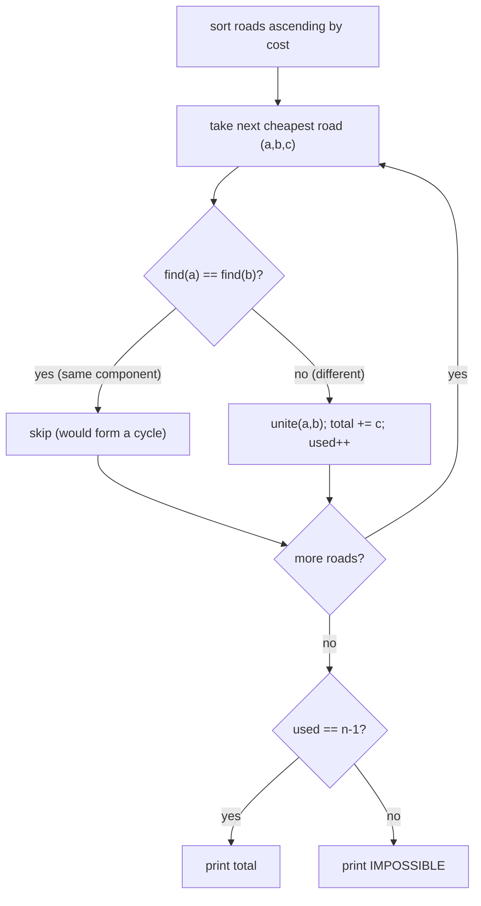
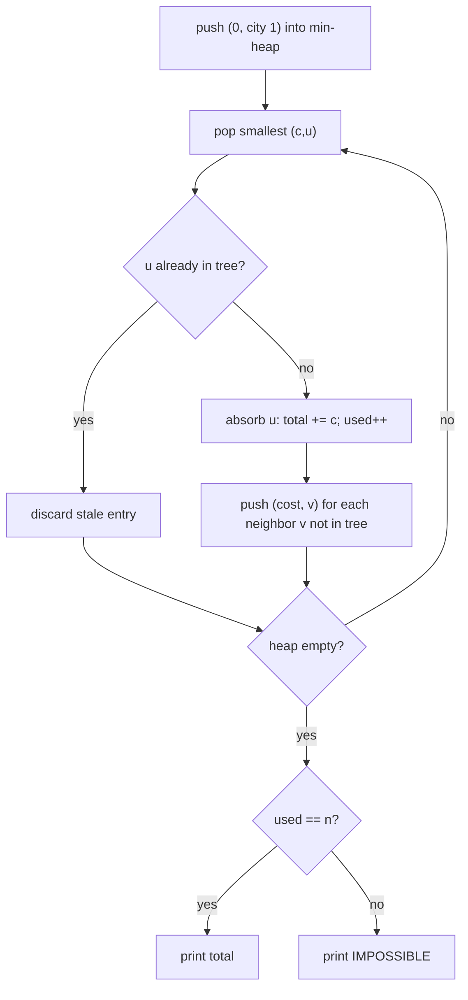

# Road Reparation (CSES 1675) — Minimum Spanning Tree Cost

| Meta | Value |
|------|-------|
| Source | CSES Problem Set — Graph Algorithms |
| Difficulty | Medium |
| Topics | Minimum Spanning Tree, Kruskal, Disjoint Set Union (DSU), Prim, Heap |
| Link | https://cses.fi/problemset/task/1675 |

---

## Problem Statement

There are `n` cities and `m` roads. Each road connects two cities `a` and `b` and has a repair
cost `c`. Your task is to find the **minimum total cost** of repairing roads so that there is a
route between **any two cities**. If it is **not possible** to connect all cities, print
`IMPOSSIBLE`.

This is exactly the **Minimum Spanning Tree (MST)** problem: select a cycle-free subset of roads
of minimum total weight that connects all `n` cities. Such a tree has exactly `n - 1` edges; if we
cannot reach that count, the graph is disconnected.

**Constraints (typical):** $1 \le n \le 10^5$, $1 \le m \le 2 \cdot 10^5$,
$1 \le c \le 10^9$. The total cost can exceed a 32-bit integer, so use 64-bit arithmetic.

**Worked Example**
```
Input:
5 6            # n cities, m roads
1 2 3
2 3 5
2 4 2
3 4 8
5 1 7
1 3 6

Build the MST greedily (cheapest first), skipping any edge that would close a cycle:
  (2,4,2) add  -> total 2     components: {2,4}
  (1,2,3) add  -> total 5     components: {1,2,4}
  (2,3,5) add  -> total 10    components: {1,2,3,4}
  (1,3,6) skip -> 1 and 3 already connected (cycle)
  (5,1,7) add  -> total 17    components: {1,2,3,4,5}  -> all 5 connected
  (3,4,8) skip -> 3 and 4 already connected (cycle)

Accepted 4 = n - 1 edges  ->  Output: 17
```

---

## Approach — Why MST

We need every city reachable from every other, at minimum total repair cost. A connected subgraph
on `n` vertices needs at least `n - 1` edges, and the cheapest such connected subgraph is, by
definition, a **minimum spanning tree**. Both the **cut property** (the cheapest edge crossing any
partition is safe to add) and the **cycle property** (the heaviest edge on any cycle is never
needed) guarantee that a simple greedy choice is globally optimal.

We present **Kruskal + DSU as the primary solution** — the input is given as an edge list and the
graph is sparse, which is Kruskal's sweet spot. We then give **Prim with a min-heap as an
alternative**, which grows a single tree from a seed vertex.

**Disconnection check.** After the algorithm:
- Kruskal: if fewer than `n - 1` edges were accepted → `IMPOSSIBLE`.
- Prim: if fewer than `n` vertices were absorbed → `IMPOSSIBLE`.

---

## Approach 1 (Primary): Kruskal + DSU

Sort all roads ascending by cost. Walk through them, adding a road only when its two cities are in
**different** components (so it cannot create a cycle). A **Disjoint Set Union** answers "are these
two cities already connected?" in near-constant time, thanks to path compression and union by rank.



### Iteration Trace (sorted edges from the worked example)

| Step | Edge (a,b,c) | find(a)=find(b)? | Action | Running total | Edges used |
|------|--------------|------------------|--------|---------------|------------|
| 1 | (2,4,**2**) | no  | **add** | 2  | 1 |
| 2 | (1,2,**3**) | no  | **add** | 5  | 2 |
| 3 | (2,3,**5**) | no  | **add** | 10 | 3 |
| 4 | (1,3,**6**) | yes | skip (cycle) | 10 | 3 |
| 5 | (5,1,**7**) | no  | **add** | 17 | 4 |
| 6 | (3,4,**8**) | yes | skip (cycle) | 17 | 4 |

`used = 4 = n - 1` → answer **17**.

### Python

```python
import sys


class DSU:
    def __init__(self, n):
        self.parent = list(range(n + 1))   # 1-indexed cities
        self.rank = [0] * (n + 1)

    def find(self, x):
        # Path compression: flatten the chain toward the root.
        while self.parent[x] != x:
            self.parent[x] = self.parent[self.parent[x]]
            x = self.parent[x]
        return x

    def unite(self, a, b):
        # Union by rank; returns False if already connected (would be a cycle).
        ra, rb = self.find(a), self.find(b)
        if ra == rb:
            return False
        if self.rank[ra] < self.rank[rb]:
            ra, rb = rb, ra
        self.parent[rb] = ra
        if self.rank[ra] == self.rank[rb]:
            self.rank[ra] += 1
        return True


def main():
    data = sys.stdin.buffer.read().split()
    idx = 0
    n = int(data[idx]); idx += 1
    m = int(data[idx]); idx += 1

    edges = []
    for _ in range(m):
        a = int(data[idx]); b = int(data[idx + 1]); c = int(data[idx + 2])
        idx += 3
        edges.append((c, a, b))            # weight first for easy sorting

    edges.sort()                           # ascending by cost
    dsu = DSU(n)
    total = 0
    used = 0
    for c, a, b in edges:
        if dsu.unite(a, b):                # merged two components
            total += c
            used += 1
            if used == n - 1:              # spanning tree complete
                break

    print(total if used == n - 1 else "IMPOSSIBLE")


main()
```

### C++

```cpp
#include <bits/stdc++.h>
using namespace std;

struct DSU {
    vector<int> parent, rank_;
    DSU(int n) : parent(n + 1), rank_(n + 1, 0) {   // 1-indexed cities
        iota(parent.begin(), parent.end(), 0);
    }
    int find(int x) {
        // Path compression: flatten the chain toward the root.
        while (parent[x] != x) {
            parent[x] = parent[parent[x]];
            x = parent[x];
        }
        return x;
    }
    // 'union' is a C++ keyword, so the method is named 'unite'.
    bool unite(int a, int b) {
        int ra = find(a), rb = find(b);
        if (ra == rb) return false;                 // already connected → cycle
        if (rank_[ra] < rank_[rb]) swap(ra, rb);    // union by rank
        parent[rb] = ra;
        if (rank_[ra] == rank_[rb]) rank_[ra]++;
        return true;
    }
};

int main() {
    ios::sync_with_stdio(false);
    cin.tie(nullptr);

    int n, m;
    cin >> n >> m;

    vector<array<long long,3>> edges(m);            // {cost, a, b}
    for (int i = 0; i < m; i++) {
        long long a, b, c;
        cin >> a >> b >> c;
        edges[i] = {c, a, b};                       // weight first for sorting
    }

    sort(edges.begin(), edges.end());               // ascending by cost
    DSU dsu(n);
    long long total = 0;                            // long long: total can overflow int
    int used = 0;
    for (auto& e : edges) {
        long long c = e[0];
        int a = (int)e[1], b = (int)e[2];
        if (dsu.unite(a, b)) {                       // merged two components
            total += c;
            if (++used == n - 1) break;              // spanning tree complete
        }
    }

    if (used == n - 1) cout << total << "\n";
    else               cout << "IMPOSSIBLE" << "\n";
    return 0;
}
```

---

## Approach 2 (Alternative): Prim + Min-Heap

Grow one tree from city `1`. Keep a min-heap of crossing edges `(cost, city)`; repeatedly pop the
cheapest edge leading to a city not yet in the tree, absorb that city, and push its outgoing edges.
If we end up absorbing fewer than `n` cities, the graph is disconnected.



### Heap-Evolution Trace (same worked example, start = city 1)

| Pop (c,u) | In tree? | total | used | Pushes (cost, city) |
|-----------|----------|-------|------|---------------------|
| (0, 1) | no  | 0  | 1 | (3,2), (7,5), (6,3) |
| (3, 2) | no  | 3  | 2 | (5,3), (2,4) |
| (2, 4) | no  | 5  | 3 | (8,3) |
| (5, 3) | no  | 10 | 4 | (8,4) |
| (6, 3) | yes | 10 | 4 | — (stale, skipped) |
| (7, 5) | no  | 17 | 5 | — |
| (8, 3) | yes | 17 | 5 | — (stale, skipped) |
| (8, 4) | yes | 17 | 5 | — (stale, skipped) |

`used = 5 = n` → answer **17** (matches Kruskal).

### Python

```python
import sys
import heapq


def main():
    data = sys.stdin.buffer.read().split()
    idx = 0
    n = int(data[idx]); idx += 1
    m = int(data[idx]); idx += 1

    adj = [[] for _ in range(n + 1)]       # adj[u] = list of (cost, v)
    for _ in range(m):
        a = int(data[idx]); b = int(data[idx + 1]); c = int(data[idx + 2])
        idx += 3
        adj[a].append((c, b))
        adj[b].append((c, a))

    in_mst = [False] * (n + 1)
    total = 0
    used = 0
    heap = [(0, 1)]                         # (edge_cost, city); seed at city 1
    while heap:
        c, u = heapq.heappop(heap)
        if in_mst[u]:                       # stale entry, skip
            continue
        in_mst[u] = True                    # absorb u into the tree
        total += c
        used += 1
        for w, v in adj[u]:
            if not in_mst[v]:               # a crossing edge candidate
                heapq.heappush(heap, (w, v))

    print(total if used == n else "IMPOSSIBLE")


main()
```

### C++

```cpp
#include <bits/stdc++.h>
using namespace std;

int main() {
    ios::sync_with_stdio(false);
    cin.tie(nullptr);

    int n, m;
    cin >> n >> m;

    // adj[u] = vector of {cost, v}
    vector<vector<pair<long long,int>>> adj(n + 1);
    for (int i = 0; i < m; i++) {
        int a, b; long long c;
        cin >> a >> b >> c;
        adj[a].push_back({c, b});
        adj[b].push_back({c, a});
    }

    vector<char> inMst(n + 1, false);
    // Min-heap of (edge_cost, city); greater<> makes it a min-heap.
    priority_queue<pair<long long,int>,
                   vector<pair<long long,int>>,
                   greater<>> pq;
    pq.push({0, 1});                              // seed at city 1
    long long total = 0;                          // long long: total can overflow int
    int used = 0;
    while (!pq.empty()) {
        auto [c, u] = pq.top(); pq.pop();
        if (inMst[u]) continue;                   // stale entry, skip
        inMst[u] = true;                          // absorb u into the tree
        total += c;
        used++;
        for (auto& [w, v] : adj[u])
            if (!inMst[v])                        // a crossing edge candidate
                pq.push({w, v});
    }

    if (used == n) cout << total << "\n";
    else           cout << "IMPOSSIBLE" << "\n";
    return 0;
}
```

---

## Math

The answer is the weight of a minimum spanning tree $T$:

$$
\text{cost} = \min_{T \text{ spanning tree}} \sum_{e \in T} w(e), \qquad |T| = n - 1.
$$

Correctness rests on the **cut property**: for any partition $(S, V \setminus S)$, the minimum-cost
edge crossing it is safe to include —

$$
e^{*} = \arg\min_{e \text{ crosses } (S, V \setminus S)} w(e) \ \in\ \text{MST}.
$$

A spanning tree exists **iff** the graph is connected; otherwise the answer is `IMPOSSIBLE`.

---

## Complexity

| Approach | Time | Space | Notes |
|----------|------|-------|-------|
| Kruskal + DSU | $O(m \log m) = O(m \log n)$ | $O(n + m)$ | Sorting dominates; DSU ops $O(\alpha(n))$ |
| Prim + binary heap | $O(m \log n)$ | $O(n + m)$ | Adjacency list + lazy heap |

With $m \le 2 \cdot 10^5$, both run comfortably within the limits.

---

## Takeaway

"Connect all cities at minimum cost" is the textbook signature of a **minimum spanning tree**.
With an edge list and a sparse graph, **Kruskal + DSU** is the natural fit: sort by cost, union
components, skip cycles, and you are done. **Prim + heap** reaches the same optimum by growing one
tree from a seed and is preferable on dense graphs. In both cases, always verify full connectivity
(`n - 1` accepted edges for Kruskal, `n` absorbed vertices for Prim) and use **64-bit** totals to
avoid overflow — otherwise report `IMPOSSIBLE`.
