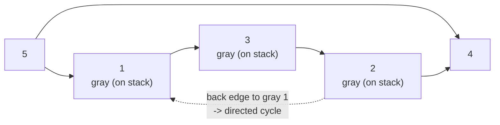

# CSES 1678 — Round Trip II (Directed Cycle, Print It)

| | |
| --- | --- |
| **Source** | CSES Problem Set — Graph Algorithms |
| **Difficulty** | Medium–Hard |
| **Topics** | Graphs, DFS, Directed Cycle Detection, 3-Color DFS, Cycle Reconstruction |
| **Link** | https://cses.fi/problemset/task/1678 |

---

## Problem Statement

You are given a **directed** graph with $n$ vertices ("teleporters") and $m$
directed edges. Your task is to find a *round trip*: start at some vertex, follow
directed edges, and return to the starting vertex, visiting each intermediate
vertex at most once (a simple directed cycle).

- If such a round trip exists, print:
  - the number of vertices on the route (including the repeated start vertex),
  - then the vertices in order, following edge directions, starting and ending
    at the same vertex.
- If no round trip exists, print `IMPOSSIBLE`.

Any valid directed cycle is accepted.

**Constraints:** $1 \le n \le 10^5$, $1 \le m \le 2 \cdot 10^5$.

### Worked Example

```
Input:
5 6
1 3
2 1
2 4
3 2
5 1
5 4

Directed edges:
    1 -> 3
    2 -> 1
    2 -> 4
    3 -> 2
    5 -> 1
    5 -> 4

A valid directed round trip:
    1 -> 3 -> 2 -> 1

Output:
4
1 3 2 1
```

Check: `1 -> 3` ✅, `3 -> 2` ✅, `2 -> 1` ✅ — all respect direction, and `1`
is repeated as the closing vertex.

---

## Approach (the WHY)

Direction changes the rule completely. Here we use **3-color DFS**:

| Color | Meaning |
| ----- | ------- |
| **white** (0) | not yet visited |
| **gray** (1) | currently on the DFS recursion stack (an *ancestor* of the current node) |
| **black** (2) | fully processed, popped off the stack |

The key insight: **a directed cycle exists iff DFS finds an edge into a gray
vertex** (a "back edge"). A gray vertex is still on the active path, so an edge
to it closes a loop. An edge into a **black** vertex is *not* a cycle — that
subtree is already finished and was proven cycle-free; it is just a cross/forward
edge.

This is why a plain two-state `visited[]` array fails: on the DAG
$1 \to 2,\ 1 \to 3,\ 2 \to 3$ a `visited`-only DFS would wrongly flag the edge
`2 -> 3` (since `3` was visited) as a cycle. The gray/black distinction is what
makes directed detection correct.

**To print the cycle (parent pointers + slicing):** keep `parent[]`. When we
detect an edge `u -> w` where `w` is **gray**, `w` is an ancestor of `u` on the
current stack. Walk parent pointers from `u` up to `w`, collect the vertices,
reverse, and append `w` to close it. Because we follow edge directions, the
order must be `w -> ... -> u -> w` (reconstruct then reverse).

**Iterative DFS is required.** With chains up to $10^5$ long, recursion
overflows. We push `(vertex, parent)` and a per-vertex adjacency cursor onto an
explicit stack; we color a vertex **gray** on push and **black** only when it is
finally popped (all its edges exhausted).

### KaTeX

A directed graph is a **DAG** iff it admits a topological order, iff a 3-color
DFS finds no back edge. The whole sweep is linear:

$$
O(n + m)
$$

time, $O(n + m)$ space.

---

## Solution: Iterative 3-Color DFS

### Python

```python
import sys

def main():
    data = sys.stdin.buffer.read().split()
    idx = 0
    n = int(data[idx]); idx += 1
    m = int(data[idx]); idx += 1

    adj = [[] for _ in range(n + 1)]
    for _ in range(m):
        a = int(data[idx]); b = int(data[idx + 1]); idx += 2
        adj[a].append(b)                  # directed edge a -> b only

    color = [0] * (n + 1)                 # 0 white, 1 gray, 2 black
    parent = [0] * (n + 1)
    it = [0] * (n + 1)                    # resume index into adj[u]

    for start in range(1, n + 1):
        if color[start] != 0:
            continue
        stack = [(start, 0)]
        color[start] = 1                  # push -> gray
        parent[start] = 0

        while stack:
            u, par = stack[-1]
            if it[u] < len(adj[u]):
                w = adj[u][it[u]]
                it[u] += 1
                if color[w] == 0:
                    color[w] = 1          # discover -> gray, push
                    parent[w] = u
                    stack.append((w, u))
                elif color[w] == 1:
                    # edge into a gray (on-stack) vertex -> directed cycle
                    cycle = [w]           # start from ancestor w
                    x = u
                    while x != w:
                        cycle.append(x)
                        x = parent[x]     # walk from u up toward w
                    # cycle currently: w, u, parent[u], ..., (child of w)
                    cycle.reverse()       # now: w ... u  in edge direction
                    cycle.append(w)       # close loop -> w
                    sys.stdout.write(str(len(cycle)) + '\n')
                    sys.stdout.write(' '.join(map(str, cycle)) + '\n')
                    return
                # color[w] == 2 (black): finished subtree, NOT a cycle -> ignore
            else:
                color[u] = 2              # pop -> black
                stack.pop()

    print("IMPOSSIBLE")

main()
```

### C++

```cpp
#include <bits/stdc++.h>
using namespace std;

int main() {
    ios::sync_with_stdio(false);
    cin.tie(nullptr);

    int n, m;
    cin >> n >> m;

    vector<vector<int>> adj(n + 1);
    for (int i = 0; i < m; ++i) {
        int a, b; cin >> a >> b;
        adj[a].push_back(b);              // directed edge a -> b only
    }

    vector<int> color(n + 1, 0);          // 0 white, 1 gray, 2 black
    vector<int> parent(n + 1, 0);
    vector<int> it(n + 1, 0);             // resume index into adj[u]

    for (int start = 1; start <= n; ++start) {
        if (color[start] != 0) continue;

        vector<pair<int,int>> stk;
        stk.push_back({start, 0});
        color[start] = 1;                 // push -> gray
        parent[start] = 0;

        while (!stk.empty()) {
            auto [u, par] = stk.back();
            if (it[u] < (int)adj[u].size()) {
                int w = adj[u][it[u]++];
                if (color[w] == 0) {
                    color[w] = 1;         // discover -> gray, push
                    parent[w] = u;
                    stk.push_back({w, u});
                } else if (color[w] == 1) {
                    // edge into a gray (on-stack) vertex -> directed cycle
                    vector<int> cycle;
                    cycle.push_back(w);   // start from ancestor w
                    int x = u;
                    while (x != w) {
                        cycle.push_back(x);
                        x = parent[x];    // walk from u up toward w
                    }
                    reverse(cycle.begin(), cycle.end()); // w ... u in edge order
                    cycle.push_back(w);   // close loop -> w
                    cout << cycle.size() << '\n';
                    for (size_t k = 0; k < cycle.size(); ++k)
                        cout << cycle[k] << " \n"[k + 1 == cycle.size()];
                    return 0;
                }
                // color[w] == 2 (black): finished, NOT a cycle -> ignore
            } else {
                color[u] = 2;             // pop -> black
                stk.pop_back();
            }
        }
    }

    cout << "IMPOSSIBLE\n";
    return 0;
}
```

> **Self-loop note:** an edge `v -> v` makes `v` gray then immediately sees `w =
> v` which is gray → a length-1 cycle. The code handles it without special
> casing. CSES 1678 generally has no self-loops, but the logic is robust.

---

## Iteration Trace

DFS from vertex `1` on the worked example. `color`: W=white, G=gray, B=black.

| Step | At u | Edge looked at | Action | color after | parent updates | stack (gray path) |
| ---- | ---- | -------------- | ------ | ----------- | -------------- | ----------------- |
| 1 | — | push start 1 | 1 → gray | 1:G | parent[1]=0 | [1] |
| 2 | 1 | 1 → 3 (white) | push 3 | 3:G | parent[3]=1 | [1,3] |
| 3 | 3 | 3 → 2 (white) | push 2 | 2:G | parent[2]=3 | [1,3,2] |
| 4 | 2 | 2 → 1 (**gray!**) | back edge → cycle | — | — | [1,3,2] |
| 5 | — | reconstruct: w=1, u=2 | walk 2 → parent 3 → parent 1 | — | — | — |
| 6 | — | cycle [1,3,2] then reverse + close | print `4` / `1 3 2 1` | — | — | — |

The `color[]` array at the moment of detection:

| Vertex | 1 | 2 | 3 | 4 | 5 |
| ------ | - | - | - | - | - |
| color  | G | G | G | W | W |

All three of `1, 3, 2` are **gray** (on the stack) when the back edge `2 -> 1` is
found — that is precisely what proves the directed cycle.

---

## Diagram



The dashed edge `2 -> 1` points into vertex `1`, which is still **gray** (an
ancestor on the current DFS stack), so `1 -> 3 -> 2 -> 1` is a directed cycle.
Edges into vertex `4` lead to a node that finishes **black** without a back edge,
so they do not form cycles.

---

## Complexity

| Aspect | Cost | Reason |
| ------ | ---- | ------ |
| Time | $O(n + m)$ | each vertex colored once W→G→B; each directed edge scanned once |
| Space | $O(n + m)$ | adjacency lists $+$ explicit stack $+$ `color`/`parent`/`it` arrays |
| Output | $O(L)$ | $L$ = cycle length, at most $n + 1$ printed vertices |

Kahn's topological sort is an $O(n + m)$ alternative to *detect* a directed
cycle (leftover vertices form cycles), but recovering an explicit printed cycle
from it takes extra bookkeeping, so 3-color DFS is preferred when the cycle must
be printed.

---

## Takeaway

Directed cycle detection needs **three colors, not two**: a back edge into a
**gray** (on-stack) vertex means a cycle, while an edge into a **black**
(finished) vertex is harmless. Keep `parent[]` to *reconstruct* the route by
walking from the current vertex up to the gray ancestor, then reverse to respect
edge direction and close the loop. Use **iterative** DFS to survive $10^5$-deep
chains. Never reuse undirected "skip the parent" logic here — direction makes
that idea meaningless, and the gray/black split is what keeps detection correct.
