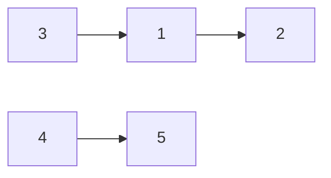

# CSES 1679 — Course Schedule (Topological Order)

| | |
|---|---|
| **Source** | CSES Problem Set — Graph Algorithms |
| **Difficulty** | Medium |
| **Topics** | Topological Sort, Kahn's Algorithm, Cycle Detection, DAG |
| **Link** | https://cses.fi/problemset/task/1679 |

You are given a list of `n` courses and `m` requirements. Each requirement `(a, b)` means course `a` must be completed **before** course `b`. Your task is to find an order in which all courses can be completed, or report that it is impossible (a cycle of prerequisites exists).

## Problem Statement

- Input: first line `n m`. Next `m` lines each contain `a b`, meaning course `a` must come before course `b`.
- Output: a permutation of `1..n` that respects every requirement, or `IMPOSSIBLE` if no such order exists.
- Constraints: `1 ≤ n, m ≤ 10^5`.

```text
Input
5 3
1 2
3 1
4 5

A valid Output
4 5 3 1 2

Explanation
Edges: 1->2, 3->1, 4->5.
'3' must precede '1', and '1' must precede '2', so the chain 3,1,2 is forced
relative to itself. '4' must precede '5'. The two chains are independent,
so 4 5 3 1 2 is one valid answer (3 1 2 4 5 is another).
```

If instead we had `1 2`, `2 3`, `3 1`, the three courses form a cycle and the answer is `IMPOSSIBLE`.

## Approach (WHY)

This is the textbook definition of a **topological sort**: a requirement `a` before `b` is a directed edge `a → b`, and we need a vertex ordering where every edge points forward. Such an ordering exists **exactly when** the graph is a DAG.

**Kahn's algorithm** is the natural fit here because:

1. It is **iterative**, so with `n, m` up to `10^5` there is no recursion-depth risk (recursive DFS could stack-overflow on a long prerequisite chain).
2. It **detects cycles for free**: a course can only be placed once all its prerequisites are placed (in-degree drops to `0`). If a cycle exists, those courses never reach in-degree `0`, so fewer than `n` courses get emitted — print `IMPOSSIBLE`.

We compute the in-degree of every course, seed a queue with all courses that have no prerequisites, and repeatedly emit a zero-in-degree course while decrementing its successors' in-degrees.

## Algorithm

1. Build adjacency list `adj` and `indeg[]` for the directed edges `a → b`.
2. Push every course with `indeg == 0` into a queue.
3. While the queue is non-empty: pop `u`, append to `order`, and for each `u → v` decrement `indeg[v]`; if it hits `0`, push `v`.
4. If `len(order) == n` print the order; otherwise print `IMPOSSIBLE`.



Sources (in-degree `0`) are `3` and `4`. Emitting them exposes `1` and `5`, then `2`, giving a valid order.

## Iteration Trace (Kahn on the sample)

Edges: `1→2`, `3→1`, `4→5`. Initial in-degrees: `1:1, 2:1, 3:0, 4:0, 5:1`.
Queue seeded with sources `[3, 4]` (FIFO).

| Step | Queue (front → back) | Pop `u` | Decrement → new in-degree | Newly 0 (pushed) | Order so far |
|---|---|---|---|---|---|
| 1 | `3, 4` | `3` | `1`: 1→0 | `1` | `3` |
| 2 | `4, 1` | `4` | `5`: 1→0 | `5` | `3, 4` |
| 3 | `1, 5` | `1` | `2`: 1→0 | `2` | `3, 4, 1` |
| 4 | `5, 2` | `5` | — | — | `3, 4, 1, 5` |
| 5 | `2` | `2` | — | — | `3, 4, 1, 5, 2` |

`len(order) = 5 = n` → valid. Output: `3 4 1 5 2`.

## Solution

```python
import sys
from collections import deque

def main():
    data = sys.stdin.buffer.read().split()
    idx = 0
    n = int(data[idx]); idx += 1
    m = int(data[idx]); idx += 1

    adj = [[] for _ in range(n + 1)]   # 1-indexed courses
    indeg = [0] * (n + 1)
    for _ in range(m):
        a = int(data[idx]); b = int(data[idx + 1]); idx += 2
        adj[a].append(b)               # a must come before b
        indeg[b] += 1

    q = deque(v for v in range(1, n + 1) if indeg[v] == 0)  # sources
    order = []
    while q:
        u = q.popleft()
        order.append(u)
        for v in adj[u]:               # relax outgoing edges
            indeg[v] -= 1
            if indeg[v] == 0:          # all prerequisites satisfied
                q.append(v)

    if len(order) == n:
        sys.stdout.write(" ".join(map(str, order)) + "\n")
    else:
        sys.stdout.write("IMPOSSIBLE\n")   # cycle: some course never freed

main()
```

```cpp
#include <bits/stdc++.h>
using namespace std;

int main() {
    ios::sync_with_stdio(false);
    cin.tie(nullptr);

    int n, m;
    cin >> n >> m;

    vector<vector<int>> adj(n + 1);    // 1-indexed
    vector<int> indeg(n + 1, 0);
    for (int i = 0; i < m; ++i) {
        int a, b;
        cin >> a >> b;
        adj[a].push_back(b);           // a must come before b
        indeg[b]++;
    }

    queue<int> q;
    for (int v = 1; v <= n; ++v)
        if (indeg[v] == 0) q.push(v);  // sources

    vector<int> order;
    order.reserve(n);
    while (!q.empty()) {
        int u = q.front(); q.pop();
        order.push_back(u);
        for (int v : adj[u]) {         // relax outgoing edges
            if (--indeg[v] == 0)       // all prerequisites satisfied
                q.push(v);
        }
    }

    if ((int)order.size() == n) {
        for (int i = 0; i < n; ++i)
            cout << order[i] << " \n"[i == n - 1];
    } else {
        cout << "IMPOSSIBLE\n";        // cycle detected
    }
    return 0;
}
```

## Why Cycle Detection Works

Each emitted course removes exactly one unit of in-degree from each successor. A course is emitted only when its in-degree reaches `0`, i.e. when **all** its prerequisites have already been emitted. If a set of courses forms a directed cycle, every course in it always has at least one un-emitted prerequisite inside the cycle, so none of them ever reach in-degree `0`. Formally, if the graph contains a cycle, the number of emitted courses satisfies

$$
|\text{order}| \;<\; n \quad\Longleftrightarrow\quad \text{the graph has a directed cycle.}
$$

## Complexity

| Aspect | Cost |
|---|---|
| Building graph | $O(n + m)$ |
| Kahn's traversal | $O(n + m)$ — each vertex once, each edge once |
| Output | $O(n)$ |
| **Total time** | $O(n + m)$ |
| **Space** | $O(n + m)$ for adjacency list + in-degrees |

## Takeaway

Course-scheduling "is there a valid order?" problems are pure topological sort. Use **Kahn's BFS** because it is iterative (no stack-overflow on long chains up to `10^5`) and gives **cycle detection for free**: if fewer than `n` vertices are emitted, a prerequisite cycle exists, so print `IMPOSSIBLE`. Any order in which every edge points forward is accepted.
