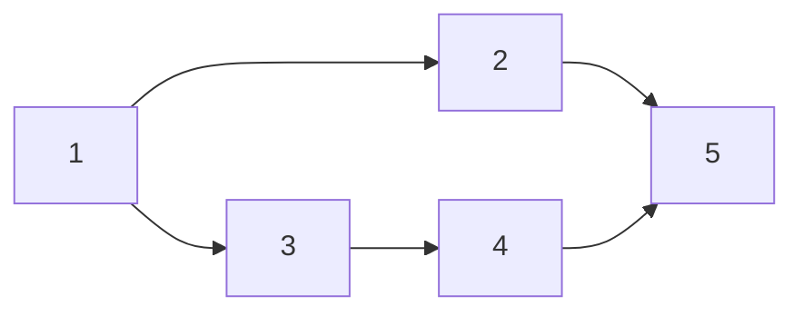

# CSES 1680 — Longest Flight Route (DAG Longest Path)

| | |
|---|---|
| **Source** | CSES Problem Set — Graph Algorithms |
| **Difficulty** | Medium |
| **Topics** | Topological Sort, DAG DP, Longest Path, Path Reconstruction |
| **Link** | https://cses.fi/problemset/task/1680 |

There are `n` cities and `m` **one-way** flight connections. You start in city `1` and want to reach city `n`. Find a route that visits the **maximum number of cities**, and print such a route. If city `n` is unreachable from city `1`, print `IMPOSSIBLE`. The flight network is guaranteed to be a **DAG** (no city can be visited twice).

## Problem Statement

- Input: first line `n m`. Next `m` lines each contain `a b`, a one-way flight `a → b`.
- Output: on the first line the maximum number of cities `k` on a valid route from `1` to `n`; on the second line the `k` cities in order. Or `IMPOSSIBLE`.
- Constraints: `1 ≤ n ≤ 10^5`, `1 ≤ m ≤ 2·10^5`. The graph is a DAG.

```text
Input
5 5
1 2
2 5
1 3
3 4
4 5

Output
4
1 3 4 5

Explanation
Two routes reach city 5: 1->2->5 (3 cities) and 1->3->4->5 (4 cities).
The longer one visits 4 cities, so we output that route.
```

## Approach (WHY)

We want the path from `1` to `n` that passes through the **most cities**. Because the graph is a DAG, the **longest path** is well defined and computable in linear time — unlike general graphs where longest path is NP-hard. The key insight:

> Process vertices in **topological order**. When we reach a vertex `u`, every predecessor that can reach `u` has already been finalized, so `dp[u]` (the longest route from `1` to `u`) is final and we can relax `u`'s outgoing edges.

Define `dp[u]` = maximum number of cities on a route from city `1` to city `u` (or `-∞` if `u` is unreachable). Transition along edge `u → v`:

$$
dp[v] = \max_{(u,\,v)\,\in\,E}\bigl(dp[u] + 1\bigr), \qquad dp[1] = 1.
$$

To **reconstruct** the actual route we store, for each `v`, the predecessor `parent[v]` that achieved the best `dp[v]`. After the DP, if `dp[n]` is reachable we walk `parent` back from `n` to `1` and reverse.

We use **Kahn's algorithm** to generate the topological order iteratively, avoiding recursion-depth issues at `n = 10^5`.

## Algorithm

1. Build `adj` and `indeg[]`.
2. Run Kahn's algorithm to get a topological `order`.
3. Initialize `dp[v] = -∞`, `dp[1] = 1`, `parent[v] = -1`.
4. Traverse `order`; for each `u` with `dp[u] != -∞`, relax each edge `u → v`: if `dp[u] + 1 > dp[v]`, set `dp[v] = dp[u] + 1` and `parent[v] = u`.
5. If `dp[n] == -∞` print `IMPOSSIBLE`; else walk `parent` from `n` back to `1`, reverse, and print.



## DP Trace (sample)

A topological order is `1, 2, 3, 4, 5`. Start `dp[1]=1`, all others `-∞`.

| Process `u` | `dp[u]` | Relaxations `u → v` | Updates | `dp[]` after (1..5) | `parent[]` (1..5) |
|---|---|---|---|---|---|
| `1` | 1 | `→2`, `→3` | `dp[2]=2,p=1`; `dp[3]=2,p=1` | `1,2,2,-∞,-∞` | `-,1,1,-,-` |
| `2` | 2 | `→5` | `dp[5]=3,p=2` | `1,2,2,-∞,3` | `-,1,1,-,2` |
| `3` | 2 | `→4` | `dp[4]=3,p=3` | `1,2,2,3,3` | `-,1,1,3,2` |
| `4` | 3 | `→5` | `dp[4]+1=4 > 3` → `dp[5]=4,p=4` | `1,2,2,3,4` | `-,1,1,3,4` |
| `5` | 4 | — | — | `1,2,2,3,4` | `-,1,1,3,4` |

`dp[5] = 4`. Reconstruct from `5`: `5 → parent 4 → parent 3 → parent 1`, reversed = `1 3 4 5`. ✅

## Solution

```python
import sys
from collections import deque

def main():
    data = sys.stdin.buffer.read().split()
    idx = 0
    n = int(data[idx]); idx += 1
    m = int(data[idx]); idx += 1

    adj = [[] for _ in range(n + 1)]
    indeg = [0] * (n + 1)
    for _ in range(m):
        a = int(data[idx]); b = int(data[idx + 1]); idx += 2
        adj[a].append(b)            # one-way flight a -> b
        indeg[b] += 1

    # Kahn's topological order (iterative; safe for n = 1e5).
    q = deque(v for v in range(1, n + 1) if indeg[v] == 0)
    order = []
    while q:
        u = q.popleft()
        order.append(u)
        for v in adj[u]:
            indeg[v] -= 1
            if indeg[v] == 0:
                q.append(v)

    NEG = -1
    dp = [NEG] * (n + 1)            # max cities on route 1 -> v
    parent = [-1] * (n + 1)
    dp[1] = 1
    for u in order:
        if dp[u] == NEG:
            continue               # u unreachable from city 1
        du = dp[u]
        for v in adj[u]:
            if du + 1 > dp[v]:     # found a longer route to v
                dp[v] = du + 1
                parent[v] = u
            elif dp[v] == NEG:     # first time reaching v
                dp[v] = du + 1
                parent[v] = u

    if dp[n] == NEG:
        sys.stdout.write("IMPOSSIBLE\n")
        return

    path = []
    cur = n
    while cur != -1:               # walk predecessors back to city 1
        path.append(cur)
        cur = parent[cur]
    path.reverse()

    out = [str(dp[n]), " ".join(map(str, path))]
    sys.stdout.write("\n".join(out) + "\n")

main()
```

> Note: in the comparison above, since `dp[v]` starts at `-1` (`NEG`) and every real value is `≥ 2`, `du + 1 > dp[v]` already covers the first-reach case; the explicit `elif` is kept only for clarity. A single `if du + 1 > dp[v]` suffices.

```cpp
#include <bits/stdc++.h>
using namespace std;

int main() {
    ios::sync_with_stdio(false);
    cin.tie(nullptr);

    int n, m;
    cin >> n >> m;

    vector<vector<int>> adj(n + 1);
    vector<int> indeg(n + 1, 0);
    for (int i = 0; i < m; ++i) {
        int a, b;
        cin >> a >> b;
        adj[a].push_back(b);            // one-way flight a -> b
        indeg[b]++;
    }

    // Kahn's topological order (iterative; safe for n = 1e5).
    queue<int> q;
    for (int v = 1; v <= n; ++v)
        if (indeg[v] == 0) q.push(v);
    vector<int> order;
    order.reserve(n);
    while (!q.empty()) {
        int u = q.front(); q.pop();
        order.push_back(u);
        for (int v : adj[u])
            if (--indeg[v] == 0) q.push(v);
    }

    const int NEG = -1;
    vector<int> dp(n + 1, NEG);         // max cities on route 1 -> v
    vector<int> parent(n + 1, -1);
    dp[1] = 1;
    for (int u : order) {
        if (dp[u] == NEG) continue;     // u unreachable from city 1
        for (int v : adj[u]) {
            if (dp[u] + 1 > dp[v]) {    // found a longer route to v
                dp[v] = dp[u] + 1;
                parent[v] = u;
            }
        }
    }

    if (dp[n] == NEG) {
        cout << "IMPOSSIBLE\n";
        return 0;
    }

    vector<int> path;
    for (int cur = n; cur != -1; cur = parent[cur])  // walk back to city 1
        path.push_back(cur);
    reverse(path.begin(), path.end());

    cout << dp[n] << "\n";
    for (size_t i = 0; i < path.size(); ++i)
        cout << path[i] << " \n"[i + 1 == path.size()];
    return 0;
}
```

## Why Topological Order Is Required

The transition `dp[v] = max(dp[u] + 1)` is only correct if **all** predecessors `u` of `v` are finalized before `v` is processed. Topological order guarantees exactly that: for every edge `u → v`, `u` precedes `v` in the order, so when we relax `u`'s outgoing edges, `dp[u]` already holds its final value. Without this ordering (e.g. arbitrary BFS/DFS), a later-discovered longer path into `u` would never propagate to `v`.

## Complexity

| Aspect | Cost |
|---|---|
| Build graph + in-degrees | $O(n + m)$ |
| Kahn topological order | $O(n + m)$ |
| DP relaxation pass | $O(n + m)$ — each edge relaxed once |
| Path reconstruction | $O(n)$ |
| **Total time** | $O(n + m)$ |
| **Space** | $O(n + m)$ adjacency + `dp` + `parent` |

## Takeaway

Longest path in a **DAG** is linear, not NP-hard: linearize the graph with a topological sort (Kahn's BFS keeps it iterative for `n = 10^5`), then do a single forward relaxation `dp[v] = max(dp[u] + 1)`. Record a `parent` pointer at each improvement so you can **reconstruct** the route by walking back from `n` to `1` and reversing. If `dp[n]` stays unreachable, the destination cannot be reached → `IMPOSSIBLE`.
