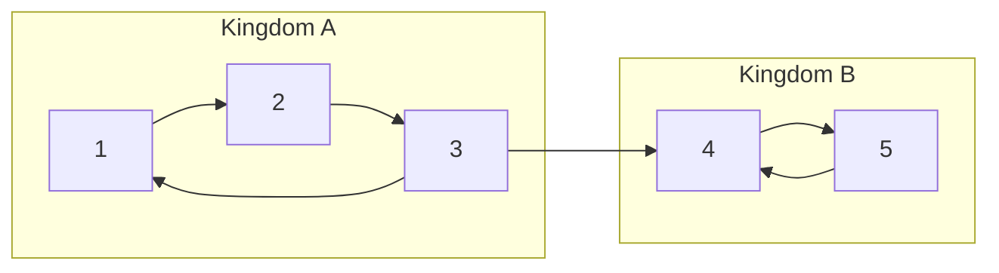

# CSES 1683 — Planets and Kingdoms (Label Each Node with its SCC id)

| | |
|---|---|
| **Source** | CSES Problem Set — Graph Algorithms |
| **Difficulty** | Medium |
| **Topics** | Strongly Connected Components, Tarjan, Kosaraju, DFS, Transpose |
| **Link** | https://cses.fi/problemset/task/1683 |

There are `n` planets connected by `m` one-way *teleporters*. Two planets belong to the **same kingdom** when you can travel from each to the other (both directions of reachability). Your task is to determine the kingdoms and assign each planet a kingdom id, so that two planets share an id **iff** they are mutually reachable. A "kingdom" is exactly a **Strongly Connected Component**.

## Problem Statement

- **Input:** first line `n m`. Each of the next `m` lines holds `a b`, a one-way teleporter from planet `a` to planet `b` (`1`-indexed).
- **Output:** first line `k` = number of kingdoms. Second line lists `n` integers, the kingdom id (in `1..k`) of each planet `1..n`. Any valid labeling is accepted as long as same-kingdom ⇔ mutually reachable.
- **Constraints:** `1 ≤ n ≤ 10^5`, `1 ≤ m ≤ 2·10^5`.

```text
Input
5 6
1 2
2 3
3 1
3 4
4 5
5 4

A valid Output
3
1 1 1 2 2

Explanation
Edges 1->2->3->1 form a cycle, so {1,2,3} are mutually reachable -> kingdom 1.
Edges 4->5 and 5->4 form a 2-cycle -> {4,5} is kingdom 2.
The edge 3->4 only goes one way, so 4 cannot return to 3: different kingdoms.
(The numbering itself is free; here the three SCCs collapsed to ids 1 and 2
because the sample groups {1,2,3} and {4,5}; a run may print other ids.)
```

## Approach (WHY)

"Mutually reachable" is the **definition** of a strongly connected component. So the whole task is: compute SCCs, then print the count and each vertex's component id. We need an $O(n+m)$ algorithm, and with `n` up to `10^5` and `m` up to `2·10^5` we must use an **iterative** DFS — a recursive DFS would overflow the stack on a long teleporter chain.

Either algorithm works:

- **Tarjan** — a single DFS maintaining `disc`, `low`, and a stack; when `low[u] == disc[u]` we pop one whole SCC.
- **Kosaraju** — a finish-order DFS on `G`, then a DFS on the transpose `Gᵀ` in reverse finish order; each second-pass tree is one SCC.

CSES requires kingdom ids in `1..k`, so we simply add `1` to the zero-based component ids our routine produces.

## Algorithm

1. Read edges into adjacency list `adj` (`0`-indexed internally).
2. Run iterative **Tarjan** (primary) to get `ncomp` and `comp[]`.
3. Print `ncomp`, then `comp[u] + 1` for `u = 0..n-1`.



## Iteration Trace (Tarjan on the sample)

DFS from planet `1` (internally vertex `0`); `disc`/`low` shown 0-based by discovery. The stack holds open vertices; an SCC pops when `low == disc`.

| Step | Action | u | disc[u] | low[u] | Stack (bottom→top) | SCC popped |
|---|---|---|---|---|---|---|
| 1 | enter 1 | 1 | 0 | 0 | 1 | — |
| 2 | enter 2 | 2 | 1 | 1 | 1 2 | — |
| 3 | enter 3 | 3 | 2 | 2 | 1 2 3 | — |
| 4 | edge 3→1 (on stack) | 3 | 2 | **0** | 1 2 3 | — |
| 5 | enter 4 (via 3→4) | 4 | 3 | 3 | 1 2 3 4 | — |
| 6 | enter 5 | 5 | 4 | 4 | 1 2 3 4 5 | — |
| 7 | edge 5→4 (on stack) | 5 | 4 | **3** | 1 2 3 4 5 | — |
| 8 | finish 5, fold low→4 | 4 | 3 | 3 | 1 2 3 4 5 | — |
| 9 | finish 4: low==disc | 4 | 3 | 3 | 1 2 3 | **{5,4}** |
| 10 | finish 3, fold low→2 | 2 | 1 | 0 | 1 2 3 | — |
| 11 | finish 2, fold low→1 | 1 | 0 | 0 | 1 2 3 | — |
| 12 | finish 1: low==disc | 1 | 0 | 0 | (empty) | **{3,2,1}** |

Result: two SCCs — `{4,5}` (emitted first) and `{1,2,3}` — giving `k = 2` kingdoms.

## Solutions

```python
import sys

def main():
    input_data = sys.stdin.buffer.read().split()
    idx = 0
    n = int(input_data[idx]); idx += 1
    m = int(input_data[idx]); idx += 1
    adj = [[] for _ in range(n)]
    for _ in range(m):
        a = int(input_data[idx]) - 1; idx += 1   # to 0-indexed
        b = int(input_data[idx]) - 1; idx += 1
        adj[a].append(b)                           # directed edge a -> b

    # ---- Iterative Tarjan SCC ----
    disc = [-1] * n            # discovery time, -1 = unvisited
    low = [0] * n              # low-link value
    comp = [-1] * n            # SCC id of each vertex
    on_stack = [False] * n     # vertex currently on the SCC stack?
    scc_stack = []             # vertices awaiting a component
    timer = 0
    ncomp = 0

    for start in range(n):
        if disc[start] != -1:
            continue
        work = [(start, 0)]                        # (u, next neighbour index)
        while work:
            u, i = work[-1]
            if i == 0:                             # first entry into u
                disc[u] = low[u] = timer
                timer += 1
                scc_stack.append(u)
                on_stack[u] = True
            if i < len(adj[u]):
                work[-1] = (u, i + 1)              # advance pointer
                v = adj[u][i]
                if disc[v] == -1:                  # tree edge: descend
                    work.append((v, 0))
                elif on_stack[v]:                  # back/cross edge to open vertex
                    low[u] = min(low[u], disc[v])
            else:                                  # finished u: pop frame
                work.pop()
                if work:                           # propagate low to parent
                    p = work[-1][0]
                    low[p] = min(low[p], low[u])
                if low[u] == disc[u]:              # u is an SCC root
                    while True:
                        w = scc_stack.pop()
                        on_stack[w] = False
                        comp[w] = ncomp
                        if w == u:
                            break
                    ncomp += 1

    out = [str(ncomp), " ".join(str(comp[u] + 1) for u in range(n))]  # ids in 1..k
    sys.stdout.write("\n".join(out) + "\n")

main()
```

```cpp
#include <bits/stdc++.h>
using namespace std;

int main() {
    ios::sync_with_stdio(false);
    cin.tie(nullptr);

    int n, m;
    cin >> n >> m;
    vector<vector<int>> adj(n);
    for (int e = 0; e < m; ++e) {
        int a, b; cin >> a >> b;
        adj[a - 1].push_back(b - 1);               // 0-indexed directed edge
    }

    // ---- Iterative Tarjan SCC ----
    vector<int> disc(n, -1), low(n, 0), comp(n, -1);
    vector<char> onStack(n, 0);
    vector<int> sccStack;
    int timer = 0, ncomp = 0;

    vector<pair<int,int>> work;                    // (u, next neighbour index)
    for (int start = 0; start < n; ++start) {
        if (disc[start] != -1) continue;
        work.push_back({start, 0});
        while (!work.empty()) {
            auto& [u, i] = work.back();
            if (i == 0) {                          // first entry into u
                disc[u] = low[u] = timer++;
                sccStack.push_back(u);
                onStack[u] = 1;
            }
            if (i < (int)adj[u].size()) {
                int v = adj[u][i++];               // advance pointer
                if (disc[v] == -1) {               // tree edge: descend
                    work.push_back({v, 0});
                } else if (onStack[v]) {           // back/cross edge to open vertex
                    low[u] = min(low[u], disc[v]);
                }
            } else {                               // finished u: pop frame
                int uu = u;
                work.pop_back();
                if (!work.empty())                 // propagate low to parent
                    low[work.back().first] = min(low[work.back().first], low[uu]);
                if (low[uu] == disc[uu]) {         // uu is an SCC root
                    while (true) {
                        int w = sccStack.back(); sccStack.pop_back();
                        onStack[w] = 0;
                        comp[w] = ncomp;
                        if (w == uu) break;
                    }
                    ++ncomp;
                }
            }
        }
    }

    cout << ncomp << "\n";
    for (int u = 0; u < n; ++u)
        cout << comp[u] + 1 << " \n"[u == n - 1];  // ids in 1..k
    return 0;
}
```

## Why It's Correct

Mutual reachability is an equivalence relation, and SCCs are precisely its equivalence classes:

$$
\text{same kingdom}(u, v) \iff u \rightsquigarrow v \ \wedge\ v \rightsquigarrow u \iff comp[u] = comp[v].
$$

Tarjan assigns `comp[u] == comp[v]` exactly when `u` and `v` end up in the same stack pop, which happens iff they are mutually reachable — so the labeling matches the kingdom definition. Adding `1` shifts ids into the required `1..k` range without changing which vertices share an id.

## Complexity

| Aspect | Cost |
|---|---|
| Time | $O(n + m)$ — each vertex/edge processed once |
| Extra space | $O(n)$ — `disc`, `low`, `comp`, stacks |
| Recursion risk | none (iterative DFS) |

## Takeaway

CSES *Planets and Kingdoms* is the purest SCC-labeling exercise: kingdoms ≡ strongly connected components. Reach for an **iterative** Tarjan (or Kosaraju) to stay within $O(n+m)$ and dodge recursion-depth crashes, then print component ids shifted to `1..k`.
