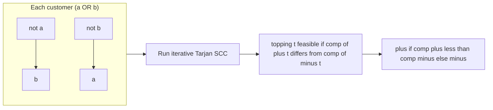
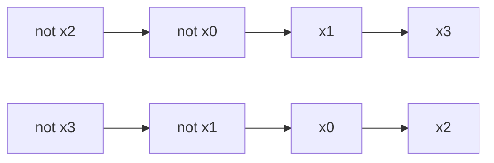

# CSES 1684 — Giant Pizza (2-SAT: Satisfy At Least One Wish per Person)

| | |
|---|---|
| **Source** | CSES Problem Set — Graph Algorithms |
| **Difficulty** | Hard |
| **Topics** | 2-SAT, Implication Graph, Strongly Connected Components, Tarjan |
| **Link** | https://cses.fi/problemset/task/1684 |

---

## Problem Statement

A pizzeria takes $m$ orders to make a single pizza with $n$ possible toppings. Each topping is either **added** ($+$) or **left off** ($-$) — a binary choice per topping. Every customer states **two wishes**, each a topping with a sign; the customer is happy if **at least one** of their two wishes is honored. Decide whether a single $+/-$ choice per topping can make *every* customer happy, and if so output one such choice.

- **Input:** first line $n$ (customers) and $m$ (toppings). Each of the next $n$ lines is a customer: a sign (`+`/`-`) and topping index, then another sign and topping index.
- **Output:** print a line of $m$ characters, the $i$-th being `+` or `-` for topping $i$; or `IMPOSSIBLE` if no assignment satisfies all customers.
- **Constraints:** $1 \le n \le 10^5$, $1 \le m \le 10^5$.

Let $x_t = \text{true}$ mean topping $t$ is **added** ($+$). A customer wishing "$+a$ or $-b$" is satisfied when $x_a \lor \neg x_b$ holds. The whole input is therefore a 2-CNF formula

$$
\Phi = \bigwedge_{\text{customers}} (\ell_1 \lor \ell_2),
$$

and we must decide satisfiability and produce a model — textbook **2-SAT**.

```text
Input
3 5
+ 1 + 2
- 1 + 3
+ 4 - 2

Output (one valid answer)
- + - + -
```

Customer 1 wants $+1$ or $+2$; topping 2 is added → happy. Customer 2 wants $-1$ or $+3$; topping 1 is left off → happy. Customer 3 wants $+4$ or $-2$; topping 4 is added → happy.

## Approach (WHY)

Each topping is a boolean variable, each customer a clause with two literals — the exact shape 2-SAT solves in linear time. Convert each clause $(a \lor b)$ into its two implications $\neg a \Rightarrow b$ and $\neg b \Rightarrow a$, build the implication graph on $2m$ literal-nodes, run an SCC decomposition, and apply the criterion: the menu is feasible **iff** no topping's two literal-nodes share an SCC. The assignment is read straight off the Tarjan component ids.

With $m$ up to $10^5$ toppings and $n$ up to $10^5$ customers (so up to $2 \cdot 10^5$ implication edges) we need the **iterative** SCC — a recursive DFS would overflow on long implication chains.



We use the **interleaved** node convention from [guide 13](../guide/13-two-sat.md): node $2t$ = "topping $t$ added", node $2t+1$ = "topping $t$ left off", and negation is `v ^ 1`. Internally toppings are `0`-indexed; input is `1`-indexed.

## Solution

### Python

```python
import sys

def main():
    data = sys.stdin.buffer.read().split()
    idx = 0
    n = int(data[idx]); idx += 1       # customers (clauses)
    m = int(data[idx]); idx += 1       # toppings  (variables)

    adj = [[] for _ in range(2 * m)]   # implication graph

    def node(var, is_true):
        return 2 * var + (0 if is_true else 1)

    def add_clause(a, b):              # a, b are node ids; (a OR b)
        adj[a ^ 1].append(b)           # not a => b
        adj[b ^ 1].append(a)           # not b => a

    for _ in range(n):
        s1 = data[idx]; t1 = int(data[idx + 1]) - 1; idx += 2
        s2 = data[idx]; t2 = int(data[idx + 1]) - 1; idx += 2
        a = node(t1, s1 == b'+')       # '+': topping true (added)
        b = node(t2, s2 == b'+')
        add_clause(a, b)

    # ---- Iterative Tarjan SCC over 2m literal-nodes ----
    N = 2 * m
    disc = [-1] * N
    low = [0] * N
    comp = [-1] * N
    on_stack = [False] * N
    scc_stack = []
    timer = 0
    ncomp = 0

    for start in range(N):
        if disc[start] != -1:
            continue
        work = [(start, 0)]
        while work:
            u, i = work[-1]
            if i == 0:
                disc[u] = low[u] = timer
                timer += 1
                scc_stack.append(u)
                on_stack[u] = True
            if i < len(adj[u]):
                work[-1] = (u, i + 1)
                v = adj[u][i]
                if disc[v] == -1:
                    work.append((v, 0))
                elif on_stack[v]:
                    low[u] = min(low[u], disc[v])
            else:
                if low[u] == disc[u]:
                    while True:
                        w = scc_stack.pop()
                        on_stack[w] = False
                        comp[w] = ncomp
                        if w == u:
                            break
                    ncomp += 1
                work.pop()
                if work:
                    p = work[-1][0]
                    low[p] = min(low[p], low[u])

    out = []
    for t in range(m):
        if comp[2 * t] == comp[2 * t + 1]:
            print("IMPOSSIBLE")
            return
        # Tarjan: smaller comp id = topologically later = chosen true
        out.append('+' if comp[2 * t] < comp[2 * t + 1] else '-')
    sys.stdout.write(' '.join(out) + '\n')

main()
```

### C++

```cpp
#include <bits/stdc++.h>
using namespace std;

int main() {
    ios_base::sync_with_stdio(false);
    cin.tie(nullptr);

    int n, m;                          // n customers, m toppings
    cin >> n >> m;

    int N = 2 * m;                     // literal-nodes
    vector<vector<int>> adj(N);

    auto node = [](int var, bool isTrue) { return 2 * var + (isTrue ? 0 : 1); };
    auto addClause = [&](int a, int b) {           // (a OR b)
        adj[a ^ 1].push_back(b);                   // not a => b
        adj[b ^ 1].push_back(a);                   // not b => a
    };

    for (int c = 0; c < n; ++c) {
        char s1, s2; int t1, t2;
        cin >> s1 >> t1 >> s2 >> t2;
        int a = node(t1 - 1, s1 == '+');           // '+': topping added (true)
        int b = node(t2 - 1, s2 == '+');
        addClause(a, b);
    }

    // ---- Iterative Tarjan SCC ----
    vector<int> disc(N, -1), low(N, 0), comp(N, -1);
    vector<char> onStack(N, 0);
    vector<int> sccStack;
    sccStack.reserve(N);
    int timer = 0, ncomp = 0;

    for (int start = 0; start < N; ++start) {
        if (disc[start] != -1) continue;
        vector<pair<int,int>> work;
        work.push_back({start, 0});
        while (!work.empty()) {
            int u = work.back().first;
            int& i = work.back().second;
            if (i == 0) {
                disc[u] = low[u] = timer++;
                sccStack.push_back(u);
                onStack[u] = 1;
            }
            if (i < (int)adj[u].size()) {
                int v = adj[u][i++];
                if (disc[v] == -1) {
                    work.push_back({v, 0});
                } else if (onStack[v]) {
                    low[u] = min(low[u], disc[v]);
                }
            } else {
                if (low[u] == disc[u]) {
                    while (true) {
                        int w = sccStack.back(); sccStack.pop_back();
                        onStack[w] = 0;
                        comp[w] = ncomp;
                        if (w == u) break;
                    }
                    ++ncomp;
                }
                work.pop_back();
                if (!work.empty()) {
                    int p = work.back().first;
                    low[p] = min(low[p], low[u]);
                }
            }
        }
    }

    string out;
    out.reserve(2 * m);
    for (int t = 0; t < m; ++t) {
        if (comp[2 * t] == comp[2 * t + 1]) {      // contradiction
            cout << "IMPOSSIBLE\n";
            return 0;
        }
        // Tarjan: smaller comp id = topologically later = chosen true
        out += (comp[2 * t] < comp[2 * t + 1]) ? '+' : '-';
        if (t + 1 < m) out += ' ';
    }
    cout << out << '\n';
    return 0;
}
```

## Iteration Trace

Sample with $m = 5$ toppings, $n = 3$ customers. Literal-nodes: $2t$ = "$+t$" (added), $2t+1$ = "$-t$" (off). Edges added per clause:

| Customer | Clause $(a \lor b)$ | Edge $\neg a \Rightarrow b$ | Edge $\neg b \Rightarrow a$ |
|---|---|---|---|
| $+1\ +2$ | $x_0 \lor x_1$ | not $x_0$ → $x_1$ | not $x_1$ → $x_0$ |
| $-1\ +3$ | $\neg x_0 \lor x_2$ | $x_0$ → $x_2$ | not $x_2$ → not $x_0$ |
| $+4\ -2$ | $x_3 \lor \neg x_1$ | not $x_3$ → not $x_1$ | $x_1$ → $x_3$ |

After the SCC pass each topping's two nodes fall in different components, so the criterion holds. Reading `comp[2t] < comp[2t+1]` per topping yields one valid menu, e.g. `- + - + -`.

| Topping $t$ | comp($+t$) vs comp($-t$) | Choice |
|---|---|---|
| 0 | comp(0) > comp(1) | `-` |
| 1 | comp(2) < comp(3) | `+` |
| 2 | comp(4) > comp(5) | `-` |
| 3 | comp(6) < comp(7) | `+` |
| 4 | comp(8) > comp(9) | `-` |



## Complexity

With $n$ clauses and $m$ variables the implication graph has $2m$ nodes and $2n$ edges. Build, SCC, and recovery are each linear:

$$
T(n, m) = O(n + m), \qquad S(n, m) = O(n + m).
$$

| Phase | Time | Space |
|---|---|---|
| Build implication graph | $O(n + m)$ | $O(n + m)$ |
| Iterative Tarjan SCC | $O(n + m)$ | $O(n + m)$ |
| Check + recover assignment | $O(m)$ | $O(m)$ |
| **Total** | $O(n + m)$ | $O(n + m)$ |

## Takeaway

"Each item has two states, each request needs at least one of two literals satisfied" is the canonical 2-SAT signature. Encode every topping as a variable and every customer as a clause, then lean on the same iterative SCC engine from [guide 07](../guide/07-scc-tarjan-kosaraju.md): feasibility is "no variable shares an SCC with its negation," and the answer is a direct component-id comparison. See [guide 13](../guide/13-two-sat.md) for the full framework.
