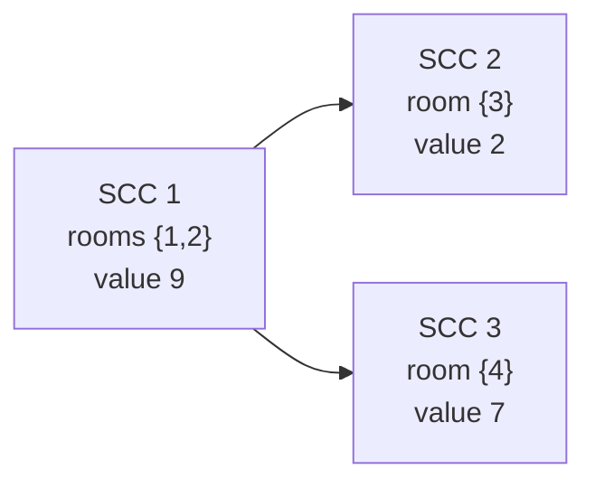

# CSES 1686 — Coin Collector (Condense SCCs, then Longest-Path DP on the DAG)

| | |
|---|---|
| **Source** | CSES Problem Set — Graph Algorithms |
| **Difficulty** | Hard |
| **Topics** | Strongly Connected Components, Condensation, DAG DP, Longest Path, Tarjan |
| **Link** | https://cses.fi/problemset/task/1686 |

There are `n` rooms, each holding some coins, connected by `m` one-way teleporters. You may start in **any** room and follow teleporters as long as you like (revisiting rooms is allowed). Collecting a room's coins counts **once**. Maximize the total number of coins you can gather along a single walk.

## Problem Statement

- **Input:** first line `n m`. Second line: `k_1 … k_n`, the coins in each room. Each of the next `m` lines holds `a b`, a one-way teleporter `a → b` (`1`-indexed).
- **Output:** a single integer — the maximum coins collectable on one walk.
- **Constraints:** `1 ≤ n ≤ 10^5`, `1 ≤ m ≤ 2·10^5`, `1 ≤ k_i ≤ 10^9`. Sums can reach ~`10^{14}`, so use **64-bit** integers.

```text
Input
4 4
4 5 2 7
1 2
2 1
1 3
2 4

A valid Output
16

Explanation
Rooms 1 and 2 form a cycle (1->2->1), so once inside you can grab BOTH:
4 + 5 = 9 coins. From there 1->3 (+2) or 2->4 (+7). Taking the 4 gives more:
9 + 7 = 16. You cannot get rooms 3 and 4 together (no path links them after
the cycle), so 16 is optimal.
```

## Approach (WHY)

Two observations unlock the problem:

1. **Inside a cycle, all coins are free.** If a set of rooms is mutually reachable (an **SCC**), a walk that enters the SCC can tour *every* room in it and collect all their coins. So each SCC behaves like one super-room whose value is the **sum** of its members' coins.
2. **Between SCCs the structure is acyclic.** Collapsing each SCC into a super-node yields the **condensation**, which is always a **DAG**. A walk through the original graph becomes a *path* in this DAG, and since coins per super-node are counted once, the answer is the **maximum-weight path** in the DAG (free choice of start and end).

So the recipe is: **SCC → condense → longest-path DP over the DAG.** With `n ≤ 10^5`, `m ≤ 2·10^5`, we use **iterative Tarjan** (recursive DFS overflows on long chains) and **64-bit** accumulators for the coin sums.

A neat shortcut: **Tarjan numbers components in reverse topological order** of the condensation. That means for every super-edge `c → s` we have `s < c`. Iterating component ids from `0` upward therefore visits each node *after* all of its successors, so a single forward sweep computes the best path with no separate topological sort needed.

$$
best[c] = weight[c] + \max\Big(0,\ \max_{c \to s \text{ in condensation}} best[s]\Big), \qquad answer = \max_c best[c].
$$

## Algorithm

1. Read coins `k[]` and directed edges into `adj`.
2. **Iterative Tarjan** → `ncomp`, `comp[]`.
3. `weight[c] = Σ k[u]` over rooms `u` with `comp[u] == c` (use `long long`).
4. Build the **condensation** edges (only `comp[u] != comp[v]`); dedup optional.
5. Sweep components `0..ncomp-1` (reverse-topo): `best[c] = weight[c] + max(0, max best[s])`.
6. Answer = `max best[c]`.



Best path: `SCC 1 → SCC 3` gives `9 + 7 = 16`.

## Iteration Trace (DAG DP on the condensation)

Using Tarjan's reverse-topo ids for the sample. Suppose Tarjan emits `SCC{3}=0`, `SCC{4}=1`, `SCC{1,2}=2` (sinks pop first). Weights: `w[0]=2`, `w[1]=7`, `w[2]=9`. Condensation edges: `2→0`, `2→1`.

| Component `c` (reverse-topo) | weight[c] | successors | best from succ | best[c] = w + max(0, …) |
|---|---|---|---|---|
| 0 (room 3) | 2 | — | 0 | 2 |
| 1 (room 4) | 7 | — | 0 | 7 |
| 2 (rooms 1,2) | 9 | 0, 1 | max(2, 7) = 7 | 9 + 7 = **16** |

`answer = max(2, 7, 16) = 16`.

## Solutions

```python
import sys

def main():
    data = sys.stdin.buffer.read().split()
    idx = 0
    n = int(data[idx]); idx += 1
    m = int(data[idx]); idx += 1
    coins = [0] * n
    for u in range(n):
        coins[u] = int(data[idx]); idx += 1
    adj = [[] for _ in range(n)]
    for _ in range(m):
        a = int(data[idx]) - 1; idx += 1          # to 0-indexed
        b = int(data[idx]) - 1; idx += 1
        adj[a].append(b)                           # directed edge a -> b

    # ---- Iterative Tarjan SCC ----
    disc = [-1] * n            # discovery time
    low = [0] * n              # low-link
    comp = [-1] * n            # SCC id
    on_stack = [False] * n
    scc_stack = []
    timer = 0
    ncomp = 0
    for start in range(n):
        if disc[start] != -1:
            continue
        work = [(start, 0)]                        # (u, next neighbour index)
        while work:
            u, i = work[-1]
            if i == 0:
                disc[u] = low[u] = timer
                timer += 1
                scc_stack.append(u)
                on_stack[u] = True
            if i < len(adj[u]):
                work[-1] = (u, i + 1)
                v = adj[u][i]
                if disc[v] == -1:                  # tree edge
                    work.append((v, 0))
                elif on_stack[v]:                  # back/cross to open vertex
                    low[u] = min(low[u], disc[v])
            else:
                work.pop()
                if work:                           # propagate low to parent
                    p = work[-1][0]
                    low[p] = min(low[p], low[u])
                if low[u] == disc[u]:              # SCC root -> pop component
                    while True:
                        w = scc_stack.pop()
                        on_stack[w] = False
                        comp[w] = ncomp
                        if w == u:
                            break
                    ncomp += 1

    # ---- Aggregate weights per SCC (64-bit sums) ----
    weight = [0] * ncomp
    for u in range(n):
        weight[comp[u]] += coins[u]

    # ---- Condensation edges (cross-component only) ----
    cadj = [set() for _ in range(ncomp)]
    for u in range(n):
        cu = comp[u]
        for v in adj[u]:
            cv = comp[v]
            if cu != cv:
                cadj[cu].add(cv)

    # ---- Longest path: Tarjan ids are reverse-topo, so single forward sweep ----
    best = weight[:]                               # best[c] = max coins starting at c
    ans = 0
    for c in range(ncomp):                         # successors have smaller id
        add = 0
        for s in cadj[c]:
            if best[s] > add:
                add = best[s]
        best[c] = weight[c] + add
        if best[c] > ans:
            ans = best[c]

    sys.stdout.write(str(ans) + "\n")

main()
```

```cpp
#include <bits/stdc++.h>
using namespace std;

int main() {
    ios::sync_with_stdio(false);
    cin.tie(nullptr);

    int n, m;
    cin >> n >> m;
    vector<long long> coins(n);
    for (int u = 0; u < n; ++u) cin >> coins[u];
    vector<vector<int>> adj(n);
    for (int e = 0; e < m; ++e) {
        int a, b; cin >> a >> b;
        adj[a - 1].push_back(b - 1);               // 0-indexed directed edge
    }

    // ---- Iterative Tarjan SCC ----
    vector<int> disc(n, -1), low(n, 0), comp(n, -1);
    vector<char> onStack(n, 0);
    vector<int> sccStack;
    int timer = 0, ncomp = 0;
    vector<pair<int,int>> work;                    // (u, next neighbour index)
    for (int start = 0; start < n; ++start) {
        if (disc[start] != -1) continue;
        work.push_back({start, 0});
        while (!work.empty()) {
            auto& [u, i] = work.back();
            if (i == 0) {
                disc[u] = low[u] = timer++;
                sccStack.push_back(u);
                onStack[u] = 1;
            }
            if (i < (int)adj[u].size()) {
                int v = adj[u][i++];
                if (disc[v] == -1) {               // tree edge
                    work.push_back({v, 0});
                } else if (onStack[v]) {           // back/cross to open vertex
                    low[u] = min(low[u], disc[v]);
                }
            } else {
                int uu = u;
                work.pop_back();
                if (!work.empty())                 // propagate low to parent
                    low[work.back().first] = min(low[work.back().first], low[uu]);
                if (low[uu] == disc[uu]) {         // SCC root -> pop component
                    while (true) {
                        int w = sccStack.back(); sccStack.pop_back();
                        onStack[w] = 0;
                        comp[w] = ncomp;
                        if (w == uu) break;
                    }
                    ++ncomp;
                }
            }
        }
    }

    // ---- Aggregate weights per SCC (64-bit) ----
    vector<long long> weight(ncomp, 0);
    for (int u = 0; u < n; ++u) weight[comp[u]] += coins[u];

    // ---- Condensation edges (cross-component only) ----
    vector<vector<int>> cadj(ncomp);
    {
        vector<set<int>> tmp(ncomp);
        for (int u = 0; u < n; ++u) {
            int cu = comp[u];
            for (int v : adj[u]) {
                int cv = comp[v];
                if (cu != cv) tmp[cu].insert(cv);
            }
        }
        for (int c = 0; c < ncomp; ++c)
            cadj[c] = vector<int>(tmp[c].begin(), tmp[c].end());
    }

    // ---- Longest path: Tarjan ids are reverse-topo -> single forward sweep ----
    vector<long long> best = weight;               // best[c] = max coins starting at c
    long long ans = 0;
    for (int c = 0; c < ncomp; ++c) {              // successors have smaller id
        long long add = 0;
        for (int s : cadj[c]) add = max(add, best[s]);
        best[c] = weight[c] + add;
        ans = max(ans, best[c]);
    }

    cout << ans << "\n";
    return 0;
}
```

## Why It's Correct

A walk in the original graph maps to a path in the condensation DAG, and every SCC on that path contributes *all* of its coins exactly once (mutual reachability lets you tour the whole component). Conversely any DAG path lifts back to a valid walk. So the maximum walk value equals the maximum-weight path in the condensation:

$$
\text{answer} = \max_{P \text{ path in } C}\ \sum_{c \in P} weight[c], \qquad weight[c] = \sum_{u:\,comp[u]=c} k_u.
$$

The recurrence $best[c] = weight[c] + \max(0, \max_{c\to s} best[s])$ computes exactly this longest path; processing components in reverse topological order (Tarjan's native id order) guarantees each `best[s]` is final before it is read.

## Complexity

| Aspect | Cost |
|---|---|
| SCC (Tarjan) | $O(n + m)$ |
| Build condensation | $O(n + m)$ (or $O(m \log m)$ if deduping with sets) |
| DAG DP | $O(\text{nodes} + \text{edges of } C) \le O(n + m)$ |
| **Total** | $O(n + m)$ |
| Extra space | $O(n + m)$ |
| Integer width | **64-bit** (`long long`) — sums up to ~$10^{14}$ |

## Takeaway

*Coin Collector* is the canonical **"condense then DP"** problem: cycles let you collect everything inside an SCC for free, so collapse each SCC into a weighted super-node and the messy directed graph becomes a clean DAG where a single longest-path sweep yields the answer. Remember **iterative Tarjan** for the size limits and **`long long`** for the coin sums.
