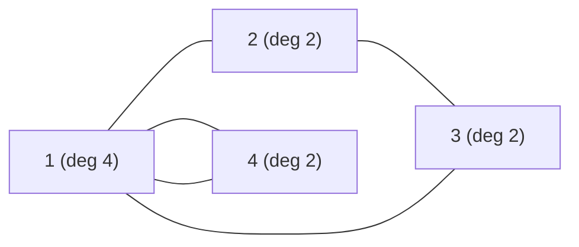

# CSES 1691 — Mail Delivery (Eulerian Circuit, Undirected)

| | |
|---|---|
| **Source** | CSES Problem Set — Graph Algorithms |
| **Difficulty** | Medium |
| **Topics** | Eulerian Circuit, Hierholzer's Algorithm, Undirected Graph, Degree Parity |
| **Link** | https://cses.fi/problemset/task/1691 |

A mail carrier needs to deliver mail along every street and return to the post office. There are `n` crossings and `m` two-way streets. Starting and ending at crossing `1`, find a route that travels along **every street exactly once** — i.e. an **Eulerian circuit** of the undirected graph — or report `IMPOSSIBLE`.

## Problem Statement

- Input: first line `n m`. Next `m` lines each contain `a b`: a two-way street between crossings `a` and `b`.
- Output: a sequence of crossings forming a route that starts at `1`, ends at `1`, and uses every street exactly once. If none exists, print `IMPOSSIBLE`.
- Constraints: `1 ≤ n ≤ 10^5`, `1 ≤ m ≤ 2·10^5`.

```text
Input
7 9
1 2
1 3
2 3
2 4
2 5
4 5
3 6
3 7
6 7

A valid Output
1 2 4 5 2 3 6 7 3 1

Explanation
Degrees: deg(1)=2, deg(2)=4, deg(3)=4, deg(4)=2, deg(5)=2, deg(6)=2, deg(7)=2.
Every degree is even and all 9 edges are connected, so an Eulerian circuit
exists. The route above lists 10 crossings = 9 edges + 1, starting and ending
at crossing 1, and walks each of the 9 streets exactly once.
```

If, say, we deleted street `6 7`, then crossings `6` and `7` would each have odd degree (1), giving two odd-degree vertices — no Eulerian **circuit** — so the answer would be `IMPOSSIBLE`.

## Approach (WHY)

We need a closed walk that uses every **edge** exactly once and returns to the start — the definition of an **Eulerian circuit**. For an **undirected** graph a circuit exists **iff**:

1. **Every vertex has even degree.** Each time the route enters a crossing it must leave by a *different* unused street, so streets are consumed in pairs at every crossing. An odd degree leaves one street unmatched, which is only allowed at the endpoints of an *open* trail — but a circuit has no free endpoints.

   $$\text{circuit exists} \iff \forall v\; \deg(v) \equiv 0 \pmod 2 \quad\text{and edges connected.}$$

2. **The edges are connected.** All streets must lie in one component; otherwise some streets are unreachable from crossing `1`. CSES guarantees the start crossing `1` owns edges in valid cases, but we still must verify connectivity — done cheaply by checking the built trail uses all `m` edges.

**IMPOSSIBLE cases:** any vertex with odd degree, or the edges split across multiple components (the trail ends up shorter than `m + 1` vertices).

**Building the trail (Hierholzer).** Start at crossing `1`. Greedily follow unused streets with a **per-vertex pointer** (so each street is examined once), pushing onto an explicit stack. When a crossing has no unused street left, pop it into the output. The output is the circuit **reversed**. Because each undirected street appears in **two** adjacency lists, we mark it consumed by a shared **edge id** so it is never walked from the other side.

Start vertex must be `1` (the post office). Since all degrees are even, getting "stuck" can only happen back at `1`, so the closed-route requirement is automatically satisfied.

## Solution

```python
import sys

def main():
    data = sys.stdin.buffer.read().split()
    idx = 0
    n = int(data[idx]); idx += 1
    m = int(data[idx]); idx += 1

    # adj[v] = list of (neighbor, edge_id); each undirected edge id is in BOTH lists
    adj = [[] for _ in range(n + 1)]
    deg = [0] * (n + 1)
    for eid in range(m):
        a = int(data[idx]); b = int(data[idx + 1]); idx += 2
        adj[a].append((b, eid))
        adj[b].append((a, eid))          # undirected: store both directions, same id
        deg[a] += 1
        deg[b] += 1

    # Eulerian circuit requires every degree even.
    for v in range(1, n + 1):
        if deg[v] % 2 == 1:
            print("IMPOSSIBLE")
            return

    used = [False] * m                   # edge-used flag indexed by EDGE ID
    it = [0] * (n + 1)                    # per-vertex pointer to next unused street
    stack = [1]                          # must start and end at the post office (1)
    trail = []                           # built in reverse

    while stack:
        u = stack[-1]
        advanced = False
        while it[u] < len(adj[u]):
            v, eid = adj[u][it[u]]
            it[u] += 1                   # consume this adjacency slot for u
            if not used[eid]:            # street not yet walked from either side
                used[eid] = True         # double-mark via shared edge id
                stack.append(v)
                advanced = True
                break
        if not advanced:
            trail.append(u)              # u drained -> emit
            stack.pop()

    # Connectivity check folded in: a full circuit visits m + 1 crossings.
    if len(trail) != m + 1:
        print("IMPOSSIBLE")
        return

    trail.reverse()
    sys.stdout.write(" ".join(map(str, trail)) + "\n")

main()
```

```cpp
#include <bits/stdc++.h>
using namespace std;

int main() {
    ios::sync_with_stdio(false);
    cin.tie(nullptr);

    int n, m;
    cin >> n >> m;

    // adj[v] = (neighbor, edge_id); each undirected edge id is in BOTH lists
    vector<vector<pair<int,int>>> adj(n + 1);
    vector<int> deg(n + 1, 0);
    for (int eid = 0; eid < m; ++eid) {
        int a, b; cin >> a >> b;
        adj[a].push_back({b, eid});
        adj[b].push_back({a, eid});      // undirected: both directions, same id
        deg[a]++; deg[b]++;
    }

    // Eulerian circuit requires every degree even.
    for (int v = 1; v <= n; ++v) {
        if (deg[v] & 1) { cout << "IMPOSSIBLE\n"; return 0; }
    }

    vector<char> used(m, 0);             // edge-used flag indexed by EDGE ID
    vector<int> it(n + 1, 0);            // per-vertex pointer to next unused street
    vector<int> stk = {1}, trail;        // must start and end at crossing 1
    trail.reserve(m + 1);

    while (!stk.empty()) {
        int u = stk.back();
        bool advanced = false;
        while (it[u] < (int)adj[u].size()) {
            auto [v, eid] = adj[u][it[u]++];  // consume this adjacency slot for u
            if (!used[eid]) {                 // street not yet walked from either side
                used[eid] = 1;                // double-mark via shared edge id
                stk.push_back(v);
                advanced = true;
                break;
            }
        }
        if (!advanced) {                      // u drained -> emit
            trail.push_back(u);
            stk.pop_back();
        }
    }

    // Connectivity check: a full circuit visits m + 1 crossings.
    if ((int)trail.size() != m + 1) { cout << "IMPOSSIBLE\n"; return 0; }

    reverse(trail.begin(), trail.end());
    for (int i = 0; i < (int)trail.size(); ++i)
        cout << trail[i] << " \n"[i + 1 == (int)trail.size()];
    return 0;
}
```

## Iteration Trace

Smaller graph: `n = 4`, streets `1-2, 2-3, 3-1, 1-4, 4-1` give degrees `deg(1)=4, deg(2)=2, deg(3)=2, deg(4)=2` — all even, `5` edges. Start at `1`. (`eid`: `1-2`=0, `2-3`=1, `3-1`=2, `1-4`=3, `4-1`=4.)

| Step | Top `u` | Action | Stack (bottom→top) | Emitted (reverse) |
|---|---|---|---|---|
| 1 | 1 | walk eid 0 → 2 | `1 2` | — |
| 2 | 2 | walk eid 1 → 3 | `1 2 3` | — |
| 3 | 3 | walk eid 2 → 1 | `1 2 3 1` | — |
| 4 | 1 | walk eid 3 → 4 | `1 2 3 1 4` | — |
| 5 | 4 | walk eid 4 → 1 | `1 2 3 1 4 1` | — |
| 6 | 1 | no unused street, pop | `1 2 3 1 4` | `1` |
| 7 | 4 | drained, pop | `1 2 3 1` | `1 4` |
| 8 | 1 | drained, pop | `1 2 3` | `1 4 1` |
| 9 | 3 | drained, pop | `1 2` | `1 4 1 3` |
| 10 | 2 | drained, pop | `1` | `1 4 1 3 2` |
| 11 | 1 | drained, pop | *(empty)* | `1 4 1 3 2 1` |

Reverse → `1 2 3 1 4 1`. Length `6 = m + 1`, starts and ends at `1`: a valid Eulerian circuit.



## Math

Existence condition (connected undirected graph):

$$\text{Eulerian circuit} \iff \forall v \in V:\ \deg(v) \equiv 0 \pmod 2.$$

Degree-sum (handshaking) guarantees the count of odd-degree vertices is even:

$$\sum_{v \in V} \deg(v) = 2m \;\Rightarrow\; \big|\{v : \deg(v)\ \text{odd}\}\big| \equiv 0 \pmod 2.$$

A valid circuit lists exactly `m + 1` crossings (each of the `m` edges contributes one step):

$$|\text{trail}| = m + 1.$$

## Complexity

| Aspect | Cost |
|---|---|
| Reading input + building adjacency | $O(n + m)$ |
| Degree parity check | $O(n)$ |
| Hierholzer (explicit stack, per-vertex pointer) | $O(n + m)$ |
| Connectivity (trail-length check) | $O(1)$ after construction |
| **Total time** | $O(n + m)$ |
| **Space** | $O(n + m)$ |

## Takeaway

Mail Delivery is the canonical **undirected Eulerian circuit**: check **every degree is even**, run **iterative Hierholzer** from the required start (crossing `1`), and confirm connectivity by verifying the trail has `m + 1` vertices. The two undirected-specific details — a **shared edge-id `used[]` flag** so each street is walked once, and a **per-vertex pointer** for linear time — are exactly what make the solution correct and fast on CSES-scale inputs.
