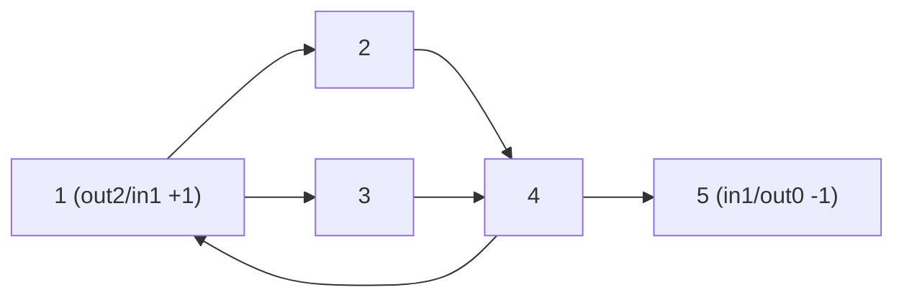

# CSES 1693 — Teleporters Path (Eulerian Path, Directed)

| | |
|---|---|
| **Source** | CSES Problem Set — Graph Algorithms |
| **Difficulty** | Medium |
| **Topics** | Eulerian Path, Hierholzer's Algorithm, Directed Graph, In/Out-Degree Balance |
| **Link** | https://cses.fi/problemset/task/1693 |

A game has `n` levels connected by `m` **one-way** teleporters. You must travel from level `1` to level `n` using **every teleporter exactly once** — i.e. find an **Eulerian path** from `1` to `n` in the directed graph — or report `IMPOSSIBLE`.

## Problem Statement

- Input: first line `n m`. Next `m` lines each contain `a b`: a one-way teleporter from level `a` to level `b`.
- Output: a sequence of levels forming a path that starts at `1`, ends at `n`, and uses every teleporter exactly once. If none exists, print `IMPOSSIBLE`.
- Constraints: `2 ≤ n ≤ 10^5`, `1 ≤ m ≤ 2·10^5`.

```text
Input
5 6
1 2
1 3
2 4
3 4
4 5
4 1

A valid Output
1 2 4 1 3 4 5

Explanation
out/in degrees:
  level 1: out 2, in 1  -> out-in = +1  (forced START)
  level 5: out 0, in 1  -> in-out = +1  (forced END)
  levels 2,3,4: balanced (out == in)
Exactly one +1 start and one +1 end, all others balanced, and the 6 edges are
connected, so an Eulerian path exists. The output lists 7 levels = 6 edges + 1,
starts at 1, ends at 5, and uses each teleporter once.
```

If we removed teleporter `4 5`, then level `4` would have `out 1 / in 2` (`-1`) and level `5` would have `out 0 / in 0` (isolated). Level `1` keeps `+1` but there would be **no** vertex with the matching surplus to end at `n = 5`, so the answer is `IMPOSSIBLE`.

## Approach (WHY)

We need a walk that consumes every **directed edge** exactly once and runs specifically from `1` to `n` — a **directed Eulerian path**. For a directed graph (connected in the underlying sense) such a path exists **iff**:

1. **Exactly one vertex has `\text{out} - \text{in} = +1`** (the **start**) and **exactly one has `\text{in} - \text{out} = +1`** (the **end**), with **every other** vertex balanced (`out == in`). At every interior visit one incoming edge is paired with one outgoing edge, so only the two endpoints may be unbalanced — and by exactly one.

   $$\text{out}(s)-\text{in}(s)=+1,\quad \text{in}(t)-\text{out}(t)=+1,\quad \text{others: out}=\text{in}.$$

2. **This problem additionally fixes the endpoints**: the start surplus vertex must be `1` and the end surplus vertex must be `n`. If the `+1` vertex is not `1`, or the `-1` vertex is not `n`, it is `IMPOSSIBLE`. (A pure circuit — all balanced — only works here when `1 == n`, which the constraints exclude, so an open path with the two specific surpluses is required.)

3. **Connectivity**: all edges must form one (weakly) connected piece reachable consistently; we fold this into the final **edge-count check** — the trail must contain `m + 1` levels.

**IMPOSSIBLE cases:** more than one `+1` or `-1` vertex; any imbalance of magnitude `≥ 2`; the surplus vertices are not exactly `{start = 1, end = n}`; or the edges are disconnected (trail shorter than `m + 1`).

**Building the trail (Hierholzer).** Start at level `1` (the forced start). A directed edge lives in exactly one adjacency list, so advancing a **per-vertex pointer** *is* the consumption — no `used[]` array needed. Push along unused teleporters onto an explicit stack; when a level has no unused outgoing teleporter, pop it to the output. The output is the path **reversed**. Choosing the correct start (`1`, the `+1` vertex) is essential — starting elsewhere strands edges.

## Solution

```python
import sys

def main():
    data = sys.stdin.buffer.read().split()
    idx = 0
    n = int(data[idx]); idx += 1
    m = int(data[idx]); idx += 1

    adj = [[] for _ in range(n + 1)]
    outdeg = [0] * (n + 1)
    indeg = [0] * (n + 1)
    for _ in range(m):
        a = int(data[idx]); b = int(data[idx + 1]); idx += 2
        adj[a].append(b)                 # directed: store the edge ONCE
        outdeg[a] += 1
        indeg[b] += 1

    # Directed Eulerian PATH conditions, with endpoints fixed to start=1, end=n.
    ok = True
    for v in range(1, n + 1):
        d = outdeg[v] - indeg[v]
        if v == 1:
            if d != 1: ok = False        # level 1 must have out-in == +1
        elif v == n:
            if d != -1: ok = False       # level n must have in-out == +1
        else:
            if d != 0: ok = False        # all other levels balanced
    if not ok:
        print("IMPOSSIBLE")
        return

    it = [0] * (n + 1)                   # per-vertex pointer = consumption
    stack = [1]                         # forced start = level 1
    trail = []                          # built in reverse

    while stack:
        u = stack[-1]
        if it[u] < len(adj[u]):
            v = adj[u][it[u]]
            it[u] += 1                   # consume teleporter u -> v
            stack.append(v)
        else:
            trail.append(u)              # u drained -> emit
            stack.pop()

    # Connectivity folded in: a full path visits m + 1 levels and ends at n.
    if len(trail) != m + 1 or trail[0] != n:
        print("IMPOSSIBLE")
        return

    trail.reverse()                      # now starts at 1, ends at n
    sys.stdout.write(" ".join(map(str, trail)) + "\n")

main()
```

```cpp
#include <bits/stdc++.h>
using namespace std;

int main() {
    ios::sync_with_stdio(false);
    cin.tie(nullptr);

    int n, m;
    cin >> n >> m;

    vector<vector<int>> adj(n + 1);      // directed: store the edge ONCE
    vector<int> outdeg(n + 1, 0), indeg(n + 1, 0);
    for (int i = 0; i < m; ++i) {
        int a, b; cin >> a >> b;
        adj[a].push_back(b);
        outdeg[a]++; indeg[b]++;
    }

    // Directed Eulerian PATH with endpoints fixed to start=1, end=n.
    bool ok = true;
    for (int v = 1; v <= n; ++v) {
        int d = outdeg[v] - indeg[v];
        if (v == 1)      { if (d != 1)  ok = false; }   // out-in == +1
        else if (v == n) { if (d != -1) ok = false; }   // in-out == +1
        else             { if (d != 0)  ok = false; }   // balanced
    }
    if (!ok) { cout << "IMPOSSIBLE\n"; return 0; }

    vector<int> it(n + 1, 0);            // per-vertex pointer = consumption
    vector<int> stk = {1}, trail;        // forced start = level 1
    trail.reserve(m + 1);

    while (!stk.empty()) {
        int u = stk.back();
        if (it[u] < (int)adj[u].size()) {
            int v = adj[u][it[u]++];     // consume teleporter u -> v
            stk.push_back(v);
        } else {                          // u drained -> emit
            trail.push_back(u);
            stk.pop_back();
        }
    }

    // Connectivity check: full path visits m + 1 levels and ends at n.
    if ((int)trail.size() != m + 1 || trail.front() != n) {
        cout << "IMPOSSIBLE\n"; return 0;
    }

    reverse(trail.begin(), trail.end()); // now starts at 1, ends at n
    for (int i = 0; i < (int)trail.size(); ++i)
        cout << trail[i] << " \n"[i + 1 == (int)trail.size()];
    return 0;
}
```

## Iteration Trace

Graph from the example: `n = 5`, edges `1->2, 1->3, 2->4, 3->4, 4->5, 4->1`. Adjacency (insertion order): `adj[1]=[2,3]`, `adj[2]=[4]`, `adj[3]=[4]`, `adj[4]=[5,1]`. Start at `1`.

| Step | Top `u` | Action | Stack (bottom→top) | Emitted (reverse) |
|---|---|---|---|---|
| 1 | 1 | take `1->2` | `1 2` | — |
| 2 | 2 | take `2->4` | `1 2 4` | — |
| 3 | 4 | take `4->5` | `1 2 4 5` | — |
| 4 | 5 | no out-edge, pop | `1 2 4` | `5` |
| 5 | 4 | take `4->1` | `1 2 4 1` | `5` |
| 6 | 1 | take `1->3` | `1 2 4 1 3` | `5` |
| 7 | 3 | take `3->4` | `1 2 4 1 3 4` | `5` |
| 8 | 4 | drained, pop | `1 2 4 1 3` | `5 4` |
| 9 | 3 | drained, pop | `1 2 4 1` | `5 4 3` |
| 10 | 1 | drained, pop | `1 2 4` | `5 4 3 1` |
| 11 | 4 | drained, pop | `1 2` | `5 4 3 1 4` |
| 12 | 2 | drained, pop | `1` | `5 4 3 1 4 2` |
| 13 | 1 | drained, pop | *(empty)* | `5 4 3 1 4 2 1` |

Reverse → `1 2 4 1 3 4 5`. Length `7 = m + 1`, starts at `1`, ends at `5`: a valid Eulerian path.



## Math

Directed Eulerian path existence (underlying-connected graph), with endpoints fixed here:

$$\text{out}(1)-\text{in}(1)=+1,\quad \text{in}(n)-\text{out}(n)=+1,\quad \forall v\notin\{1,n\}:\ \text{out}(v)=\text{in}(v).$$

Total out-degree equals total in-degree, so the surpluses must cancel — you can never have a lone unbalanced vertex:

$$\sum_{v} \text{out}(v) = m = \sum_{v} \text{in}(v).$$

A valid path lists exactly `m + 1` levels:

$$|\text{trail}| = m + 1.$$

## Complexity

| Aspect | Cost |
|---|---|
| Reading input + building adjacency | $O(n + m)$ |
| In/out-degree balance check | $O(n)$ |
| Hierholzer (explicit stack, per-vertex pointer) | $O(n + m)$ |
| Connectivity (trail-length + endpoint check) | $O(1)$ after construction |
| **Total time** | $O(n + m)$ |
| **Space** | $O(n + m)$ |

## Takeaway

Teleporters Path is the canonical **directed Eulerian path**: verify level `1` has out-surplus `+1`, level `n` has in-surplus `+1`, and every other level is **balanced**, then run **iterative Hierholzer** from the forced start `1`. Directed graphs need **no `used[]` array** — the per-vertex pointer is the consumption — and the final **`m + 1` length + ends-at-`n`** check folds connectivity and endpoint correctness into one cheap test, keeping the whole solution linear `O(n + m)`.
