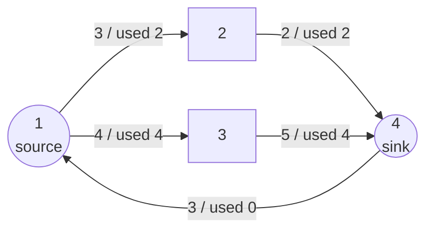

# CSES 1694 — Download Speed (Maximum Flow via Dinic)

| | |
|---|---|
| **Source** | CSES Problem Set — Graph Algorithms |
| **Difficulty** | Medium |
| **Topics** | Maximum flow, Dinic's algorithm, residual graphs, augmenting paths |
| **Link** | https://cses.fi/problemset/task/1694 |

---

## Problem Statement

You are given a network of $n$ computers (numbered $1 \ldots n$) and $m$ directed connections.
Connection $i$ goes from computer $a_i$ to computer $b_i$ and can transfer data at a rate of up to
$c_i$ (its capacity). Computer $1$ is the **server** (source) and computer $n$ is **Kotivalo's
computer** (sink).

Determine the **maximum total speed** at which data can be downloaded from computer $1$ to
computer $n$ — i.e., the value of the maximum flow from $1$ to $n$.

- $1 \le n \le 500$
- $1 \le m \le 1000$
- $1 \le a_i, b_i \le n$
- $1 \le c_i \le 10^9$

There may be **multiple edges** between the same pair of computers; treat each as a separate pipe.

### Worked Example

```text
Input:
4 5
1 2 3
2 4 2
1 3 4
3 4 5
4 1 3

n = 4, m = 5
Edges (a -> b, capacity):
  1 -> 2 (3)
  2 -> 4 (2)
  1 -> 3 (4)
  3 -> 4 (5)
  4 -> 1 (3)      # leads back to the source; carries no useful s->t flow

Source = 1, Sink = 4

Output:
6
```

Explanation: push $2$ units along $1 \to 2 \to 4$ and $4$ units along $1 \to 3 \to 4$. The pipe
$1\to2$ caps the first path at $2$ (because $2\to4$ has capacity $2$), and $3\to4$ comfortably
carries the $4$ units of the second path. Total $= 2 + 4 = 6$. The edge $4 \to 1$ cannot contribute
to flow *out of* the sink, so it is irrelevant.

---

## Approach (WHY)

This is the textbook **maximum-flow** problem, stated almost verbatim. We model computers as
vertices, connections as directed capacitated edges, and ask for the maximum flow from vertex $1$
to vertex $n$.

**Why max flow?** Each connection limits throughput independently (capacity constraint), and every
intermediate computer must forward exactly as much as it receives (flow conservation) — it has no
storage. The total download rate at the sink is, by definition, the value of an $s$–$t$ flow, and
we want it as large as possible.

**Why Dinic?** With $n \le 500$ and $m \le 1000$, capacities up to $10^9$ rule out
capacity-dependent Ford–Fulkerson. Edmonds–Karp ($O(VE^2)$) would also pass, but **Dinic**
($O(V^2 E)$, far faster in practice) is the clean, reusable choice and handles the large capacities
trivially since it is capacity-independent.

**Implementation notes.**

- Build the residual graph with a flat edge list; each input edge becomes a forward arc (capacity
  $c_i$) plus a reverse arc (capacity $0$). The reverse arcs provide the "undo" needed for
  correctness.
- Capacities up to $10^9$ over $1000$ edges can sum past $2^{31}$, so **use `long long`** and a big
  `INF`. (Worst-case flow $\le 1000 \times 10^9 = 10^{12}$.)
- Convert to 0-indexed internally; source $= 0$, sink $= n - 1$.

---

## Solution

### Python

```python
import sys
from collections import deque

def main():
    input = sys.stdin.buffer.read().split()
    idx = 0
    n = int(input[idx]); idx += 1
    m = int(input[idx]); idx += 1

    INF = float("inf")
    graph = [[] for _ in range(n)]   # graph[u] = list of edge indices
    to, cap = [], []                 # to[e] = head, cap[e] = residual capacity

    def add_edge(u, v, c):
        graph[u].append(len(to)); to.append(v); cap.append(c)
        graph[v].append(len(to)); to.append(u); cap.append(0)   # reverse arc

    for _ in range(m):
        a = int(input[idx]) - 1; idx += 1
        b = int(input[idx]) - 1; idx += 1
        c = int(input[idx]);     idx += 1
        add_edge(a, b, c)

    s, t = 0, n - 1
    level = [0] * n
    it = [0] * n

    def bfs():
        nonlocal level
        level = [-1] * n
        level[s] = 0
        q = deque([s])
        while q:
            u = q.popleft()
            for e in graph[u]:
                v = to[e]
                if cap[e] > 0 and level[v] < 0:     # residual & unvisited
                    level[v] = level[u] + 1
                    q.append(v)
        return level[t] >= 0

    def dfs(u, pushed):
        if u == t:
            return pushed
        while it[u] < len(graph[u]):
            e = graph[u][it[u]]
            v = to[e]
            if cap[e] > 0 and level[v] == level[u] + 1:
                d = dfs(v, min(pushed, cap[e]))
                if d > 0:
                    cap[e]     -= d     # consume forward capacity
                    cap[e ^ 1] += d     # restore reverse (undo) capacity
                    return d
            it[u] += 1                  # dead edge for this phase
        return 0

    flow = 0
    while bfs():                        # Phase A: build level graph
        for i in range(n):
            it[i] = 0
        while True:                     # Phase B: blocking flow
            pushed = dfs(s, INF)
            if pushed == 0:
                break
            flow += pushed

    print(flow)

main()
```

> For deep graphs you may need `sys.setrecursionlimit(...)` or an explicit stack; with $n \le 500$
> the recursive DFS depth stays small enough.

### C++

```cpp
#include <bits/stdc++.h>
using namespace std;
using ll = long long;
const ll INF = (ll)4e18;            // large sentinel for capacities/flow

struct Dinic {
    int n;
    vector<int> to;                 // to[e]  = head of edge e
    vector<ll>  cap;                // cap[e] = residual capacity of edge e
    vector<vector<int>> graph;      // graph[u] = list of edge indices
    vector<int> level, it;

    Dinic(int n) : n(n), graph(n), level(n), it(n) {}

    void add_edge(int u, int v, ll c) {
        graph[u].push_back((int)to.size()); to.push_back(v); cap.push_back(c);
        graph[v].push_back((int)to.size()); to.push_back(u); cap.push_back(0); // reverse
    }

    bool bfs(int s, int t) {
        fill(level.begin(), level.end(), -1);
        level[s] = 0;
        queue<int> q; q.push(s);
        while (!q.empty()) {
            int u = q.front(); q.pop();
            for (int e : graph[u]) {
                int v = to[e];
                if (cap[e] > 0 && level[v] < 0) {   // residual & unvisited
                    level[v] = level[u] + 1;
                    q.push(v);
                }
            }
        }
        return level[t] >= 0;
    }

    ll dfs(int u, int t, ll pushed) {
        if (u == t) return pushed;
        for (int &i = it[u]; i < (int)graph[u].size(); ++i) {
            int e = graph[u][i], v = to[e];
            if (cap[e] > 0 && level[v] == level[u] + 1) {
                ll d = dfs(v, t, min(pushed, cap[e]));
                if (d > 0) {
                    cap[e]     -= d;    // consume forward capacity
                    cap[e ^ 1] += d;    // restore reverse (undo) capacity
                    return d;
                }
            }
        }
        return 0;
    }

    ll max_flow(int s, int t) {
        ll flow = 0;
        while (bfs(s, t)) {                 // Phase A: build level graph
            fill(it.begin(), it.end(), 0);
            while (ll pushed = dfs(s, t, INF)) // Phase B: blocking flow
                flow += pushed;
        }
        return flow;
    }
};

int main() {
    ios::sync_with_stdio(false);
    cin.tie(nullptr);

    int n, m;
    cin >> n >> m;
    Dinic dinic(n);
    for (int i = 0; i < m; ++i) {
        int a, b; ll c;
        cin >> a >> b >> c;
        dinic.add_edge(a - 1, b - 1, c);    // 1-indexed -> 0-indexed
    }
    cout << dinic.max_flow(0, n - 1) << "\n";
    return 0;
}
```

---

## Iteration Trace

Tracing Dinic on the worked example ($s = 1$, $t = 4$, 1-indexed for readability):

| Phase | BFS levels (1→2→3→4) | Augmenting path found | Bottleneck | Flow after |
|---|---|---|---|---|
| 1 | $1{:}0,\ 2{:}1,\ 3{:}1,\ 4{:}2$ | $1 \to 2 \to 4$ | $\min(3, 2) = 2$ | $2$ |
| 1 | (same level graph) | $1 \to 3 \to 4$ | $\min(4, 5) = 4$ | $6$ |
| 1 | (same level graph) | none — blocking flow reached | — | $6$ |
| 2 | BFS from $1$: $2$ saturated to $4$? $2\to4$ now $0$; $3\to4$ has $1$ left but $1\to3$ now $0$ | $t = 4$ **unreachable** | — | $6$ |

After phase 1's blocking flow, the second BFS cannot reach the sink (both useful paths are
saturated at their bottleneck pipes), so the algorithm terminates with **max flow $= 6$**.

---

## Flow Diagram



Edge labels show `capacity / used`. The path $1\to2\to4$ carries $2$ (limited by pipe $2\to4$) and
$1\to3\to4$ carries $4$, for a total download speed of $6$. The back edge $4\to1$ is unused.

---

## Math

The answer is the maximum flow value
$$|f| \;=\; \sum_{v} f(s, v),$$
subject to capacity ($0 \le f(e) \le c(e)$) and conservation
$$\sum_{u} f(u, v) = \sum_{w} f(v, w) \qquad \forall v \notin \{s, t\}.$$
By the max-flow–min-cut theorem this equals the minimum capacity over all $s$–$t$ cuts:
$$|f^\star| \;=\; \min_{(S,T)} c(S, T).$$
Here the cut $S = \{1, 2, 3\},\ T = \{4\}$ has capacity $c(2,4) + c(3,4) = 2 + 4 = 6$, matching the
flow.

---

## Complexity

| Aspect | Cost |
|---|---|
| BFS phases | $O(V)$ |
| Work per phase (blocking flow) | $O(V E)$ |
| **Total time (Dinic)** | $O(V^2 E)$ — fast for $V \le 500,\ E \le 1000$ |
| Space | $O(V + E)$ for the edge list and adjacency |

With $V = 500$ and $E = 1000$ the worst case is comfortably within limits, and in practice Dinic
finishes in a handful of phases.

---

## Takeaway

*Download Speed* is the "hello world" of maximum flow: map computers to vertices and connections to
capacitated edges, then run **Dinic** from $1$ to $n$. The only traps are using `long long`/large
`INF` for the $10^9$ capacities and remembering the reverse (residual) edges that let flow be
rerouted. Master this template — every later flow problem reuses it verbatim.
