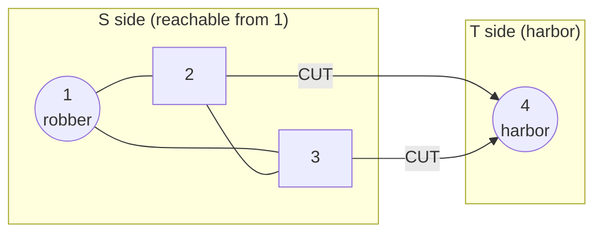

# CSES 1695 — Police Chase (Minimum Cut via Max Flow)

| | |
|---|---|
| **Source** | CSES Problem Set — Graph Algorithms |
| **Difficulty** | Medium–Hard |
| **Topics** | Minimum cut, maximum flow, Dinic's algorithm, residual reachability, max-flow–min-cut duality |
| **Link** | https://cses.fi/problemset/task/1695 |

---

## Problem Statement

A robber is hiding in a city with $n$ crossings (numbered $1 \ldots n$) connected by $m$
**bidirectional** streets. The robber is at crossing $1$ and wants to escape to the harbor at
crossing $n$. The police want to place checkpoints on streets so the robber **cannot** reach the
harbor. Placing a checkpoint on a street "removes" that street.

Find the **minimum number of streets** the police must block so that there is no path from $1$ to
$n$, and output **which streets** to block.

- $1 \le n \le 500$
- $1 \le m \le 1000$
- Each street connects two distinct crossings $a_i, b_i$ and is traversable in both directions.

### Worked Example

```text
Input:
4 5
1 2
1 3
2 3
2 4
3 4

n = 4, m = 5
Streets (bidirectional):
  1 - 2
  1 - 3
  2 - 3
  2 - 4
  3 - 4

Output:
2
2 4
3 4
```

Explanation: the robber starts at $1$ and wants crossing $4$. Every route to $4$ ends with either
street $2\!-\!4$ or $3\!-\!4$. Blocking **both** $2\!-\!4$ and $3\!-\!4$ disconnects $4$ from the
rest entirely, so $2$ checkpoints suffice, and one can verify a single checkpoint never works.

---

## Approach (WHY)

**The disconnection number is a minimum cut.** "Block the fewest streets so $1$ and $n$ are
separated" is precisely the **minimum $s$–$t$ cut** problem with $s = 1$, $t = n$, where every
street has capacity $1$ (blocking it costs $1$). By the **max-flow–min-cut theorem**:

$$\text{(min streets to block)} \;=\; \min\text{-cut} \;=\; \max\text{-flow from } 1 \text{ to } n.$$

So the *count* is just the value of a unit-capacity max flow.

**Modeling bidirectional streets.** A street $a \!-\! b$ can be used in either direction. We add it
to the flow network as an edge with capacity $1$ in **both** directions: `add_edge(a, b, 1)` and
`add_edge(b, a, 1)` (each creating its own forward+reverse residual pair). This correctly charges a
cost of $1$ for cutting the street regardless of which way the robber would traverse it.

**Recovering the actual cut edges (the hard part).** The theorem is constructive. After running
Dinic to obtain the maximum flow:

1. Compute $S =$ the set of vertices **reachable from $s$ in the final residual graph** (BFS over
   edges with remaining capacity $> 0$). Note $t \notin S$.
2. A street is part of the minimum cut **iff one endpoint is in $S$ and the other is not** — these
   are exactly the saturated streets crossing from the reachable side to the unreachable side.
3. Output every such original street. The number of them equals the max-flow value, confirming
   optimality.

This residual-reachability trick is the canonical way to turn a *value* (max flow) into a concrete
*set of edges* (the min cut).

---

## Solution

We use a Dinic template. For each original street we remember the index of its **forward arc** in
the edge list so we can test "does this street cross the cut?" directly.

### Python

```python
import sys
from collections import deque

def main():
    data = sys.stdin.buffer.read().split()
    idx = 0
    n = int(data[idx]); idx += 1
    m = int(data[idx]); idx += 1

    INF = float("inf")
    graph = [[] for _ in range(n)]
    to, cap = [], []
    edge_endpoints = []              # (a, b, forward_arc_index) per original street

    def add_arc(u, v, c):
        graph[u].append(len(to)); to.append(v); cap.append(c)
        graph[v].append(len(to)); to.append(u); cap.append(0)   # reverse arc

    for _ in range(m):
        a = int(data[idx]) - 1; idx += 1
        b = int(data[idx]) - 1; idx += 1
        fwd = len(to)               # index the forward a->b arc will get
        add_arc(a, b, 1)            # street usable a -> b
        add_arc(b, a, 1)            # street usable b -> a (capacity 1 each way)
        edge_endpoints.append((a, b, fwd))

    s, t = 0, n - 1
    level = [0] * n
    it = [0] * n

    def bfs():
        nonlocal level
        level = [-1] * n
        level[s] = 0
        q = deque([s])
        while q:
            u = q.popleft()
            for e in graph[u]:
                v = to[e]
                if cap[e] > 0 and level[v] < 0:
                    level[v] = level[u] + 1
                    q.append(v)
        return level[t] >= 0

    def dfs(u, pushed):
        if u == t:
            return pushed
        while it[u] < len(graph[u]):
            e = graph[u][it[u]]
            v = to[e]
            if cap[e] > 0 and level[v] == level[u] + 1:
                d = dfs(v, min(pushed, cap[e]))
                if d > 0:
                    cap[e]     -= d     # consume forward capacity
                    cap[e ^ 1] += d     # restore reverse capacity
                    return d
            it[u] += 1
        return 0

    flow = 0
    while bfs():
        for i in range(n):
            it[i] = 0
        while True:
            pushed = dfs(s, INF)
            if pushed == 0:
                break
            flow += pushed

    # Residual reachability from s  ->  the S side of the min cut
    reach = [False] * n
    reach[s] = True
    q = deque([s])
    while q:
        u = q.popleft()
        for e in graph[u]:
            v = to[e]
            if cap[e] > 0 and not reach[v]:
                reach[v] = True
                q.append(v)

    # A street crosses the cut iff exactly one endpoint is reachable
    out = []
    for a, b, _fwd in edge_endpoints:
        if reach[a] != reach[b]:
            out.append((a + 1, b + 1))      # back to 1-indexed

    print(len(out))                          # equals `flow`
    print("\n".join(f"{a} {b}" for a, b in out))

main()
```

### C++

```cpp
#include <bits/stdc++.h>
using namespace std;
using ll = long long;
const ll INF = (ll)4e18;            // large sentinel for capacities/flow

struct Dinic {
    int n;
    vector<int> to;
    vector<ll>  cap;
    vector<vector<int>> graph;
    vector<int> level, it;

    Dinic(int n) : n(n), graph(n), level(n), it(n) {}

    int add_arc(int u, int v, ll c) {       // returns index of the forward arc
        int id = (int)to.size();
        graph[u].push_back((int)to.size()); to.push_back(v); cap.push_back(c);
        graph[v].push_back((int)to.size()); to.push_back(u); cap.push_back(0);
        return id;
    }

    bool bfs(int s, int t) {
        fill(level.begin(), level.end(), -1);
        level[s] = 0;
        queue<int> q; q.push(s);
        while (!q.empty()) {
            int u = q.front(); q.pop();
            for (int e : graph[u]) {
                int v = to[e];
                if (cap[e] > 0 && level[v] < 0) {
                    level[v] = level[u] + 1;
                    q.push(v);
                }
            }
        }
        return level[t] >= 0;
    }

    ll dfs(int u, int t, ll pushed) {
        if (u == t) return pushed;
        for (int &i = it[u]; i < (int)graph[u].size(); ++i) {
            int e = graph[u][i], v = to[e];
            if (cap[e] > 0 && level[v] == level[u] + 1) {
                ll d = dfs(v, t, min(pushed, cap[e]));
                if (d > 0) {
                    cap[e]     -= d;    // consume forward capacity
                    cap[e ^ 1] += d;    // restore reverse capacity
                    return d;
                }
            }
        }
        return 0;
    }

    ll max_flow(int s, int t) {
        ll flow = 0;
        while (bfs(s, t)) {
            fill(it.begin(), it.end(), 0);
            while (ll pushed = dfs(s, t, INF))
                flow += pushed;
        }
        return flow;
    }

    vector<char> reachable(int s) {         // S side of the min cut
        vector<char> seen(n, 0);
        seen[s] = 1;
        queue<int> q; q.push(s);
        while (!q.empty()) {
            int u = q.front(); q.pop();
            for (int e : graph[u]) {
                int v = to[e];
                if (cap[e] > 0 && !seen[v]) { seen[v] = 1; q.push(v); }
            }
        }
        return seen;
    }
};

int main() {
    ios::sync_with_stdio(false);
    cin.tie(nullptr);

    int n, m;
    cin >> n >> m;
    Dinic dinic(n);

    vector<array<int,2>> streets(m);        // remember endpoints (0-indexed)
    for (int i = 0; i < m; ++i) {
        int a, b;
        cin >> a >> b;
        --a; --b;
        dinic.add_arc(a, b, 1);             // capacity 1 each direction
        dinic.add_arc(b, a, 1);
        streets[i] = {a, b};
    }

    int s = 0, t = n - 1;
    ll flow = dinic.max_flow(s, t);         // = number of checkpoints
    vector<char> reach = dinic.reachable(s);

    cout << flow << "\n";
    for (auto &e : streets) {
        int a = e[0], b = e[1];
        if (reach[a] != reach[b])           // crosses S -> T : part of the cut
            cout << a + 1 << " " << b + 1 << "\n";
    }
    return 0;
}
```

---

## Iteration Trace

Tracing on the worked example ($s = 1$, $t = 4$, unit capacities, 1-indexed):

| Phase | BFS levels (1,2,3,4) | Augmenting path | Bottleneck | Flow after |
|---|---|---|---|---|
| 1 | $0,1,1,2$ | $1 \to 2 \to 4$ | $1$ | $1$ |
| 1 | (same) | $1 \to 3 \to 4$ | $1$ | $2$ |
| 2 | BFS from $1$ over residual: reaches $2$ and $3$ (via $1\!-\!2$, $1\!-\!3$, $2\!-\!3$), but **not** $4$ | $t$ unreachable | — | $2$ |

**Residual reachability:** $S = \{1, 2, 3\}$, and $4 \notin S$. Checking each street for
"crosses the cut" ($\text{reach}[a] \ne \text{reach}[b]$):

| Street | reach[a] | reach[b] | In cut? |
|---|---|---|---|
| $1 - 2$ | ✓ | ✓ | no |
| $1 - 3$ | ✓ | ✓ | no |
| $2 - 3$ | ✓ | ✓ | no |
| $2 - 4$ | ✓ | ✗ | **yes** |
| $3 - 4$ | ✓ | ✗ | **yes** |

Output: `2` then streets `2 4` and `3 4` — matching the expected answer.

---

## Cut Diagram



The two streets crossing from the reachable set $S = \{1,2,3\}$ to $T = \{4\}$ are exactly the
checkpoints; their count ($2$) equals the max flow.

---

## Math

Police Chase is a unit-capacity minimum cut. With $c(e) = 1$ for every street:

$$\text{answer} \;=\; \min_{(S,T)} c(S,T) \;=\; \min_{(S,T)} \sum_{\substack{u \in S,\ v \in T}} c(u,v) \;=\; \max\text{-flow}(s \to t).$$

Letting $S$ be the residual-reachable set from $s$, the proof of the theorem guarantees every
crossing edge $u\to v$ (with $u\in S,\ v\in T$) is **saturated**, so

$$|f^\star| \;=\; c(S,T) \;=\; \#\{\text{streets with one endpoint in } S \text{ and one in } T\}.$$

That equality is *why* the residual-reachability extraction yields exactly the optimal cut.

---

## Complexity

| Aspect | Cost |
|---|---|
| Max flow (Dinic, unit capacities) | $O(E \sqrt{V})$ |
| General Dinic bound | $O(V^2 E)$ |
| Residual reachability BFS | $O(V + E)$ |
| Scan streets to emit cut | $O(E)$ |
| **Total** | dominated by Dinic; trivial for $V \le 500,\ E \le 1000$ |
| Space | $O(V + E)$ |

---

## Takeaway

Police Chase is the archetypal **minimum-cut** problem: "remove the fewest edges to disconnect $s$
from $t$" is literally the min $s$–$t$ cut, which equals the max flow with unit capacities. Compute
the flow with Dinic, then **recover the cut** by BFS-ing over residual capacity from the source —
every street with exactly one endpoint reachable is a checkpoint. Remember the two modeling details:
add bidirectional streets with capacity $1$ in *both* directions, and keep each street's forward-arc
index so you can report the actual edges.
