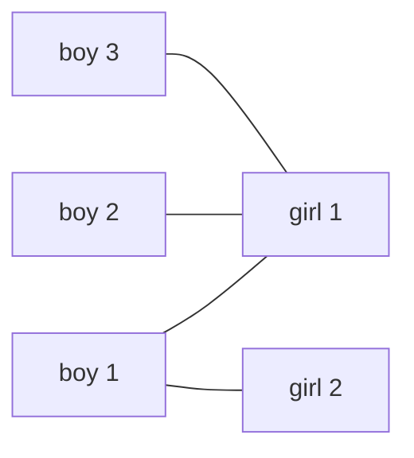

# CSES 1696 — School Dance (Maximum Bipartite Matching)

| | |
|---|---|
| **Source** | CSES Problem Set — Graph Algorithms |
| **Difficulty** | Medium |
| **Topics** | Bipartite Matching, Kuhn's Algorithm, Augmenting Paths, Max Flow |
| **Link** | https://cses.fi/problemset/task/1696 |

There are `n` boys and `m` girls in a school. Your task is to pair as many of them as possible for a
dance. You are given a list of `k` pairs `(a, b)` meaning boy `a` and girl `b` are willing to dance
together. Find a maximum set of disjoint dancing pairs and print them.

## Problem Statement

- Input: first line `n m k` — number of boys, girls, and acceptable pairs. Next `k` lines each
  contain `a b` (`1 ≤ a ≤ n`, `1 ≤ b ≤ m`): boy `a` is willing to dance with girl `b`.
- Output: first line the number `t` of pairs in a maximum matching. Then `t` lines, each a matched
  pair `a b`.
- Constraints: `1 ≤ n, m ≤ 500`, `1 ≤ k ≤ 1000`. (CSES bounds; the code below scales comfortably to
  ~$10^3$ nodes per side and ~$10^5$ edges.)

```text
Input
3 2 4
1 1
1 2
2 1
3 1

A valid Output
2
1 2
2 1

Explanation
Boys = {1,2,3}, Girls = {1,2}. Willing pairs: 1-1, 1-2, 2-1, 3-1.
Only 2 girls exist, so at most 2 pairs are possible.
Match boy 1 -> girl 2 and boy 2 -> girl 1. Boy 3 can only take girl 1 (taken),
so he stays unpaired. Answer size = 2 (e.g. "1 1 / 2 ?" fails since girl 1 then
blocks both 2 and 3; augmenting reassigns boy 1 to girl 2).
```

This is a **maximum bipartite matching**: boys on the left, girls on the right, an edge per willing
pair, and we want the largest set of vertex-disjoint edges.

## Approach (WHY)

We want a *maximum* matching, not just a *maximal* one. The greedy "grab any free pair" only gives a
maximal matching — it can get stuck (assigning girl 1 to boy 1 may block boys 2 and 3 even though a
size-2 matching exists). The fix is **Berge's lemma**: a matching is maximum **iff** it has no
**augmenting path** (an alternating boy–girl–boy–…–girl path between two currently-free endpoints).

**Kuhn's algorithm** finds these augmenting paths greedily. We process each boy `u` and run a DFS:

- For each willing girl `v`, if `v` is free, match `u—v`.
- If `v` is already taken by boy `w`, recursively try to **re-home `w`** to a different girl. If that
  succeeds, `v` is freed for `u`. This recursion *is* the augmenting path — it reassigns matched
  vertices along an alternating chain, increasing the matching size by one.

A per-attempt `visited` array on girls prevents revisiting and guarantees termination. Because each
augmentation either grows the matching by 1 or fails, after processing all boys the matching is
maximum (no augmenting path can remain). To print the pairs, we just read off `matchL`.

**Flow alternative.** Build $s \to \text{boys} \to \text{girls} \to t$ with all capacities 1; the
maximum integral $s$–$t$ flow equals the maximum matching. Dinic on this unit-capacity network runs
in $O(E\sqrt{V})$ — preferable when the graph is much larger, where **Hopcroft–Karp** (also
$O(E\sqrt{V})$) is the matching-specific equivalent.

## Algorithm

1. Read `n m k`, build adjacency `adj[boy]` of willing girls (convert to 0-indexed).
2. Init `matchL[0..n-1] = -1`, `matchR[0..m-1] = -1`.
3. For each boy `u`: reset `visited` over girls, run `try_kuhn(u)`; count successes.
4. Print the count, then every pair `(u+1, matchL[u]+1)` with `matchL[u] != -1`.

## Solution

### Python

```python
import sys
from sys import setrecursionlimit

def main():
    setrecursionlimit(1 << 20)
    data = sys.stdin.buffer.read().split()
    idx = 0
    n = int(data[idx]); m = int(data[idx+1]); k = int(data[idx+2]); idx += 3

    adj = [[] for _ in range(n)]            # adj[boy] = list of willing girls (0-indexed)
    for _ in range(k):
        a = int(data[idx]) - 1              # boy   -> 0-indexed
        b = int(data[idx+1]) - 1            # girl  -> 0-indexed
        idx += 2
        adj[a].append(b)

    matchL = [-1] * n                       # boy  -> girl partner, or -1
    matchR = [-1] * m                       # girl -> boy  partner, or -1

    def try_kuhn(u):
        for v in adj[u]:
            if not visited[v]:
                visited[v] = True           # explore girl v once per attempt
                # girl v is free, or her partner can be re-homed along an augmenting path
                if matchR[v] == -1 or try_kuhn(matchR[v]):
                    matchL[u] = v
                    matchR[v] = u
                    return True
        return False

    result = 0
    for u in range(n):
        visited = [False] * m               # RESET visited before each boy
        if try_kuhn(u):
            result += 1

    out = [str(result)]
    for u in range(n):                      # read the matched pairs off matchL
        if matchL[u] != -1:
            out.append(f"{u + 1} {matchL[u] + 1}")
    sys.stdout.write("\n".join(out) + "\n")

main()
```

### C++

```cpp
#include <bits/stdc++.h>
using namespace std;

int n, m, k;
vector<int> adj[1005];     // adj[boy] = willing girls (0-indexed)
int matchL[1005];          // boy  -> girl partner, or -1
int matchR[1005];          // girl -> boy  partner, or -1
vector<char> visited;      // per-attempt mark on girls

bool try_kuhn(int u) {
    for (int v : adj[u]) {
        if (!visited[v]) {
            visited[v] = 1;                       // explore girl v once per attempt
            // girl v is free, or her partner can be re-homed along an augmenting path
            if (matchR[v] == -1 || try_kuhn(matchR[v])) {
                matchL[u] = v;
                matchR[v] = u;
                return true;
            }
        }
    }
    return false;
}

int main() {
    ios::sync_with_stdio(false);
    cin.tie(nullptr);

    cin >> n >> m >> k;
    for (int i = 0; i < k; ++i) {
        int a, b;
        cin >> a >> b;
        adj[a - 1].push_back(b - 1);              // convert to 0-indexed
    }

    fill(matchL, matchL + n, -1);
    fill(matchR, matchR + m, -1);

    int result = 0;
    for (int u = 0; u < n; ++u) {
        visited.assign(m, 0);                     // RESET visited before each boy
        if (try_kuhn(u)) ++result;
    }

    cout << result << '\n';
    for (int u = 0; u < n; ++u)                   // read the matched pairs off matchL
        if (matchL[u] != -1)
            cout << (u + 1) << ' ' << (matchL[u] + 1) << '\n';
    return 0;
}
```

For larger inputs (tens of thousands of vertices), swap Kuhn for **Hopcroft–Karp** to get
$O(E\sqrt{V})$ instead of $O(V \cdot E)$.

## Iteration Trace

Edges: boy1–girl1, boy1–girl2, boy2–girl1, boy3–girl1 (1-indexed). Processing boys in order:

| Step | Boy `u` | DFS path explored | Action | `matchL` (boy→girl) | Size |
|---|---|---|---|---|---|
| 1 | 1 | girl1 free | match 1—1 | `[1, -, -]` | 1 |
| 2 | 2 | girl1 taken by 1 → re-home boy1 → girl2 free → match 1—2 | augment, then match 2—1 | `[2, 1, -]` | 2 |
| 3 | 3 | girl1 taken by 2 → re-home boy2: girl1 only option, visited → fail | no augmenting path | `[2, 1, -]` | 2 |

Boy 2 triggers an **augmenting path** `boy2 → girl1 → boy1 → girl2`: flipping it reassigns boy 1 to
girl 2 and pairs boy 2 with girl 1, growing the matching from 1 to 2. Boy 3 has no free alternating
path, so the matching of size 2 is maximum.



Maximum matching (size 2): `boy1—girl2` and `boy2—girl1`; `boy3` and no third girl remain unpaired.

## Math

By **Berge's lemma**, the returned matching $M$ is maximum because the algorithm halts only when no
augmenting path exists:

$$|M| = |M^{*}| \quad\Longleftrightarrow\quad \text{no augmenting path w.r.t. } M.$$

The matching is bounded by the smaller side and by König's theorem (min vertex cover):

$$|M^{*}| \le \min(n, m), \qquad |M^{*}| = |VC^{*}|.$$

In the example $n = 3$, $m = 2$, so $|M^{*}| \le 2$, achieved.

## Complexity

| Aspect | Kuhn (this code) | Hopcroft–Karp (alt.) |
|---|---|---|
| Time | $O(V \cdot E)$ | $O(E \sqrt{V})$ |
| Space | $O(V + E)$ | $O(V + E)$ |
| Each augmentation | one $O(E)$ DFS | a BFS-layer phase, $O(E)$ |

With $n, m \le 500$ and $k \le 1000$, Kuhn's $O(V \cdot E) \approx 500 \times 1000$ is trivially fast.

## Takeaway

School Dance is the textbook **maximum bipartite matching** problem: model boys and girls as the two
sides, an edge per willing pair, and run **Kuhn's augmenting-path DFS**, remembering to **reset
`visited` before each left vertex** and to handle 1- vs 0-indexing. Reconstructing the answer is just
reading `matchL`. When inputs grow, reach for Hopcroft–Karp or unit-capacity max flow for the
$O(E\sqrt{V})$ bound, and recall that the same matching unlocks the minimum vertex cover and maximum
independent set via König's theorem.
