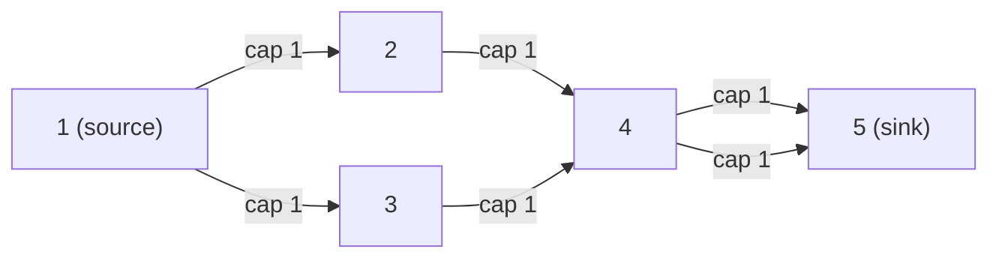

# CSES 1711 — Distinct Routes (Maximum Edge-Disjoint Paths via Unit-Capacity Max Flow)

| Meta | Value |
|------|-------|
| Source | CSES Problem Set — Graph Algorithms |
| Difficulty | Medium–Hard |
| Topics | Max Flow, Edge-Disjoint Paths, Path Decomposition, MCMF (generalization) |
| Link | https://cses.fi/problemset/task/1711 |

---

## Problem Statement

A game has $n$ rooms and $m$ **one-way** teleporters (directed edges). You start in room $1$ and
must reach room $n$. The catch: you want the **maximum number of routes** from $1$ to $n$ such that
**no teleporter is used by two different routes** — i.e. the routes are **edge-disjoint**. Output
that maximum count $k$, then print the $k$ routes themselves (each as the sequence of rooms it
visits).

- $2 \le n \le 500$, $1 \le m \le 1000$.

**Example**
```
n = 5, m = 6
edges (directed a -> b):
  1 2
  1 3
  2 4
  3 4
  4 5
  4 5     # two parallel 4->5 teleporters

The two edge-disjoint routes (k = 2):
  route A: 1 -> 2 -> 4 -> 5      (uses the first 4->5)
  route B: 1 -> 3 -> 4 -> 5      (uses the second 4->5)

Output:
  2
  4
  1 2 4 5
  3
  1 3 4 5
```

If only **one** teleporter `4 -> 5` existed, edge `4->5` would be the bottleneck and the answer
would be $k = 1$.

---

## Approach (WHY)

This is a **maximum flow** problem. Give every directed teleporter **capacity 1**. Then a flow of
value $f$ from source $1$ to sink $n$ corresponds to $f$ **edge-disjoint paths**: capacity 1
guarantees each edge carries at most one unit, so no edge is shared. By the **max-flow = max
edge-disjoint paths** theorem (a special case of Menger's theorem), the maximum flow value equals
the answer $k$.

After computing the max flow we must **recover the actual routes** by **path decomposition**:

1. Each edge with flow 1 (`forward cap now 0`) is "used".
2. Starting from room $1$, repeatedly follow any unused-but-saturated outgoing edge, consuming it
   (mark used) and moving to its endpoint, until reaching room $n$. That traced sequence is one
   route.
3. Repeat $k$ times — once per unit of flow leaving the source.



Two unit-capacity paths can both reach node 4 and then leave via the two parallel `4->5` edges, so
max flow $= 2$.

**Why this is a flow problem — and how MCMF generalizes it.** Distinct Routes is *pure max flow*:
all costs are effectively $0$, so we only maximize the number of paths. **Min-cost max-flow
generalizes it**: assign each teleporter a length/cost and run MCMF to get the $k$ edge-disjoint
paths of **minimum total length** (push exactly $k$ units, cost = length, cap = 1). Plain max flow
is the special case where every cost is equal — you maximize flow and ignore cost.

> **Reverse edges & path printing.** Standard max-flow adds reverse edges (cap 0). During
> decomposition, only follow **original forward** edges whose flow is 1; never walk a residual
> reverse edge, or you'll print an invalid route. A robust trick: when tracing, if you arrive
> somewhere via flow cancellation you simply skip used edges — the decomposition stays consistent
> because total in-flow = out-flow at every interior node.

---

## Solution — Python

We use **Dinic's algorithm** (fast unit-capacity max flow), then decompose. The same edge struct is
the backbone of the MCMF template (just add a `cost` field and replace BFS/DFS with SPFA).

```python
import sys
from collections import deque

def main():
    input = sys.stdin.buffer.read().split()
    idx = 0
    n = int(input[idx]); idx += 1
    m = int(input[idx]); idx += 1

    # edges stored in pairs: edges[i] = [to, cap], edges[i^1] is the reverse
    graph = [[] for _ in range(n + 1)]
    edges = []

    def add_edge(u, v, cap):
        graph[u].append(len(edges)); edges.append([v, cap])
        graph[v].append(len(edges)); edges.append([u, 0])  # reverse, cap 0

    raw = []
    for _ in range(m):
        a = int(input[idx]); b = int(input[idx + 1]); idx += 2
        add_edge(a, b, 1)          # unit capacity
        raw.append((a, b, len(edges) - 2))   # remember the forward edge id

    s, t = 1, n
    INF = float("inf")

    def bfs():
        level = [-1] * (n + 1)
        level[s] = 0
        q = deque([s])
        while q:
            u = q.popleft()
            for eid in graph[u]:
                v, cap = edges[eid]
                if cap > 0 and level[v] == -1:
                    level[v] = level[u] + 1
                    q.append(v)
        return level if level[t] != -1 else None

    def dfs(u, pushed, level, it):
        if u == t:
            return pushed
        while it[u] < len(graph[u]):
            eid = graph[u][it[u]]
            v, cap = edges[eid]
            if cap > 0 and level[v] == level[u] + 1:
                d = dfs(v, min(pushed, cap), level, it)
                if d > 0:
                    edges[eid][1] -= d
                    edges[eid ^ 1][1] += d
                    return d
            it[u] += 1
        return 0

    flow = 0
    while True:
        level = bfs()
        if level is None:
            break
        it = [0] * (n + 1)
        while True:
            pushed = dfs(s, INF, level, it)
            if pushed == 0:
                break
            flow += pushed

    # --- path decomposition: follow saturated forward edges from s to t ---
    # outgoing[u] = list of forward edge ids leaving u that carry flow (cap now 0)
    used = [False] * len(edges)
    outgoing = [[] for _ in range(n + 1)]
    for (a, b, fid) in raw:
        if edges[fid][1] == 0:     # forward edge used (flow == 1)
            outgoing[a].append(fid)

    routes = []
    ptr = [0] * (n + 1)
    for _ in range(flow):
        path = [s]
        u = s
        while u != t:
            # advance to the next unused saturated edge out of u
            while ptr[u] < len(outgoing[u]) and used[outgoing[u][ptr[u]]]:
                ptr[u] += 1
            fid = outgoing[u][ptr[u]]
            used[fid] = True
            u = edges[fid][0]
            path.append(u)
        routes.append(path)

    out = [str(flow)]
    for path in routes:
        out.append(str(len(path)))
        out.append(" ".join(map(str, path)))
    sys.stdout.write("\n".join(out) + "\n")


if __name__ == "__main__":
    main()
```

## Solution — C++

```cpp
#include <bits/stdc++.h>
using namespace std;

const long long INF = (long long)4e18;

struct MaxFlow {
    struct Edge { int to; long long cap; };
    int n;
    vector<Edge> edges;                 // edges[i], edges[i^1] are a pair
    vector<vector<int>> graph;
    vector<int> level, it;

    MaxFlow(int n) : n(n), graph(n), level(n), it(n) {}

    int add_edge(int u, int v, long long cap) {
        int id = (int)edges.size();
        graph[u].push_back(id);     edges.push_back({v, cap});
        graph[v].push_back(id + 1); edges.push_back({u, 0});   // reverse, cap 0
        return id;                  // return forward edge id
    }

    bool bfs(int s, int t) {
        fill(level.begin(), level.end(), -1);
        queue<int> q; q.push(s); level[s] = 0;
        while (!q.empty()) {
            int u = q.front(); q.pop();
            for (int eid : graph[u]) {
                auto& e = edges[eid];
                if (e.cap > 0 && level[e.to] == -1) {
                    level[e.to] = level[u] + 1; q.push(e.to);
                }
            }
        }
        return level[t] != -1;
    }

    long long dfs(int u, int t, long long pushed) {
        if (u == t) return pushed;
        for (; it[u] < (int)graph[u].size(); it[u]++) {
            int eid = graph[u][it[u]];
            auto& e = edges[eid];
            if (e.cap > 0 && level[e.to] == level[u] + 1) {
                long long d = dfs(e.to, t, min(pushed, e.cap));
                if (d > 0) {
                    edges[eid].cap     -= d;
                    edges[eid ^ 1].cap += d;
                    return d;
                }
            }
        }
        return 0;
    }

    long long max_flow(int s, int t) {
        long long flow = 0;
        while (bfs(s, t)) {
            fill(it.begin(), it.end(), 0);
            while (long long p = dfs(s, t, INF)) flow += p;
        }
        return flow;
    }
};

int main() {
    int n, m;
    scanf("%d %d", &n, &m);
    MaxFlow mf(n + 1);
    vector<int> fwd(m);                 // forward edge id of each input edge
    vector<int> from(m);
    for (int i = 0; i < m; i++) {
        int a, b; scanf("%d %d", &a, &b);
        fwd[i] = mf.add_edge(a, b, 1);  // unit capacity
        from[i] = a;
    }
    int s = 1, t = n;
    long long flow = mf.max_flow(s, t);

    // --- path decomposition: follow saturated forward edges s -> t ---
    // nxt[u] = targets of forward edges leaving u that carry flow (cap now 0)
    vector<vector<int>> nxt(n + 1);
    for (int i = 0; i < m; i++)
        if (mf.edges[fwd[i]].cap == 0)     // forward used (flow == 1)
            nxt[from[i]].push_back(mf.edges[fwd[i]].to);

    vector<int> ptr(n + 1, 0);
    printf("%lld\n", flow);
    for (long long r = 0; r < flow; r++) {
        vector<int> path = {s};
        int u = s;
        while (u != t) {
            int v = nxt[u][ptr[u]++];      // consume one saturated edge out of u
            path.push_back(v);
            u = v;
        }
        printf("%d\n", (int)path.size());
        for (int i = 0; i < (int)path.size(); i++)
            printf("%d%c", path[i], i + 1 < (int)path.size() ? ' ' : '\n');
    }
    return 0;
}
```

> The C++ decomposition uses a per-node pointer `ptr[u]` into the list `nxt[u]` of saturated
> outgoing targets, so each used edge feeds exactly one route — total work $O(n + m)$.

---

## Iteration Trace

Max flow on the example (Dinic, unit capacities). Each augmenting path carries exactly 1 unit:

| Phase | Augmenting path found | Δ flow | Total flow |
|-------|-----------------------|--------|-----------|
| 1 | 1 → 2 → 4 → 5 (first 4→5) | 1 | 1 |
| 2 | 1 → 3 → 4 → 5 (second 4→5) | 1 | 2 |
| 3 | no $s\to t$ path with residual capacity | 0 | 2 |

Then **decomposition** turns the flow into printable routes:

| Step | At node | Saturated edge taken | Route so far |
|------|---------|----------------------|--------------|
| route 1 | 1 → 2 → 4 → 5 | 1→2, 2→4, 4→5(a) | `1 2 4 5` |
| route 2 | 1 → 3 → 4 → 5 | 1→3, 3→4, 4→5(b) | `1 3 4 5` |

Answer: $k = 2$ routes, each edge used at most once.

---

## Math

By **Menger's theorem**, the maximum number of edge-disjoint $s$–$t$ paths equals the minimum number
of edges whose removal disconnects $s$ from $t$ (the **min cut**). With unit capacities the
max-flow/min-cut theorem gives

$$k = \max_{\text{flow } f} |f| = \min_{\text{cut } (S, \bar S)} \sum_{u \in S,\, v \in \bar S} \text{cap}(u,v).$$

The MCMF generalization minimizes path length while keeping $|f| = k$:

$$\min \sum_{e} \text{len}_e \, f_e \quad \text{subject to } |f| = k, \; 0 \le f_e \le 1.$$

Flow conservation $\sum_{(u,v)} f_{uv} = \sum_{(v,w)} f_{vw}$ at every interior node is exactly what
makes the flow decompose into whole paths.

---

## Complexity

| Step | Time | Notes |
|------|------|-------|
| Dinic on unit-capacity graph | $O(E \sqrt{V})$ | special bound for unit capacities |
| General Dinic | $O(V^2 E)$ | loose upper bound |
| Path decomposition | $O(V + E)$ | each saturated edge consumed once |
| MCMF generalization (min total length) | $O(k \cdot E \log V)$ | Dijkstra + potentials, $k$ phases |

With $n \le 500$, $m \le 1000$, this is comfortably fast.

---

## Takeaway

Distinct Routes is a textbook **maximum edge-disjoint paths** problem: set every edge's capacity to
$1$, run max flow, and **decompose** the resulting flow into concrete routes by following saturated
forward edges from source to sink. It is *pure flow* (no costs) — and **min-cost max-flow is the
natural generalization**: keep capacities at 1, attach a length/cost to each edge, and MCMF returns
the $k$ edge-disjoint paths of minimum total cost. Mastering decomposition here is the bridge from
"flow value" to "actual paths," a skill reused throughout flow-based modeling.
