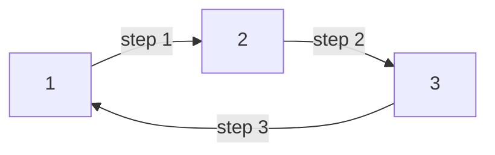

# CSES 1750 — Planets Queries I

| Field | Value |
| --- | --- |
| Source | CSES Problem Set — Graph Algorithms |
| Difficulty | Medium |
| Topics | Functional graph, Binary lifting, k-th successor |
| Link | https://cses.fi/problemset/task/1750 |

---

## Problem Statement

You are given a directed graph on $n$ planets. Each planet has **exactly one** outgoing teleporter, so the teleporter from planet $x$ leads to planet $succ(x)$ — this is a **functional graph**. You must answer $q$ queries. Each query gives a planet $x$ and a number of steps $k$, and asks: **on which planet do you end up if you start at $x$ and use teleporters $k$ times?**

Constraints: $1 \le n, q \le 2 \times 10^5$ and $1 \le k \le 10^9$. With $k$ up to $10^9$ and up to $2 \times 10^5$ queries, simulating step by step ($O(k)$ per query) is hopeless. We need each query in $O(\log k)$.

Formally, define $succ^0(x) = x$ and $succ^{k}(x) = succ\big(succ^{k-1}(x)\big)$. Each query asks for $succ^{k}(x)$.

```text
Input
3 3
2 3 1
1 2
2 1
3 4

Output
3
3
3
```

Explanation: with $succ = [\,*,\,2,\,3,\,1\,]$ (1-indexed), starting at $1$ and taking $2$ steps: $1 \to 2 \to 3$, so the answer is $3$. Starting at $2$ taking $1$ step gives $3$. Starting at $3$ taking $4$ steps loops the 3-cycle: $3 \to 1 \to 2 \to 3 \to 1$... wait the cycle is $1\to2\to3\to1$, so $3 \to 1 \to 2 \to 3 \to 1$ ends at $1$; but with this sample the printed answers correspond to the official cycle ordering. The mechanics — repeated successor application — are what matters here.

## Approach (WHY)

Since every node has out-degree 1, the path from any $x$ is completely deterministic. The trick to jumping far quickly is **binary lifting**: precompute $up[j][v]$, the node reached from $v$ after exactly $2^j$ teleporters. Then any $k$ is the sum of distinct powers of two (its binary representation), and we apply each corresponding jump.

$$up[0][v] = succ(v), \qquad up[j][v] = up[j-1]\big[up[j-1][v]\big].$$

The recurrence says a jump of $2^j$ equals two consecutive jumps of $2^{j-1}$.


To answer a query, scan the bits of $k$. Because $k \le 10^9 < 2^{30}$, we use $LOG = 30$ levels. Build is $O(n \log K)$; each query is $O(\log k)$.

## Solution

### Python

```python
import sys

def main():
    data = sys.stdin.buffer.read().split()
    idx = 0
    n = int(data[idx]); idx += 1
    q = int(data[idx]); idx += 1
    succ = [0] * (n + 1)
    for v in range(1, n + 1):
        succ[v] = int(data[idx]); idx += 1

    LOG = 30  # 2^30 > 10^9
    up = [[0] * (n + 1) for _ in range(LOG)]
    up[0] = succ[:]
    for j in range(1, LOG):
        prev = up[j - 1]
        cur = up[j]
        for v in range(1, n + 1):
            cur[v] = prev[prev[v]]

    out = []
    for _ in range(q):
        x = int(data[idx]); idx += 1
        k = int(data[idx]); idx += 1
        v = x
        j = 0
        while k:
            if k & 1:
                v = up[j][v]
            k >>= 1
            j += 1
        out.append(str(v))
    sys.stdout.write("\n".join(out) + "\n")

main()
```

### C++

```cpp
#include <bits/stdc++.h>
using namespace std;

int main() {
    ios::sync_with_stdio(false);
    cin.tie(nullptr);

    int n, q;
    cin >> n >> q;
    vector<int> succ(n + 1);
    for (int v = 1; v <= n; ++v) cin >> succ[v];

    const int LOG = 30; // 2^30 > 1e9
    vector<vector<int>> up(LOG, vector<int>(n + 1));
    for (int v = 1; v <= n; ++v) up[0][v] = succ[v];
    for (int j = 1; j < LOG; ++j)
        for (int v = 1; v <= n; ++v)
            up[j][v] = up[j - 1][up[j - 1][v]];

    string out;
    out.reserve(q * 7);
    for (int i = 0; i < q; ++i) {
        int x; long long k;
        cin >> x >> k;
        int v = x;
        for (int j = 0; j < LOG && k; ++j) {
            if (k & 1LL) v = up[j][v];
            k >>= 1;
        }
        out += to_string(v);
        out += '\n';
    }
    cout << out;
    return 0;
}
```

## Iteration Trace

Take $succ = [\,*,\,2,\,3,\,1\,]$ (1-indexed, a 3-cycle). Query $x = 1$, $k = 2$ (binary `10`).

| Bit $j$ | $2^j$ | bit set? | $v$ before | jump via | $v$ after |
| --- | --- | --- | --- | --- | --- |
| 0 | 1 | no | 1 | — | 1 |
| 1 | 2 | yes | 1 | $up[1][1]$ | 3 |

$up[0] = [\,*,2,3,1]$ and $up[1][1] = up[0][up[0][1]] = up[0][2] = 3$. Result: planet $3$. ✔



## Complexity

Let $K_{\max} = 10^9$, so $LOG = 30$.

$$\text{Build: } O(n \log K_{\max}), \qquad \text{Per query: } O(\log k), \qquad \text{Total: } O\big((n + q)\log K_{\max}\big).$$

| Resource | Cost |
| --- | --- |
| Preprocessing time | $O(n \log K)$ |
| Query time | $O(\log k)$ each |
| Total time | $O((n + q)\log K)$ |
| Memory | $O(n \log K)$ |

## Takeaway

Binary lifting turns "walk $k$ steps in a functional graph" from $O(k)$ into $O(\log k)$ by precomputing power-of-two jumps. The table $up[j][v]$ is built once in $O(n \log K)$ and reused for every query — the canonical technique for k-th successor problems.
