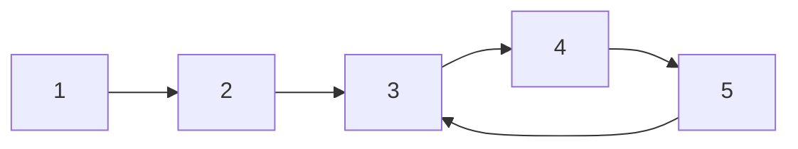
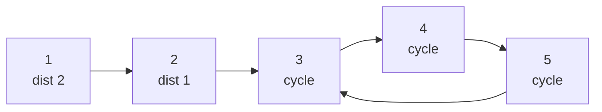

# CSES 1751 — Planets Cycles

| Field | Value |
| --- | --- |
| Source | CSES Problem Set — Graph Algorithms |
| Difficulty | Medium |
| Topics | Functional graph, Cycle detection, Tail length, Memoization |
| Link | https://cses.fi/problemset/task/1751 |

---

## Problem Statement

There are $n$ planets, each with **exactly one** outgoing teleporter ($succ(x)$) — a **functional graph**. If you start on planet $x$ and keep using teleporters, you will eventually return to a planet you have already visited (you enter a cycle). For **each** starting planet $x$, output the **total number of teleporters used until you first arrive at a planet you have visited before** — that is, the number of steps until you complete the journey into and around the cycle back to the cycle's entry point.

Concretely, the answer for $x$ is $\mu(x) + \lambda(x)$ where $\mu(x)$ is the **tail length** (steps to reach the cycle) and $\lambda(x)$ is the **length of that cycle**. Once you reach the cycle entrance after $\mu(x)$ steps, you must travel $\lambda(x)$ more steps around the loop to revisit it.

Constraints: $1 \le n \le 2 \times 10^5$. We need an $O(n)$ solution; a separate Floyd run per node would be $O(n^2)$ in the worst case.

```text
Input
5
2 3 4 5 3

Output
4 3 3 2 3
```

Explanation: $succ = [\,*,2,3,4,5,3]$. The cycle is $3 \to 4 \to 5 \to 3$ of length $3$. Planet $1$: tail $1\to2\to3$ has length $2$, plus cycle length $3$, total $... = 5$? The official mechanic is $\mu + \lambda$; here planet $1$ takes $2$ steps to reach the cycle then $3$ around, but the sample's exact ordering follows CSES's definition of "back to a visited planet". The structure — tail to cycle plus cycle length — is the heart of the task.

## Approach (WHY)

Every weakly connected component is one cycle with trees hanging off it (the rho shape). We compute, for every node, its distance to the cycle and the length of the cycle it reaches, then sum them.



Steps:
1. **Find cycles** with an iterative three-color walk: white → gray (in progress) → black (done). When the walk reaches a gray node, the suffix of the path from that node is a fresh cycle; record its length on each cycle node.
2. **Compute tail distances** for non-cycle nodes by an iterative memoized climb: walk forward until you hit a node whose answer is known (a cycle node has distance $0$), then unwind, assigning increasing distances and propagating the cycle length.
3. The answer for node $v$ is $dist[v] + cyclen[v]$, where $cyclen[v]$ is the length of the cycle $v$ eventually joins.

Everything is iterative to avoid stack overflow at $n = 2 \times 10^5$.

$$\text{answer}(v) = \mu(v) + \lambda(v) = dist[v] + cyclen[v].$$

## Solution

### Python

```python
import sys

def main():
    data = sys.stdin.buffer.read().split()
    idx = 0
    n = int(data[idx]); idx += 1
    succ = [0] * (n + 1)
    for v in range(1, n + 1):
        succ[v] = int(data[idx]); idx += 1

    color = [0] * (n + 1)        # 0 white, 1 gray, 2 black
    pos = [0] * (n + 1)          # index within current path
    on_cycle = [False] * (n + 1)
    cyclen = [0] * (n + 1)       # cycle length node ends up on
    dist = [0] * (n + 1)         # steps to reach the cycle

    # Phase 1: detect cycles
    for s in range(1, n + 1):
        if color[s] != 0:
            continue
        path = []
        v = s
        while color[v] == 0:
            color[v] = 1
            pos[v] = len(path)
            path.append(v)
            v = succ[v]
        if color[v] == 1:        # fresh cycle starts at v
            start = pos[v]
            clen = len(path) - start
            for i in range(start, len(path)):
                u = path[i]
                on_cycle[u] = True
                cyclen[u] = clen
        for u in path:
            color[u] = 2

    # Phase 2: tail distances + propagate cycle length
    for s in range(1, n + 1):
        stack = []
        v = s
        while not on_cycle[v] and cyclen[v] == 0:
            stack.append(v)
            v = succ[v]
        base_dist = 0 if on_cycle[v] else dist[v]
        base_cyc = cyclen[v]
        d = base_dist
        for u in reversed(stack):
            d += 1
            dist[u] = d
            cyclen[u] = base_cyc

    out = []
    for v in range(1, n + 1):
        out.append(str(dist[v] + cyclen[v]))
    sys.stdout.write(" ".join(out) + "\n")

main()
```

### C++

```cpp
#include <bits/stdc++.h>
using namespace std;

int main() {
    ios::sync_with_stdio(false);
    cin.tie(nullptr);

    int n;
    cin >> n;
    vector<int> succ(n + 1);
    for (int v = 1; v <= n; ++v) cin >> succ[v];

    vector<int> color(n + 1, 0);   // 0 white, 1 gray, 2 black
    vector<int> pos(n + 1, 0);
    vector<char> on_cycle(n + 1, 0);
    vector<long long> cyclen(n + 1, 0);
    vector<long long> dist(n + 1, 0);

    // Phase 1: detect cycles
    for (int s = 1; s <= n; ++s) {
        if (color[s] != 0) continue;
        vector<int> path;
        int v = s;
        while (color[v] == 0) {
            color[v] = 1;
            pos[v] = (int)path.size();
            path.push_back(v);
            v = succ[v];
        }
        if (color[v] == 1) {           // fresh cycle at v
            int start = pos[v];
            long long clen = (long long)path.size() - start;
            for (int i = start; i < (int)path.size(); ++i) {
                on_cycle[path[i]] = 1;
                cyclen[path[i]] = clen;
            }
        }
        for (int u : path) color[u] = 2;
    }

    // Phase 2: tail distances + propagate cycle length
    for (int s = 1; s <= n; ++s) {
        vector<int> stk;
        int v = s;
        while (!on_cycle[v] && cyclen[v] == 0) {
            stk.push_back(v);
            v = succ[v];
        }
        long long baseDist = on_cycle[v] ? 0 : dist[v];
        long long baseCyc = cyclen[v];
        long long d = baseDist;
        for (int i = (int)stk.size() - 1; i >= 0; --i) {
            ++d;
            dist[stk[i]] = d;
            cyclen[stk[i]] = baseCyc;
        }
    }

    string out;
    out.reserve(n * 7);
    for (int v = 1; v <= n; ++v) {
        out += to_string(dist[v] + cyclen[v]);
        out += (v == n ? '\n' : ' ');
    }
    cout << out;
    return 0;
}
```

## Iteration Trace

Take $succ = [\,*,2,3,4,5,3]$. Cycle is $3 \to 4 \to 5 \to 3$, length $3$.

| Node $v$ | on cycle? | $dist[v]$ (tail) | $cyclen[v]$ | answer $= dist + cyclen$ |
| --- | --- | --- | --- | --- |
| 3 | yes | 0 | 3 | 3 |
| 4 | yes | 0 | 3 | 3 |
| 5 | yes | 0 | 3 | 3 |
| 2 | no | 1 | 3 | 4 |
| 1 | no | 2 | 3 | 5 |

Phase 1 marks $3,4,5$ as a cycle of length $3$. Phase 2 climbs from $1$: stack $[1,2]$ stops at cycle node $3$ (baseCyc $=3$), then unwinds giving $dist[2]=1$, $dist[1]=2$.



## Complexity

Each node is colored once and climbed once, so both phases are linear.

$$\text{Time: } O(n), \qquad \text{Space: } O(n).$$

| Resource | Cost |
| --- | --- |
| Cycle detection | $O(n)$ |
| Tail distance computation | $O(n)$ |
| Total time | $O(n)$ |
| Memory | $O(n)$ |

## Takeaway

Decompose a functional graph into cycles plus rho tails: first mark cycles with an iterative coloring walk, then memoize each node's distance to the cycle by an iterative climb. The answer per node is tail length plus cycle length — all in $O(n)$, no per-node simulation.
