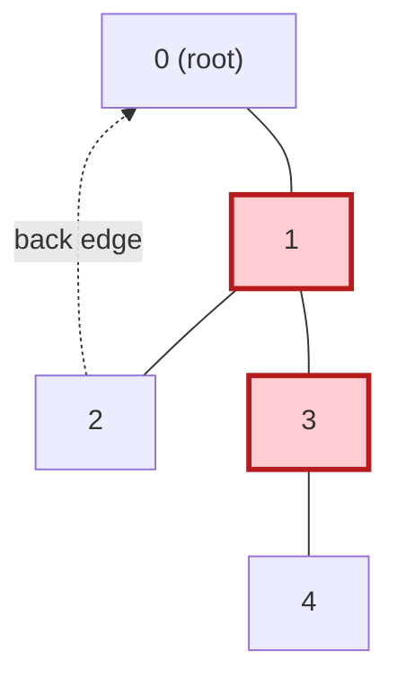

# Find All Articulation Points (Cut Vertices) in an Undirected Graph

| | |
| --- | --- |
| **Source** | Classic Competitive Programming problem |
| **Difficulty** | Hard |
| **Topics** | Graphs, DFS, Articulation Points / Cut Vertices, Low-Link, Tarjan |
| **Link** | https://cp-algorithms.com/graph/cutpoints.html |

> Related practice: SPOJ SUBMERGE, UVa 315 (Network), Codeforces gym variants.

---

## Problem Statement

You are given an **undirected** graph with `n` vertices (`0 .. n-1`) and `m`
edges. A vertex `v` is an **articulation point** (cut vertex) if **removing `v`
and all its incident edges increases the number of connected components** — i.e.
some pair of vertices that could reach each other can no longer do so once `v`
is gone.

Output all articulation points (the count, and/or the vertices themselves).

**Constraints (typical):** $1 \le n \le 10^5$, $0 \le m \le 2 \cdot 10^5$; the
graph may be disconnected and may contain multi-edges.

### Worked Example

```
Input:
n = 5
edges = [[0,1], [1,2], [2,0], [1,3], [3,4]]

Graph:
        2
       / \
      0---1 --- 3 --- 4
            (triangle 0-1-2, then a tail 1-3-4)

Remove vertex 1  => {0,2} stay linked, but {3,4} fall off  => ARTICULATION
Remove vertex 3  => 4 becomes isolated                     => ARTICULATION
Remove vertex 0  => 1,2 still connected via edge 1-2        => not
Remove vertex 2 / 4                                          => not

Output:
2
1 3
```

---

## Approach — Why the Low-Link Condition Works

Build the **DFS tree**, recording each vertex's **discovery time** `disc[u]` and
its **low-link**

$$
\text{low}[u] = \min\Big(
  \text{disc}[u],\;
  \min_{(u,w)\ \text{back edge}} \text{disc}[w],\;
  \min_{v\ \text{child of }u} \text{low}[v]
\Big),
$$

the highest ancestor (smallest discovery time) reachable from `u`'s subtree via
downward tree edges plus at most one back edge.

There are two cases for declaring `u` a cut vertex:

1. **Root rule.** If `u` is the DFS root, it is an articulation point **iff it
   has $\ge 2$ DFS-tree children.** With two children, their subtrees connect to
   the rest of the graph *only* through the root, so deleting it splits them.

2. **Non-root rule.** A non-root `u` is an articulation point **iff some child
   `v` satisfies**
   $$
   \boxed{\text{low}[v] \ge \text{disc}[u].}
   $$
   This says `v`'s subtree cannot reach any **strict ancestor** of `u` without
   passing through `u`. Remove `u` and that subtree is stranded.

**Why `>=` (not `>` like bridges).** We are deleting the *vertex* `u`. A back
edge from `v`'s subtree that climbs **exactly** to `u` (`low[v] == disc[u]`) is
useless once `u` is gone — it led *to the very vertex we removed*. So even
equality makes `u` a cut vertex. (For bridges we keep the vertex and only delete
the edge, so landing on `u` is a valid escape and the test is strict.)

**Multi-edges are harmless here** because the condition is about vertices, so
tracking the parent **vertex** is enough.

---

## Solution

### Python

```python
import sys
from typing import List, Set

def articulation_points(n: int, edges: List[List[int]]) -> Set[int]:
    adj = [[] for _ in range(n)]
    for a, b in edges:
        adj[a].append(b)
        adj[b].append(a)

    disc = [-1] * n                  # discovery time, -1 = unvisited
    low = [0] * n                    # low-link
    is_ap = [False] * n
    timer = 0
    sys.setrecursionlimit(1 << 20)   # DFS can recurse ~n deep

    def dfs(u, parent):
        nonlocal timer
        disc[u] = low[u] = timer
        timer += 1
        children = 0                 # DFS-tree children of u
        for v in adj[u]:
            if v == parent:          # skip the parent vertex
                continue
            if disc[v] == -1:        # tree edge -> recurse
                children += 1
                dfs(v, u)
                low[u] = min(low[u], low[v])
                # non-root rule: '>=' because deleting u kills the landing spot
                if parent != -1 and low[v] >= disc[u]:
                    is_ap[u] = True
            else:                    # back edge
                low[u] = min(low[u], disc[v])
        if parent == -1 and children >= 2:   # root rule
            is_ap[u] = True

    for s in range(n):               # handle every component
        if disc[s] == -1:
            dfs(s, -1)
    return {u for u in range(n) if is_ap[u]}
```

> If the graph can have parallel edges *and* you must skip by edge, switch to
> edge-id tracking as in the bridges solution. For AP, parent-vertex skipping is
> already correct because the test concerns vertices, not edges.

### C++

```cpp
#include <bits/stdc++.h>
using namespace std;

class ArticulationFinder {
    vector<vector<int>> adj;
    vector<int> disc, low_;
    vector<bool> is_ap;
    int timer_ = 0;

    void dfs(int u, int parent) {
        disc[u] = low_[u] = timer_++;        // first visit timestamp
        int children = 0;                    // DFS-tree children of u
        for (int v : adj[u]) {
            if (v == parent) continue;       // skip the parent vertex
            if (disc[v] == -1) {             // tree edge -> recurse
                ++children;
                dfs(v, u);
                low_[u] = min(low_[u], low_[v]);
                // non-root rule: '>=' (deleting u removes the landing spot)
                if (parent != -1 && low_[v] >= disc[u])
                    is_ap[u] = true;
            } else {                         // back edge
                low_[u] = min(low_[u], disc[v]);
            }
        }
        if (parent == -1 && children >= 2)   // root rule
            is_ap[u] = true;
    }
public:
    vector<int> solve(int n, vector<pair<int,int>>& edges) {
        adj.assign(n, {});
        disc.assign(n, -1); low_.assign(n, 0); is_ap.assign(n, false);
        timer_ = 0;
        for (auto [a, b] : edges) {
            adj[a].push_back(b);
            adj[b].push_back(a);
        }
        for (int s = 0; s < n; ++s)          // every component
            if (disc[s] == -1) dfs(s, -1);
        vector<int> res;
        for (int u = 0; u < n; ++u) if (is_ap[u]) res.push_back(u);
        return res;
    }
};
```

For $n$ up to $10^5$ with long chains, prefer an **iterative DFS** (explicit
stack) or enlarge the stack to avoid recursion overflow; the `low`/`children`
bookkeeping is unchanged.

---

## Iteration Trace

Graph from the worked example: `n = 5`, edges
`0-1, 1-2, 2-0, 1-3, 3-4`. DFS from `0`, neighbors in ascending order.



| Step | `u` | `disc[u]` | Edge | Action | `low[u]` | AP test |
| --- | --- | --- | --- | --- | --- | --- |
| 1 | 0 | 0 | — | enter root | 0 | — |
| 2 | 1 | 1 | tree 0→1 | recurse | 1 | — |
| 3 | 2 | 2 | tree 1→2 | recurse | 2 | — |
| 4 | 2 | 2 | back 2→0 | `low[2]=min(2,0)` | 0 | — |
| 5 | 1 | 1 | ret 2 | `low[1]=min(1,0)` | 0 | `low[2]=0 >= disc[1]=1`? No |
| 6 | 3 | 3 | tree 1→3 | recurse | 3 | — |
| 7 | 4 | 4 | tree 3→4 | recurse, leaf | 4 | — |
| 8 | 3 | 3 | ret 4 | `low[3]=min(3,4)` | 3 | `low[4]=4 >= disc[3]=3`? **Yes → 3 is AP** |
| 9 | 1 | 1 | ret 3 | `low[1]=min(0,3)` | 0 | `low[3]=3 >= disc[1]=1`? **Yes → 1 is AP** |
| 10 | 0 | 0 | ret 1 | root children = 1 | 0 | root rule: `children=1 < 2`? not AP |

Articulation points = `{1, 3}`. Vertex `0` is the root with a single DFS child,
so the root rule spares it even though it sits in the triangle.

---

## Math Summary

With discovery times and

$$
\text{low}[u] = \min\big(\text{disc}[u],\ \min_{\text{back }(u,w)} \text{disc}[w],\ \min_{\text{child } v} \text{low}[v]\big),
$$

vertex `u` is an articulation point iff

$$
\big(\,u = \text{root} \ \wedge\ \#\text{children}(u) \ge 2\,\big)
\quad\lor\quad
\big(\,u \ne \text{root} \ \wedge\ \exists\,\text{child } v:\ \text{low}[v] \ge \text{disc}[u]\,\big).
$$

Contrast with the bridge test `low[v] > disc[u]`: vertices use **`>=`**, edges
use **`>`**.

---

## Complexity

| Metric | Value | Reason |
| --- | --- | --- |
| Time | $O(V + E)$ | single DFS; each vertex once, each edge twice |
| Space | $O(V + E)$ | adjacency list + `disc`/`low`/`is_ap` arrays |
| Recursion depth | $O(V)$ | iterate / raise limit for long chains |

---

## Takeaway

A vertex is a cut vertex when some child's subtree cannot escape above it
(`low[v] >= disc[u]`), with the **root** handled specially (cut iff it has $\ge
2$ DFS children). Same single-DFS low-link machinery as bridges — just remember
the inequality flips from strict `>` (edges) to `>=` (vertices), and never forget
the root rule.
