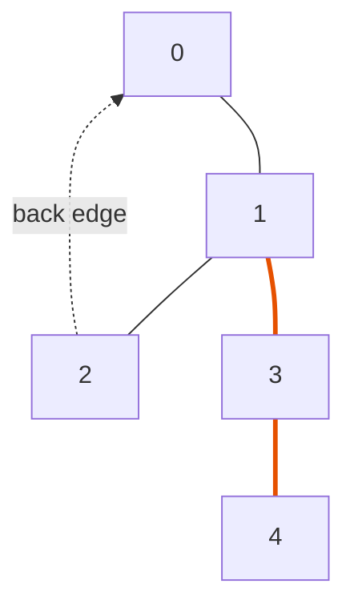

# Find All Bridges in an Undirected Graph (Critical Connections)

| | |
| --- | --- |
| **Source** | Classic CP / LeetCode 1192 — "Critical Connections in a Network" |
| **Difficulty** | Hard |
| **Topics** | Graphs, DFS, Bridges / Cut Edges, Low-Link, Tarjan |
| **Link** | https://leetcode.com/problems/critical-connections-in-a-network/ |

> Reference write-up (CP-Algorithms style):
> https://cp-algorithms.com/graph/bridge-searching.html

---

## Problem Statement

There are `n` servers numbered `0` to `n - 1` connected by undirected
`connections` forming a network, where `connections[i] = [a, b]` represents a
connection between servers `a` and `b`. Any server can reach any other server
directly or indirectly through the network.

A **critical connection** is a connection that, **if removed**, will make some
servers unable to reach some other servers. Return **all** critical connections
in any order.

A critical connection is exactly a **bridge**: an edge whose removal increases
the number of connected components.

**Constraints:** $2 \le n \le 10^5$, $n - 1 \le \text{connections} \le 10^5$,
no repeated connections (LeetCode 1192 guarantees no multi-edges, but the
solution below handles them anyway via edge ids).

### Worked Example

```
Input:
n = 4
connections = [[0,1], [1,2], [2,0], [1,3]]

Network:
        0
       / \
      1---2          (triangle 0-1-2, plus a tail 1-3)
      |
      3

Removing edge 1-3 isolates server 3  => CRITICAL (bridge).
Removing any edge of triangle 0-1-2 leaves everything connected
(the other two triangle edges still link them) => NOT critical.

Output:
[[1,3]]
```

---

## Approach — Why the Low-Link Condition Works

Run a single DFS, building the **DFS tree**. Every traversed edge is a **tree
edge**; every non-tree edge of an undirected graph is a **back edge** to an
ancestor.

Assign each vertex a **discovery time** `disc[u]` (visit order) and a **low-link**

$$
\text{low}[u] = \min\Big(
  \text{disc}[u],\;
  \min_{(u,w)\ \text{back edge}} \text{disc}[w],\;
  \min_{v\ \text{child of }u} \text{low}[v]
\Big),
$$

i.e. the smallest discovery time reachable from `u`'s subtree using downward
tree edges and **at most one** back edge upward.

For a tree edge $(u, v)$ with parent $u$, child $v$:

$$
\boxed{(u, v)\ \text{is a bridge} \iff \text{low}[v] > \text{disc}[u].}
$$

**Why.** `low[v] > disc[u]` means the whole subtree of `v` has **no** back edge
reaching `u` or anything above `u`. So the *only* way out of that subtree is the
edge $(u, v)$ itself — delete it and the subtree falls off. If instead
`low[v] <= disc[u]`, some descendant of `v` has a back edge to `u`
(`= disc[u]`) or higher (`< disc[u]`), giving an alternate route, so the edge is
safe. The inequality must be **strict**: a back edge that lands exactly on `u`
provides a second path, so it is *not* a bridge.

**Multi-edge safety.** We skip only the *exact edge id* we entered a vertex
through, not the parent *vertex*. Two parallel edges then correctly cancel each
other as bridges.

---

## Solution

### Python

```python
import sys
from typing import List

class Solution:
    def criticalConnections(self, n: int, connections: List[List[int]]) -> List[List[int]]:
        adj = [[] for _ in range(n)]
        for eid, (a, b) in enumerate(connections):
            adj[a].append((b, eid))      # store (neighbor, edge_id)
            adj[b].append((a, eid))      # same id on both directions

        disc = [-1] * n                  # discovery time, -1 = unvisited
        low = [0] * n                    # low-link
        bridges = []
        timer = 0
        sys.setrecursionlimit(1 << 20)   # DFS can recurse ~n deep

        def dfs(u, parent_edge):
            nonlocal timer
            disc[u] = low[u] = timer
            timer += 1
            for v, eid in adj[u]:
                if eid == parent_edge:   # ignore the exact edge we came in on
                    continue
                if disc[v] == -1:        # tree edge -> recurse
                    dfs(v, eid)
                    low[u] = min(low[u], low[v])
                    if low[v] > disc[u]: # strict '>' => bridge
                        bridges.append([u, v])
                else:                    # back edge -> climb via disc
                    low[u] = min(low[u], disc[v])

        for s in range(n):               # handle every component
            if disc[s] == -1:
                dfs(s, -1)
        return bridges
```

For very large chains, replace recursion with an explicit stack to avoid hitting
Python's recursion ceiling; the `low` update on child-return is identical.

### C++

```cpp
#include <bits/stdc++.h>
using namespace std;

class Solution {
    vector<vector<pair<int,int>>> adj;   // (neighbor, edge_id)
    vector<int> disc, low_;
    vector<vector<int>> bridges;
    int timer_ = 0;

    void dfs(int u, int parent_edge) {
        disc[u] = low_[u] = timer_++;    // first visit timestamp
        for (auto [v, eid] : adj[u]) {
            if (eid == parent_edge) continue;  // skip exact incoming edge
            if (disc[v] == -1) {         // tree edge -> recurse
                dfs(v, eid);
                low_[u] = min(low_[u], low_[v]);
                if (low_[v] > disc[u])   // strict '>' => bridge
                    bridges.push_back({u, v});
            } else {                     // back edge -> climb via disc
                low_[u] = min(low_[u], disc[v]);
            }
        }
    }
public:
    vector<vector<int>> criticalConnections(int n, vector<vector<int>>& connections) {
        adj.assign(n, {});
        disc.assign(n, -1); low_.assign(n, 0);
        bridges.clear(); timer_ = 0;
        for (int i = 0; i < (int)connections.size(); ++i) {
            int a = connections[i][0], b = connections[i][1];
            adj[a].push_back({b, i});    // same edge id both directions
            adj[b].push_back({a, i});
        }
        for (int s = 0; s < n; ++s)      // every component
            if (disc[s] == -1) dfs(s, -1);
        return bridges;
    }
};
```

For $n \approx 10^5$ in a worst-case path graph, recursion may overflow the
stack; an iterative DFS (manual frame stack) or raising the thread stack size is
the production-safe choice.

---

## Iteration Trace

Graph: `n = 5`, edges (with ids)
`0:(0-1) 1:(1-2) 2:(2-0) 3:(1-3) 4:(3-4)`. DFS from `0`, visiting neighbors in
ascending order.



| Step | Vertex `u` | `disc[u]` | Edge examined | Action | `low[u]` after |
| --- | --- | --- | --- | --- | --- |
| 1 | 0 | 0 | — | enter root | 0 |
| 2 | 1 | 1 | tree 0→1 | recurse | 1 |
| 3 | 2 | 2 | tree 1→2 | recurse | 2 |
| 4 | 2 | 2 | back 2→0 | `low[2]=min(2,disc[0]=0)` | 0 |
| 5 | 1 | 1 | return from 2 | `low[1]=min(1,low[2]=0)` | 0 |
| 6 | — | — | test (1,2) | `low[2]=0 > disc[1]=1`? No | — (not bridge) |
| 7 | 3 | 3 | tree 1→3 | recurse | 3 |
| 8 | 4 | 4 | tree 3→4 | recurse, leaf | 4 |
| 9 | — | — | test (3,4) | `low[4]=4 > disc[3]=3`? **Yes** | **bridge 3-4** |
| 10 | 3 | 3 | return from 4 | `low[3]=min(3,4)` | 3 |
| 11 | — | — | test (1,3) | `low[3]=3 > disc[1]=1`? **Yes** | **bridge 1-3** |
| 12 | 1 | 1 | return from 3 | `low[1]=min(0,3)` | 0 |
| 13 | — | — | test (0,1) | `low[1]=0 > disc[0]=0`? No | — (not bridge) |

Result: bridges `{1-3, 3-4}`. The triangle `0-1-2` has none — the back edge
`2-0` (`low[2]=0`) protects both `0-1` and `1-2`.

---

## Math Summary

Discovery time orders the DFS; the low-link is

$$
\text{low}[u] = \min\big(\text{disc}[u],\ \min_{\text{back }(u,w)} \text{disc}[w],\ \min_{\text{child } v} \text{low}[v]\big),
$$

and the bridge criterion for a tree edge $(u, v)$ is the strict inequality

$$
\text{low}[v] > \text{disc}[u].
$$

Equivalently, $(u, v)$ is a bridge iff it lies on **no** cycle of $G$.

---

## Complexity

| Metric | Value | Reason |
| --- | --- | --- |
| Time | $O(V + E)$ | one DFS; each vertex once, each edge twice |
| Space | $O(V + E)$ | adjacency list + `disc`/`low` arrays |
| Recursion depth | $O(V)$ | raise limit / iterate for long chains |

---

## Takeaway

A bridge is a tree edge no back edge climbs over. Compute `disc` and `low` in a
single DFS and emit edge $(u, v)$ whenever `low[v] > disc[u]` (**strict**),
skipping the exact parent **edge id** so multi-edges behave. This is the same
low-link engine used for articulation points (`>=` instead of `>`) and Tarjan's
SCC — learn it once, $O(V + E)$ forever.
