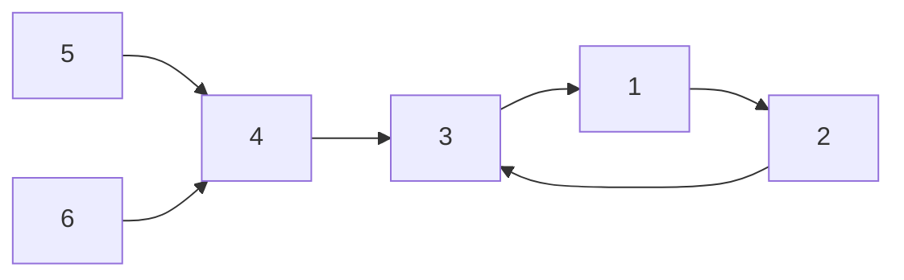
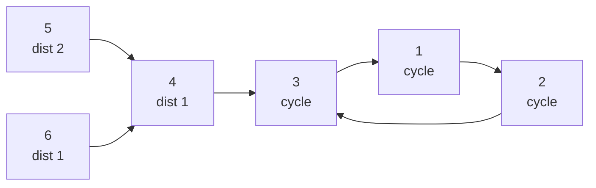

# Functional Graph Cycle Detection

| Field | Value |
| --- | --- |
| Source | Classic technique (self-contained; inspired by CSES 1752 Planets Queries II) |
| Difficulty | Medium |
| Topics | Functional graph, Floyd cycle detection, Visited coloring, Tail length |
| Link | https://cses.fi/problemset/task/1752 |

---

## Problem Statement

You are given a **functional graph** on $n$ nodes: an array $succ[1..n]$ where each node $x$ has exactly one outgoing edge to $succ[x]$. Your task is to fully characterize the structure:

1. Identify **every cycle** in the graph.
2. For each node $v$, report its **distance to the cycle** it eventually reaches, $\mu(v)$ (this is $0$ if $v$ is itself on a cycle).
3. For each node $v$, report the **length of the cycle** it reaches, $\lambda(v)$.

This is the foundational decomposition used by many functional-graph problems (e.g. answering "are $a$ and $b$ on the same path / how many steps from $a$ to $b$"). We show **two** complementary cycle-detection methods: **Floyd's tortoise and hare** ($O(1)$ memory, per start) and **visited-coloring / iterative DFS** ($O(n)$ total for the whole graph).

Constraints: $1 \le n \le 2 \times 10^5$, $1 \le succ[x] \le n$. Self-loops ($succ[x] = x$, a cycle of length $1$) are allowed.

```text
Input
6
2 3 1 3 4 4

Output
node dist cyclen
1    0    3
2    0    3
3    0    3
4    1    3
5    2    3
6    1    3
```

Here $succ = [\,*,2,3,1,3,4,4]$. Nodes $1,2,3$ form a cycle of length $3$. Node $4 \to 3$ (distance $1$), node $5 \to 4 \to 3$ (distance $2$), node $6 \to 4 \to 3$ (distance $1$); all reach the length-$3$ cycle.

## Approach (WHY)

The visited-coloring method processes the **entire graph in $O(n)$**: a three-color walk (white/gray/black) where reaching a gray node reveals a new cycle, and reaching a black node means we've merged into already-known structure. We then compute tail distances by an iterative memoized climb.

Floyd's method is shown as an alternative that uses **constant extra memory** and works even when $succ$ is computed on the fly (streaming) — it finds the tail length $\mu$ and cycle length $\lambda$ for a single start without any visited array.



The coloring walk: mark nodes gray as you advance; when you step onto a gray node, the suffix of your path from that node's first appearance is a brand-new cycle. Mark the whole path black so later starts that flow into it stop immediately.

$$\text{node } v: \quad \mu(v) = \text{steps to cycle}, \quad \lambda(v) = \text{length of reached cycle}.$$

## Solution

### Python

```python
import sys

def solve(n, succ):
    color = [0] * (n + 1)        # 0 white, 1 gray, 2 black
    pos = [0] * (n + 1)
    on_cycle = [False] * (n + 1)
    cyclen = [0] * (n + 1)
    dist = [0] * (n + 1)

    # Visited-coloring: detect all cycles in O(n)
    for s in range(1, n + 1):
        if color[s] != 0:
            continue
        path = []
        v = s
        while color[v] == 0:
            color[v] = 1
            pos[v] = len(path)
            path.append(v)
            v = succ[v]
        if color[v] == 1:            # fresh cycle starting at v
            start = pos[v]
            clen = len(path) - start
            for i in range(start, len(path)):
                u = path[i]
                on_cycle[u] = True
                cyclen[u] = clen
        for u in path:
            color[u] = 2

    # Iterative memoized climb for tail distances
    for s in range(1, n + 1):
        stack = []
        v = s
        while not on_cycle[v] and cyclen[v] == 0:
            stack.append(v)
            v = succ[v]
        base_dist = 0 if on_cycle[v] else dist[v]
        base_cyc = cyclen[v]
        d = base_dist
        for u in reversed(stack):
            d += 1
            dist[u] = d
            cyclen[u] = base_cyc

    return dist, cyclen


def floyd(succ, start):
    # O(1) memory: returns (mu = tail length, lam = cycle length) for one start
    slow = succ[start]
    fast = succ[succ[start]]
    while slow != fast:
        slow = succ[slow]
        fast = succ[succ[fast]]
    mu = 0
    slow = start
    while slow != fast:
        slow = succ[slow]
        fast = succ[fast]
        mu += 1
    lam = 1
    fast = succ[slow]
    while fast != slow:
        fast = succ[fast]
        lam += 1
    return mu, lam


def main():
    data = sys.stdin.buffer.read().split()
    idx = 0
    n = int(data[idx]); idx += 1
    succ = [0] * (n + 1)
    for v in range(1, n + 1):
        succ[v] = int(data[idx]); idx += 1

    dist, cyclen = solve(n, succ)
    out = ["node dist cyclen"]
    for v in range(1, n + 1):
        out.append(f"{v}    {dist[v]}    {cyclen[v]}")
    sys.stdout.write("\n".join(out) + "\n")

main()
```

### C++

```cpp
#include <bits/stdc++.h>
using namespace std;

void solve(int n, const vector<int>& succ,
           vector<long long>& dist, vector<long long>& cyclen) {
    vector<int> color(n + 1, 0);    // 0 white, 1 gray, 2 black
    vector<int> pos(n + 1, 0);
    vector<char> on_cycle(n + 1, 0);

    // Visited-coloring: detect all cycles in O(n)
    for (int s = 1; s <= n; ++s) {
        if (color[s] != 0) continue;
        vector<int> path;
        int v = s;
        while (color[v] == 0) {
            color[v] = 1;
            pos[v] = (int)path.size();
            path.push_back(v);
            v = succ[v];
        }
        if (color[v] == 1) {            // fresh cycle at v
            int start = pos[v];
            long long clen = (long long)path.size() - start;
            for (int i = start; i < (int)path.size(); ++i) {
                on_cycle[path[i]] = 1;
                cyclen[path[i]] = clen;
            }
        }
        for (int u : path) color[u] = 2;
    }

    // Iterative memoized climb for tail distances
    for (int s = 1; s <= n; ++s) {
        vector<int> stk;
        int v = s;
        while (!on_cycle[v] && cyclen[v] == 0) {
            stk.push_back(v);
            v = succ[v];
        }
        long long baseDist = on_cycle[v] ? 0 : dist[v];
        long long baseCyc = cyclen[v];
        long long d = baseDist;
        for (int i = (int)stk.size() - 1; i >= 0; --i) {
            ++d;
            dist[stk[i]] = d;
            cyclen[stk[i]] = baseCyc;
        }
    }
}

// O(1) memory: returns (mu = tail length, lam = cycle length) for one start
pair<long long, long long> floyd(const vector<int>& succ, int start) {
    int slow = succ[start];
    int fast = succ[succ[start]];
    while (slow != fast) {
        slow = succ[slow];
        fast = succ[succ[fast]];
    }
    long long mu = 0;
    slow = start;
    while (slow != fast) {
        slow = succ[slow];
        fast = succ[fast];
        ++mu;
    }
    long long lam = 1;
    fast = succ[slow];
    while (fast != slow) {
        fast = succ[fast];
        ++lam;
    }
    return {mu, lam};
}

int main() {
    ios::sync_with_stdio(false);
    cin.tie(nullptr);

    int n;
    cin >> n;
    vector<int> succ(n + 1);
    for (int v = 1; v <= n; ++v) cin >> succ[v];

    vector<long long> dist(n + 1, 0), cyclen(n + 1, 0);
    solve(n, succ, dist, cyclen);

    cout << "node dist cyclen\n";
    for (int v = 1; v <= n; ++v)
        cout << v << "    " << dist[v] << "    " << cyclen[v] << '\n';
    return 0;
}
```

## Iteration Trace

Take $succ = [\,*,2,3,1,3,4,4]$, start the coloring walk at $s = 5$.

| Step | $v$ | action | path so far | color change |
| --- | --- | --- | --- | --- |
| 1 | 5 | gray, push | [5] | 5 → gray |
| 2 | 4 | gray, push | [5,4] | 4 → gray |
| 3 | 3 | gray, push | [5,4,3] | 3 → gray |
| 4 | 1 | gray, push | [5,4,3,1] | 1 → gray |
| 5 | 2 | gray, push | [5,4,3,1,2] | 2 → gray |
| 6 | 3 | gray hit! | cycle = path from pos[3]=2 → [3,1,2] | len 3 |

The cycle $\{3,1,2\}$ has length $3$. Tail nodes $4$ (dist $1$) and $5$ (dist $2$) flow in. A later start at $6$ stops immediately at $4$ (black) giving dist $1$.



## Complexity

Coloring processes every node a constant number of times. Floyd runs in time proportional to one rho's size.

$$\text{Coloring: } O(n)\text{ time}, \ O(n)\text{ space}. \qquad \text{Floyd: } O(\mu + \lambda)\text{ time}, \ O(1)\text{ space}.$$

| Method | Time | Space |
| --- | --- | --- |
| Visited-coloring (all nodes) | $O(n)$ | $O(n)$ |
| Tail distance climb | $O(n)$ | $O(n)$ |
| Floyd tortoise/hare (one start) | $O(\mu + \lambda)$ | $O(1)$ |

## Takeaway

A functional graph decomposes into cycles with rho tails. Use **visited-coloring / iterative DFS** for an $O(n)$ whole-graph pass that labels every cycle and tail distance; use **Floyd's tortoise and hare** when you need $O(1)$ memory or a streaming successor (it is also the engine behind Pollard's rho). Both avoid recursion to stay safe at $n = 2 \times 10^5$.
