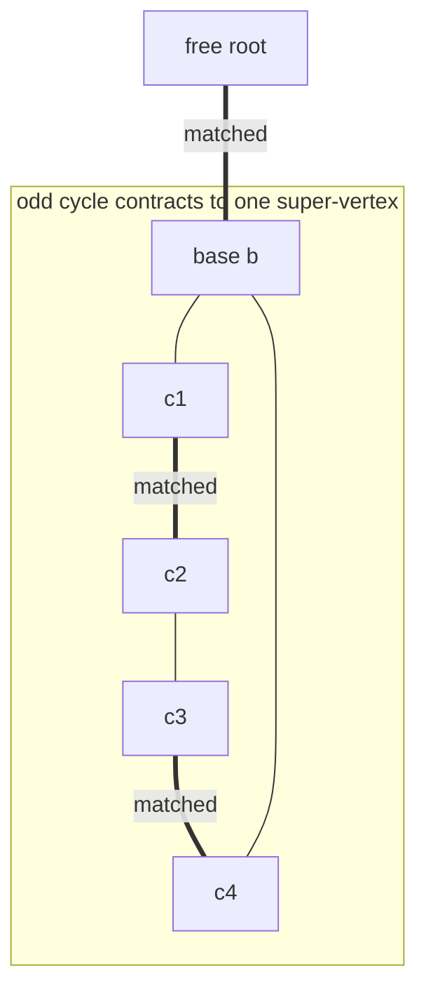
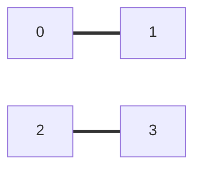

# Maximum Matching in a General Graph — Blossom Algorithm ($O(V^3)$)

| Meta | Value |
|------|-------|
| Source | Edmonds' Blossom algorithm (classic) |
| Difficulty | Hard |
| Topics | General Matching, Augmenting Paths, Blossom Contraction |
| Link | https://cp-algorithms.com/graph/edmonds_matching.html |

---

## Problem Statement

Given an **undirected, not necessarily bipartite** graph $G = (V, E)$ on $n = |V|$ vertices, find a
**maximum-cardinality matching**: the largest set $M \subseteq E$ such that no two edges of $M$
share a vertex.

Unlike the bipartite case, $G$ may contain **odd cycles**, which is exactly what makes a naive
augmenting-path search fail.

**Example**
```
n = 4
edges: 0-1, 1-2, 0-2, 2-3      (triangle 0-1-2, plus pendant 2-3)

A maximum matching has 2 edges, e.g.  {0-1, 2-3}.
(The triangle alone is an odd cycle: at most 1 of its 3 edges can be matched.)

Answer: 2
```

---

## Approach (WHY)

By **Berge's lemma**, a matching is maximum **iff** there is no augmenting path (an alternating path
between two free vertices). We repeatedly search from each free vertex for such a path and flip it.

The obstacle is the **blossom**: an odd cycle of $2k+1$ vertices with $k$ matched edges, attached
to the alternating tree at its **base**. A vertex on the cycle is reachable with *both* parities, so
a naive BFS may miss the augmenting path. Edmonds' fix is to **contract** each blossom into a single
super-vertex (found via the **LCA** of the two endpoints in the alternating tree), continue the
search on the contracted graph, then **expand and flip** through the blossom when augmenting.



Full derivation: [15-hungarian-general-matching.md](../guide/15-hungarian-general-matching.md).

---

## Solution

### Python

```python
from collections import deque

def max_matching_general(n, adj):
    """Maximum-cardinality matching in a general graph on vertices 0..n-1.
    Returns (size, match) with match[v] = partner or -1."""
    match = [-1] * n
    p = [-1] * n
    base = list(range(n))

    def lca(a, b):
        seen = [False] * n
        while True:
            a = base[a]
            seen[a] = True
            if match[a] == -1:
                break
            a = p[match[a]]
        while True:
            b = base[b]
            if seen[b]:
                return b
            b = p[match[b]]

    def mark_path(v, b, child, blossom):
        while base[v] != b:
            blossom[base[v]] = True
            blossom[base[match[v]]] = True
            p[v] = child
            child = match[v]
            v = p[match[v]]

    def find_path(root):
        nonlocal base, p
        used = [False] * n
        p = [-1] * n
        base = list(range(n))
        used[root] = True
        q = deque([root])
        while q:
            v = q.popleft()
            for to in adj[v]:
                if base[v] == base[to] or match[v] == to:
                    continue
                if to == root or (match[to] != -1 and p[match[to]] != -1):
                    cur = lca(v, to)                 # contract blossom
                    blossom = [False] * n
                    mark_path(v, cur, to, blossom)
                    mark_path(to, cur, v, blossom)
                    for i in range(n):
                        if blossom[base[i]]:
                            base[i] = cur
                            if not used[i]:
                                used[i] = True
                                q.append(i)
                elif p[to] == -1:
                    p[to] = v
                    if match[to] == -1:
                        return to                    # augmenting endpoint
                    used[match[to]] = True
                    q.append(match[to])
        return -1

    for v in range(n):
        if match[v] == -1:
            u = find_path(v)
            while u != -1:                           # flip augmenting path
                pv = p[u]
                ppv = match[pv]
                match[u] = pv
                match[pv] = u
                u = ppv
    size = sum(1 for v in range(n) if match[v] != -1) // 2
    return size, match


if __name__ == "__main__":
    n = 4
    adj = [[1, 2], [0, 2], [0, 1, 3], [2]]
    size, match = max_matching_general(n, adj)
    print(size)      # 2
    print(match)     # e.g. [1, 0, 3, 2]
```

### C++

```cpp
#include <bits/stdc++.h>
using namespace std;

struct Blossom {
    int n;
    vector<vector<int>> adj;
    vector<int> match, p, base;
    vector<char> used, blossom;
    queue<int> q;

    Blossom(int n) : n(n), adj(n), match(n, -1), p(n), base(n),
                     used(n), blossom(n) {}

    void add_edge(int u, int v) { adj[u].push_back(v); adj[v].push_back(u); }

    int lca(int a, int b) {
        vector<char> seen(n, false);
        while (true) {
            a = base[a];
            seen[a] = true;
            if (match[a] == -1) break;
            a = p[match[a]];
        }
        while (true) {
            b = base[b];
            if (seen[b]) return b;
            b = p[match[b]];
        }
    }

    void mark_path(int v, int b, int child) {
        while (base[v] != b) {
            blossom[base[v]] = true;
            blossom[base[match[v]]] = true;
            p[v] = child;
            child = match[v];
            v = p[match[v]];
        }
    }

    int find_path(int root) {
        fill(used.begin(), used.end(), false);
        fill(p.begin(), p.end(), -1);
        for (int i = 0; i < n; ++i) base[i] = i;
        used[root] = true;
        q = queue<int>();
        q.push(root);
        while (!q.empty()) {
            int v = q.front(); q.pop();
            for (int to : adj[v]) {
                if (base[v] == base[to] || match[v] == to) continue;
                if (to == root || (match[to] != -1 && p[match[to]] != -1)) {
                    int cur = lca(v, to);            // contract blossom
                    fill(blossom.begin(), blossom.end(), false);
                    mark_path(v, cur, to);
                    mark_path(to, cur, v);
                    for (int i = 0; i < n; ++i) {
                        if (blossom[base[i]]) {
                            base[i] = cur;
                            if (!used[i]) { used[i] = true; q.push(i); }
                        }
                    }
                } else if (p[to] == -1) {
                    p[to] = v;
                    if (match[to] == -1) return to;  // augmenting endpoint
                    used[match[to]] = true;
                    q.push(match[to]);
                }
            }
        }
        return -1;
    }

    int solve() {
        for (int v = 0; v < n; ++v) {
            if (match[v] == -1) {
                int u = find_path(v);
                while (u != -1) {                    // flip augmenting path
                    int pv = p[u], ppv = match[pv];
                    match[u] = pv;
                    match[pv] = u;
                    u = ppv;
                }
            }
        }
        int size = 0;
        for (int v = 0; v < n; ++v) if (match[v] != -1) ++size;
        return size / 2;
    }
};

int main() {
    Blossom b(4);                 // triangle 0-1-2 plus pendant 2-3
    b.add_edge(0, 1);
    b.add_edge(1, 2);
    b.add_edge(0, 2);
    b.add_edge(2, 3);
    cout << b.solve() << "\n";    // 2
    return 0;
}
```

---

## Iteration Trace

On the example (triangle `0-1-2` + pendant `2-3`), starting from an empty matching:

| Step | Search root | Event | Matching after |
|------|-------------|-------|----------------|
| 1 | 0 | path `0–1` (both free) | {0-1} |
| 2 | 2 | path `2–3` (both free) | {0-1, 2-3} |
| 3 | — | all vertices matched | done, size 2 |

If instead we had matched `1-2` first, root `0` would reach the **blossom** `0-1-2`: edge `0–2`
connects two `even` tree vertices, so the triangle is contracted to its base, and the search still
finds the augmenting path `0–...–3`, flipping to size 2. The contraction is what prevents the odd
cycle from hiding the augmenting path.



---

## Complexity

Each free vertex triggers one $O(V^2)$ search (BFS plus per-blossom $O(V)$ contractions), over up to
$V$ free vertices:

$$T(V) = O(V \cdot V^2) = O(V^3), \qquad \text{space } O(V^2).$$

| Resource | Bound |
|----------|-------|
| Time | $O(V^3)$ |
| Space | $O(V^2)$ |

---

## Takeaway

General-graph matching is exactly bipartite matching **plus blossom handling**: when an alternating
search hits an odd cycle, **contract it at the LCA** so the augmenting path becomes visible, then
expand and flip. The $O(V^3)$ contraction approach is the standard contest-ready version.
Maximum-*weight* general matching is much harder (weighted Blossom with primal–dual duals) — see
[15-hungarian-general-matching.md](../guide/15-hungarian-general-matching.md); for *bipartite*
weighted matching, use the Hungarian algorithm instead.
