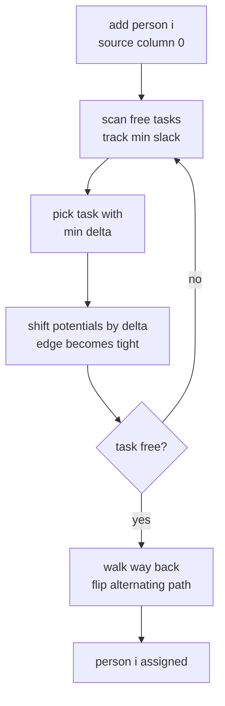
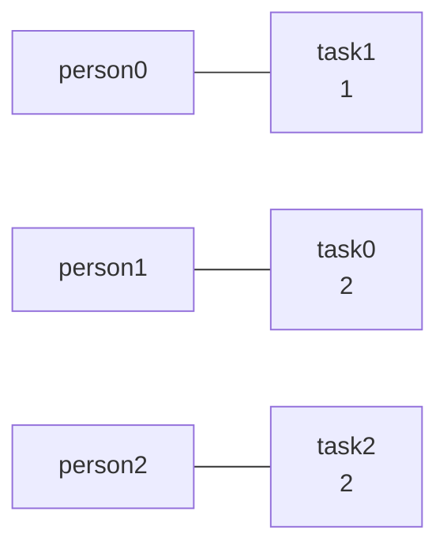

# Minimum-Cost Perfect Matching — Assign Tasks to People (Hungarian)

| Meta | Value |
|------|-------|
| Source | Classic assignment problem (Kuhn–Munkres) |
| Difficulty | Medium–Hard |
| Topics | Assignment, Bipartite Matching, Hungarian Algorithm |
| Link | https://cses.fi/problemset/ |

---

## Problem Statement

There are $n$ **people** and $n$ **tasks**. If person $i$ performs task $j$ it costs $c_{ij}$
(time/money), given as an $n \times n$ matrix. Every person must do **exactly one** task and every
task must be done by **exactly one** person. Find the assignment $\sigma$ (a permutation) minimizing
the total cost:

$$\min_{\sigma \in S_n} \ \sum_{i=1}^{n} c_{i,\sigma(i)}.$$

This is the **minimum-cost perfect matching** in a complete bipartite graph — the same core problem
as [assignment-problem-hungarian.md](assignment-problem-hungarian.md), framed as people/tasks.

**Example**
```
n = 3
cost[i][j] = time for person i on task j:

        task0  task1  task2
pers0     4      1      3
pers1     2      0      5
pers2     3      2      2

Optimal:
  person0 -> task1   (1)
  person1 -> task0   (2)
  person2 -> task2   (2)
  ----------------------------
  minimum total cost = 1 + 2 + 2 = 5
```

---

## Approach (WHY)

Maintain dual **potentials** $u_i$ (people) and $v_j$ (tasks) that stay feasible —
$u_i + v_j \le c_{ij}$ — and grow the matching using only **tight** edges where
$u_i + v_j = c_{ij}$ (complementary slackness). Add one person at a time; a Dijkstra-like search over
reduced costs $c_{ij} - u_i - v_j \ge 0$ finds the cheapest way to extend the matching, shifting
potentials by the **minimum slack** $\delta$ to expose a new tight edge until an augmenting path
completes.



Full theory: [15-hungarian-general-matching.md](../guide/15-hungarian-general-matching.md).

---

## Solution

### Python

```python
INF = float("inf")

def min_cost_assignment(cost):
    """Minimum-cost perfect matching of people to tasks (n x n).
    Returns (total_cost, assign) with assign[i] = task for person i."""
    n = len(cost)
    u = [0] * (n + 1)          # person potentials (1-indexed)
    v = [0] * (n + 1)          # task potentials
    p = [0] * (n + 1)          # p[j] = person matched to task j
    way = [0] * (n + 1)
    for i in range(1, n + 1):
        p[0] = i
        j0 = 0
        minv = [INF] * (n + 1)
        used = [False] * (n + 1)
        while True:
            used[j0] = True
            i0 = p[j0]
            delta = INF
            j1 = -1
            for j in range(1, n + 1):
                if not used[j]:
                    cur = cost[i0 - 1][j - 1] - u[i0] - v[j]   # reduced cost
                    if cur < minv[j]:
                        minv[j] = cur
                        way[j] = j0
                    if minv[j] < delta:
                        delta = minv[j]
                        j1 = j
            for j in range(n + 1):
                if used[j]:
                    u[p[j]] += delta
                    v[j] -= delta
                else:
                    minv[j] -= delta
            j0 = j1
            if p[j0] == 0:
                break
        while j0:                       # augment along the path
            j1 = way[j0]
            p[j0] = p[j1]
            j0 = j1
    assign = [0] * n
    for j in range(1, n + 1):
        assign[p[j] - 1] = j - 1
    total = sum(cost[i][assign[i]] for i in range(n))
    return total, assign


if __name__ == "__main__":
    cost = [
        [4, 1, 3],
        [2, 0, 5],
        [3, 2, 2],
    ]
    total, assign = min_cost_assignment(cost)
    print(total)     # 5
    print(assign)    # [1, 0, 2]
```

### C++

```cpp
#include <bits/stdc++.h>
using namespace std;

// Minimum-cost perfect matching of people to tasks (n x n).
// Returns total cost; fills assign[i] = task chosen for person i.
long long min_cost_assignment(const vector<vector<long long>>& cost, vector<int>& assign) {
    const long long INF = 1e18;
    int n = (int)cost.size();
    vector<long long> u(n + 1, 0), v(n + 1, 0);
    vector<int> p(n + 1, 0), way(n + 1, 0);     // p[j] = person matched to task j
    for (int i = 1; i <= n; ++i) {
        p[0] = i;
        int j0 = 0;
        vector<long long> minv(n + 1, INF);
        vector<char> used(n + 1, false);
        do {
            used[j0] = true;
            int i0 = p[j0], j1 = -1;
            long long delta = INF;
            for (int j = 1; j <= n; ++j) {
                if (!used[j]) {
                    long long cur = cost[i0 - 1][j - 1] - u[i0] - v[j];  // reduced cost
                    if (cur < minv[j]) { minv[j] = cur; way[j] = j0; }
                    if (minv[j] < delta) { delta = minv[j]; j1 = j; }
                }
            }
            for (int j = 0; j <= n; ++j) {
                if (used[j]) { u[p[j]] += delta; v[j] -= delta; }
                else          minv[j] -= delta;
            }
            j0 = j1;
        } while (p[j0] != 0);
        do {                                    // augment along the path
            int j1 = way[j0];
            p[j0] = p[j1];
            j0 = j1;
        } while (j0);
    }
    assign.assign(n, 0);
    for (int j = 1; j <= n; ++j) assign[p[j] - 1] = j - 1;
    long long total = 0;
    for (int i = 0; i < n; ++i) total += cost[i][assign[i]];
    return total;
}

int main() {
    vector<vector<long long>> cost = {
        {4, 1, 3},
        {2, 0, 5},
        {3, 2, 2},
    };
    vector<int> assign;
    cout << min_cost_assignment(cost, assign) << "\n";  // 5
    for (int x : assign) cout << x << ' ';              // 1 0 2
    cout << "\n";
    return 0;
}
```

---

## Iteration Trace

Adding people one at a time to the example matrix (potentials start at 0):

| Person added | Cheapest extension | New tight edge | Partial assignment | Notes |
|--------------|--------------------|----------------|--------------------|-------|
| 0 | task1 (cost 1) | (0,1) | task1→p0 | minimum in row 0 |
| 1 | task0 (cost 2) | (1,0) | task0→p1, task1→p0 | task1 wanted by p1 too, but slack favors task0 |
| 2 | task2 (cost 2) | (2,2) | task0→p1, task1→p0, task2→p2 | completes perfect matching |

Final inverse map `p`: task0→person1, task1→person0, task2→person2 ⇒
`assign = [1, 0, 2]`, total $1 + 2 + 2 = 5$.



---

## Complexity

$n$ people, each with at most $n$ frontier expansions scanning $O(n)$ tasks:

$$T(n) = O(n^3), \qquad \text{space } O(n^2).$$

| Resource | Bound |
|----------|-------|
| Time | $O(n^3)$ |
| Space | $O(n^2)$ |

---

## Takeaway

"Assign people to tasks minimizing total cost over a square matrix" is the canonical **assignment
problem**: solve it directly with the Hungarian algorithm in $O(n^3)$, maintaining feasible
potentials and augmenting through tight edges. For maximization negate the matrix; for non-square
inputs pad to a square; for capacities or side constraints switch to MCMF
([assignment-problem-mcmf.md](assignment-problem-mcmf.md)).
