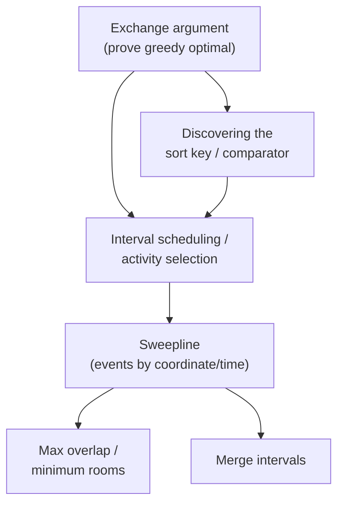

# Greedy Algorithms

A focused module on **greedy algorithms** — making a locally optimal choice at each step and
proving it leads to a global optimum. Each topic has a **concept guide** (theory from scratch,
proofs, many Mermaid diagrams, complexity, pitfalls, patterns) and **curated problems** solved in
**both Python and C++**.

## Structure

```
greedy/
├── guide/      # one concept guide per topic (diagram-heavy)
└── problems/   # one file per curated problem (Python + C++, traces, diagrams, math)
```

## Topics & Guides

| # | Topic | Guide | Key problems |
|---|-------|-------|--------------|
| 1 | Exchange-argument greedy | [01-exchange-argument-greedy.md](guide/01-exchange-argument-greedy.md) | Minimize sum of products, Largest Number (179), Job sequencing |
| 2 | Interval scheduling / activity selection | [02-interval-scheduling.md](guide/02-interval-scheduling.md) | Non-overlapping Intervals (435), Burst Balloons Arrows (452), Activity selection |
| 3 | Sweepline (events by coordinate/time) | [03-sweepline-events.md](guide/03-sweepline-events.md) | Meeting Rooms II (253), Max Population Year (1854), Merge intervals |

## How the pieces fit together



## Recommended study order

1. **Exchange-argument greedy** (1) — the proof technique that justifies *why* a greedy choice is
   safe; it underpins everything else.
2. **Interval scheduling / activity selection** (2) — the canonical "earliest finish time"
   greedy, proven by exchange.
3. **Sweepline** (3) — turn intervals into +1/−1 events, sort, and sweep; the timeline cousin of
   geometric line sweep.

## Complexity cheat sheet

| Technique | Complexity | Notes |
|-----------|-----------|-------|
| Exchange-argument greedy (sort + scan) | $O(n\log n)$ | dominated by the sort / comparator |
| Custom comparator (e.g. Largest Number) | $O(n\log n)$ | comparator must be transitive |
| Activity selection / max non-overlap | $O(n\log n)$ | sort by finish time, greedy scan |
| Minimum arrows / point cover | $O(n\log n)$ | sort by end, count groups |
| Sweepline max overlap / rooms | $O(n\log n)$ | sort events, running counter |
| Difference-array sweep | $O(n + R)$ | $R$ = coordinate range |
| Merge intervals | $O(n\log n)$ | sort by start, merge in one pass |

---

> Every code sample appears in **both Python and C++**. Problem files follow the repo format:
> meta table → statement → approach (WHY, with the exchange argument) → Python + C++ → trace →
> Mermaid → math → complexity → takeaway. Guides follow: TOC → theory → paired code → many Mermaid
> diagrams → math → complexity → pitfalls → patterns.
