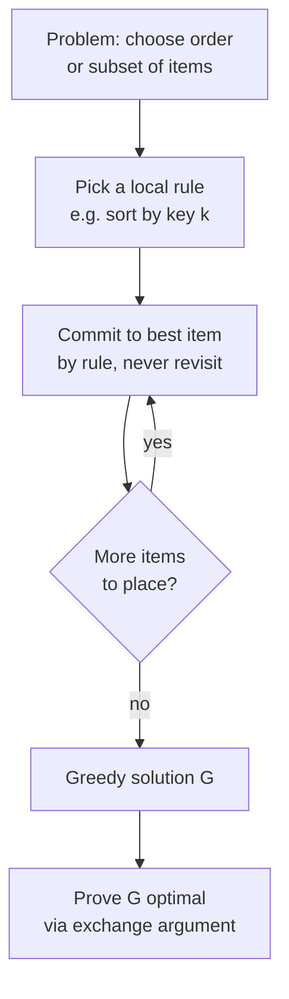
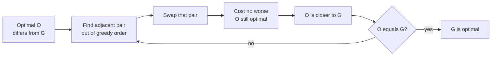
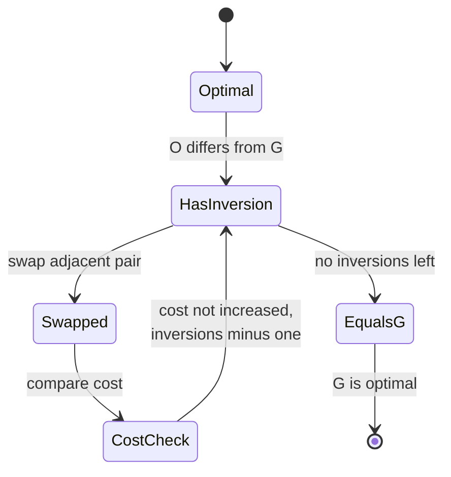
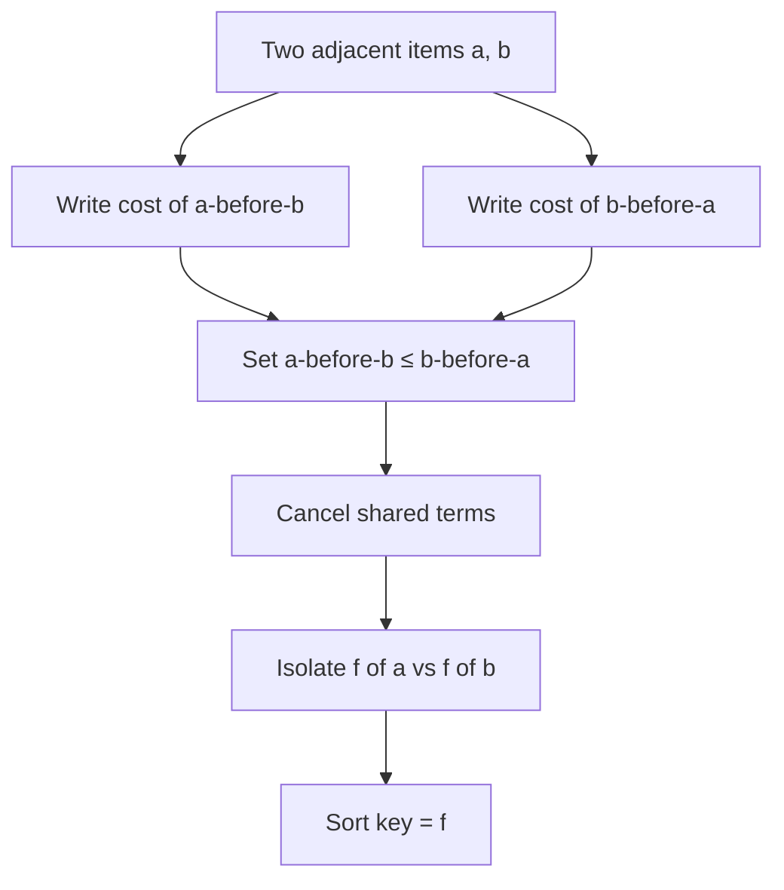
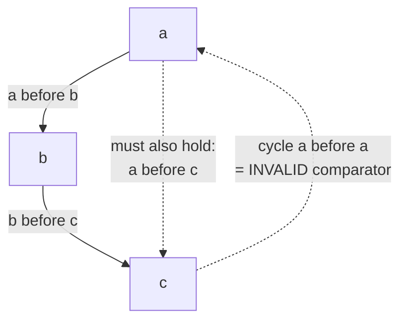
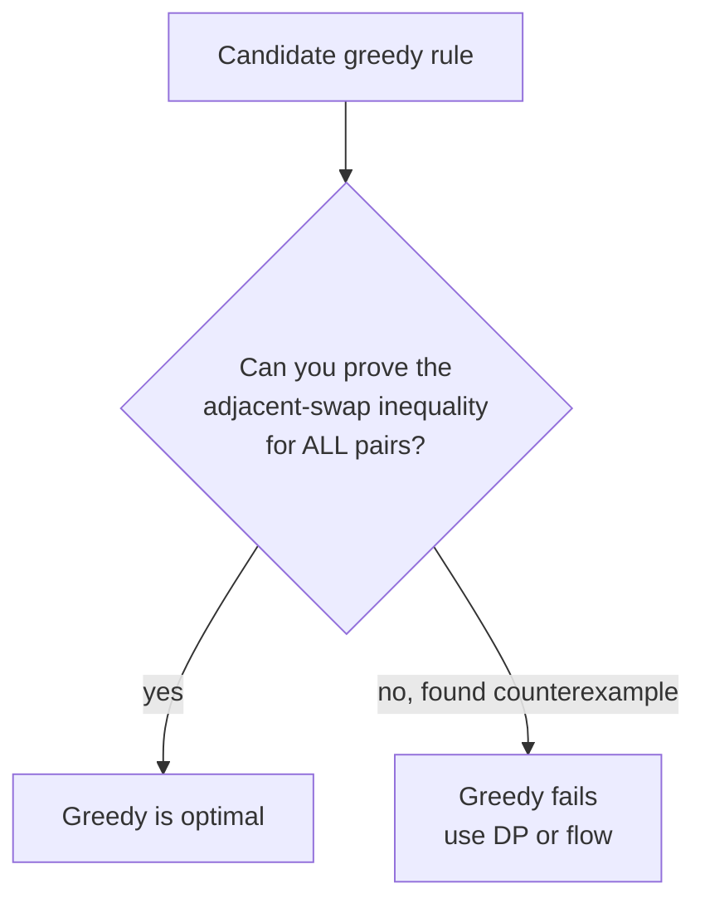

# Exchange-Argument Greedy

> A **greedy algorithm** builds a solution step by step, always taking the locally best-looking choice and never reconsidering it. The hard part is never the code — it is *proving* that local choices add up to a global optimum. The **exchange argument** is the workhorse proof technique for that: take any optimal solution, show you can swap a pair of elements toward the greedy order without making things worse, and repeat until the optimal solution *becomes* the greedy one. This guide builds the idea from scratch, shows how to discover the correct sort key, and explains the custom-comparator pattern (including why the comparator must define a strict weak ordering).

## Table of Contents

1. [What Is a Greedy Algorithm?](#1-what-is-a-greedy-algorithm)
2. [The Exchange Argument, Intuitively](#2-the-exchange-argument-intuitively)
3. [The Exchange Argument, Formally](#3-the-exchange-argument-formally)
4. [Discovering the Right Sort Key](#4-discovering-the-right-sort-key)
5. [The Custom-Comparator Pattern](#5-the-custom-comparator-pattern)
6. [Strict Weak Ordering and Transitivity](#6-strict-weak-ordering-and-transitivity)
7. [Classic Example: Minimize Weighted Completion Time](#7-classic-example-minimize-weighted-completion-time)
8. [Classic Example: String-Concatenation Ordering](#8-classic-example-string-concatenation-ordering)
9. [Classic Example: Job Sequencing With Deadlines](#9-classic-example-job-sequencing-with-deadlines)
10. [When Greedy Fails](#10-when-greedy-fails)
11. [Complexity Summary](#11-complexity-summary)
12. [Common Pitfalls](#12-common-pitfalls)
13. [Patterns](#13-patterns)

## 1. What Is a Greedy Algorithm?

A greedy algorithm makes a sequence of choices, each of which:

- is the **best** option according to some simple local criterion, and
- is **never undone** later.

Formally, suppose the answer is an ordering or selection of items. A greedy strategy fixes a **priority** (often "sort by some key") and commits to items in that priority order. Greedy is fast and simple, but it is only *correct* when local optimality forces global optimality.

Two properties must hold for greedy to be provably optimal:

- **Greedy-choice property** — there exists an optimal solution that agrees with the first greedy choice.
- **Optimal substructure** — after making the greedy choice, the remaining subproblem is solved the same way.

The exchange argument is how we usually establish the greedy-choice property.



## 2. The Exchange Argument, Intuitively

Imagine the greedy answer $G$ orders items one way, and somebody hands you a supposedly better optimal answer $O$ that orders them differently. Because $O \neq G$, somewhere in $O$ two **adjacent** items are out of greedy order — a place where greedy would have swapped them.

The exchange argument says: *swap that adjacent pair.* Show that the swap does not increase the cost (or does not decrease the value). After the swap, $O$ looks a little more like $G$. Repeat. Every swap moves $O$ closer to $G$ and never hurts the objective, so $G$ is at least as good as $O$. Since $O$ was optimal, $G$ is optimal too.



## 3. The Exchange Argument, Formally

Let the objective be a cost $C(\cdot)$ we want to **minimize** (maximization is symmetric). Let $G$ be greedy's output and $O$ an optimal output with $C(O) \le C(G)$.

1. **Difference implies an inversion.** If $O \neq G$, then there exist two items $x$ and $y$ that are **adjacent** in $O$ but in the opposite relative order to greedy's rule. Call this an *inversion*.
2. **Local swap bound.** Let $O'$ be $O$ with that adjacent pair swapped. Because only the contributions of $x$ and $y$ change, we can compare $C(O')$ and $C(O)$ by a *local* calculation. The greedy rule is chosen precisely so that

$$
C(O') \le C(O).
$$

3. **Monotone progress.** Each such swap reduces the number of inversions with respect to greedy by exactly one, and never increases cost. After finitely many swaps we reach $G$, so

$$
C(G) \le \dots \le C(O') \le C(O).
$$

4. **Conclusion.** Combined with $C(O) \le C(G)$ (optimality of $O$), we get $C(G) = C(O)$. Greedy is optimal. $\blacksquare$



The crucial inequality in step 2 is what tells you *which* sort key to use. Read it backward: pick the key so that, whenever two adjacent items violate it, swapping them helps.

## 4. Discovering the Right Sort Key

You rarely guess the key — you **derive** it. Consider two adjacent items $a$ and $b$ and write the cost of the order `a then b` versus `b then a`. Set up the inequality "`a` before `b` is at least as good":

$$
\text{cost}(a \text{ before } b) \le \text{cost}(b \text{ before } a).
$$

Algebraically simplify until you isolate a comparison between a function of $a$ and a function of $b$. That function **is** the sort key.

For example, suppose two jobs $a$ and $b$ have processing times $p$ and weights $w$, and the cost of putting `a` first then `b` adds $w_a p_a + w_b (p_a + p_b)$. Comparing both orders and cancelling the common term $w_a p_a + w_b p_b$ leaves:

$$
w_b\, p_a \le w_a\, p_b \quad\Longleftrightarrow\quad \frac{p_a}{w_a} \le \frac{p_b}{w_b}.
$$

So sort by the ratio $p/w$ ascending. This is **Smith's rule**. The whole derivation is "compare two adjacent orders, cancel, read off the key."



## 5. The Custom-Comparator Pattern

Once you have the pairwise rule "`a` should come before `b` iff `better(a, b)`", you feed it to a sort. In Python the cleanest path for a *pairwise* rule is `functools.cmp_to_key`; for a *key* rule use `sorted(..., key=...)`. In C++ pass a comparator to `std::sort`.

A comparator returns whether the first argument must come **strictly before** the second. Here is Smith's rule via a numeric key:

```python
from functools import cmp_to_key

def order_jobs(jobs):
    # jobs: list of (p, w); sort by ratio p/w ascending.
    # Key form (preferred when a numeric key exists):
    return sorted(jobs, key=lambda job: job[0] / job[1])

def order_jobs_cmp(jobs):
    # Pairwise comparator form: avoid float division by cross-multiplying.
    def cmp(a, b):
        left = a[0] * b[1]   # p_a * w_b
        right = b[0] * a[1]  # p_b * w_a
        if left < right:
            return -1
        if left > right:
            return 1
        return 0
    return sorted(jobs, key=cmp_to_key(cmp))
```

```cpp
#include <bits/stdc++.h>
using namespace std;

vector<pair<long long,long long>> order_jobs(vector<pair<long long,long long>> jobs) {
    // jobs: (p, w); sort by ratio p/w ascending using a key-like comparator.
    sort(jobs.begin(), jobs.end(), [](const pair<long long,long long>& a,
                                      const pair<long long,long long>& b) {
        return (double)a.first / a.second < (double)b.first / b.second;
    });
    return jobs;
}

vector<pair<long long,long long>> order_jobs_cmp(vector<pair<long long,long long>> jobs) {
    // Pairwise comparator: cross-multiply to avoid float error.
    sort(jobs.begin(), jobs.end(), [](const pair<long long,long long>& a,
                                      const pair<long long,long long>& b) {
        long long left = a.first * b.second;  // p_a * w_b
        long long right = b.first * a.second; // p_b * w_a
        return left < right;                  // strictly before
    });
    return jobs;
}
```

Prefer cross-multiplication over float division when inputs are integers — it is exact and avoids subtle ordering bugs from floating-point rounding.

## 6. Strict Weak Ordering and Transitivity

A comparator handed to `std::sort` (or `cmp_to_key`) **must** define a **strict weak ordering**, otherwise the sort is undefined behaviour and may even crash. The required properties:

- **Irreflexivity:** `cmp(a, a)` is false (no element precedes itself).
- **Asymmetry:** if `cmp(a, b)` then not `cmp(b, a)`.
- **Transitivity:** if `cmp(a, b)` and `cmp(b, c)` then `cmp(a, c)`.
- **Transitivity of incomparability:** if `a` and `b` are "equivalent" (neither precedes the other) and `b` and `c` are equivalent, then `a` and `c` are equivalent.

Transitivity is the one people get wrong. If your "`a` before `b`" rule can produce a cycle $a \prec b \prec c \prec a$, the sort is meaningless. When you derive a key $f$ and compare `f(a) < f(b)`, transitivity is automatic because `<` on real numbers is transitive. When you use a *bespoke* pairwise rule (like the largest-number string comparison `a+b` vs `b+a`), you must **prove** transitivity separately.



If you can show your comparator is equivalent to "compare some real-valued key", transitivity comes for free. That is the safest design.

## 7. Classic Example: Minimize Weighted Completion Time

$n$ jobs share one machine. Job $i$ takes time $p_i$ and has weight $w_i$. If jobs finish at times $C_1, \dots, C_n$, minimize $\sum_i w_i C_i$. From Section 4 the exchange argument gives **Smith's rule**: sort by $p_i / w_i$ ascending.

A special case where all weights equal $1$ reduces to *Shortest Processing Time first*: sort by $p_i$ ascending to minimize total completion time. Another special case — minimizing the **sum of pairwise products** of two arrays — is solved by sorting one ascending and the other descending (the rearrangement inequality, itself proved by an exchange argument).

```python
def min_weighted_completion_time(jobs):
    # jobs: list of (p, w). Return minimum sum of w_i * C_i.
    order = sorted(jobs, key=lambda j: j[0] / j[1])
    t = 0
    total = 0
    for p, w in order:
        t += p          # completion time of this job
        total += w * t
    return total
```

```cpp
#include <bits/stdc++.h>
using namespace std;

long long min_weighted_completion_time(vector<pair<long long,long long>> jobs) {
    // jobs: (p, w). Return minimum sum of w_i * C_i.
    sort(jobs.begin(), jobs.end(), [](const pair<long long,long long>& a,
                                      const pair<long long,long long>& b) {
        return a.first * b.second < b.first * a.second; // p_a/w_a < p_b/w_b
    });
    long long t = 0, total = 0;
    for (auto& job : jobs) {
        t += job.first;             // completion time
        total += job.second * t;
    }
    return total;
}
```

## 8. Classic Example: String-Concatenation Ordering

Given numbers as strings, arrange them so the concatenation is largest (LeetCode 179). The pairwise rule: `a` comes before `b` iff the string `a + b` is lexicographically greater than `b + a`. This is exactly an exchange-argument rule — swapping any adjacent pair that violates it produces a larger concatenation. Its transitivity needs a proof (covered in the dedicated problem file), and once proven the comparator is a valid strict weak ordering.

```python
from functools import cmp_to_key

def largest_concatenation(nums):
    strs = list(map(str, nums))
    def cmp(a, b):
        if a + b > b + a:
            return -1      # a before b
        if a + b < b + a:
            return 1
        return 0
    strs.sort(key=cmp_to_key(cmp))
    result = "".join(strs)
    return "0" if result[0] == "0" else result
```

```cpp
#include <bits/stdc++.h>
using namespace std;

string largest_concatenation(vector<long long> nums) {
    vector<string> strs;
    for (long long x : nums) strs.push_back(to_string(x));
    sort(strs.begin(), strs.end(), [](const string& a, const string& b) {
        return a + b > b + a;   // a before b when a+b is larger
    });
    string result;
    for (auto& s : strs) result += s;
    if (!result.empty() && result[0] == '0') return "0";
    return result;
}
```

## 9. Classic Example: Job Sequencing With Deadlines

Each job has a deadline and a profit; each takes one unit of time; one machine. Maximize total profit of jobs finished by their deadlines. The greedy: sort jobs by **profit descending**, then place each job in the latest free slot at or before its deadline. The exchange argument shows that taking a higher-profit job in preference to a lower one never hurts, and scheduling it as late as possible leaves earlier slots free for tighter-deadline jobs.

```python
def job_sequencing(jobs):
    # jobs: list of (deadline, profit). Maximize profit.
    jobs = sorted(jobs, key=lambda j: j[1], reverse=True)  # profit desc
    max_deadline = max(d for d, _ in jobs)
    slots = [False] * (max_deadline + 1)
    profit = 0
    for d, p in jobs:
        t = min(d, max_deadline)
        while t > 0 and slots[t]:
            t -= 1
        if t > 0:
            slots[t] = True
            profit += p
    return profit
```

```cpp
#include <bits/stdc++.h>
using namespace std;

long long job_sequencing(vector<pair<long long,long long>> jobs) {
    // jobs: (deadline, profit). Maximize profit.
    sort(jobs.begin(), jobs.end(), [](const pair<long long,long long>& a,
                                      const pair<long long,long long>& b) {
        return a.second > b.second;   // profit descending
    });
    long long max_deadline = 0;
    for (auto& j : jobs) max_deadline = max(max_deadline, j.first);
    vector<bool> slots(max_deadline + 1, false);
    long long profit = 0;
    for (auto& j : jobs) {
        long long t = min(j.first, max_deadline);
        while (t > 0 && slots[t]) t--;
        if (t > 0) { slots[t] = true; profit += j.second; }
    }
    return profit;
}
```

## 10. When Greedy Fails

Greedy is seductive but often wrong. The discipline: before trusting it, *try to break it.* A counterexample mindset:

- **0/1 Knapsack.** Greedy by value/weight ratio fails because items are indivisible. Sorting by ratio and grabbing greedily can leave a high-ratio tiny item blocking a perfect-fitting pair. Counterexample: capacity $10$, items $(\text{value } 6, \text{weight } 5)$, $(6, 5)$, $(10, 6)$ — ratio greedy picks the $10/6$ item and wastes capacity; optimal takes the two $5$-weight items for $12 > 10$.
- **Coin change with arbitrary denominations.** Greedy "largest coin first" fails for coins $\{1, 3, 4\}$ making $6$: greedy gives $4 + 1 + 1 = 3$ coins, optimal is $3 + 3 = 2$ coins.
- **Longest path.** No local rule survives; needs different machinery.

The litmus test: if your exchange-argument inequality in Section 4 **cannot** be proven for *every* adjacent pair, greedy is probably wrong and you need dynamic programming or flow.



## 11. Complexity Summary

| Task | Time | Space | Notes |
| --- | --- | --- | --- |
| Sort by numeric key | $O(n \log n)$ | $O(1)$ or $O(n)$ | Comparison sort dominates |
| Sort by pairwise comparator | $O(n \log n)$ | $O(\log n)$ stack | Comparator must be $O(1)$ amortized |
| String-concat comparator | $O(n \log n \cdot L)$ | $O(nL)$ | $L$ = max string length |
| Weighted completion time | $O(n \log n)$ | $O(1)$ | Smith's rule |
| Job sequencing (naive slots) | $O(n \cdot D)$ | $O(D)$ | $D$ = max deadline |
| Job sequencing (DSU slots) | $O(n \log n)$ | $O(D)$ | Union-find for next free slot |
| Exchange-argument proof | n/a | n/a | $O(n^2)$ swaps to convert $O$ into $G$ |

## 12. Common Pitfalls

- **Trusting greedy without proof.** Always run the adjacent-swap inequality; if it does not hold universally, find the counterexample.
- **Non-transitive comparators.** A bespoke pairwise rule that is not transitive yields undefined sort behaviour (potential crash in C++). Prove transitivity or reduce to a numeric key.
- **Floating-point keys.** `p/w` as a `double` can misorder near-equal ratios. Cross-multiply integers instead: `a.p * b.w < b.p * a.w`.
- **Overflow.** Cross-multiplication and prefix sums can overflow 32-bit ints; use `long long`.
- **Forgetting edge cases.** Largest-number must collapse all-zero input to `"0"`, not `"000"`.
- **Wrong sort direction.** Minimization vs maximization flips ascending/descending; derive the direction from the inequality, do not guess.
- **Mutating during iteration / unstable assumptions.** Do not rely on stability unless your comparator guarantees it.

## 13. Patterns

- **Derive, don't guess.** Compare two adjacent orders, cancel shared terms, read the key off the remaining inequality.
- **Reduce bespoke comparators to numeric keys** whenever possible to get transitivity for free.
- **Cross-multiply** to keep integer comparisons exact.
- **Maximize ↔ minimize symmetry.** Flip the inequality and the sort direction; the proof structure is identical.
- **Rearrangement inequality** (sort one up, one down) is the exchange argument for sums of products.
- **Smith's rule** (sort by cost-to-benefit ratio) recurs across scheduling problems.
- **Latest-slot scheduling** with deadlines: process high value first, place as late as possible to preserve early slots.
- **Counterexample first.** Before coding greedy, spend 60 seconds trying to break it; indivisibility and global constraints are the usual killers.
