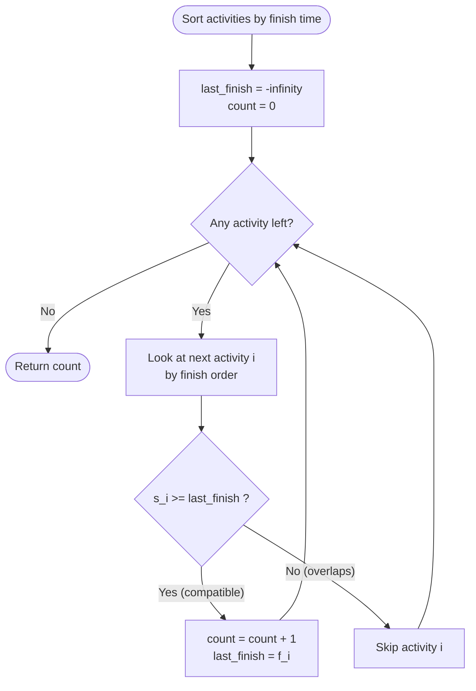
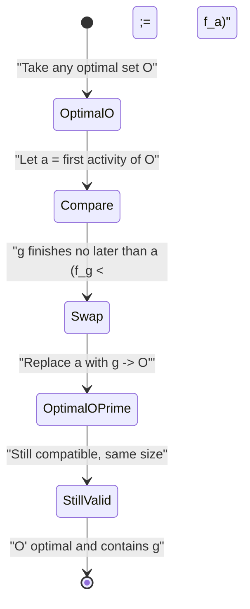
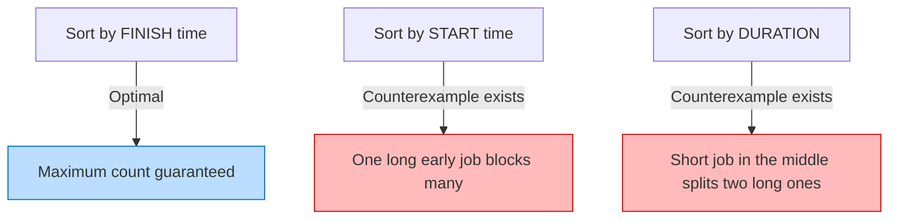
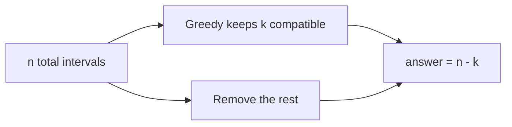
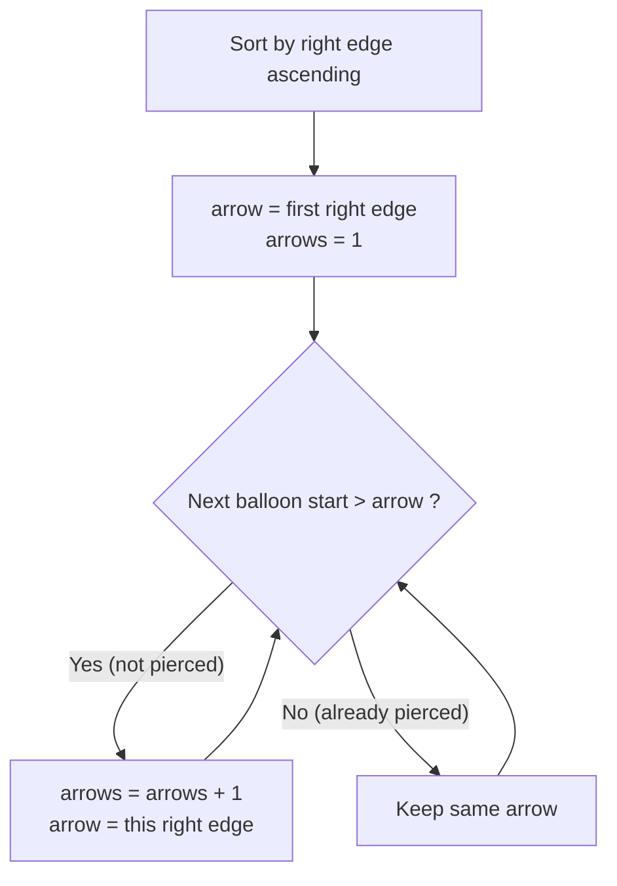
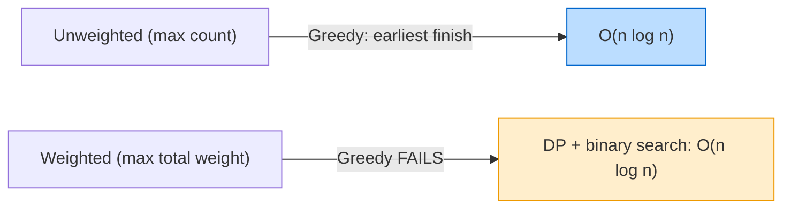
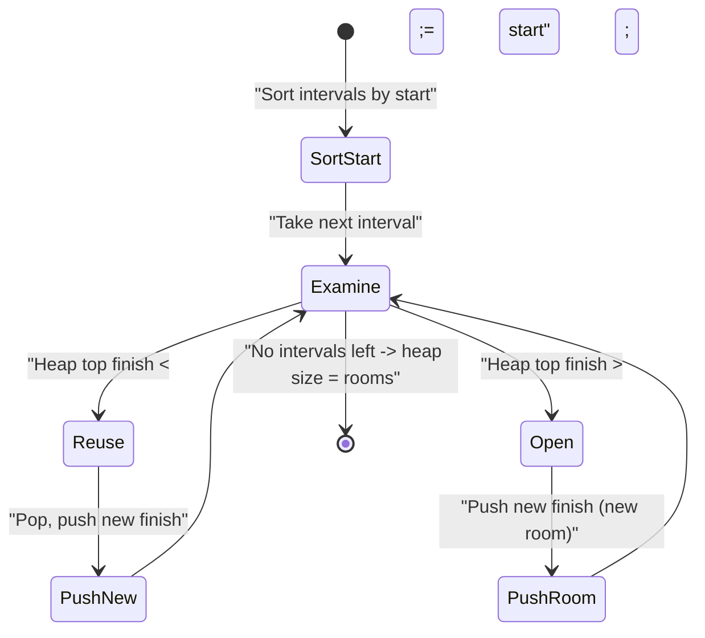

# Interval Scheduling / Activity Selection

> Interval scheduling is the classic playground for **greedy algorithms**. Given a set of jobs
> (activities) each with a fixed start and finish time, we repeatedly ask: *which job should I
> commit to next so that I never regret it later?* The astonishingly simple answer — **always pick
> the job that finishes earliest among those that still fit** — is provably optimal, and the proof
> (an *exchange argument*) is one of the most elegant in all of algorithms.

---

## Table of Contents
1. [The Activity-Selection Problem](#the-activity-selection-problem)
2. [The Greedy Choice: Earliest Finish Time](#the-greedy-choice-earliest-finish-time)
3. [The Exchange-Argument Proof](#the-exchange-argument-proof)
4. [Sorting by Finish Time](#sorting-by-finish-time)
5. [Counting Maximum Non-Overlapping Intervals](#counting-maximum-non-overlapping-intervals)
6. [The Dual: Minimum Removals](#the-dual-minimum-removals-to-make-non-overlapping)
7. [Interval Point Cover / Minimum Arrows](#interval-point-cover--minimum-arrows)
8. [Weighted Interval Scheduling (needs DP)](#weighted-interval-scheduling-needs-dp)
9. [Interval Partitioning / Minimum Rooms](#interval-partitioning--minimum-number-of-rooms)
10. [Complexity Summary](#complexity-summary)
11. [Common Pitfalls](#common-pitfalls)
12. [Patterns](#patterns)

---

## The Activity-Selection Problem

You are given $n$ activities. Activity $i$ has a start time $s_i$ and a finish time $f_i$ with
$s_i &lt; f_i$. Two activities $i$ and $j$ are **compatible** (non-overlapping) if their time ranges
do not intersect, i.e.

$$
f_i \le s_j \quad\text{or}\quad f_j \le s_i.
$$

The goal: select a **maximum-size** subset of mutually compatible activities. Only **one** activity
can run at any instant (think: a single lecture hall, a single CPU, a single conference room).

Here is a small instance drawn as a timeline. Notice how some bars overlap:

```mermaid
gantt
    title Activities on a Single Timeline
    dateFormat X
    axisFormat %s
    section Candidates
    A1 :a1, 1, 4
    A2 :a2, 3, 5
    A3 :a3, 0, 6
    A4 :a4, 5, 7
    A5 :a5, 3, 9
    A6 :a6, 5, 9
    A7 :a7, 6, 10
    A8 :a8, 8, 11
    A9 :a9, 8, 12
    A10 :a10, 2, 14
    A11 :a11, 12, 16
```



A valid (and in fact optimal) selection here is $\{A1, A4, A8, A11\}$ — four mutually compatible
activities. The whole art is *how to find such a selection fast*.

---

## The Greedy Choice: Earliest Finish Time

The greedy rule is:

> **Among all activities compatible with the ones already chosen, always pick the one with the
> smallest finish time.**

Intuition: finishing early leaves the **most room** on the timeline for future activities. Any
other first choice can only finish *later*, leaving a *smaller* remaining window — never a bigger
one. So the earliest-finishing activity is the "safest" greedy commitment.

The decision loop as a flowchart:



```python
def activity_selection(activities):
    # activities: list of (start, finish)
    activities.sort(key=lambda iv: iv[1])   # sort by finish time
    count = 0
    last_finish = float("-inf")
    chosen = []
    for s, f in activities:
        if s >= last_finish:                # compatible with last pick
            chosen.append((s, f))
            last_finish = f
            count += 1
    return count, chosen
```

```cpp
#include <bits/stdc++.h>
using namespace std;

pair<long long, vector<pair<long long,long long>>>
activitySelection(vector<pair<long long,long long>> activities) {
    // sort by finish time
    sort(activities.begin(), activities.end(),
         [](const auto &a, const auto &b){ return a.second < b.second; });
    long long count = 0;
    long long lastFinish = LLONG_MIN;
    vector<pair<long long,long long>> chosen;
    for (auto &iv : activities) {
        if (iv.first >= lastFinish) {       // compatible with last pick
            chosen.push_back(iv);
            lastFinish = iv.second;
            ++count;
        }
    }
    return {count, chosen};
}
```

---

## The Exchange-Argument Proof

Why is "earliest finish" optimal? We prove it with an **exchange argument** (a.k.a. *greedy stays
ahead*).

**Claim.** Let $g$ be the activity with the smallest finish time. Then there exists an optimal
solution that contains $g$.

**Proof.** Let $O$ be any optimal solution, and sort its activities by finish time. Let $a$ be the
first activity in $O$. Since $g$ has the globally smallest finish time, $f_g \le f_a$. Now build
$O' = (O \setminus \{a\}) \cup \{g\}$. Because every activity after $a$ in $O$ starts at or after
$f_a \ge f_g$, swapping $a$ for $g$ keeps the set compatible. And $|O'| = |O|$, so $O'$ is also
optimal — and it contains $g$. $\blacksquare$

By induction, after committing to $g$ we recurse on the activities that start at or after $f_g$,
and the same argument applies. Therefore the greedy solution is optimal.

The swap that powers the argument:



Formally, the **greedy-stays-ahead** invariant is: after $k$ picks, the greedy solution's $k$-th
finish time $f^{greedy}_k$ satisfies

$$
f^{greedy}_k \le f^{opt}_k
$$

for every optimal solution. Finishing no later at every step means greedy can never run out of room
before the optimum does, so it matches the optimum's count.

---

## Sorting by Finish Time

Everything hinges on the **finish-time order**. Sorting is the dominant cost:

$$
T(n) = \underbrace{O(n \log n)}_{\text{sort}} + \underbrace{O(n)}_{\text{single sweep}} = O(n \log n).
$$

A common mistake is sorting by **start** time or by **duration** — both can be defeated by simple
counterexamples. The diagram below contrasts the orderings:



Counterexample for **sort-by-start**: jobs $[0, 10], [1, 2], [3, 4]$. By start, you grab $[0,10]$
first and get only $1$ job; the optimum picks $[1,2]$ and $[3,4]$ for $2$.

```python
def beats_start_sort():
    jobs = [(0, 10), (1, 2), (3, 4)]
    # finish-time greedy gets [1,2] then [3,4] -> 2
    jobs_by_finish = sorted(jobs, key=lambda iv: iv[1])
    last, cnt = float("-inf"), 0
    for s, f in jobs_by_finish:
        if s >= last:
            cnt += 1
            last = f
    return cnt   # 2
```

```cpp
#include <bits/stdc++.h>
using namespace std;

int beatsStartSort() {
    vector<pair<long long,long long>> jobs = {{0,10},{1,2},{3,4}};
    sort(jobs.begin(), jobs.end(),
         [](const auto &a, const auto &b){ return a.second < b.second; });
    long long last = LLONG_MIN;
    int cnt = 0;
    for (auto &iv : jobs) {
        if (iv.first >= last) { ++cnt; last = iv.second; }
    }
    return cnt;   // 2
}
```

---

## Counting Maximum Non-Overlapping Intervals

If we only need the **count** (not the actual activities), the loop simplifies to a counter. This
is the canonical "maximum number of non-overlapping intervals" problem.

```python
def max_non_overlapping(intervals):
    intervals.sort(key=lambda iv: iv[1])
    count, last_finish = 0, float("-inf")
    for s, f in intervals:
        if s >= last_finish:
            count += 1
            last_finish = f
    return count
```

```cpp
#include <bits/stdc++.h>
using namespace std;

int maxNonOverlapping(vector<pair<long long,long long>> intervals) {
    sort(intervals.begin(), intervals.end(),
         [](const auto &a, const auto &b){ return a.second < b.second; });
    int count = 0;
    long long lastFinish = LLONG_MIN;
    for (auto &iv : intervals) {
        if (iv.first >= lastFinish) {
            ++count;
            lastFinish = iv.second;
        }
    }
    return count;
}
```

---

## The Dual: Minimum Removals to Make Non-Overlapping

A beautiful duality: if the maximum number of compatible intervals is $k$ out of $n$ total, then
the **minimum number of intervals to delete** so that none overlap is

$$
\text{removals} = n - k.
$$

This is exactly **LeetCode 435 — Non-overlapping Intervals**. You run the same earliest-finish
greedy, but instead of counting kept intervals you count the ones you *drop*.



```python
def erase_overlap_intervals(intervals):
    if not intervals:
        return 0
    intervals.sort(key=lambda iv: iv[1])
    removals, last_finish = 0, float("-inf")
    for s, f in intervals:
        if s >= last_finish:
            last_finish = f          # keep it
        else:
            removals += 1            # overlaps -> remove it
    return removals
```

```cpp
#include <bits/stdc++.h>
using namespace std;

int eraseOverlapIntervals(vector<pair<long long,long long>> intervals) {
    if (intervals.empty()) return 0;
    sort(intervals.begin(), intervals.end(),
         [](const auto &a, const auto &b){ return a.second < b.second; });
    int removals = 0;
    long long lastFinish = LLONG_MIN;
    for (auto &iv : intervals) {
        if (iv.first >= lastFinish) {
            lastFinish = iv.second;   // keep it
        } else {
            ++removals;               // overlaps -> remove it
        }
    }
    return removals;
}
```

---

## Interval Point Cover / Minimum Arrows

A twist with the same skeleton: given intervals, find the **minimum number of points** that touch
every interval (equivalently, **LeetCode 452 — minimum arrows to burst balloons**). Sort by
finish (right edge); shoot an arrow at the current right edge; skip every interval that this arrow
already pierces; repeat.

The rule "shoot at the earliest right edge" is the *same* greedy choice — one point can serve all
intervals whose start is $\le$ that right edge.



```python
def min_arrows(points):
    if not points:
        return 0
    points.sort(key=lambda p: p[1])          # by right edge
    arrows, arrow = 1, points[0][1]
    for start, end in points[1:]:
        if start > arrow:                    # current arrow misses this balloon
            arrows += 1
            arrow = end
    return arrows
```

```cpp
#include <bits/stdc++.h>
using namespace std;

int minArrows(vector<pair<long long,long long>> points) {
    if (points.empty()) return 0;
    sort(points.begin(), points.end(),
         [](const auto &a, const auto &b){ return a.second < b.second; });
    int arrows = 1;
    long long arrow = points[0].second;
    for (size_t i = 1; i < points.size(); ++i) {
        if (points[i].first > arrow) {       // current arrow misses this balloon
            ++arrows;
            arrow = points[i].second;
        }
    }
    return arrows;
}
```

---

## Weighted Interval Scheduling (needs DP)

The moment each interval carries a **weight** $w_i$ and we want the maximum-weight compatible
subset, **greedy breaks**. Earliest finish no longer wins because a single fat-weight late job can
beat several skinny early ones.

The correct tool is **dynamic programming**. Sort by finish time, and for each interval $i$ define
$p(i)$ = the largest index $j &lt; i$ with $f_j \le s_i$ (the rightmost compatible predecessor, found
by binary search). Then

$$
dp[i] = \max\big(dp[i-1],\; w_i + dp[p(i)]\big).
$$

Contrast at a glance:



```python
import bisect

def weighted_interval_scheduling(intervals):
    # intervals: list of (start, finish, weight)
    intervals.sort(key=lambda iv: iv[1])          # by finish
    finishes = [iv[1] for iv in intervals]
    n = len(intervals)
    dp = [0] * (n + 1)
    for i in range(1, n + 1):
        s, f, w = intervals[i - 1]
        # p(i): rightmost interval whose finish <= s
        j = bisect.bisect_right(finishes, s, 0, i - 1)
        dp[i] = max(dp[i - 1], w + dp[j])
    return dp[n]
```

```cpp
#include <bits/stdc++.h>
using namespace std;

long long weightedIntervalScheduling(vector<array<long long,3>> intervals) {
    // each element: {start, finish, weight}
    sort(intervals.begin(), intervals.end(),
         [](const auto &a, const auto &b){ return a[1] < b[1]; });
    int n = (int)intervals.size();
    vector<long long> finishes(n);
    for (int i = 0; i < n; ++i) finishes[i] = intervals[i][1];
    vector<long long> dp(n + 1, 0);
    for (int i = 1; i <= n; ++i) {
        long long s = intervals[i - 1][0];
        long long w = intervals[i - 1][2];
        // p(i): rightmost interval whose finish <= s, among first i-1
        int j = (int)(upper_bound(finishes.begin(), finishes.begin() + (i - 1), s)
                      - finishes.begin());
        dp[i] = max(dp[i - 1], w + dp[j]);
    }
    return dp[n];
}
```

---

## Interval Partitioning / Minimum Number of Rooms

Different question: instead of one room, how **many** rooms do we need so that *every* interval is
scheduled and no two overlapping intervals share a room? The answer equals the maximum number of
intervals overlapping at any single instant (the **depth** of the interval set).

The classic approach: sort by start time and use a **min-heap** keyed by finish time. For each new
interval, if the room that frees up earliest is free in time (its finish $\le$ new start), reuse it;
otherwise open a new room.



```python
import heapq

def min_rooms(intervals):
    if not intervals:
        return 0
    intervals.sort(key=lambda iv: iv[0])     # by start
    heap = []                                # min-heap of finish times
    for s, f in intervals:
        if heap and heap[0] <= s:
            heapq.heapreplace(heap, f)       # reuse earliest-freed room
        else:
            heapq.heappush(heap, f)          # open a new room
    return len(heap)
```

```cpp
#include <bits/stdc++.h>
using namespace std;

int minRooms(vector<pair<long long,long long>> intervals) {
    if (intervals.empty()) return 0;
    sort(intervals.begin(), intervals.end(),
         [](const auto &a, const auto &b){ return a.first < b.first; });
    priority_queue<long long, vector<long long>, greater<long long>> heap; // min-heap of finishes
    for (auto &iv : intervals) {
        if (!heap.empty() && heap.top() <= iv.first) {
            heap.pop();                      // reuse earliest-freed room
        }
        heap.push(iv.second);                // occupy a room
    }
    return (int)heap.size();
}
```

---

## Complexity Summary

| Problem | Greedy / Method | Time | Space |
|---------|-----------------|------|-------|
| Activity selection (max count) | Sort by finish + sweep | $O(n \log n)$ | $O(1)$ extra |
| Max non-overlapping intervals | Sort by finish + sweep | $O(n \log n)$ | $O(1)$ extra |
| Min removals (LC 435) | Sort by finish + sweep | $O(n \log n)$ | $O(1)$ extra |
| Min arrows / point cover (LC 452) | Sort by right edge + sweep | $O(n \log n)$ | $O(1)$ extra |
| Weighted interval scheduling | DP + binary search | $O(n \log n)$ | $O(n)$ |
| Interval partitioning (min rooms) | Sort by start + min-heap | $O(n \log n)$ | $O(n)$ |

---

## Common Pitfalls
- **Sorting by the wrong key.** Use **finish time** for max-count / min-removals, **right edge** for
  arrows, **start time** for partitioning. Sorting by start or duration for activity selection is
  the most common bug.
- **Boundary semantics.** Decide whether touching endpoints overlap. If $[1,2]$ and $[2,3]$ are
  *compatible*, use `s >= last_finish` (`>` for arrows where touching balloons share an arrow).
- **Forgetting the dual.** Min removals $= n - (\text{max kept})$ — do not recompute from scratch.
- **Applying greedy to weighted version.** Weighted scheduling needs DP; greedy is wrong there.
- **Integer overflow in C++.** Coordinates can be large; use `long long` and avoid `r1 - r2`
  subtraction comparisons that can overflow — compare directly instead.

---

## Patterns
- **Earliest-finish-first** is the universal template for single-resource selection.
- **Exchange argument / greedy-stays-ahead** is the standard optimality proof technique.
- **Sort + single sweep + one running variable** (`last_finish` or `arrow`) covers a huge family of
  interval problems.
- **Min-heap of finish times** generalizes single-room greedy to the multi-room partitioning case.
- When intervals gain **weights**, switch mentally from greedy to **DP with binary search on the
  predecessor**.
