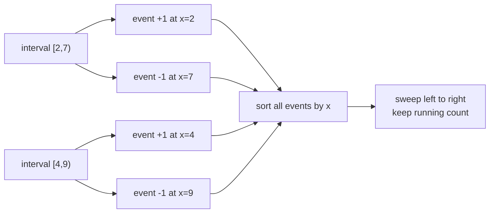
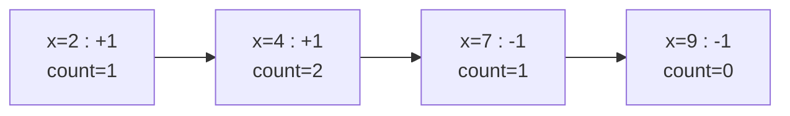
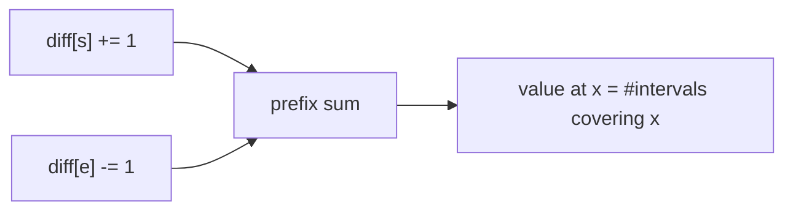
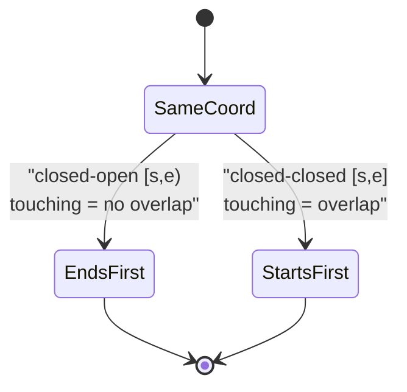
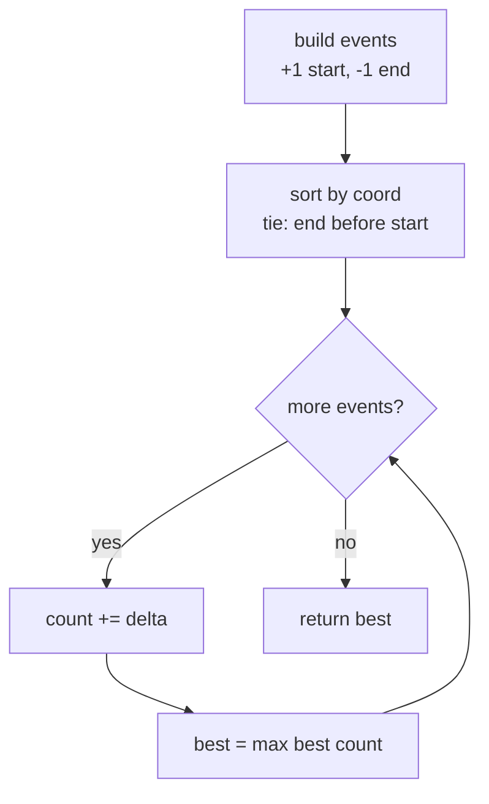
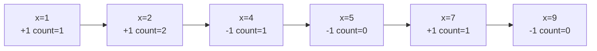
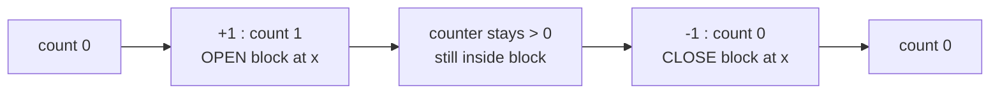
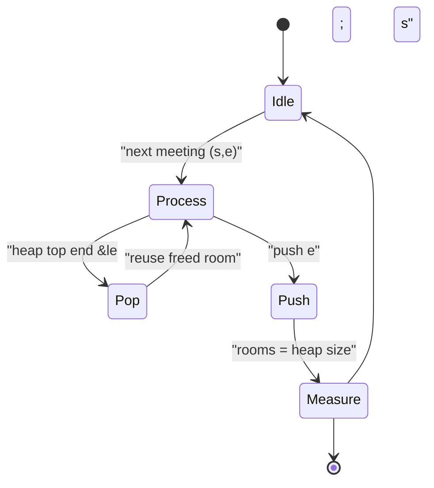
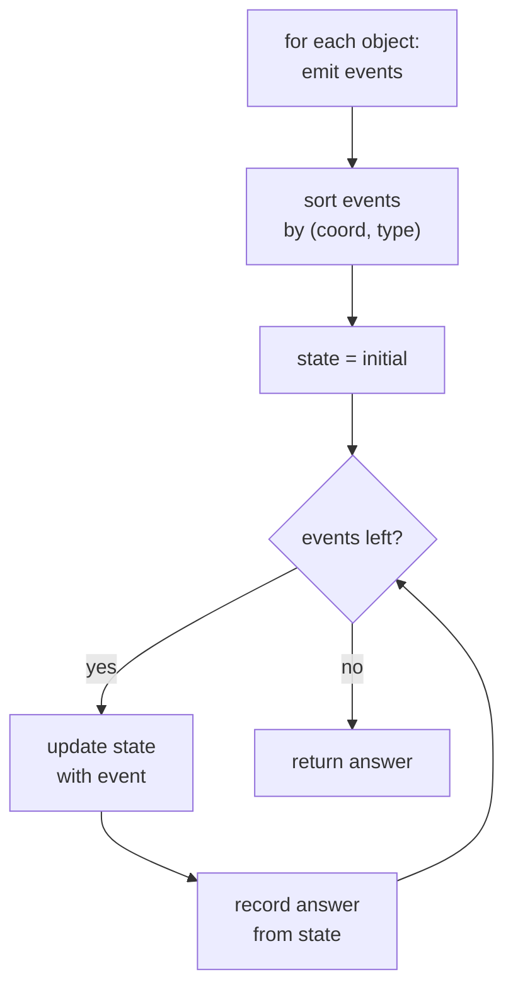

# Sweepline — Events Sorted by Coordinate / Time

> Many problems about intervals, bookings, overlaps, and timelines collapse into a single elegant idea: **turn each object into events, sort the events by coordinate/time, then sweep from left to right** while maintaining a running count or an active set. This is the 1D / timeline cousin of computational-geometry line sweep.

## Table of Contents

- [The Core Sweepline Idea](#the-core-sweepline-idea)
- [The Difference-Array / Prefix-Sum View](#the-difference-array--prefix-sum-view)
- [Tie-Breaking at Equal Coordinates](#tie-breaking-at-equal-coordinates)
- [Maximum Overlap / Minimum Rooms](#maximum-overlap--minimum-rooms)
- [Merging Intervals via Sweep](#merging-intervals-via-sweep)
- [Sweeping with a Balanced Set / Heap](#sweeping-with-a-balanced-set--heap)
- [The General Event-Loop Template](#the-general-event-loop-template)
- [Complexity Summary](#complexity-summary)
- [Common Pitfalls](#common-pitfalls)
- [Patterns](#patterns)

## The Core Sweepline Idea

Take an interval $[s, e)$. It contributes $+1$ to "how many things are active" at its **start** and $-1$ at its **end**. If we explode every interval into two events and walk a virtual cursor along the axis, the running sum at any point equals the number of intervals covering that point.



Place the events on a number line and watch the counter rise and fall:



The maximum value the counter ever reaches is the **maximum overlap**. Formally, with events sorted, the answer is

$$\max_{x} \sum_{i} \big[ s_i \le x \big] - \big[ e_i \le x \big].$$

```python
def max_overlap(intervals):
    events = []
    for s, e in intervals:
        events.append((s, 1))   # start: +1
        events.append((e, -1))  # end:   -1
    events.sort(key=lambda ev: (ev[0], ev[1]))  # ends (-1) before starts (+1) on ties
    cur = best = 0
    for _, delta in events:
        cur += delta
        best = max(best, cur)
    return best
```

```cpp
#include <bits/stdc++.h>
using namespace std;

int maxOverlap(vector<pair<long long,long long>>& intervals) {
    vector<pair<long long,int>> events;
    for (auto& iv : intervals) {
        events.push_back({iv.first, 1});   // start: +1
        events.push_back({iv.second, -1}); // end:   -1
    }
    sort(events.begin(), events.end());     // ends (-1) before starts (+1) on ties
    int cur = 0, best = 0;
    for (auto& ev : events) {
        cur += ev.second;
        best = max(best, cur);
    }
    return best;
}
```

## The Difference-Array / Prefix-Sum View

When coordinates are small integers, you do not even need to sort. Allocate an array `diff`, do `diff[s] += 1` and `diff[e] -= 1`, then take a prefix sum. Index $x$ of the prefix sum equals the active count at $x$ — exactly the swept counter, computed in bulk.



$$\text{cover}(x) = \sum_{k \le x} \text{diff}[k].$$

```python
def coverage(intervals, N):
    diff = [0] * (N + 2)
    for s, e in intervals:
        diff[s] += 1
        diff[e] -= 1          # half-open [s, e)
    cover = [0] * (N + 1)
    run = 0
    for x in range(N + 1):
        run += diff[x]
        cover[x] = run
    return cover
```

```cpp
#include <bits/stdc++.h>
using namespace std;

vector<long long> coverage(vector<pair<int,int>>& intervals, int N) {
    vector<long long> diff(N + 2, 0);
    for (auto& iv : intervals) {
        diff[iv.first] += 1;
        diff[iv.second] -= 1;   // half-open [s, e)
    }
    vector<long long> cover(N + 1, 0);
    long long run = 0;
    for (int x = 0; x <= N; ++x) {
        run += diff[x];
        cover[x] = run;
    }
    return cover;
}
```

The two views are the same algorithm: sorting events is the general $O(n \log n)$ form; the difference array is the $O(\text{range})$ bucket form for small coordinates.

## Tie-Breaking at Equal Coordinates

When a start and an end share the same coordinate, the order you process them changes the answer. This is the single most common bug in sweepline code.



- If intervals are **half-open** $[s, e)$ — meetings that end exactly when another begins do **not** clash — process the **end** ($-1$) **before** the **start** ($+1$). A meeting ending at 10 frees the room before the 10:00 meeting starts.
- If intervals are **closed** $[s, e]$ — touching points count as overlap — process the **start** ($+1$) **before** the **end** ($-1$).

A clean trick: encode the delta in the sort key. With `(coord, delta)` and `delta = -1` for ends, ties naturally put ends first because $-1 < +1$.

```python
def min_rooms(intervals):
    events = []
    for s, e in intervals:
        events.append((s, +1))
        events.append((e, -1))
    # (coord, delta): on equal coord, -1 (end) sorts before +1 (start)
    events.sort()
    cur = best = 0
    for _, delta in events:
        cur += delta
        best = max(best, cur)
    return best
```

```cpp
#include <bits/stdc++.h>
using namespace std;

int minRooms(vector<pair<long long,long long>>& intervals) {
    vector<pair<long long,int>> events;
    for (auto& iv : intervals) {
        events.push_back({iv.first, +1});
        events.push_back({iv.second, -1});
    }
    // (coord, delta): on equal coord, -1 (end) sorts before +1 (start)
    sort(events.begin(), events.end());
    int cur = 0, best = 0;
    for (auto& ev : events) {
        cur += ev.second;
        best = max(best, cur);
    }
    return best;
}
```

## Maximum Overlap / Minimum Rooms

"Minimum number of rooms" equals "maximum number of simultaneously active meetings" equals the peak of the swept counter. The flowchart of the sweep loop:



The counter as a rise/fall sequence for three meetings $[1,4), [2,5), [7,9)$:



Peak is $2$, so two rooms suffice.

```python
def meeting_rooms(intervals):
    events = []
    for s, e in intervals:
        events.append((s, 1))
        events.append((e, -1))
    events.sort()
    cur = best = 0
    for _, d in events:
        cur += d
        if cur > best:
            best = cur
    return best
```

```cpp
#include <bits/stdc++.h>
using namespace std;

int meetingRooms(vector<pair<long long,long long>>& intervals) {
    vector<pair<long long,int>> events;
    for (auto& iv : intervals) {
        events.push_back({iv.first, 1});
        events.push_back({iv.second, -1});
    }
    sort(events.begin(), events.end());
    int cur = 0, best = 0;
    for (auto& ev : events) {
        cur += ev.second;
        if (cur > best) best = cur;
    }
    return best;
}
```

## Merging Intervals via Sweep

To merge overlapping intervals, sweep the same events but remember the cursor where the counter was last zero. Each time the counter **rises from 0**, a new merged block starts; each time it **falls back to 0**, the block closes.



For closed intervals where touching merges, process starts before ends on ties (the opposite of the rooms rule).

```python
def merge(intervals):
    events = []
    for s, e in intervals:
        events.append((s, 1))    # start before end on ties -> touching merges
        events.append((e, -1))
    events.sort(key=lambda ev: (ev[0], -ev[1]))
    res = []
    cur = 0
    start = None
    for x, d in events:
        if cur == 0 and d == 1:
            start = x
        cur += d
        if cur == 0:
            res.append([start, x])
    return res
```

```cpp
#include <bits/stdc++.h>
using namespace std;

vector<pair<long long,long long>> merge(vector<pair<long long,long long>>& intervals) {
    vector<pair<long long,int>> events;
    for (auto& iv : intervals) {
        events.push_back({iv.first, 1});    // start before end on ties -> touching merges
        events.push_back({iv.second, -1});
    }
    sort(events.begin(), events.end(), [](const pair<long long,int>& a, const pair<long long,int>& b){
        if (a.first != b.first) return a.first < b.first;
        return a.second > b.second;          // +1 before -1
    });
    vector<pair<long long,long long>> res;
    int cur = 0;
    long long start = 0;
    for (auto& ev : events) {
        if (cur == 0 && ev.second == 1) start = ev.first;
        cur += ev.second;
        if (cur == 0) res.push_back({start, ev.first});
    }
    return res;
}
```

## Sweeping with a Balanced Set / Heap

When you need more than a count — e.g. "which interval is on top", "the smallest active right endpoint", or "assign a concrete room id" — keep an **active structure** instead of a scalar. A min-heap of end times answers meeting-rooms directly: pop every meeting that has finished before the current start, then push the current end; the heap size is the live room count.



```python
import heapq

def min_rooms_heap(intervals):
    intervals.sort(key=lambda iv: iv[0])  # by start
    heap = []                              # active end times
    best = 0
    for s, e in intervals:
        while heap and heap[0] <= s:       # room freed before this start
            heapq.heappop(heap)
        heapq.heappush(heap, e)
        best = max(best, len(heap))
    return best
```

```cpp
#include <bits/stdc++.h>
using namespace std;

int minRoomsHeap(vector<pair<long long,long long>> intervals) {
    sort(intervals.begin(), intervals.end());  // by start
    priority_queue<long long, vector<long long>, greater<long long>> heap; // active end times
    int best = 0;
    for (auto& iv : intervals) {
        while (!heap.empty() && heap.top() <= iv.first) heap.pop();
        heap.push(iv.second);
        best = max(best, (int)heap.size());
    }
    return best;
}
```

A balanced ordered set (`std::set` / `SortedList`) lets you also query neighbors during the sweep, which is what full 2D geometry line sweep needs.

## The General Event-Loop Template

Almost every sweepline solution fits this skeleton: **build events, sort with a deliberate tie-break, then fold a state through them.**



```python
def sweep(objects, make_events, apply, initial):
    events = []
    for obj in objects:
        events.extend(make_events(obj))
    events.sort()                  # (coord, type, payload)
    state = initial
    answer = None
    for ev in events:
        state, answer = apply(state, ev, answer)
    return answer
```

```cpp
#include <bits/stdc++.h>
using namespace std;

struct Event { long long coord; int type; long long payload; };

template <class State, class Apply>
long long sweep(vector<Event> events, State initial, Apply apply) {
    sort(events.begin(), events.end(), [](const Event& a, const Event& b){
        if (a.coord != b.coord) return a.coord < b.coord;
        return a.type < b.type;
    });
    State state = initial;
    long long answer = 0;
    for (auto& ev : events) answer = apply(state, ev, answer);
    return answer;
}
```

## Complexity Summary

| Technique | Time | Space | Notes |
|---|---|---|---|
| Event sort + scalar counter | $O(n \log n)$ | $O(n)$ | General max-overlap / merge |
| Difference array + prefix sum | $O(n + R)$ | $O(R)$ | $R$ = coordinate range, small ints |
| Min-heap of end times | $O(n \log n)$ | $O(n)$ | Room assignment, richer queries |
| Balanced set sweep | $O(n \log n)$ | $O(n)$ | Neighbor queries, geometry-style |

## Common Pitfalls

- **Wrong tie-break.** Half-open $[s,e)$ needs ends before starts; closed $[s,e]$ needs starts before ends. Decide based on whether touching counts as overlap.
- **Forgetting the half-open convention** when reusing rooms — an end at $x$ should free the room for a start at $x$ only if intervals are half-open.
- **Off-by-one in the difference array.** Use `diff[e] -= 1` for $[s,e)$ and `diff[e+1] -= 1` for the closed range $[s,e]$.
- **Coordinate range too large** for a difference array — fall back to sorting events or coordinate-compress first.
- **Resetting `best` instead of keeping the running max** — track the peak, do not overwrite it.
- **Heap not draining finished meetings** before measuring size, inflating the room count.

## Patterns

- **Max simultaneous / minimum resources** → peak of swept $\pm 1$ counter.
- **Range add, then query coverage** → difference array + prefix sum.
- **Merge / union of intervals** → sweep and cut where the counter returns to 0.
- **Assign concrete ids / nearest neighbor** → sweep with a heap or balanced set.
- **Small integer domain** → bucket with a difference array instead of sorting.
- **Touching = overlap or not** → choose the tie-break consciously; it is the whole correctness story.
