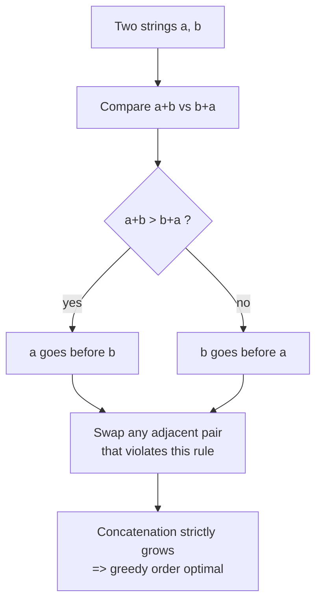
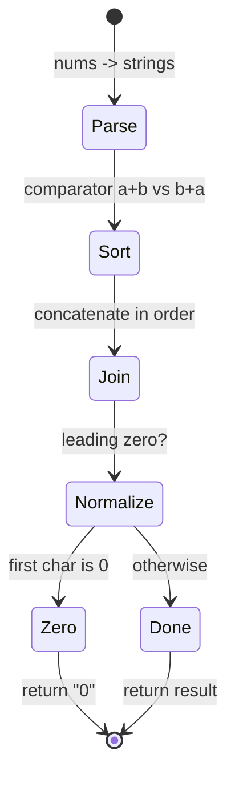

# Largest Number

| Meta | Value |
| --- | --- |
| Problem | Arrange non-negative integers to form the largest concatenated number |
| Source | LeetCode 179 |
| Reference | https://leetcode.com/problems/largest-number/ |
| Difficulty | Medium |
| Topics | Greedy, Sorting, Custom Comparator, Exchange Argument |
| Time | $O(n \log n \cdot L)$ |
| Space | $O(n \cdot L)$ |

## Problem Statement

Given a list of non-negative integers `nums`, arrange them so that they form the **largest** possible number, and return it as a **string** (the result can be huge, so a string is required). If the largest number is zero (all inputs are zero), return `"0"` rather than something like `"00"`.

```text
Example 1
nums = [10, 2]
Best order: "2" then "10" -> "210"
Answer: "210"

Example 2
nums = [3, 30, 34, 5, 9]
Best order: 9, 5, 34, 3, 30 -> "9534330"
Answer: "9534330"

Example 3
nums = [0, 0]
Answer: "0"   (not "00")
```

## Approach (WHY)

We need an order of the string forms $s_1, s_2, \dots, s_n$ so the concatenation $s_1 s_2 \cdots s_n$ is maximal. Sorting by plain numeric or lexicographic value fails: `"3"` vs `"30"` — numerically $3 < 30$, but `"330" > "303"`, so `"3"` should come first.

**The pairwise rule.** For two strings $a$ and $b$, place `a` before `b` iff the concatenation $a \mathbin{+} b$ is **lexicographically greater** than $b \mathbin{+} a$:

$$
a \prec b \iff (a \mathbin{+} b) > (b \mathbin{+} a).
$$

Because all numbers are non-negative and $a + b$ and $b + a$ have the **same length** (sum of the two string lengths), lexicographic comparison equals numeric comparison of those two concatenations — no length bias.

**Exchange-argument justification.** Take any optimal ordering. If it disagrees with our rule, there are two **adjacent** strings $a, b$ (in that order) for which $a + b < b + a$. The total concatenation looks like $P \,a\, b\, Q$ where $P, Q$ are the surrounding prefix/suffix. Swapping $a$ and $b$ changes only the middle from $a b$ to $b a$, and since $b + a > a + b$, the value of $P \,b\, a\, Q$ is **strictly larger** (same prefix $P$, then a larger block). That contradicts optimality. So no adjacent violating pair exists in an optimal order, meaning the greedy sort order **is** optimal. $\blacksquare$

**Why the comparator is valid (transitivity).** A comparator passed to a sort must define a **strict weak ordering**; the subtle requirement is transitivity: if $a \prec b$ and $b \prec c$ then $a \prec c$. Define the order via the real number each string represents in concatenation. Concretely, $a \prec b$ exactly when the infinite repetition $\overline{a} = aaa\ldots$ is greater than $\overline{b} = bbb\ldots$ as a decimal sequence. The key facts:

- $a + b > b + a \iff \overline{a} > \overline{b}$ (comparing the two concatenations is the same as comparing the leading digits of the infinite repetitions).
- The relation "$\overline{a} > \overline{b}$" is a comparison of **real numbers**, which is transitive.

Hence $a \prec b$ and $b \prec c$ give $\overline{a} > \overline{b} > \overline{c}$, so $\overline{a} > \overline{c}$, i.e. $a \prec c$. Transitivity holds, the comparator is a legal strict weak ordering, and `sort` is well-defined. $\blacksquare$



## Solution

```python
from functools import cmp_to_key

def largest_number(nums):
    strs = list(map(str, nums))

    def cmp(a, b):
        if a + b > b + a:
            return -1      # a before b
        if a + b < b + a:
            return 1       # b before a
        return 0

    strs.sort(key=cmp_to_key(cmp))
    result = "".join(strs)
    # Collapse "000...0" to "0".
    if result and result[0] == "0":
        return "0"
    return result
```

```cpp
#include <bits/stdc++.h>
using namespace std;

string largest_number(vector<long long> nums) {
    vector<string> strs;
    for (long long x : nums) strs.push_back(to_string(x));

    sort(strs.begin(), strs.end(), [](const string& a, const string& b) {
        return a + b > b + a;   // a before b when a+b is larger
    });

    string result;
    for (const string& s : strs) result += s;
    // Collapse "000...0" to "0".
    if (!result.empty() && result[0] == '0') return "0";
    return result;
}
```

## Iteration / Trace

Take `nums = [3, 30, 34, 5, 9]` → strings `["3","30","34","5","9"]`.

Pairwise decisions (which of `a+b`, `b+a` is larger) drive the sort:

| Compare a, b | a+b | b+a | Larger | a before b? |
| --- | --- | --- | --- | --- |
| 9, 5 | "95" | "59" | "95" | yes |
| 5, 34 | "534" | "345" | "534" | yes |
| 34, 3 | "343" | "334" | "343" | yes |
| 3, 30 | "330" | "303" | "330" | yes |

Sorted order: `["9", "5", "34", "3", "30"]`. Concatenation → `"9534330"`.



## Complexity

- **Time:** $O(n \log n \cdot L)$, where $L$ is the maximum string length — each comparison concatenates and compares strings of length up to $2L$.
- **Space:** $O(n \cdot L)$ for the string copies and the output.

## Takeaway

The whole problem is a **custom-comparator exchange argument**: place `a` before `b` iff `a + b > b + a`, justified because swapping any adjacent violating pair strictly increases the concatenation. The non-obvious obligation is proving the comparator is **transitive** (a valid strict weak ordering) — done by mapping each string to the real value of its infinite repetition, where `<` is transitive for free. Always remember the all-zeros edge case: return `"0"`, never `"000"`.
