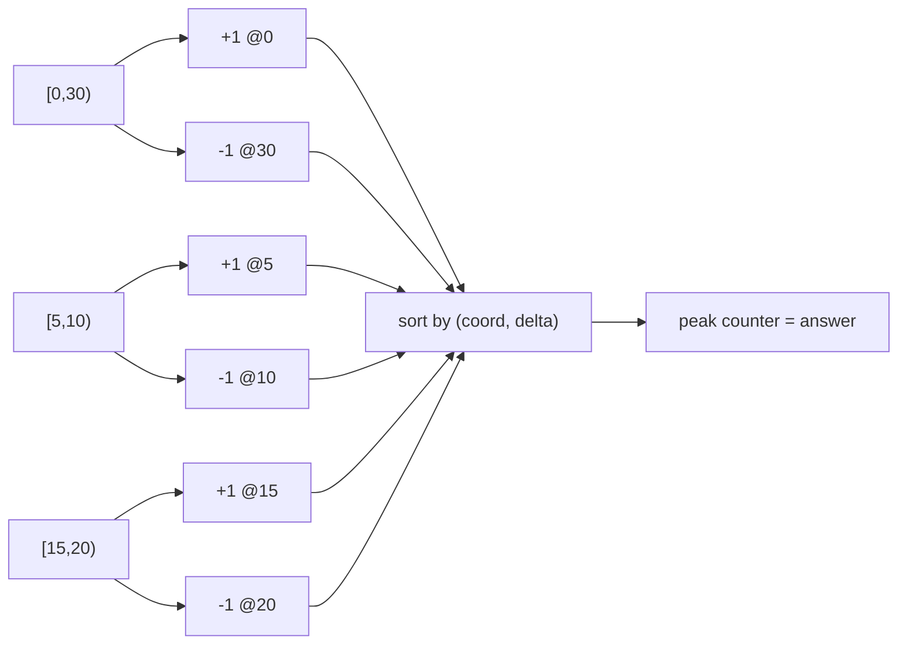
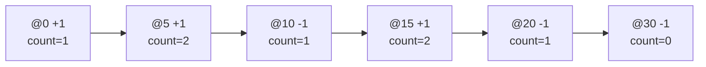

# Meeting Rooms II (Sweepline)

| Meta | Value |
|---|---|
| Source | LeetCode 253 |
| Difficulty | Medium |
| Topic | Sweepline / Events |
| Techniques | Event sort, min-heap |

## Problem Statement

Given an array of meeting time intervals `intervals[i] = [start, end)`, return the **minimum number of conference rooms** required so that no two overlapping meetings share a room.

```text
Input:  intervals = [[0,30],[5,10],[15,20]]
Output: 2
Explanation:
  Meeting [0,30) overlaps [5,10) and [15,20).
  At time 5, meetings [0,30) and [5,10) are both live -> 2 rooms.
```

## Approach (WHY)

The minimum number of rooms equals the **maximum number of meetings live at the same instant** — the peak of the sweepline counter. Explode each meeting into a `+1` start event and a `-1` end event, sort by coordinate, and the running sum at any point is the number of live meetings.

Because intervals are **half-open** $[s, e)$, a meeting ending at time $t$ frees its room for a meeting starting at $t$. So on a tie we must process the **end before the start**. Encoding ends as $-1$ and starts as $+1$ and sorting `(coord, delta)` does this automatically since $-1 < +1$.

$$\text{rooms} = \max_{t} \big( \#\{\text{started by } t\} - \#\{\text{ended by } t\} \big).$$



```python
def minMeetingRooms(intervals):
    events = []
    for s, e in intervals:
        events.append((s, 1))    # start: +1
        events.append((e, -1))   # end:   -1 (sorts before +1 on ties)
    events.sort()
    cur = best = 0
    for _, delta in events:
        cur += delta
        best = max(best, cur)
    return best
```

```cpp
#include <bits/stdc++.h>
using namespace std;

int minMeetingRooms(vector<pair<long long,long long>>& intervals) {
    vector<pair<long long,int>> events;
    for (auto& iv : intervals) {
        events.push_back({iv.first, 1});    // start: +1
        events.push_back({iv.second, -1});  // end:   -1 (sorts before +1 on ties)
    }
    sort(events.begin(), events.end());
    int cur = 0, best = 0;
    for (auto& ev : events) {
        cur += ev.second;
        best = max(best, cur);
    }
    return best;
}
```

An equivalent **min-heap** formulation sorts meetings by start, keeps active end times in a heap, and pops every meeting that finished before the current start; the heap size is the live room count.

```python
import heapq

def minMeetingRoomsHeap(intervals):
    intervals.sort(key=lambda iv: iv[0])
    heap = []                                  # active end times
    best = 0
    for s, e in intervals:
        while heap and heap[0] <= s:           # half-open: end == start frees room
            heapq.heappop(heap)
        heapq.heappush(heap, e)
        best = max(best, len(heap))
    return best
```

```cpp
#include <bits/stdc++.h>
using namespace std;

int minMeetingRoomsHeap(vector<pair<long long,long long>> intervals) {
    sort(intervals.begin(), intervals.end());
    priority_queue<long long, vector<long long>, greater<long long>> heap; // active end times
    int best = 0;
    for (auto& iv : intervals) {
        while (!heap.empty() && heap.top() <= iv.first) heap.pop(); // end == start frees room
        heap.push(iv.second);
        best = max(best, (int)heap.size());
    }
    return best;
}
```

## Trace

For `[[0,30],[5,10],[15,20]]` the sorted event list and running counter:

```text
event        delta  count
(0,  +1)      +1      1
(5,  +1)      +1      2   <- peak
(10, -1)      -1      1
(15, +1)      +1      2   <- peak
(20, -1)      -1      1
(30, -1)      -1      0
answer = 2
```



## Complexity

- **Time:** $O(n \log n)$ to sort the $2n$ events (or the meetings for the heap variant).
- **Space:** $O(n)$ for the events / heap.

## Takeaway

Minimum rooms = maximum concurrent meetings = peak of the $\pm 1$ sweep counter. With half-open intervals, sort ends before starts so a meeting ending at $t$ frees the room for one starting at $t$.
