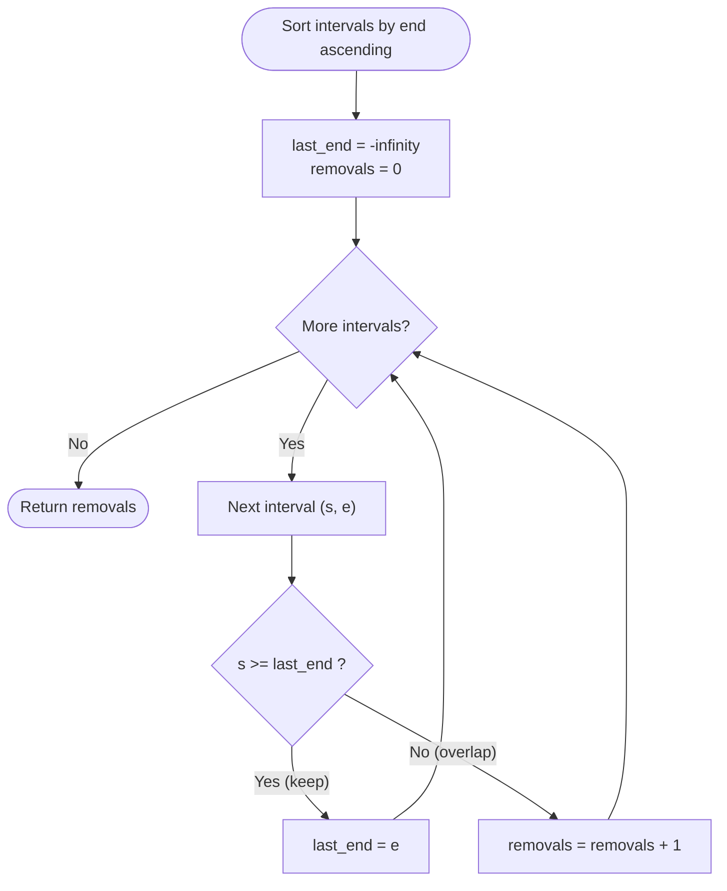

# Non-overlapping Intervals

| Meta | Value |
|------|-------|
| Problem | Non-overlapping Intervals |
| Source | LeetCode #435 |
| Reference | https://leetcode.com/problems/non-overlapping-intervals/ |
| Difficulty | Medium |
| Topics | Greedy, Interval Scheduling, Sorting |
| Time | $O(n \log n)$ |
| Space | $O(1)$ extra (besides sort) |

---

## Problem Statement

Given an array `intervals` where `intervals[i] = [start_i, end_i]`, return the **minimum number of
intervals you need to remove** to make the rest **non-overlapping**. Intervals that only **touch** at
an endpoint (e.g. `[1,2]` and `[2,3]`) are considered non-overlapping.

```text
Example 1:
Input:  intervals = [[1,2],[2,3],[3,4],[1,3]]
Output: 1
Why:    Remove [1,3]; the remaining [1,2],[2,3],[3,4] are non-overlapping.

Example 2:
Input:  intervals = [[1,2],[1,2],[1,2]]
Output: 2
Why:    Keep one [1,2], remove the other two.

Example 3:
Input:  intervals = [[1,2],[2,3]]
Output: 0
Why:    Touching at endpoint 2 does not count as overlap.
```

---

## Approach (WHY)

This is the **dual** of activity selection. If $n$ is the total number of intervals and $k$ is the
**maximum** number we can keep mutually non-overlapping, then the minimum removals is

$$
\text{answer} = n - k.
$$

To maximize $k$ we use the **earliest-finish-time** greedy: sort by end coordinate, then sweep,
keeping an interval whenever its start is at or after the last kept end.

**Why earliest finish is optimal — exchange argument.** Let $g$ be the interval with the smallest
end. Suppose some optimal kept-set $O$ does not start with $g$; let $a$ be its first interval. Since
$f_g \le f_a$, replacing $a$ with $g$ keeps every later interval compatible (they all start at or
after $f_a \ge f_g$) and preserves $|O|$. So an optimal solution containing $g$ exists; recurse on
the intervals starting at or after $f_g$. Hence greedy keeps a maximum set, and $n-k$ is minimal.

We track removals directly: whenever the next interval overlaps the last kept one
($s &lt; \text{last\_end}$), we drop it.



```python
def eraseOverlapIntervals(intervals):
    if not intervals:
        return 0
    intervals.sort(key=lambda iv: iv[1])     # sort by end
    removals = 0
    last_end = float("-inf")
    for s, e in intervals:
        if s >= last_end:
            last_end = e                     # keep this interval
        else:
            removals += 1                    # overlaps -> remove it
    return removals
```

```cpp
#include <bits/stdc++.h>
using namespace std;

int eraseOverlapIntervals(vector<vector<int>>& intervals) {
    if (intervals.empty()) return 0;
    sort(intervals.begin(), intervals.end(),
         [](const vector<int>& a, const vector<int>& b){ return a[1] < b[1]; });
    int removals = 0;
    long long lastEnd = LLONG_MIN;
    for (const auto& iv : intervals) {
        if (iv[0] >= lastEnd) {
            lastEnd = iv[1];                 // keep this interval
        } else {
            ++removals;                      // overlaps -> remove it
        }
    }
    return removals;
}
```

---

## Trace

Input: `[[1,2],[2,3],[3,4],[1,3]]`. After sorting by end:
`[[1,2],[1,3],[2,3],[3,4]]`.

| Step | Interval | `last_end` before | `s >= last_end`? | Action | removals |
|------|----------|-------------------|------------------|--------|----------|
| 1 | `[1,2]` | $-\infty$ | yes | keep, `last_end=2` | 0 |
| 2 | `[1,3]` | 2 | `1 >= 2`? no | remove | 1 |
| 3 | `[2,3]` | 2 | `2 >= 2`? yes | keep, `last_end=3` | 1 |
| 4 | `[3,4]` | 3 | `3 >= 3`? yes | keep, `last_end=4` | 1 |

Answer: **1**.

```mermaid
gantt
    title Sorted by End - Kept vs Removed
    dateFormat X
    axisFormat %s
    section Kept
    keep_1_2 :k1, 1, 2
    keep_2_3 :k2, 2, 3
    keep_3_4 :k3, 3, 4
    section Removed
    rem_1_3 :r1, 1, 3
```



---

## Complexity

- **Time:** $O(n \log n)$ — dominated by the sort; the sweep is $O(n)$.
- **Space:** $O(1)$ auxiliary beyond the in-place sort (or $O(n)$ if the sort copies).

---

## Takeaway

Minimum removals to de-overlap is just **total minus the maximum compatible set**, and the maximum
compatible set is found by the **earliest-finish-time greedy**. Use `s >= last_end` because touching
endpoints are allowed; counting removals inline avoids a second pass.
