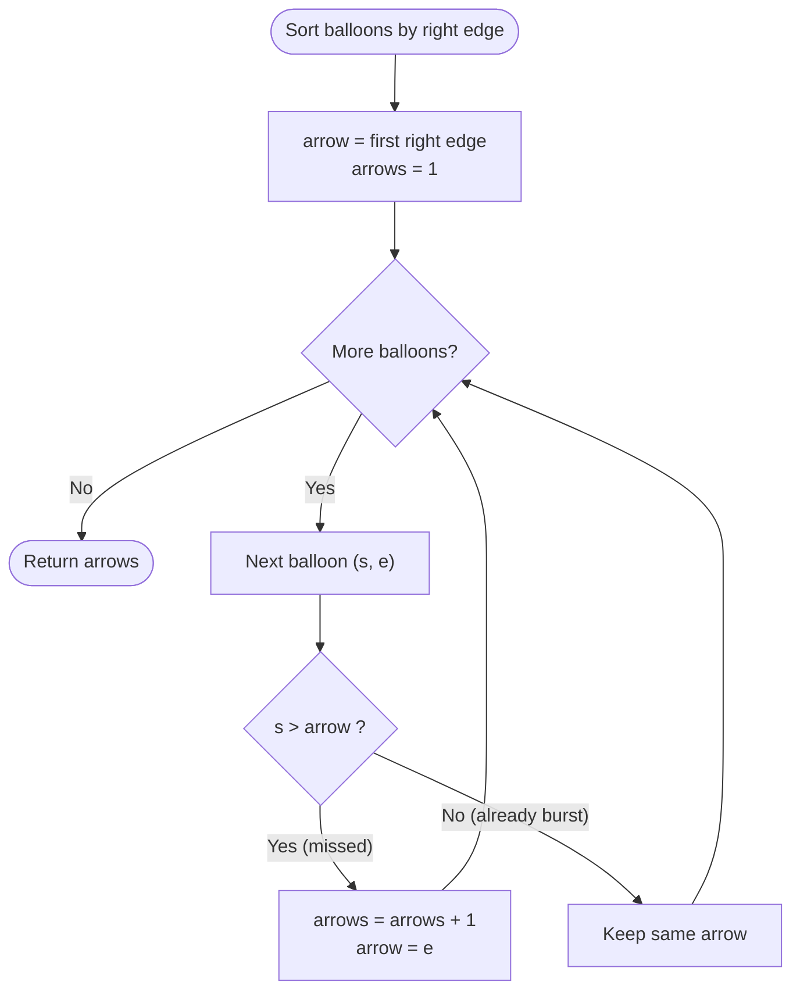

# Minimum Number of Arrows to Burst Balloons

| Meta | Value |
|------|-------|
| Problem | Minimum Number of Arrows to Burst Balloons |
| Source | LeetCode #452 |
| Reference | https://leetcode.com/problems/minimum-number-of-arrows-to-burst-balloons/ |
| Difficulty | Medium |
| Topics | Greedy, Interval Point Cover, Sorting |
| Time | $O(n \log n)$ |
| Space | $O(1)$ extra (besides sort) |

---

## Problem Statement

There are balloons taped to a wall, each given as a horizontal interval `points[i] = [x_start, x_end]`.
An arrow shot straight up at coordinate $x$ bursts a balloon `[x_start, x_end]` if
$x\_start \le x \le x\_end$. Arrows travel infinitely upward once fired. Return the **minimum number
of arrows** needed to burst **all** balloons. A balloon whose edge touches the arrow ($x = x\_start$
or $x = x\_end$) is burst.

```text
Example 1:
Input:  points = [[10,16],[2,8],[1,6],[7,12]]
Output: 2
Why:    Arrow at x=6 bursts [2,8],[1,6]; arrow at x=12 bursts [10,16],[7,12].

Example 2:
Input:  points = [[1,2],[3,4],[5,6],[7,8]]
Output: 4
Why:    No two balloons overlap, so each needs its own arrow.

Example 3:
Input:  points = [[1,2],[2,3],[3,4],[4,5]]
Output: 2
Why:    Arrow at x=2 bursts [1,2],[2,3]; arrow at x=4 bursts [3,4],[4,5].
```

---

## Approach (WHY)

This is an **interval point-cover** problem: place the fewest points so that every interval contains
at least one point. The greedy: **sort by right edge**, fire an arrow at the current right edge, and
let it burst every following balloon whose start is $\le$ that arrow. The first balloon not covered
forces a new arrow at *its* right edge.

If a chosen arrow sits at the smallest right edge $f$, it bursts **every** balloon whose interval
contains $f$ — and since it's the smallest right edge among the remaining, no balloon that contains
$f$ is "wasted".

**Why the smallest right edge is optimal — exchange argument.** Consider the balloon $g$ with the
smallest right edge $f_g$. Some arrow must hit $g$, and that arrow's $x$ satisfies $x \le f_g$. Moving
that arrow to exactly $x = f_g$ can only **add** coverage (it still hits $g$, and any balloon with
$start \le f_g \le end$ stays hit), never removes it. So an optimal solution that shoots at $f_g$
exists; remove all balloons it bursts and recurse. Hence the greedy arrow count is minimal.

Use a **strict** comparison `start > arrow`: a balloon whose start equals the arrow is still burst
(touching counts), so it should *not* trigger a new arrow.



```python
def findMinArrowShots(points):
    if not points:
        return 0
    points.sort(key=lambda p: p[1])          # sort by right edge
    arrows = 1
    arrow = points[0][1]
    for s, e in points[1:]:
        if s > arrow:                        # this balloon escaped the current arrow
            arrows += 1
            arrow = e
    return arrows
```

```cpp
#include <bits/stdc++.h>
using namespace std;

int findMinArrowShots(vector<vector<int>>& points) {
    if (points.empty()) return 0;
    sort(points.begin(), points.end(),
         [](const vector<int>& a, const vector<int>& b){ return a[1] < b[1]; });
    int arrows = 1;
    long long arrow = points[0][1];
    for (size_t i = 1; i < points.size(); ++i) {
        if (points[i][0] > arrow) {          // this balloon escaped the current arrow
            ++arrows;
            arrow = points[i][1];
        }
    }
    return arrows;
}
```

---

## Trace

Input: `[[10,16],[2,8],[1,6],[7,12]]`. After sorting by right edge:
`[[1,6],[2,8],[7,12],[10,16]]`.

| Step | Balloon | `arrow` before | `s > arrow`? | Action | arrows |
|------|---------|----------------|--------------|--------|--------|
| init | `[1,6]` | — | — | fire `arrow=6` | 1 |
| 1 | `[2,8]` | 6 | `2 > 6`? no | burst by arrow 6 | 1 |
| 2 | `[7,12]` | 6 | `7 > 6`? yes | fire `arrow=12` | 2 |
| 3 | `[10,16]` | 12 | `10 > 12`? no | burst by arrow 12 | 2 |

Answer: **2**.

```mermaid
gantt
    title Sorted by Right Edge - Arrow Groups
    dateFormat X
    axisFormat %s
    section Arrow at 6
    b_1_6 :a1, 1, 6
    b_2_8 :a2, 2, 8
    section Arrow at 12
    b_7_12 :a3, 7, 12
    b_10_16 :a4, 10, 16
```



---

## Complexity

- **Time:** $O(n \log n)$ — the sort dominates; the sweep is $O(n)$.
- **Space:** $O(1)$ auxiliary beyond the in-place sort.

---

## Takeaway

Minimum arrows = minimum points to stab all intervals = **maximum number of pairwise-disjoint
intervals**. Sort by **right edge**, shoot at it, and only open a new arrow when the next balloon's
start strictly exceeds the current arrow. Watch the `>` vs `>=`: touching balloons share an arrow.
Use `long long` for the arrow coordinate to dodge overflow on extreme inputs.
