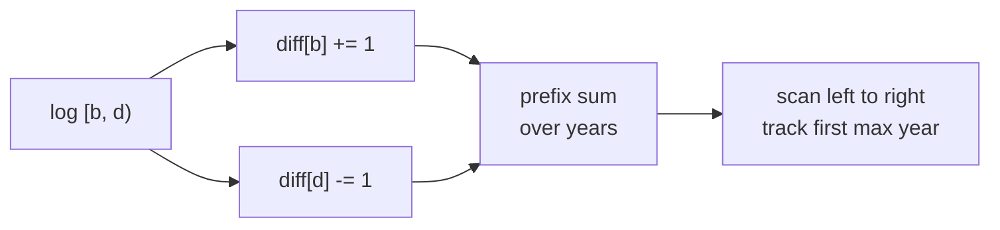
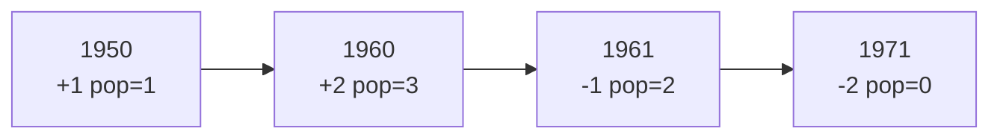

# Maximum Population Year (Difference-Array Sweep)

| Meta | Value |
|---|---|
| Source | LeetCode 1854 |
| Difficulty | Easy |
| Topic | Sweepline / Difference Array |
| Techniques | Difference array, prefix sum |

## Problem Statement

You are given `logs` where `logs[i] = [birth, death]` means a person is alive in the half-open year range `[birth, death)`. The **population** of a year is the number of people alive that year. Return the **earliest year** with the maximum population.

```text
Input:  logs = [[1993,1999],[2000,2008],[1950,1973]]
Output: 1960
Explanation:
  Years 1950..1972 have population 1 (third person).
  No year has more than 1 alive, earliest such year is 1950... 
  but max population across all is 1, earliest is 1950.
```

```text
Input:  logs = [[1950,1961],[1960,1971],[1960,1971]]
Output: 1960
Explanation:
  1960 and 1970-... : at 1960 three ranges? [1950,1961) covers 1960,
  both [1960,1971) cover 1960 -> population 3, the maximum.
```

## Approach (WHY)

Years are small integers (years $1950 \le y < 2050$), so we do not need to sort events — we **bucket** them in a difference array. A birth adds $+1$ at `birth`; a death subtracts $1$ at `death` (half-open, so the death year is the first year **not** alive). A prefix sum over the array reconstructs the population per year — exactly the swept counter, computed in bulk.

$$\text{pop}(y) = \sum_{k \le y} \text{diff}[k], \qquad \text{diff}[\text{birth}] {+}{=} 1,\ \text{diff}[\text{death}] {-}{=} 1.$$

Scanning the prefix sum left to right and keeping the first year that hits the max gives the **earliest** answer for free.



```python
def maximumPopulation(logs):
    diff = [0] * 2051            # years up to 2050
    for birth, death in logs:
        diff[birth] += 1
        diff[death] -= 1        # half-open [birth, death)
    best_year, best_pop, run = 0, 0, 0
    for year in range(1950, 2051):
        run += diff[year]
        if run > best_pop:
            best_pop = run
            best_year = year
    return best_year
```

```cpp
#include <bits/stdc++.h>
using namespace std;

int maximumPopulation(vector<pair<int,int>>& logs) {
    vector<long long> diff(2052, 0);          // years up to 2050
    for (auto& lg : logs) {
        diff[lg.first] += 1;
        diff[lg.second] -= 1;                 // half-open [birth, death)
    }
    int bestYear = 0;
    long long bestPop = 0, run = 0;
    for (int year = 1950; year <= 2050; ++year) {
        run += diff[year];
        if (run > bestPop) {
            bestPop = run;
            bestYear = year;
        }
    }
    return bestYear;
}
```

## Trace

For `[[1950,1961],[1960,1971],[1960,1971]]`, the relevant diff entries and the prefix-sum population:

```text
diff[1950] = +1
diff[1960] = +2   (two births)
diff[1961] = -1
diff[1971] = -2

year   delta  population
1950    +1       1
...     0        1
1960    +2       3   <- max, first seen here
1961    -1       2
...     0        2
1971    -2       0
answer = 1960
```



## Complexity

- **Time:** $O(n + R)$ where $n$ is the number of logs and $R \approx 100$ is the year range.
- **Space:** $O(R)$ for the difference array.

## Takeaway

When coordinates are small integers, skip sorting events: bump a difference array at births and deaths, take a prefix sum, and scan once. Tracking the **first** year that reaches the maximum yields the earliest answer automatically.
