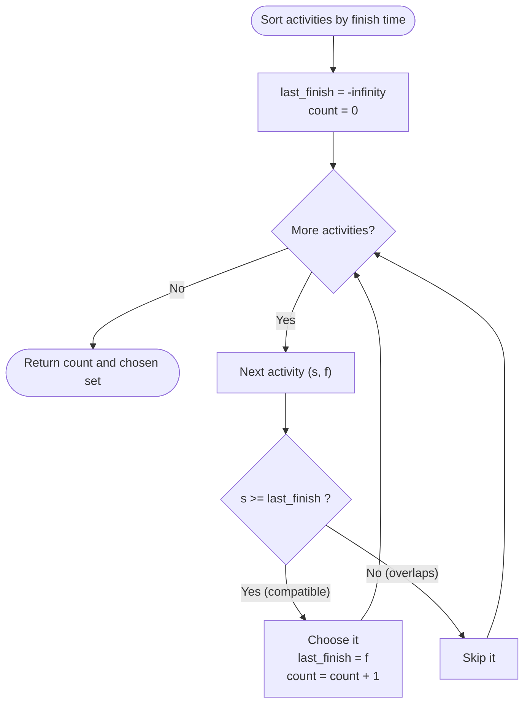

# Activity Selection (Maximum Count)

| Meta | Value |
|------|-------|
| Problem | Activity Selection — choose the most non-overlapping activities |
| Source | Classic (CLRS Ch. 16, GeeksforGeeks) |
| Reference | https://en.wikipedia.org/wiki/Activity_selection_problem |
| Difficulty | Easy–Medium |
| Topics | Greedy, Interval Scheduling, Sorting |
| Time | $O(n \log n)$ |
| Space | $O(1)$ extra (or $O(n)$ to return the chosen set) |

---

## Problem Statement

You are given $n$ activities, where activity $i$ has a start time $s_i$ and a finish time $f_i$ with
$s_i &lt; f_i$. Only one activity can occupy the single shared resource at any moment. Two activities
are **compatible** if they do not overlap in time; touching at an endpoint ($f_i = s_j$) is allowed.
Select a **maximum-size** set of mutually compatible activities, and report both the count and the
chosen activities.

```text
Example:
Input:  starts  = [1, 3, 0, 5, 3, 5, 6, 8, 8, 2, 12]
        finishes = [4, 5, 6, 7, 9, 9, 10, 11, 12, 14, 16]
Output: count = 4, chosen = [(1,4), (5,7), (8,11), (12,16)]
Why:    These four never overlap; no set of 5 compatible activities exists.
```

---

## Approach (WHY)

**Greedy rule: always pick the compatible activity that finishes earliest.** Sort all activities by
finish time, then sweep once, keeping an activity whenever its start is at or after the finish of the
last kept activity.

Finishing as early as possible leaves the **largest remaining window** for future choices, so the
earliest-finishing activity is never a worse first commitment than any alternative.

**Why it is optimal — exchange argument.** Let $g$ be the activity with the smallest finish time, and
let $O$ be any optimal solution sorted by finish, with first activity $a$. Since $f_g \le f_a$, the
set $O' = (O \setminus \{a\}) \cup \{g\}$ is still compatible — every activity after $a$ starts at or
after $f_a \ge f_g$ — and $|O'| = |O|$. Thus there is an optimal solution containing $g$. Remove $g$
and the activities overlapping it, then recurse; the same argument applies. Therefore the greedy set
is maximum. Equivalently, **greedy stays ahead**: after $k$ picks its $k$-th finish time is no later
than any optimal solution's $k$-th finish time,

$$
f^{greedy}_k \le f^{opt}_k,
$$

so greedy can never be forced to stop earlier than the optimum.



```python
def activity_selection(starts, finishes):
    activities = sorted(zip(starts, finishes), key=lambda iv: iv[1])  # by finish
    count = 0
    last_finish = float("-inf")
    chosen = []
    for s, f in activities:
        if s >= last_finish:               # compatible with the last pick
            chosen.append((s, f))
            last_finish = f
            count += 1
    return count, chosen
```

```cpp
#include <bits/stdc++.h>
using namespace std;

pair<int, vector<pair<long long,long long>>>
activitySelection(vector<long long> starts, vector<long long> finishes) {
    int n = (int)starts.size();
    vector<pair<long long,long long>> activities(n);
    for (int i = 0; i < n; ++i) activities[i] = {starts[i], finishes[i]};
    sort(activities.begin(), activities.end(),
         [](const auto& a, const auto& b){ return a.second < b.second; });  // by finish
    int count = 0;
    long long lastFinish = LLONG_MIN;
    vector<pair<long long,long long>> chosen;
    for (const auto& iv : activities) {
        if (iv.first >= lastFinish) {       // compatible with the last pick
            chosen.push_back(iv);
            lastFinish = iv.second;
            ++count;
        }
    }
    return {count, chosen};
}
```

---

## Trace

After sorting the example by finish time:
`(1,4),(3,5),(0,6),(5,7),(3,9),(5,9),(6,10),(8,11),(8,12),(2,14),(12,16)`.

| Activity | `last_finish` before | `s >= last_finish`? | Action | chosen so far |
|----------|----------------------|---------------------|--------|---------------|
| `(1,4)`  | $-\infty$ | yes | pick, `last_finish=4` | `(1,4)` |
| `(3,5)`  | 4 | `3>=4`? no | skip | `(1,4)` |
| `(0,6)`  | 4 | `0>=4`? no | skip | `(1,4)` |
| `(5,7)`  | 4 | `5>=4`? yes | pick, `last_finish=7` | `(1,4),(5,7)` |
| `(3,9)`  | 7 | `3>=7`? no | skip | … |
| `(5,9)`  | 7 | `5>=7`? no | skip | … |
| `(6,10)` | 7 | `6>=7`? no | skip | … |
| `(8,11)` | 7 | `8>=7`? yes | pick, `last_finish=11` | `…,(8,11)` |
| `(8,12)` | 11 | `8>=11`? no | skip | … |
| `(2,14)` | 11 | `2>=11`? no | skip | … |
| `(12,16)`| 11 | `12>=11`? yes | pick, `last_finish=16` | `…,(12,16)` |

Result: count **4**, chosen `(1,4),(5,7),(8,11),(12,16)`.

```mermaid
gantt
    title Chosen (Selected) vs Rejected Activities
    dateFormat X
    axisFormat %s
    section Selected
    s_1_4   :done, c1, 1, 4
    s_5_7   :done, c2, 5, 7
    s_8_11  :done, c3, 8, 11
    s_12_16 :done, c4, 12, 16
    section Rejected
    r_3_5   :a1, 3, 5
    r_0_6   :a2, 0, 6
    r_3_9   :a3, 3, 9
    r_5_9   :a4, 5, 9
    r_6_10  :a5, 6, 10
    r_8_12  :a6, 8, 12
    r_2_14  :a7, 2, 14
```



---

## Complexity

- **Time:** $O(n \log n)$ — sorting by finish time dominates; the greedy sweep is $O(n)$.
- **Space:** $O(1)$ auxiliary if only the count is needed, or $O(n)$ to store the chosen activities.

---

## Takeaway

Activity selection is the canonical greedy proof: **sort by finish time, sweep once, keep whatever
starts at or after the last finish.** The earliest-finish choice is justified by an exchange
argument, and the same skeleton powers max non-overlapping intervals, minimum removals, and interval
point-cover problems. Remember: this works because activities are **unweighted** — add weights and you
must switch to dynamic programming.
