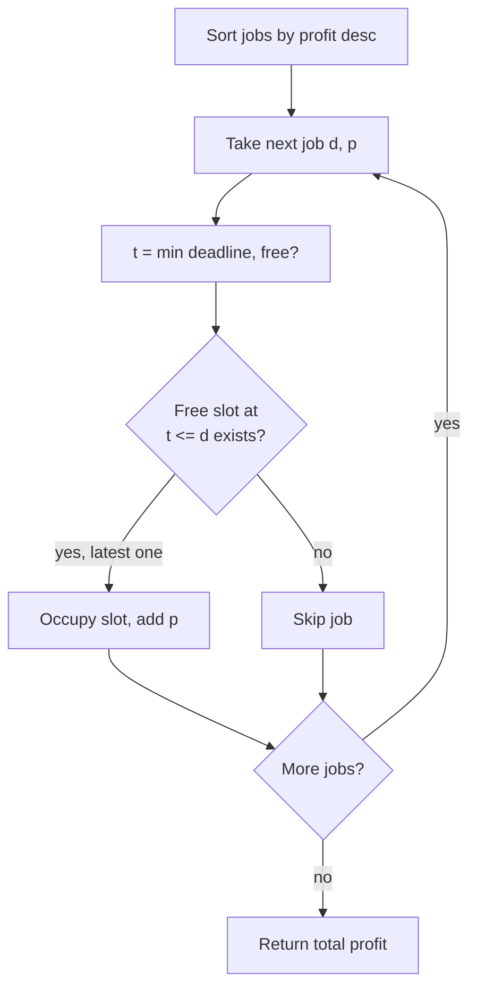
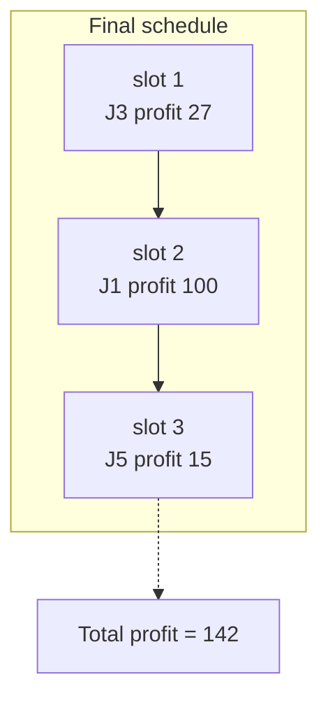

# Job Sequencing With Deadlines

| Meta | Value |
| --- | --- |
| Problem | Schedule unit-time jobs with deadlines on one machine to maximize total profit |
| Source | Classic (GfG / standard greedy) |
| Reference | Self-contained |
| Difficulty | Medium |
| Topics | Greedy, Sorting, Scheduling, Exchange Argument |
| Time | $O(n \log n + n \cdot D)$ naive slots |
| Space | $O(D)$ |

## Problem Statement

You are given $n$ jobs. Job $i$ has a **deadline** $d_i$ (an integer ≥ 1) and a **profit** $p_i$. Each job takes exactly **one unit of time**, and only **one job** can run at a time on a single machine. Time slots are $1, 2, 3, \dots$. A job earns its profit **only if it is scheduled in some slot $t$ with $t \le d_i$**. Choose which jobs to run and in which slots to **maximize total profit**.

```text
Example
jobs (deadline, profit):
  J1 = (deadline 2, profit 100)
  J2 = (deadline 1, profit 19)
  J3 = (deadline 2, profit 27)
  J4 = (deadline 1, profit 25)
  J5 = (deadline 3, profit 15)

Greedy by profit desc: J1(100), J3(27), J4(25), J5(15), J2(19->already)
Place each in the LATEST free slot <= deadline:
  J1 -> slot 2     (profit 100)
  J3 -> slot 1     (profit 27, slot 2 taken)
  J4 -> deadline 1, slot 1 taken -> skip
  J5 -> slot 3     (profit 15)
  J2 -> deadline 1, slot 1 taken -> skip
Scheduled: slot1=J3, slot2=J1, slot3=J5
Total profit = 100 + 27 + 15 = 142
```

## Approach (WHY)

**Greedy.** Sort jobs by **profit descending**. Process them in that order; for each job place it in the **latest still-free slot** at or before its deadline. If no such slot exists, drop the job.

Two design decisions need justification — *which job to prefer* and *which slot to use*.

**Exchange argument 1 — prefer higher profit.** Suppose an optimal schedule $O$ omits a job $a$ but includes a job $b$ with $p_b < p_a$, and $a$ could have occupied $b$'s slot (or any free slot ≤ $d_a$). Replace $b$ by $a$ in that slot. Feasibility is preserved (the slot is ≤ $a$'s deadline), and the profit changes by

$$
\Delta = p_a - p_b > 0,
$$

so the schedule improves — contradicting optimality. Hence there is always an optimal schedule that prefers the higher-profit job whenever both can fit. Processing in profit-descending order realizes this.

**Exchange argument 2 — place as late as possible.** When inserting a job, choosing the **latest** free slot $\le d_i$ (instead of an earlier one) never reduces future options: any later job that needed an earlier slot still has it free, while a job needing a late slot would have been blocked anyway. Formally, if an optimal schedule places job $i$ in slot $t$ but an earlier slot $t' < t$ ($t' \le d_i$) is free, leaving the earlier slot open can only help tighter-deadline jobs; swapping $i$ to the later slot never loses feasibility and never loses profit. So "latest free slot" dominates.

Combining both arguments, the greedy schedule is optimal. $\blacksquare$

$$
\text{Maximize} \quad \sum_{i \in \text{scheduled}} p_i
\quad \text{s.t. each chosen job } i \text{ occupies a distinct slot } t_i \le d_i.
$$



## Solution

```python
def job_sequencing(jobs):
    # jobs: list of (deadline, profit). Maximize total profit.
    jobs = sorted(jobs, key=lambda j: j[1], reverse=True)   # profit desc
    max_deadline = max(d for d, _ in jobs)
    slots = [None] * (max_deadline + 1)   # slots[1..max_deadline]
    total = 0
    scheduled = 0
    for d, p in jobs:
        t = min(d, max_deadline)
        while t > 0 and slots[t] is not None:
            t -= 1                         # walk back to latest free slot
        if t > 0:
            slots[t] = (d, p)
            total += p
            scheduled += 1
    return total, scheduled
```

```cpp
#include <bits/stdc++.h>
using namespace std;

pair<long long,long long> job_sequencing(vector<pair<long long,long long>> jobs) {
    // jobs: (deadline, profit). Maximize total profit.
    sort(jobs.begin(), jobs.end(), [](const pair<long long,long long>& a,
                                      const pair<long long,long long>& b) {
        return a.second > b.second;        // profit descending
    });
    long long max_deadline = 0;
    for (auto& j : jobs) max_deadline = max(max_deadline, j.first);
    vector<bool> used(max_deadline + 1, false);  // used[1..max_deadline]
    long long total = 0, scheduled = 0;
    for (auto& j : jobs) {
        long long t = min(j.first, max_deadline);
        while (t > 0 && used[t]) t--;       // latest free slot <= deadline
        if (t > 0) {
            used[t] = true;
            total += j.second;
            scheduled++;
        }
    }
    return {total, scheduled};
}
```

## Iteration / Trace

Jobs (deadline, profit): `(2,100), (1,19), (2,27), (1,25), (3,15)`. Sorted by profit desc: `(2,100), (2,27), (1,25), (1,19), (3,15)`. `max_deadline = 3`, slots indexed `1..3`.

| Job (d, p) | start t = min(d, 3) | walk back to | placed? | slot taken | total |
| --- | --- | --- | --- | --- | --- |
| (2, 100) | 2 | 2 (free) | yes | 2 | 100 |
| (2, 27) | 2 → 1 | 1 (free) | yes | 1 | 127 |
| (1, 25) | 1 | 1 taken → 0 | no | — | 127 |
| (1, 19) | 1 | 1 taken → 0 | no | — | 127 |
| (3, 15) | 3 | 3 (free) | yes | 3 | 142 |

Final slots: `1 = (2,27)`, `2 = (2,100)`, `3 = (3,15)`. Total profit **142**, jobs scheduled **3**.



## Complexity

- **Time:** $O(n \log n)$ to sort, plus $O(n \cdot D)$ for the naive backward slot scan where $D$ is the maximum deadline. A disjoint-set-union "find next free slot" structure reduces the scheduling phase to $O(n \log n)$ (near-$O(n \,\alpha)$).
- **Space:** $O(D)$ for the slot array.

## Takeaway

Job sequencing is a **two-part exchange argument**: (1) prefer the higher-profit job whenever both fit, because swapping in the richer job changes profit by $p_a - p_b > 0$; and (2) schedule each accepted job in the **latest** free slot $\le$ its deadline, because that preserves earlier slots for tighter-deadline jobs. Sort by profit descending, place greedily from the back, and you maximize total profit. Swap a naive backward scan for union-find when deadlines are large.
