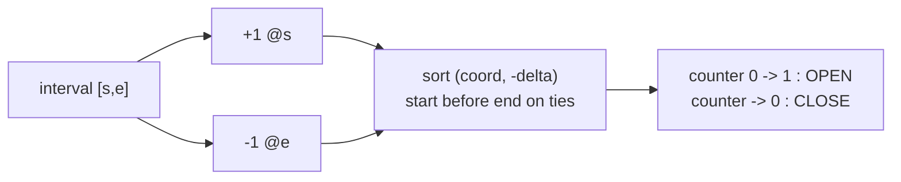
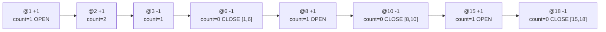

# Merge Overlapping Intervals (Sweepline)

| Meta | Value |
|---|---|
| Source | Equivalent to LeetCode 56 |
| Difficulty | Medium |
| Topic | Sweepline / Events |
| Techniques | Event sort, running counter |

## Problem Statement

Given a collection of intervals, **merge all overlapping (or touching) intervals** and return the non-overlapping cover.

```text
Input:  intervals = [[1,3],[2,6],[8,10],[15,18]]
Output: [[1,6],[8,10],[15,18]]
Explanation:
  [1,3] and [2,6] overlap -> [1,6].
  [8,10] and [15,18] are disjoint.
```

```text
Input:  intervals = [[1,4],[4,5]]
Output: [[1,5]]
Explanation: touching at 4 still merges (closed intervals).
```

## Approach (WHY)

Turn each interval into a `+1` start and a `-1` end event and sweep. The running counter is the number of intervals covering the cursor. A merged block **opens** the moment the counter rises from $0$, and **closes** the moment it returns to $0$. Everything between is a single union.

Because touching intervals like $[1,4]$ and $[4,5]$ should merge, these are **closed** intervals: on a tie at the same coordinate we must process the **start before the end** so the counter never dips to $0$ between them. Sorting by `(coord, -delta)` puts $+1$ before $-1$.

$$\text{block boundaries} = \{ x : \text{counter}(x^-) = 0 \to \text{counter}(x) \ge 1 \} \text{ and the symmetric closings.}$$



```python
def merge(intervals):
    events = []
    for s, e in intervals:
        events.append((s, 1))    # start
        events.append((e, -1))   # end
    # start (+1) before end (-1) on ties so touching merges
    events.sort(key=lambda ev: (ev[0], -ev[1]))
    res = []
    cur = 0
    start = None
    for x, delta in events:
        if cur == 0 and delta == 1:   # counter rises from 0 -> block opens
            start = x
        cur += delta
        if cur == 0:                  # counter back to 0 -> block closes
            res.append([start, x])
    return res
```

```cpp
#include <bits/stdc++.h>
using namespace std;

vector<pair<long long,long long>> merge(vector<pair<long long,long long>>& intervals) {
    vector<pair<long long,int>> events;
    for (auto& iv : intervals) {
        events.push_back({iv.first, 1});    // start
        events.push_back({iv.second, -1});  // end
    }
    // start (+1) before end (-1) on ties so touching merges
    sort(events.begin(), events.end(), [](const pair<long long,int>& a, const pair<long long,int>& b){
        if (a.first != b.first) return a.first < b.first;
        return a.second > b.second;
    });
    vector<pair<long long,long long>> res;
    int cur = 0;
    long long start = 0;
    for (auto& ev : events) {
        if (cur == 0 && ev.second == 1) start = ev.first;  // block opens
        cur += ev.second;
        if (cur == 0) res.push_back({start, ev.first});    // block closes
    }
    return res;
}
```

## Trace

For `[[1,3],[2,6],[8,10],[15,18]]` the sorted events and the running counter:

```text
event       delta  count   action
(1,  +1)     +1      1      open block at 1
(2,  +1)     +1      2
(3,  -1)     -1      1
(6,  -1)     -1      0      close block -> [1,6]
(8,  +1)     +1      1      open block at 8
(10, -1)     -1      0      close block -> [8,10]
(15, +1)     +1      1      open block at 15
(18, -1)     -1      0      close block -> [15,18]
result = [[1,6],[8,10],[15,18]]
```



## Complexity

- **Time:** $O(n \log n)$ to sort the $2n$ events.
- **Space:** $O(n)$ for the events and output.

## Takeaway

Merging is a sweep where a block lives exactly while the $\pm 1$ counter stays above $0$. Open on the $0 \to 1$ rise, close on the return to $0$. For touching-merges (closed intervals), break ties with starts before ends so the counter does not briefly fall to $0$.
