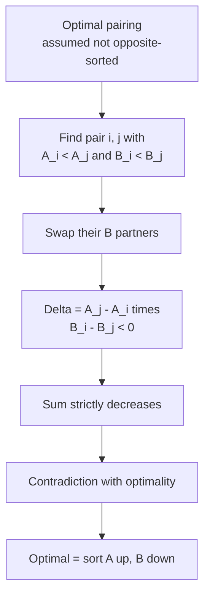
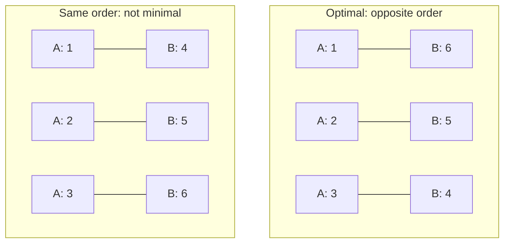

# Minimize Sum of Pairwise Products

| Meta | Value |
| --- | --- |
| Problem | Pair up elements of two arrays to minimize the sum of pairwise products |
| Source | Classic (rearrangement inequality) |
| Reference | Self-contained |
| Difficulty | Easy–Medium |
| Topics | Greedy, Sorting, Exchange Argument, Rearrangement Inequality |
| Time | $O(n \log n)$ |
| Space | $O(1)$ extra (in-place sort) |

## Problem Statement

You are given two arrays $A$ and $B$, each of length $n$. You may **permute** the elements of $B$ freely (equivalently, pair each $A_i$ with a distinct $B_j$). Choose the pairing that **minimizes**

$$
S = \sum_{i=1}^{n} A_i \cdot B_{\pi(i)}
$$

where $\pi$ is a permutation. Return the minimum possible value of $S$.

```text
Example
A = [1, 2, 3]
B = [4, 5, 6]

Pair the largest A with the smallest B:
  A sorted ascending : [1, 2, 3]
  B sorted descending: [6, 5, 4]
  S = 1*6 + 2*5 + 3*4 = 6 + 10 + 12 = 28  (minimum)

(For contrast, both ascending gives 1*4+2*5+3*6 = 32, the maximum.)
```

## Approach (WHY)

**Claim.** To minimize $\sum A_i B_{\pi(i)}$, sort $A$ ascending and pair it with $B$ sorted **descending** (equivalently, pair the largest of one with the smallest of the other). This is the *rearrangement inequality*.

**Exchange-argument justification.** Suppose an optimal pairing is **not** "ascending-vs-descending". Then there exist two indices where $A$ and the paired $B$ values are in the **same** relative order — i.e. positions $i, j$ with

$$
A_i < A_j \quad\text{and}\quad B_{\pi(i)} < B_{\pi(j)}.
$$

Look at the two terms these contribute and compare keeping them versus **swapping** the $B$ partners:

$$
\text{current} = A_i B_{\pi(i)} + A_j B_{\pi(j)}, \qquad
\text{swapped} = A_i B_{\pi(j)} + A_j B_{\pi(i)}.
$$

The difference is

$$
\text{swapped} - \text{current}
= A_i B_{\pi(j)} + A_j B_{\pi(i)} - A_i B_{\pi(i)} - A_j B_{\pi(j)}
= (A_j - A_i)\,(B_{\pi(i)} - B_{\pi(j)}).
$$

Since $A_j - A_i > 0$ and $B_{\pi(i)} - B_{\pi(j)} < 0$, the product is **negative**, so swapping **strictly lowers** $S$. Therefore any pairing with a "same-order" pair is not minimal — every adjacent same-order pair can be swapped to reduce the sum. Repeating drives the pairing to ascending-vs-descending, which is thus optimal. $\blacksquare$



So the algorithm is: sort $A$ ascending, sort $B$ descending, multiply elementwise, sum.

## Solution

```python
def min_sum_of_products(A, B):
    # Sort one ascending, the other descending, then dot-product.
    A_sorted = sorted(A)
    B_sorted = sorted(B, reverse=True)
    total = 0
    for a, b in zip(A_sorted, B_sorted):
        total += a * b
    return total
```

```cpp
#include <bits/stdc++.h>
using namespace std;

long long min_sum_of_products(vector<long long> A, vector<long long> B) {
    // Sort one ascending, the other descending, then dot-product.
    sort(A.begin(), A.end());                       // ascending
    sort(B.begin(), B.end(), greater<long long>()); // descending
    long long total = 0;
    for (size_t i = 0; i < A.size(); i++) {
        total += A[i] * B[i];
    }
    return total;
}
```

## Iteration / Trace

Take $A = [1, 2, 3]$, $B = [4, 5, 6]$.

| Step | A sorted ↑ | B sorted ↓ | Pair | Product | Running sum |
| --- | --- | --- | --- | --- | --- |
| 1 | 1 | 6 | (1, 6) | 6 | 6 |
| 2 | 2 | 5 | (2, 5) | 10 | 16 |
| 3 | 3 | 4 | (3, 4) | 12 | 28 |

Result $S = 28$. Any swap toward same-order would raise it (e.g. pairing $1$ with $4$ instead bumps the total up to $32$).



## Complexity

- **Time:** $O(n \log n)$ for the two sorts; the elementwise multiply-and-sum is $O(n)$.
- **Space:** $O(1)$ extra if sorting in place ($O(n)$ if you copy the inputs as shown).

## Takeaway

When you must **pair** two sequences to minimize a sum of products, the rearrangement inequality — proved by a single adjacent swap whose sign is $(A_j - A_i)(B_i - B_j)$ — tells you to sort them in **opposite** directions. Flip to "both same direction" to **maximize** instead. The same swap-sign trick underlies most exchange-argument greedy proofs.
