# Miscellaneous — Game Theory, Offline Techniques, Randomization & Amortization

A module of **assorted advanced techniques** that do not fit a single algorithmic family but show
up constantly in competitive programming and interviews. Each topic has a **concept guide**
(theory from scratch, many Mermaid diagrams, complexity, pitfalls, patterns) and **curated
problems** solved in **both Python and C++**.

## Structure

```
misc/
├── guide/      # one concept guide per topic (diagram-heavy)
└── problems/   # one file per curated problem (Python + C++, traces, diagrams, math)
```

## Topics & Guides

| # | Topic | Guide | Key problems |
|---|-------|-------|--------------|
| 1 | Nim | [01-nim.md](guide/01-nim.md) | Classic Nim winner, Misère Nim, Bounded-removal Nim |
| 2 | Sprague-Grundy theorem | [02-sprague-grundy.md](guide/02-sprague-grundy.md) | Subtraction game, Cat and Mouse (913), Sum of games (XOR) |
| 3 | Offline query processing | [03-offline-query-processing.md](guide/03-offline-query-processing.md) | Mo's distinct counts, Offline BIT by value, Count smaller after self |
| 4 | Divide & conquer (CDQ, parallel binary search) | [04-cdq-parallel-binary-search.md](guide/04-cdq-parallel-binary-search.md) | 3D partial order, Parallel binary search, Dynamic inversions |
| 5 | Randomization (hashing, shuffles) | [05-randomization.md](guide/05-randomization.md) | Fisher-Yates shuffle, Randomized string hash, Reservoir sampling |
| 6 | Amortization & potential arguments | [06-amortization-potential.md](guide/06-amortization-potential.md) | Array doubling, Monotonic stack, Binary counter |
| 7 | Slope trick | [07-slope-trick.md](guide/07-slope-trick.md) | Min-cost non-decreasing, Buy/Sell with fee (714), Array equalize |
| 8 | Aliens trick (Lagrangian optimization) | [08-aliens-trick.md](guide/08-aliens-trick.md) | k-partitions, Buy/Sell k transactions (188), Split into k segments |
| 9 | Implicit treap | [09-implicit-treap.md](guide/09-implicit-treap.md) | Array operations, Range reverse, Rotate subarray |
| 10 | Merge sort tree | [10-merge-sort-tree.md](guide/10-merge-sort-tree.md) | Count ≤ k in range, k-th smallest in range, Count > k in range |
| 11 | Mo's on tree & Mo's with updates | [11-mos-on-tree-and-updates.md](guide/11-mos-on-tree-and-updates.md) | Path distinct, Range distinct with updates, Subtree queries |
| 12 | Stern-Brocot tree & continued fractions | [12-stern-brocot-continued-fractions.md](guide/12-stern-brocot-continued-fractions.md) | Locate fraction, Best rational approximation, Predicate binary search |
| 13 | Simplex & linear programming | [13-simplex-linear-programming.md](guide/13-simplex-linear-programming.md) | Two-variable max, Standard-form solve, Duality & feasibility |

## How the pieces fit together

```mermaid
graph TD
    N["Nim<br/>(nim-sum / XOR)"] --> SG["Sprague-Grundy<br/>theorem"]
    SG --> GS["Sum of impartial games<br/>= XOR of Grundy values"]
    O["Offline query<br/>processing"] --> M["Mo's algorithm"]
    O --> BIT["Offline + Fenwick<br/>sweep by value/time"]
    O --> CDQ["CDQ divide & conquer"]
    CDQ --> PBS["Parallel binary search"]
    R["Randomization"] --> H["Hashing<br/>(polynomial / Zobrist)"]
    R --> SH["Shuffles & sampling"]
    A["Amortization &<br/>potential arguments"] --> PM["Potential method"]
    A --> MS["Monotonic stack<br/>O(n) argument"]
    DP["DP speed-ups"] --> ST["Slope trick<br/>(convex piecewise-linear)"]
    DP --> AT["Aliens trick<br/>(Lagrangian, exactly k)"]
    DS["Range data structures"] --> IT["Implicit treap<br/>(split / merge)"]
    DS --> MST["Merge sort tree<br/>(sorted lists per node)"]
    M --> MT["Mo's on tree /<br/>Mo's with updates"]
    NT["Number theory /<br/>geometry of numbers"] --> SB["Stern-Brocot /<br/>continued fractions"]
    LP["Optimization"] --> SX["Simplex /<br/>linear programming"]
```



## Recommended study order

1. **Nim** (1) — the seed idea: P/N positions and the nim-sum.
2. **Sprague-Grundy** (2) — generalizes Nim to all impartial games via Grundy numbers + mex.
3. **Amortization & potential arguments** (6) — the analysis lens behind many of the structures
   used elsewhere in the repo.
4. **Offline query processing** (3) — reorder queries; Mo's algorithm and offline Fenwick sweeps.
5. **Divide & conquer: CDQ / parallel binary search** (4) — the heavier offline machinery.
6. **Randomization** (5) — shuffles, hashing, and sampling for speed and robustness.
7. **Slope trick** (7) — convex piecewise-linear DP value functions maintained with heaps.
8. **Aliens trick** (8) — Lagrangian relaxation to enforce an exactly-$k$ constraint.
9. **Implicit treap** (9) — a balanced sequence supporting split/merge, range reverse, rotate.
10. **Merge sort tree** (10) — a segment tree of sorted lists for range order-statistic queries.
11. **Mo's on tree & with updates** (11) — Euler-flatten paths/subtrees and add a time dimension.
12. **Stern-Brocot & continued fractions** (12) — the binary search tree of rationals.
13. **Simplex & linear programming** (13) — vertex-hopping optimization over a convex polytope.

## Complexity cheat sheet

| Technique | Complexity | Notes |
|-----------|-----------|-------|
| Nim winner | $O(n)$ | XOR of pile sizes |
| Grundy value (memoized) | $O(\text{states} \times \text{moves})$ | mex over reachable states |
| Mo's algorithm | $O((n+q)\sqrt{n})$ | sort queries by block, move pointers |
| Offline + Fenwick | $O((n+q)\log n)$ | sweep sorted by threshold/time |
| CDQ divide & conquer | $O(n\log^2 n)$ | recursion + BIT on the cross part |
| Parallel binary search | $O((n+q)\log n \cdot \log V)$ | one timeline sweep per bisection level |
| Fisher-Yates shuffle | $O(n)$ | unbiased uniform permutation |
| Polynomial / Rabin-Karp hash | $O(n)$ expected | random base/mod beats anti-hash tests |
| Reservoir sampling | $O(n)$, $O(k)$ space | uniform $k$-sample from a stream |
| Amortized analysis | per-op average | aggregate / accounting / potential method |
| Slope trick | $O(n\log n)$ | heap of slope-change points (kinks) |
| Aliens trick | $O(n\log V)$ | binary search the Lagrange penalty $\lambda$ |
| Implicit treap | $O(\log n)$ expected / op | split + merge, lazy range reverse |
| Merge sort tree | $O(\log^2 n)$ / query | sorted list per node, binary search |
| Mo's on tree | $O((n+q)\sqrt{n})$ | Euler flatten + parity toggle + LCA |
| Mo's with updates (3D) | $O(n^{5/3})$ | block size $n^{2/3}$, time pointer |
| Stern-Brocot / continued fractions | $O(\log V)$ big steps | run-length jumps via Euclid |
| Simplex (practical) | polynomial in practice | exponential worst case; Bland's rule |

---

> Every code sample appears in **both Python and C++**. Problem files follow the repo format:
> meta table → statement → approach (WHY) → Python + C++ → trace → Mermaid → math → complexity →
> takeaway. Guides follow: TOC → theory → paired code → many Mermaid diagrams → math → complexity
> → pitfalls → patterns.
