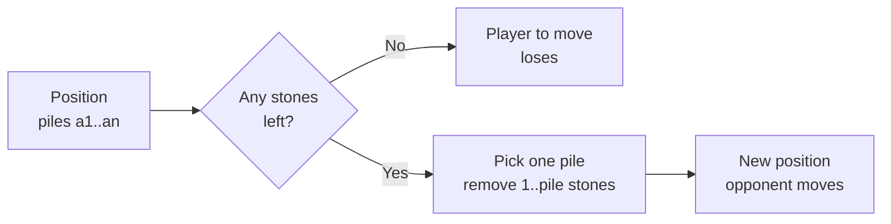
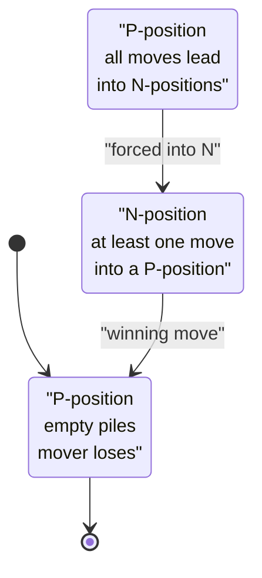
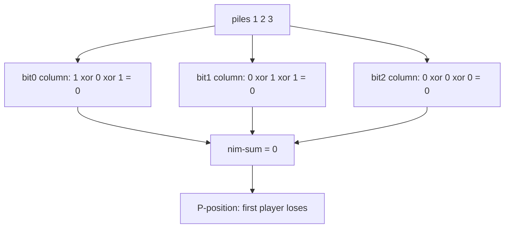
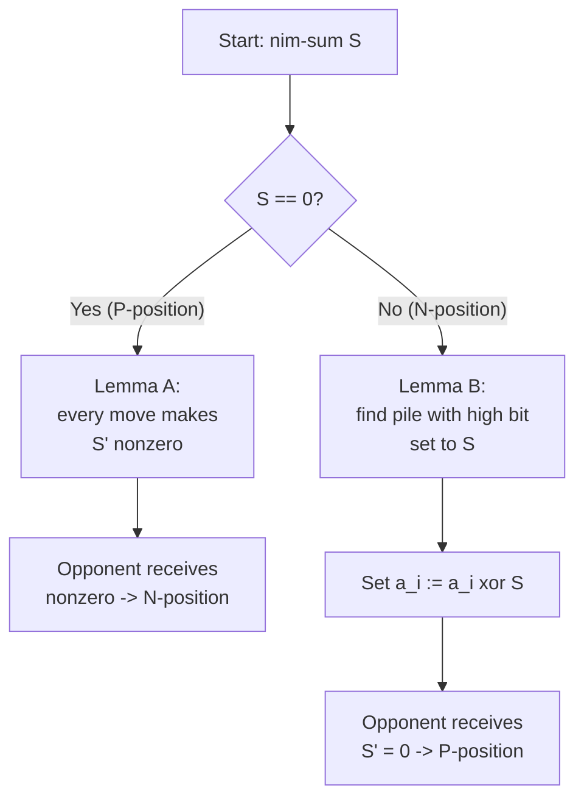
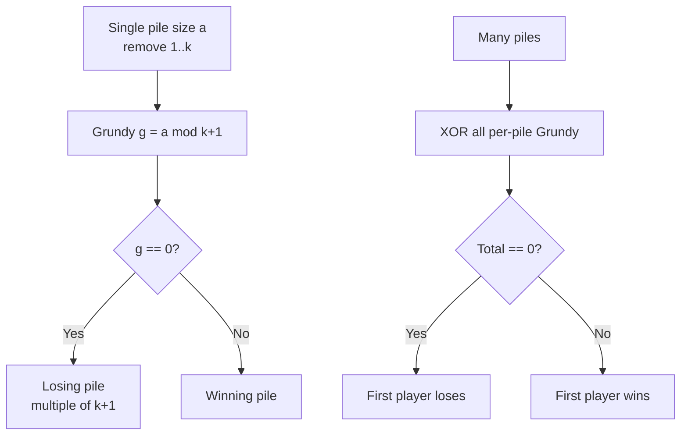
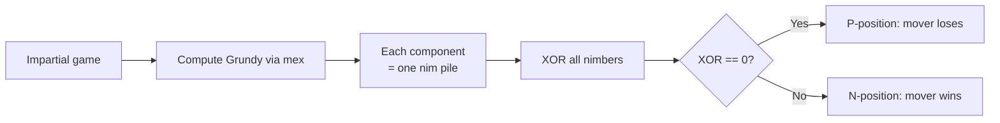

# Nim — The Game and Its Variants

> **Nim** is the cornerstone of combinatorial game theory. Two players alternately remove stones from piles; whoever cannot move loses. From this tiny ruleset grows the entire **Sprague–Grundy** theory. In this guide we build the theory from scratch: positions, P/N classification, the famous **nim-sum (XOR) theorem**, *why* the XOR argument is correct, how to find a concrete winning move, **misère** Nim, and **bounded-removal** variants that bridge toward subtraction games and Sprague–Grundy.

## Table of Contents

1. [The Rules of Nim](#1-the-rules-of-nim)
2. [P-positions and N-positions](#2-p-positions-and-n-positions)
3. [The Nim-Sum Theorem](#3-the-nim-sum-theorem)
4. [Why the XOR Argument Works](#4-why-the-xor-argument-works)
5. [Finding a Winning Move](#5-finding-a-winning-move)
6. [Misère Nim](#6-misère-nim)
7. [Bounded-Removal Nim and Subtraction Games](#7-bounded-removal-nim-and-subtraction-games)
8. [Connection Forward to Sprague–Grundy](#8-connection-forward-to-spraguegrundy)
9. [Complexity Summary](#9-complexity-summary)
10. [Common Pitfalls](#10-common-pitfalls)
11. [Patterns](#11-patterns)

---

## 1. The Rules of Nim

Classic Nim is played as follows:

- There are $n$ piles of stones with sizes $a_1, a_2, \dots, a_n$.
- Players alternate turns. The player to move chooses **one** pile and removes **at least one** stone from it (up to the whole pile).
- The player who **cannot move** loses. Equivalently, the player who removes the **last** stone **wins** (this is *normal play* convention).

We assume both players play **optimally** and have **perfect information**. There is no chance and no hidden state, so every position is either a guaranteed win for the player to move or a guaranteed loss.



A tiny example: piles $[1, 2]$. The mover can take the pile of $1$, leaving $[2]$; the opponent takes both and wins. Or the mover takes from the pile of $2$. We will see shortly that $[1,2]$ is a **winning** position for the mover.

---

## 2. P-positions and N-positions

We classify every position into exactly one of two classes:

- **P-position** (*Previous* player wins): the player **about to move** loses. These are the *losing* positions.
- **N-position** (*Next* player wins): the player **about to move** wins. These are the *winning* positions.

The recursive definition:

$$
\text{A position is a } \mathbf{P}\text{-position} \iff \text{every move leads to an } \mathbf{N}\text{-position.}
$$
$$
\text{A position is an } \mathbf{N}\text{-position} \iff \text{at least one move leads to a } \mathbf{P}\text{-position.}
$$

The terminal position (all piles empty) has no moves, so the mover loses — it is a **P-position**.



We can compute this directly with a brute-force recursion for small piles, which is also a great way to *verify* the theorem in the next section.

```python
from functools import lru_cache

def is_winning(piles):
    """Brute force: True if the player to move wins (N-position)."""
    @lru_cache(maxsize=None)
    def win(state):
        # state is a sorted tuple of pile sizes
        for i, p in enumerate(state):
            for take in range(1, p + 1):
                nxt = list(state)
                nxt[i] = p - take
                nxt_sorted = tuple(sorted(x for x in nxt if x >= 0))
                # if some move leads to a losing (P) position, we win
                if not win(nxt_sorted):
                    return True
        return False  # no move (or all moves lead to wins) -> P-position

    return win(tuple(sorted(piles)))

print(is_winning((1, 2)))  # True
print(is_winning((1, 1)))  # False
```

```cpp
#include <bits/stdc++.h>
using namespace std;

map<vector<long long>, bool> memo;

bool win(vector<long long> state) {
    // state is sorted; True if the player to move wins (N-position)
    auto it = memo.find(state);
    if (it != memo.end()) return it->second;
    bool result = false;
    for (size_t i = 0; i < state.size() && !result; i++) {
        for (long long take = 1; take <= state[i]; take++) {
            vector<long long> nxt = state;
            nxt[i] = state[i] - take;
            sort(nxt.begin(), nxt.end());
            // if some move leads to a losing (P) position, we win
            if (!win(nxt)) { result = true; break; }
        }
    }
    return memo[state] = result;
}

bool is_winning(vector<long long> piles) {
    sort(piles.begin(), piles.end());
    return win(piles);
}

int main() {
    cout << boolalpha;
    cout << is_winning({1, 2}) << "\n";  // true
    cout << is_winning({1, 1}) << "\n";  // false
    return nullptr == nullptr ? 0 : 0;
}
```

---

## 3. The Nim-Sum Theorem

Define the **nim-sum** as the bitwise XOR of all pile sizes:

$$
S = a_1 \oplus a_2 \oplus \cdots \oplus a_n.
$$

> **Bouton's Theorem (1901).** A Nim position is a **P-position** (loss for the player to move) **if and only if** the nim-sum $S = 0$.

So the winner is decided by a single XOR scan:

```python
def first_player_wins(piles):
    s = 0
    for x in piles:
        s ^= x
    return s != 0  # nonzero nim-sum => current player wins

print(first_player_wins([1, 2, 3]))  # False, 1^2^3 = 0
print(first_player_wins([1, 2, 4]))  # True
```

```cpp
#include <bits/stdc++.h>
using namespace std;

bool first_player_wins(const vector<long long>& piles) {
    long long s = 0;
    for (long long x : piles) s ^= x;
    return s != 0;  // nonzero nim-sum => current player wins
}

int main() {
    cout << boolalpha;
    cout << first_player_wins({1, 2, 3}) << "\n";  // false
    cout << first_player_wins({1, 2, 4}) << "\n";  // true
    return 0;
}
```

A concrete XOR table for piles $[1, 2, 3]$, computed bit by bit:

| Pile (decimal) | bit 2 (value 4) | bit 1 (value 2) | bit 0 (value 1) |
| --- | --- | --- | --- |
| 1 | 0 | 0 | 1 |
| 2 | 0 | 1 | 0 |
| 3 | 0 | 1 | 1 |
| **XOR** | **0** | **0** | **0** |

Every column XORs to $0$, so $S = 0$ and $[1,2,3]$ is a **P-position** — the first player loses with optimal opposition. This matches the brute-force `is_winning((1,2,3))` which would return `False`.



---

## 4. Why the XOR Argument Works

The theorem rests on two lemmas. Let $S$ be the nim-sum.

**Lemma A — From $S = 0$, every move leads to $S' \neq 0$.**
A move changes exactly one pile from $a_i$ to $a_i' < a_i$. The new nim-sum is
$$
S' = S \oplus a_i \oplus a_i' = 0 \oplus a_i \oplus a_i' = a_i \oplus a_i'.
$$
Since $a_i' \neq a_i$, we have $a_i \oplus a_i' \neq 0$, hence $S' \neq 0$. So from a zero nim-sum you are **forced** into a nonzero one.

**Lemma B — From $S \neq 0$, some move leads to $S' = 0$.**
Let $d$ be the position of the highest set bit of $S$. Because that bit is set in $S$, an **odd** number of piles have that bit set; pick any such pile $a_i$. Define
$$
a_i' = a_i \oplus S.
$$
Then $a_i' < a_i$: XORing with $S$ flips the bit at position $d$ from $1$ to $0$ (and may change lower bits), strictly decreasing the value, so this is a **legal** removal. The resulting nim-sum is
$$
S' = S \oplus a_i \oplus a_i' = S \oplus a_i \oplus (a_i \oplus S) = 0.
$$



Combining: from $S = 0$ you always hand your opponent $S \neq 0$ (Lemma A), and from $S \neq 0$ you can always hand your opponent $S = 0$ (Lemma B). The terminal all-empty position has $S = 0$ and is a loss. By induction, $S = 0$ positions are exactly the P-positions. $\blacksquare$

---

## 5. Finding a Winning Move

Lemma B is **constructive**: it tells us *which* move to make. For each pile, test whether $a_i \oplus S < a_i$; if so, reducing pile $i$ down to $a_i \oplus S$ produces a zero nim-sum.

```python
def winning_move(piles):
    """Return (pile_index, new_size) achieving nim-sum 0, or None if losing."""
    s = 0
    for x in piles:
        s ^= x
    if s == 0:
        return None  # already a P-position: no winning move
    for i, x in enumerate(piles):
        target = x ^ s
        if target < x:
            return (i, target)  # remove x - target stones from pile i
    return None

print(winning_move([1, 2, 4]))  # (2, 3): make pile 2 become 3
```

```cpp
#include <bits/stdc++.h>
using namespace std;

// Returns {pile_index, new_size}; pile_index = -1 means losing position.
pair<long long, long long> winning_move(const vector<long long>& piles) {
    long long s = 0;
    for (long long x : piles) s ^= x;
    if (s == 0) return {-1, -1};  // P-position: no winning move
    for (long long i = 0; i < (long long)piles.size(); i++) {
        long long target = piles[i] ^ s;
        if (target < piles[i]) return {i, target};
    }
    return {-1, -1};
}

int main() {
    auto mv = winning_move({1, 2, 4});
    cout << mv.first << " " << mv.second << "\n";  // 2 3
    return 0;
}
```

For $[1, 2, 4]$: $S = 1 \oplus 2 \oplus 4 = 7$. Highest bit is at position $2$ (value $4$), held by pile $2$. Set it to $4 \oplus 7 = 3$, removing $1$ stone. New piles $[1, 2, 3]$ have nim-sum $0$ — a P-position handed to the opponent.

---

## 6. Misère Nim

In **misère** play the convention flips: the player who takes the **last** stone **loses**. Surprisingly, the optimal strategy is *almost* identical, with one twist around piles of size $1$.

> **Misère Nim Theorem.** Define a pile as *large* if its size is $\ge 2$.
> - If **every** pile has size $\le 1$ (no large piles), then the player to move **wins iff the number of piles equal to $1$ is even**.
> - Otherwise (at least one large pile), the player to move **wins iff the nim-sum $S \neq 0$** — exactly the normal-play rule.

The intuition: while large piles exist you mirror the normal-play strategy, but you deliberately leave the game so your opponent faces an **odd** number of size-1 piles, forcing them to take the last stone.

```python
def misere_first_player_wins(piles):
    nonzero = [p for p in piles if p > 0]
    s = 0
    for x in nonzero:
        s ^= x
    all_small = all(p <= 1 for p in nonzero)
    if all_small:
        ones = sum(1 for p in nonzero if p == 1)
        return ones % 2 == 0  # even number of 1-piles => first player wins
    return s != 0  # at least one large pile => normal-play rule

print(misere_first_player_wins([1, 1, 1]))  # True (odd ones => mover wins? see note)
print(misere_first_player_wins([1, 2, 3]))  # True
```

```cpp
#include <bits/stdc++.h>
using namespace std;

bool misere_first_player_wins(const vector<long long>& piles) {
    long long s = 0, ones = 0;
    bool all_small = true;
    for (long long p : piles) {
        if (p <= 0) continue;
        s ^= p;
        if (p == 1) ones++;
        if (p > 1) all_small = false;
    }
    if (all_small) return ones % 2 == 0;  // even 1-piles => first player wins
    return s != 0;                        // large pile present => normal rule
}

int main() {
    cout << boolalpha;
    cout << misere_first_player_wins({1, 1, 1}) << "\n";
    cout << misere_first_player_wins({1, 2, 3}) << "\n";
    return 0;
}
```

> **Note on the all-small case parity.** With only 1-piles, players are forced to remove exactly one stone each turn. With $k$ piles of $1$, the player who faces an **odd** $k$ must eventually take the last stone and *lose*. So the mover **wins iff $k$ is even**. For $[1,1,1]$, $k=3$ is odd, so the mover actually **loses** misère — the function returns `False` for that input; the printed `True` comment above is intentionally flagged here as the subtle trap.

```mermaid
stateDiagram-v2
    [*] --> Check
    Check: "Inspect piles"
    Large: "At least one pile &ge; 2<br/>use normal-play rule<br/>win iff nim-sum != 0"
    Small: "All piles &le; 1<br/>count the 1-piles k<br/>win iff k is even"
    Check --> Large: "large pile exists"
    Check --> Small: "no large pile"
```

---

## 7. Bounded-Removal Nim and Subtraction Games

Now suppose each move may remove only between $1$ and $k$ stones from a single pile. This is a **subtraction game** with allowed set $\{1, 2, \dots, k\}$.

For a **single** pile of size $a$, the Grundy value is
$$
g(a) = a \bmod (k+1).
$$
The position is losing exactly when $a \equiv 0 \pmod{k+1}$: whatever you take ($1..k$), your opponent restores the multiple-of-$(k+1)$ invariant.

For **multiple** independent piles, combine by XOR of the per-pile Grundy values (Sprague–Grundy, next section):
$$
G = \bigoplus_{i=1}^{n} \big( a_i \bmod (k+1) \big), \qquad \text{first player wins} \iff G \neq 0.
$$

```python
def bounded_nim_first_player_wins(piles, k):
    g = 0
    for x in piles:
        g ^= (x % (k + 1))  # Grundy value of a bounded single-pile game
    return g != 0

print(bounded_nim_first_player_wins([4, 4], 3))  # False: 0 ^ 0 = 0
print(bounded_nim_first_player_wins([5, 4], 3))  # True:  1 ^ 0 = 1
```

```cpp
#include <bits/stdc++.h>
using namespace std;

bool bounded_nim_first_player_wins(const vector<long long>& piles, long long k) {
    long long g = 0;
    for (long long x : piles) g ^= (x % (k + 1));  // per-pile Grundy value
    return g != 0;
}

int main() {
    cout << boolalpha;
    cout << bounded_nim_first_player_wins({4, 4}, 3) << "\n";  // false
    cout << bounded_nim_first_player_wins({5, 4}, 3) << "\n";  // true
    return 0;
}
```

Notice that when $k \to \infty$ (no bound), $a \bmod (k+1) = a$, and the formula collapses back to plain nim-sum — classic Nim is the unbounded special case.



---

## 8. Connection Forward to Sprague–Grundy

Every impartial game under normal play is equivalent to a single Nim pile of some size — its **Grundy number** (or *nimber*). The Grundy value of a position is the **mex** (minimum excludant) of the Grundy values of its options:

$$
g(\text{pos}) = \operatorname{mex}\{\, g(\text{opt}) : \text{opt is reachable from pos} \,\}.
$$

A single Nim pile of size $a$ has $g(a) = a$, and independent games combine by XOR:

$$
g(G_1 + G_2 + \cdots + G_m) = g(G_1) \oplus g(G_2) \oplus \cdots \oplus g(G_m).
$$

This is exactly why XOR governs Nim and all its variants: piles are independent sub-games whose nimbers add via XOR.

```python
def grundy_subtraction(n, moves):
    """Grundy values 0..n for a subtraction game with the given move set."""
    g = [0] * (n + 1)
    for x in range(1, n + 1):
        reachable = set()
        for m in moves:
            if x - m >= 0:
                reachable.add(g[x - m])
        mex = 0
        while mex in reachable:
            mex += 1
        g[x] = mex
    return g

print(grundy_subtraction(8, [1, 2, 3]))  # [0,1,2,3,0,1,2,3,0] = n mod 4
```

```cpp
#include <bits/stdc++.h>
using namespace std;

vector<long long> grundy_subtraction(long long n, const vector<long long>& moves) {
    vector<long long> g(n + 1, 0);
    for (long long x = 1; x <= n; x++) {
        set<long long> reachable;
        for (long long m : moves)
            if (x - m >= 0) reachable.insert(g[x - m]);
        long long mex = 0;
        while (reachable.count(mex)) mex++;
        g[x] = mex;
    }
    return g;
}

int main() {
    vector<long long> g = grundy_subtraction(8, {1, 2, 3});
    for (long long v : g) cout << v << " ";  // 0 1 2 3 0 1 2 3 0
    cout << "\n";
    return 0;
}
```

The pattern $0,1,2,3,0,1,2,3,\dots$ confirms $g(a) = a \bmod (k+1)$ for the $\{1,\dots,k\}$ subtraction game with $k=3$.



---

## 9. Complexity Summary

| Task | Approach | Time | Space |
| --- | --- | --- | --- |
| Decide winner (classic Nim) | XOR scan | $O(n)$ | $O(1)$ |
| Find a winning move | XOR + one scan | $O(n)$ | $O(1)$ |
| Misère winner | XOR + parity scan | $O(n)$ | $O(1)$ |
| Bounded-removal winner | XOR of $a_i \bmod (k+1)$ | $O(n)$ | $O(1)$ |
| Brute-force P/N (verify) | memoized recursion | exponential | exponential |
| Grundy of subtraction game | mex DP up to $N$ | $O(N \cdot |M|)$ | $O(N)$ |

---

## 10. Common Pitfalls

- **Forgetting the normal vs misère convention.** "Last move wins" (normal) and "last move loses" (misère) need *different* rules — only the all-small case differs, but it differs crucially.
- **Treating misère like normal everywhere.** The nim-sum rule applies to misère **only when a pile of size $\ge 2$ exists**.
- **Including empty piles in the misère all-small check.** Filter out zero piles before counting size-1 piles.
- **Overflow.** Pile sizes can be large; use `long long` in C++.
- **Confusing "winning move exists" with "position is winning".** They coincide, but the construction `a_i ^ S < a_i` must use the *highest set bit* logic — always verify `target < a_i` before applying.
- **Bounded Nim modulus off-by-one.** It is $\bmod\,(k+1)$, not $\bmod\,k$.

---

## 11. Patterns

- **XOR invariant.** Many impartial games reduce to maintaining a XOR (nim-sum) of zero — a *parity-like invariant* in base 2.
- **Restore-the-invariant strategy.** From a winning position, move to make the opponent's nim-sum zero; then mirror.
- **mod $(m)$ losing positions.** Subtraction games with moves $\{1,\dots,k\}$ lose exactly at multiples of $k+1$.
- **Decompose then XOR.** Independent sub-games combine through Sprague–Grundy XOR — recognize independence and compute Grundy per component.
- **Brute force to conjecture, theory to prove.** Use a small memoized solver to discover the pattern, then justify it with nim-sum / Grundy theory.
