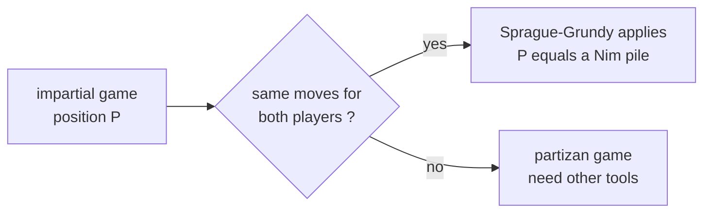
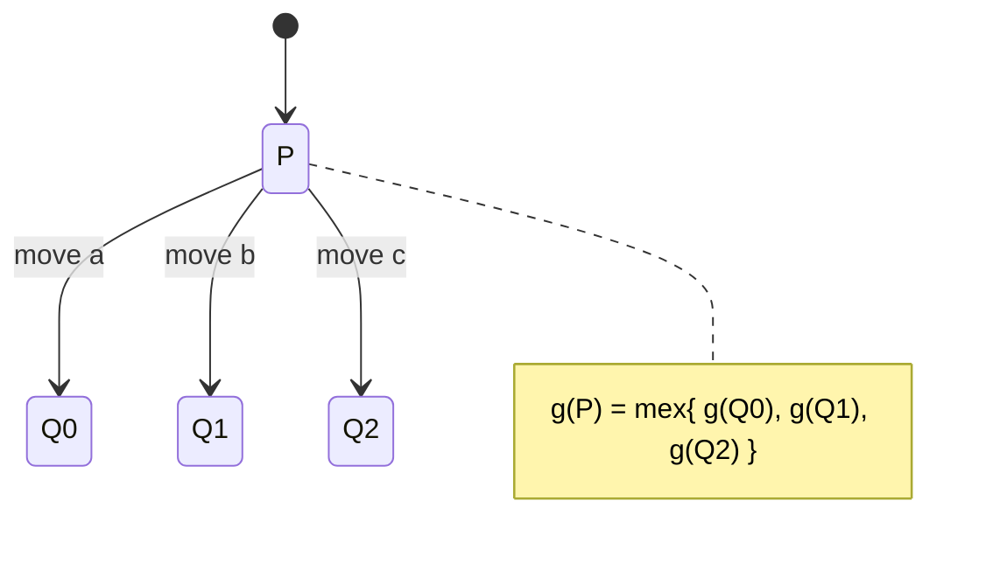
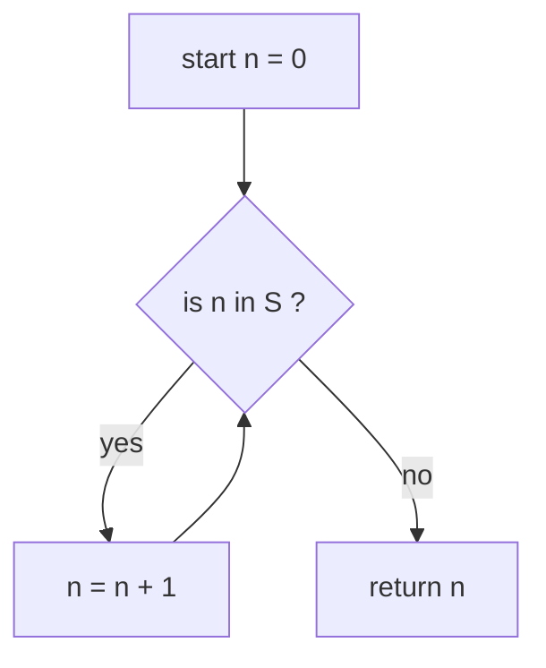
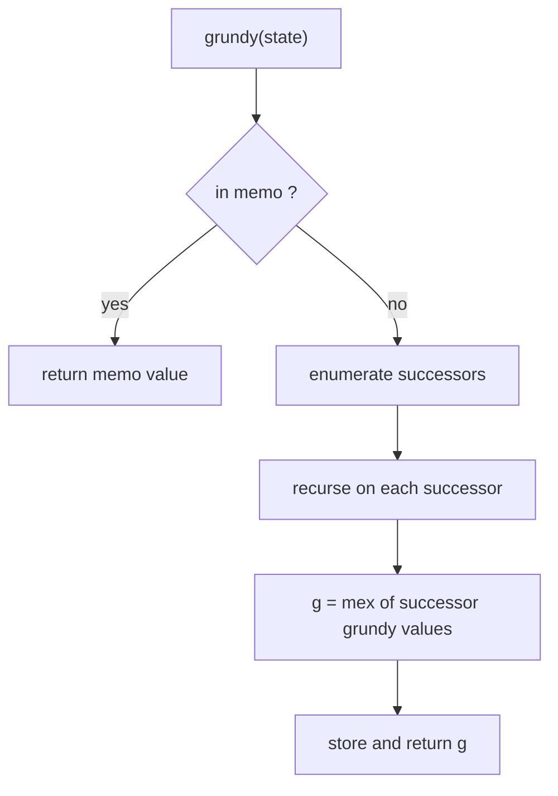
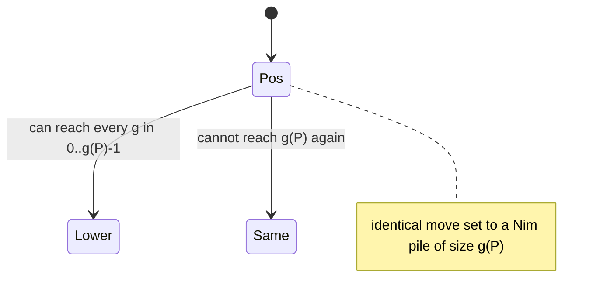
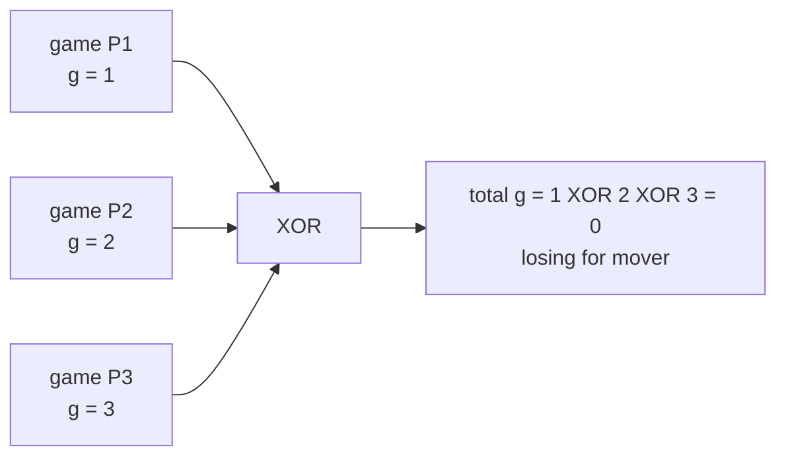
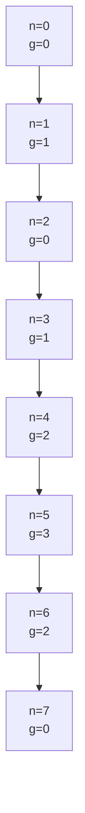
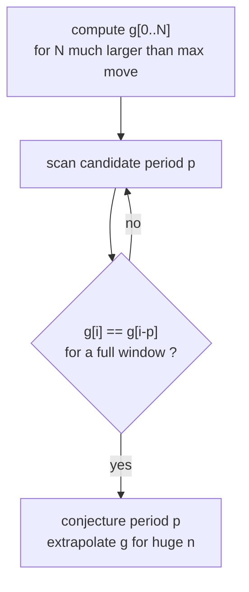
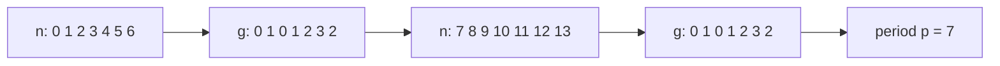

# Sprague-Grundy Theorem — Turning Every Impartial Game into Nim

> Every position of an **impartial** game behaves exactly like a single **Nim pile**. The size of
> that pile is the position's **Grundy number** (a.k.a. *nimber*). Once you can compute Grundy
> numbers, the whole theory of combinatorial games collapses into one operation you already know:
> **XOR**. This guide builds the theory from `mex`, proves the equivalence intuitively, and shows
> how a *sum of independent games* is solved by XOR-ing their Grundy values.

---

## Table of Contents

1. [Impartial Games and the Equivalent Nim Pile](#impartial-games-and-the-equivalent-nim-pile)
2. [Grundy Numbers (Nimbers)](#grundy-numbers-nimbers)
3. [The mex Function](#the-mex-function)
4. [Computing Grundy Values via mex of Reachable States](#computing-grundy-values-via-mex-of-reachable-states)
5. [The Sprague-Grundy Theorem](#the-sprague-grundy-theorem)
6. [Sum of Games = XOR of Grundy Values](#sum-of-games--xor-of-grundy-values)
7. [Worked Example: Subtraction Game](#worked-example-subtraction-game)
8. [Worked Example: Coin Turning Games](#worked-example-coin-turning-games)
9. [Detecting Periodicity in Grundy Sequences](#detecting-periodicity-in-grundy-sequences)
10. [Complexity Summary](#complexity-summary)
11. [Common Pitfalls](#common-pitfalls)
12. [Patterns](#patterns)

---

## Impartial Games and the Equivalent Nim Pile

A combinatorial game here means: two players alternate moves, there is **no chance**, and both
players have **perfect information**. A game is **impartial** when, from any position, the set of
legal moves depends only on the position — **not on whose turn it is**. (Chess is *partizan*: White
moves white pieces only; that breaks impartiality.)

We use **normal play convention**: the player who **cannot move loses**.



The central claim — proved later — is that any such position $P$ is **equivalent** to a Nim pile of
some size $g(P)$. *Equivalent* means: replacing $P$ by that Nim pile inside any larger sum of games
does not change who wins. A position is a **losing position** (previous player wins, "P-position")
exactly when $g(P) = 0$.

---

## Grundy Numbers (Nimbers)

The **Grundy number** $g(P)$ of a position $P$ is a non-negative integer assigned by a single
recursive rule. Terminal positions (no moves) get $g = 0$. For every other position you look at the
Grundy numbers of all positions you can reach in one move, and take their **mex** (defined next):

$$
g(P) = \operatorname{mex}\;\{\, g(Q) \;:\; P \to Q \,\}.
$$

Intuition: a pile of "nim-size $k$" is a position from which you can move to nim-sizes
$0, 1, \dots, k-1$ but **not** to another nim-size $k$. The `mex` enforces exactly that structure.



---

## The mex Function

`mex` = **minimum excludant** = the smallest non-negative integer **not** present in a set.

$$
\operatorname{mex}(S) = \min \{\, n \in \mathbb{Z}_{\ge 0} : n \notin S \,\}.
$$

Examples: $\operatorname{mex}(\{0,1,2\}) = 3$, $\operatorname{mex}(\{1,2,4\}) = 0$,
$\operatorname{mex}(\{\,\}) = 0$, $\operatorname{mex}(\{0,2,3\}) = 1$.



```python
def mex(reachable):
    """Smallest non-negative integer not in the set/iterable `reachable`."""
    seen = set(reachable)
    n = 0
    while n in seen:        # walk up until we find a gap
        n += 1
    return n
```

```cpp
#include <bits/stdc++.h>
using namespace std;

long long mex(const vector<long long>& reachable) {
    // Smallest non-negative integer not present in `reachable`.
    unordered_set<long long> seen(reachable.begin(), reachable.end());
    long long n = 0;
    while (seen.count(n)) {     // walk up until we find a gap
        ++n;
    }
    return n;
}
```

A faster `mex` for `k` values uses a boolean array of size `k+1`, since the answer is at most the
number of reachable states:

```python
def mex_bounded(values):
    """O(len) mex using a presence array; answer is at most len(values)."""
    k = len(values)
    present = [False] * (k + 1)
    for v in values:
        if 0 <= v <= k:          # values beyond k cannot be the mex
            present[v] = True
    n = 0
    while present[n]:
        n += 1
    return n
```

```cpp
#include <bits/stdc++.h>
using namespace std;

long long mex_bounded(const vector<long long>& values) {
    // O(len) mex using a presence array; answer is at most values.size().
    long long k = (long long)values.size();
    vector<char> present(k + 1, false);
    for (long long v : values) {
        if (0 <= v && v <= k) {      // values beyond k cannot be the mex
            present[v] = true;
        }
    }
    long long n = 0;
    while (present[n]) {
        ++n;
    }
    return n;
}
```

---

## Computing Grundy Values via mex of Reachable States

Wrap the recursion with memoization. The position is whatever uniquely identifies the state (a pile
size, a board tuple, etc.). For each position, generate successors, recurse, then `mex`.

```python
from functools import lru_cache

def make_grundy(moves_fn):
    """moves_fn(state) yields all states reachable in one move."""
    @lru_cache(maxsize=None)
    def grundy(state):
        reachable = {grundy(nxt) for nxt in moves_fn(state)}
        return mex(reachable)            # terminal -> empty set -> mex = 0
    return grundy
```

```cpp
#include <bits/stdc++.h>
using namespace std;

struct GrundyEngine {
    // moves_fn(state) returns all states reachable in one move.
    function<vector<long long>(long long)> moves_fn;
    unordered_map<long long, long long> memo;

    long long grundy(long long state) {
        auto it = memo.find(state);
        if (it != memo.end()) return it->second;
        vector<long long> reachable;
        for (long long nxt : moves_fn(state)) reachable.push_back(grundy(nxt));
        long long g = mex(reachable);    // terminal -> empty -> mex = 0
        memo[state] = g;
        return g;
    }
};
```



---

## The Sprague-Grundy Theorem

> **Theorem (Sprague 1935, Grundy 1939).** Every position of an impartial game under normal play is
> *equivalent* to a single Nim pile whose size equals the position's Grundy number $g(P)$.

Why does `mex` give the right pile size? A Nim pile of size $n$ has exactly the property that its
single-move successors are the piles $0, 1, \dots, n-1$. The `mex` rule reproduces that:

- **(Down-closure)** For every $0 \le m < g(P)$, some move leads to a position with Grundy value
  $m$ — otherwise $m$ would be missing and `mex` would have returned $m$, not $g(P)$.
- **(No fixed point)** No move leads to a position with Grundy value exactly $g(P)$, because
  $g(P)$ is *excluded* from the reachable set by definition of `mex`.

Those two facts are precisely the move structure of a Nim pile of size $g(P)$, so the position
plays identically to that pile. Hence $g(P) = 0 \iff P$ is a loss for the player about to move.



---

## Sum of Games = XOR of Grundy Values

The real power: when a game **decomposes** into independent sub-games played in parallel (a move
touches exactly one component), the Grundy number of the whole is the **XOR** (nim-sum) of the
component Grundy numbers:

$$
g(P_1 + P_2 + \dots + P_k) = g(P_1) \oplus g(P_2) \oplus \dots \oplus g(P_k).
$$

This is exactly Bouton's theorem for Nim, lifted to arbitrary impartial games via the equivalence
above: replace each component by its Nim pile, then it *is* Nim, whose theory says the position is
losing iff the XOR is $0$.



```python
from functools import reduce
from operator import xor

def game_sum_is_losing(grundy_values):
    """True if the combined position is a loss for the player to move."""
    total = reduce(xor, grundy_values, 0)
    return total == 0
```

```cpp
#include <bits/stdc++.h>
using namespace std;

bool game_sum_is_losing(const vector<long long>& grundy_values) {
    // True if the combined position is a loss for the player to move.
    long long total = 0;
    for (long long g : grundy_values) total ^= g;
    return total == 0;
}
```

To turn a winning position into a winning *move*, find a component whose Grundy value can be lowered
so the global XOR becomes $0$ — the standard Nim strategy applied to nimbers.

---

## Worked Example: Subtraction Game

Game: a pile of $n$ stones; a move removes $s$ stones for $s$ in a fixed set $S$. Last to move
wins. With $S = \{1, 3, 4\}$ the Grundy values cycle.

$$
g(n) = \operatorname{mex}\;\{\, g(n - s) : s \in S,\; s \le n \,\}.
$$

```python
def subtraction_grundy(limit, S):
    """Grundy g[0..limit] for the subtraction game with move set S."""
    g = [0] * (limit + 1)
    for n in range(1, limit + 1):
        reach = {g[n - s] for s in S if s <= n}
        g[n] = mex(reach)
    return g
```

```cpp
#include <bits/stdc++.h>
using namespace std;

vector<long long> subtraction_grundy(long long limit, const vector<long long>& S) {
    // Grundy g[0..limit] for the subtraction game with move set S.
    vector<long long> g(limit + 1, 0);
    for (long long n = 1; n <= limit; ++n) {
        vector<long long> reach;
        for (long long s : S) if (s <= n) reach.push_back(g[n - s]);
        g[n] = mex(reach);
    }
    return g;
}
```

For $S = \{1,3,4\}$ the sequence is $0,1,0,1,2,3,2,0,1,0,1,2,3,2,\dots$ — period **7** after a short
prefix.



---

## Worked Example: Coin Turning Games

In a **coin turning** game a row of coins is heads/tails; a move flips a set of coins under a rule,
with the **rightmost flipped coin going from heads to tails**. A key theorem: the Grundy value of a
configuration is the **XOR of the Grundy values of each single heads coin** treated as an
independent game. So such games reduce to a per-position nimber table plus XOR — another instance of
the sum rule.

For **Mock Turtles** / **Ruler** style games the single-coin nimbers follow simple closed forms; the
engine is identical: compute one-coin Grundy values, then XOR over all heads.

```python
def coin_turning_is_losing(heads_positions, single_grundy):
    """heads_positions: indices of heads. single_grundy(i): nimber of a lone heads at i."""
    total = 0
    for i in heads_positions:
        total ^= single_grundy(i)       # sum of independent single-coin games
    return total == 0
```

```cpp
#include <bits/stdc++.h>
using namespace std;

bool coin_turning_is_losing(const vector<long long>& heads_positions,
                            const function<long long(long long)>& single_grundy) {
    // heads_positions: indices of heads. single_grundy(i): nimber of a lone heads at i.
    long long total = 0;
    for (long long i : heads_positions) total ^= single_grundy(i);
    return total == 0;
}
```

---

## Detecting Periodicity in Grundy Sequences

Many subtraction / take-away games have **eventually periodic** Grundy sequences. If the largest
move is $M$, then a window of $M$ consecutive values repeating once is enough to *conjecture* a
period $p$; verifying it holds for one full extra block is the standard practical check.

$$
g(n) = g(n - p)\quad \text{for all } n \ge n_0.
$$



```python
def find_period(g, max_move):
    """Return smallest period p that holds over a safe window, or None."""
    n = len(g)
    start = max_move                    # skip the irregular prefix
    for p in range(1, (n - start) // 2 + 1):
        if all(g[i] == g[i - p] for i in range(start + p, n)):
            return p
    return None
```

```cpp
#include <bits/stdc++.h>
using namespace std;

long long find_period(const vector<long long>& g, long long max_move) {
    // Return smallest period p that holds over a safe window, or -1.
    long long n = (long long)g.size();
    long long start = max_move;          // skip the irregular prefix
    for (long long p = 1; p <= (n - start) / 2; ++p) {
        bool ok = true;
        for (long long i = start + p; i < n && ok; ++i)
            if (g[i] != g[i - p]) ok = false;
        if (ok) return p;
    }
    return -1;
}
```

A compact view of an eventually periodic sequence (period 7 prefix shown):



---

## Complexity Summary

| Task | Time | Space |
|------|------|-------|
| `mex` of a set of size $k$ | $O(k)$ | $O(k)$ |
| Grundy of one pile up to $n$, moves $|S|$ | $O(n\,|S|)$ | $O(n)$ |
| XOR over $k$ components | $O(k)$ | $O(1)$ |
| Period detection over $N$ values | $O(N^2)$ worst | $O(N)$ |
| General game-graph Grundy, $V$ states, $E$ edges | $O(V + E)$ | $O(V)$ |

---

## Common Pitfalls

- **Wrong convention.** Sprague-Grundy as stated is **normal play** (no-move = loss). For **misère**
  play the simple XOR rule does *not* hold in general; treat it separately.
- **Partizan games.** If the two players have different move sets (Cat-and-Mouse, Chess, Hackenbush),
  Grundy numbers do **not** apply — use retrograde analysis / game-state coloring instead.
- **Confusing "value" with "move count".** $g(P)$ is a nimber, not how many moves remain. Only
  $g = 0$ versus $g \ne 0$ tells you who wins a *single* game; XOR tells you about *sums*.
- **`mex` of the wrong set.** `mex` is over the **Grundy values of successors**, not over the move
  amounts themselves.
- **Forgetting independence.** XOR only combines sub-games where a move affects exactly **one**
  component. Coupled moves break the sum rule.
- **Period claimed too early.** A repeated window can be coincidence; verify over a full extra block
  before extrapolating to astronomically large $n$.

---

## Patterns

- **Single take-away pile** → tabulate $g(n)$ by `mex`, look for periodicity, answer in $O(1)$.
- **Many independent piles** → Grundy each, **XOR** them; zero means the mover loses.
- **Board splits into regions** (e.g. dividing games, Green Hackenbush) → Grundy per region, XOR.
- **Coin turning** → reduce to per-coin nimbers, XOR over heads.
- **Partizan / pursuit** (Cat and Mouse) → abandon Grundy, do **retrograde BFS coloring** of the
  game graph from terminal states backward.
- **Huge $n$** → find the period of the Grundy sequence, then index by $n \bmod p$.
