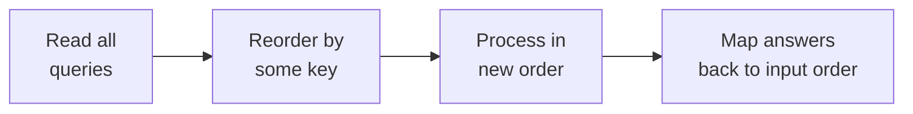
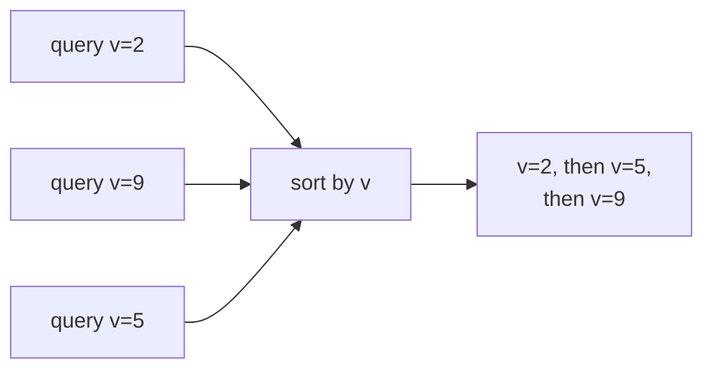
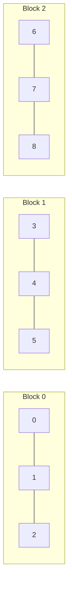
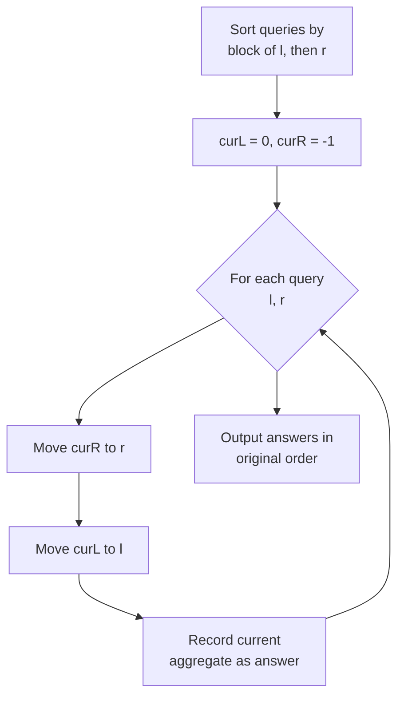
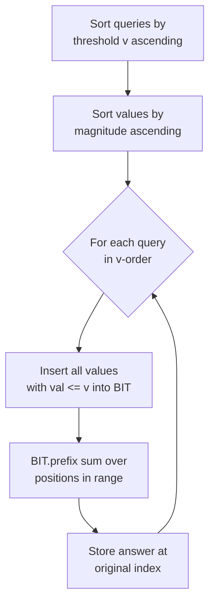
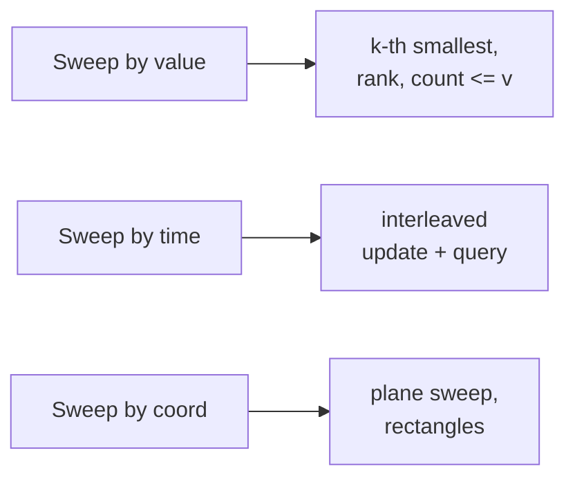
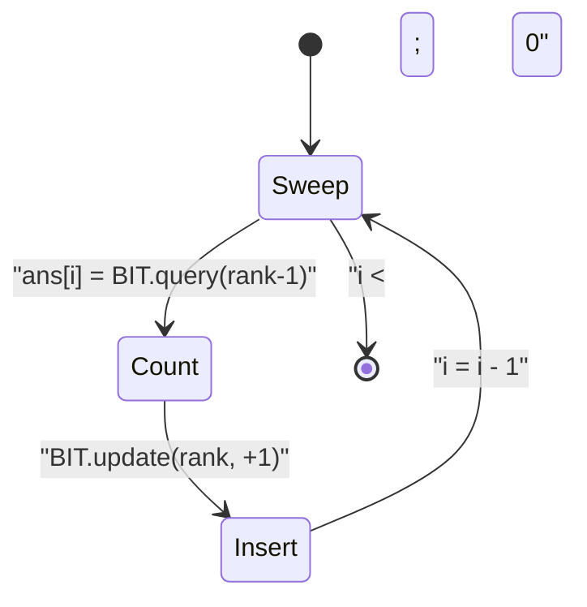
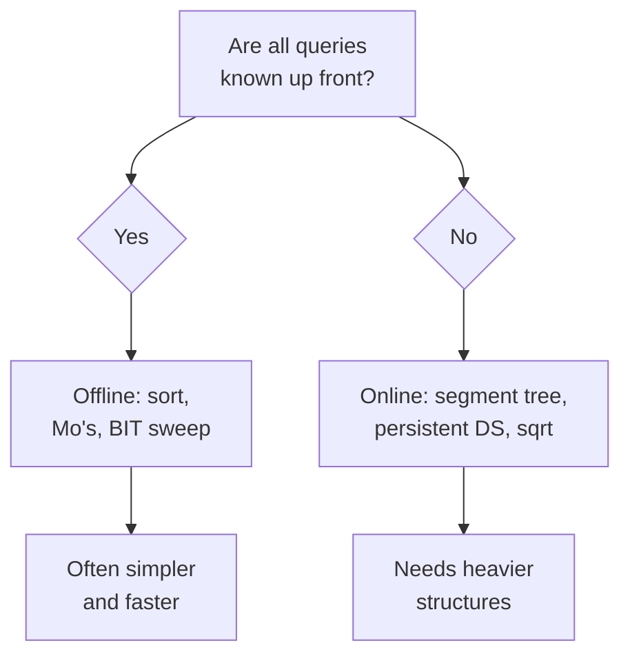

# Offline Query Processing

> When you are allowed to read **all** queries before answering any of them, you gain a superpower: you can **reorder** the queries into a sequence that is cheap to process. This guide covers offline thinking, sorting queries, **Mo's algorithm**, and **offline + Fenwick/BIT** sweeps.

## Table of Contents

- [What "Offline" Means](#what-offline-means)
- [Sorting Queries Into a Convenient Order](#sorting-queries-into-a-convenient-order)
- [Mo's Algorithm](#mos-algorithm)
- [Offline + Fenwick/BIT](#offline--fenwickbit)
- [Sweeping by Value or by Time](#sweeping-by-value-or-by-time)
- [Offline vs Online Trade-offs](#offline-vs-online-trade-offs)
- [Complexity Summary](#complexity-summary)
- [Common Pitfalls](#common-pitfalls)
- [Patterns](#patterns)

## What "Offline" Means

A problem is **online** if you must answer each query immediately, before seeing the next one. A problem is **offline** if all queries are given up front, so you may:

- **Read everything first**, then decide an order.
- **Reorder** queries to minimize repeated work.
- **Interleave** updates and queries along a sweep dimension (value, time, or index).

The key insight: answering queries in input order may be expensive, but answering them in a **clever order** can be near linear. Let the queries be $Q = \{q_1, q_2, \dots, q_m\}$. Offline processing chooses a permutation $\pi$ so that the total transition cost

$$\sum_{i=1}^{m-1} \text{cost}\big(q_{\pi(i)} \to q_{\pi(i+1)}\big)$$

is minimized, then maps answers back to original indices.



The only requirement to go offline: **the answer to a query must not depend on results of earlier queries** (no forced sequential dependency). Counting, range statistics, and "snapshot" questions all qualify.

## Sorting Queries Into a Convenient Order

The simplest offline trick is to **sort queries** by a chosen key so a single sweep answers them all.

Example: queries ask "how many array elements are $\le v$ within prefix $[0, r]$". If we sort queries by $v$ and also sort the elements by value, we can advance a pointer that inserts elements into a structure exactly once.



Each element is inserted **once** across the whole sweep, giving amortized linear insertion cost on top of the sort.

## Mo's Algorithm

**Mo's algorithm** answers range queries $[l, r]$ offline using **sqrt decomposition of the queries**. It maintains a current window $[\text{curL}, \text{curR}]$ and moves the endpoints one step at a time, using `add(x)` and `remove(x)` to update an aggregate (e.g. number of distinct values).

### Block ordering

Split indices into blocks of size $B \approx \sqrt{n}$. Sort queries by:

1. **Block of `l`** (ascending).
2. **`r`** (ascending; optionally descending on odd blocks for a constant-factor speedup).



### Pointer movement

Two pointers chase the target window. Each step adjusts the aggregate in $O(1)$.

```mermaid
stateDiagram-v2
  [*] --> Window
  Window --> ExpandR : "curR &lt; r, add(++curR)"
  Window --> ShrinkR : "curR &gt; r, remove(curR--)"
  Window --> ExpandL : "curL &gt; l, add(--curL)"
  Window --> ShrinkL : "curL &lt; l, remove(curL++)"
  ExpandR --> Window
  ShrinkR --> Window
  ExpandL --> Window
  ShrinkL --> Window
  Window --> [*] : "window == query"
```

### Complexity

- `r` moves a total of $O(n\sqrt{n})$ across all queries (monotone within each block of `l`).
- `l` moves $O(B)$ per query, totalling $O(m\sqrt{n})$.

Total: $O\big((n + m)\sqrt{n}\big)$ with $B = \sqrt{n}$.



### Mo's algorithm code

```python
import sys
from math import isqrt

def mos_distinct(arr, queries):
    n = len(arr)
    q = len(queries)
    block = max(1, isqrt(n))

    # queries[i] = (l, r) inclusive, 0-indexed
    order = sorted(range(q), key=lambda i: (queries[i][0] // block,
                                            queries[i][1]))
    cnt = {}
    distinct = 0
    cur_l, cur_r = 0, -1
    ans = [0] * q

    def add(x):
        nonlocal distinct
        c = cnt.get(x, 0)
        if c == 0:
            distinct += 1
        cnt[x] = c + 1

    def remove(x):
        nonlocal distinct
        c = cnt[x]
        if c == 1:
            distinct -= 1
        cnt[x] = c - 1

    for i in order:
        l, r = queries[i]
        while cur_r < r:
            cur_r += 1
            add(arr[cur_r])
        while cur_r > r:
            remove(arr[cur_r])
            cur_r -= 1
        while cur_l > l:
            cur_l -= 1
            add(arr[cur_l])
        while cur_l < l:
            remove(arr[cur_l])
            cur_l += 1
        ans[i] = distinct
    return ans
```

```cpp
#include <bits/stdc++.h>
using namespace std;

int blockSize;

struct Query { int l, r, idx; };

vector<int> mosDistinct(const vector<int>& arr,
                        const vector<pair<int,int>>& queries) {
    int n = (int)arr.size();
    int q = (int)queries.size();
    blockSize = max(1, (int)sqrt((double)n));

    vector<Query> qs(q);
    for (int i = 0; i < q; ++i)
        qs[i] = {queries[i].first, queries[i].second, i};

    sort(qs.begin(), qs.end(), [](const Query& a, const Query& b) {
        int ba = a.l / blockSize, bb = b.l / blockSize;
        if (ba != bb) return ba < bb;
        return a.r < b.r;
    });

    unordered_map<int, long long> cnt;
    long long distinct = 0;
    int curL = 0, curR = -1;
    vector<int> ans(q, 0);

    auto add = [&](int x) {
        if (cnt[x] == 0) ++distinct;
        ++cnt[x];
    };
    auto remove = [&](int x) {
        if (cnt[x] == 1) --distinct;
        --cnt[x];
    };

    for (const Query& cur : qs) {
        int l = cur.l, r = cur.r;
        while (curR < r) add(arr[++curR]);
        while (curR > r) remove(arr[curR--]);
        while (curL > l) add(arr[--curL]);
        while (curL < l) remove(arr[curL++]);
        ans[cur.idx] = (int)distinct;
    }
    return ans;
}
```

## Offline + Fenwick/BIT

When queries are about counts that change as we sweep, a **Fenwick tree (BIT)** shines. Process queries **sorted by a threshold** while inserting array elements into the BIT in the same threshold order. Every element is inserted once; every query reads a prefix sum.

Pattern: queries "count elements $\le v$ among prefix $[0, r]$".

1. Sort queries ascending by $v$.
2. Walk a pointer over array values sorted ascending; insert each value's **position** into the BIT when its value $\le v$.
3. Answer the query as a prefix-count over positions $\le r$.



### Offline BIT code

```python
class BIT:
    def __init__(self, n):
        self.n = n
        self.tree = [0] * (n + 1)

    def update(self, i, delta=1):
        i += 1
        while i <= self.n:
            self.tree[i] += delta
            i += i & (-i)

    def query(self, i):  # prefix count over positions [0, i]
        i += 1
        s = 0
        while i > 0:
            s += self.tree[i]
            i -= i & (-i)
        return s

def count_le_v_in_prefix(arr, queries):
    # queries[k] = (r, v): count elements arr[0..r] with value <= v
    n = len(arr)
    indexed = sorted(range(n), key=lambda i: arr[i])  # by value
    order = sorted(range(len(queries)), key=lambda k: queries[k][1])  # by v

    bit = BIT(n)
    ans = [0] * len(queries)
    ptr = 0
    for k in order:
        r, v = queries[k]
        while ptr < n and arr[indexed[ptr]] <= v:
            bit.update(indexed[ptr], 1)
            ptr += 1
        ans[k] = bit.query(r)
    return ans
```

```cpp
#include <bits/stdc++.h>
using namespace std;

struct BIT {
    int n;
    vector<long long> tree;
    BIT(int n) : n(n), tree(n + 1, 0) {}

    void update(int i, long long delta = 1) {
        for (++i; i <= n; i += i & (-i)) tree[i] += delta;
    }
    long long query(int i) {  // prefix count over positions [0, i]
        long long s = 0;
        for (++i; i > 0; i -= i & (-i)) s += tree[i];
        return s;
    }
};

vector<long long> countLeVInPrefix(const vector<int>& arr,
                                  const vector<pair<int,int>>& queries) {
    int n = (int)arr.size();
    vector<int> indexed(n);
    iota(indexed.begin(), indexed.end(), 0);
    sort(indexed.begin(), indexed.end(),
        [&](int a, int b) { return arr[a] < arr[b]; });

    int m = (int)queries.size();
    vector<int> order(m);
    iota(order.begin(), order.end(), 0);
    sort(order.begin(), order.end(),
        [&](int a, int b) { return queries[a].second < queries[b].second; });

    BIT bit(n);
    vector<long long> ans(m, 0);
    int ptr = 0;
    for (int k : order) {
        int r = queries[k].first, v = queries[k].second;
        while (ptr < n && arr[indexed[ptr]] <= v) {
            bit.update(indexed[ptr], 1);
            ++ptr;
        }
        ans[k] = bit.query(r);
    }
    return ans;
}
```

## Sweeping by Value or by Time

Offline processing often picks a **sweep dimension**:

- **By value**: insert elements from smallest to largest; queries thresholded by value are answered when the sweep crosses their threshold. Useful for "k-th smallest", "count $\le v$", rank queries.
- **By time**: for problems with updates and queries interleaved, replay them in time order, or reverse time (process deletions as insertions backwards).
- **By coordinate**: classic plane sweep; sort events by $x$, maintain a structure over $y$.



A useful identity for **count of smaller elements to the right** (inversions-style): for each index $i$, the answer is the number of $j > i$ with $a_j < a_i$. Sweeping **right to left** and inserting values into a BIT keyed by compressed value gives each answer as a prefix count:

$$\text{ans}[i] = \text{BIT.query}\big(\text{rank}(a_i) - 1\big)$$

after which we insert $a_i$.



## Offline vs Online Trade-offs



| Aspect | Offline | Online |
| --- | --- | --- |
| Query visibility | All known first | One at a time |
| Typical tools | Mo's, sorted sweep, BIT | Segment tree, persistent, balanced BST |
| Reordering allowed | Yes | No |
| Updates between queries | Hard unless tracked | Natural |
| Code complexity | Usually lower | Usually higher |

Choose **offline** when there are no forced interdependencies and the batch fits in memory. Choose **online** when answers must come back immediately or when later queries depend on earlier answers.

## Complexity Summary

| Technique | Time | Space | Notes |
| --- | --- | --- | --- |
| Sort queries + sweep | $O((n + m)\log)$ | $O(n + m)$ | One pass after sort |
| Mo's algorithm | $O((n + m)\sqrt{n})$ | $O(n + m)$ | Needs $O(1)$ add/remove |
| Offline + BIT | $O((n + m)\log n)$ | $O(n)$ | Threshold sweep |
| Count-smaller-after-self | $O(n\log n)$ | $O(n)$ | BIT or merge sort |

## Common Pitfalls

- **Forgetting to map answers back** to the original query order after sorting.
- **Hidden dependencies**: if query $i$ depends on the result of query $i-1$, you cannot reorder.
- **Mo's `add`/`remove` not $O(1)$**: distinct counting needs a frequency map, not a recompute.
- **Pointer move order in Mo's**: expand before shrink to avoid temporarily empty windows producing wrong aggregates; a safe order is grow `r`, then grow `l` inward correctly.
- **Coordinate compression off-by-one**: ranks must be $1$-indexed for the BIT and consistent across the whole sweep.
- **Inclusive vs exclusive ranges**: decide once whether $[l, r]$ is inclusive and keep it consistent.

## Patterns

- **Read-all-then-reorder**: the universal offline mindset.
- **Threshold sweep + BIT**: count/rank queries answered by inserting once per element.
- **Mo's algorithm**: any range aggregate with cheap incremental updates and no point updates.
- **Reverse-time processing**: turn deletions into insertions by walking time backwards.
- **Right-to-left BIT**: inversions, count-smaller-after-self, count-greater-before.

---

Per-file code block count — Python: 2, C++: 2 (matched).
