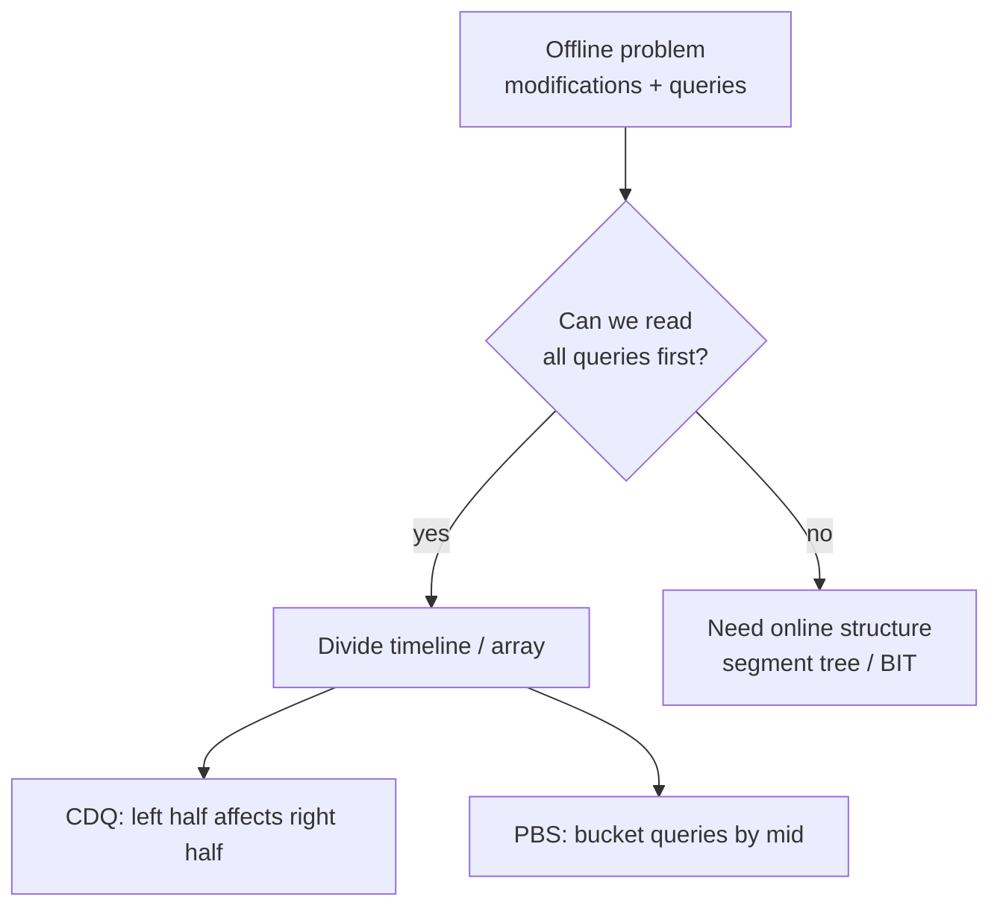
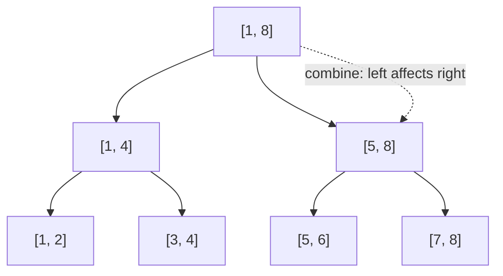
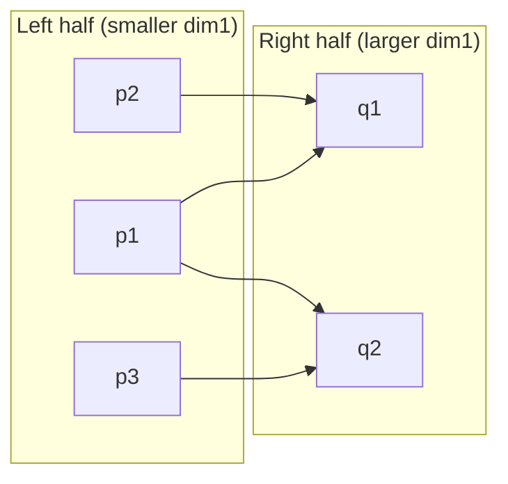
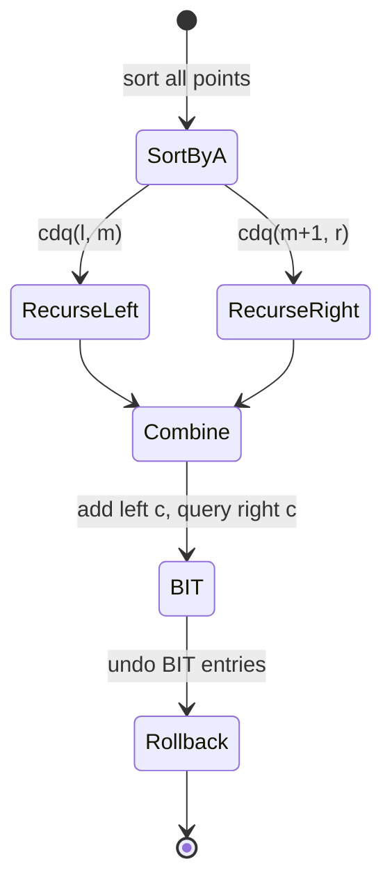
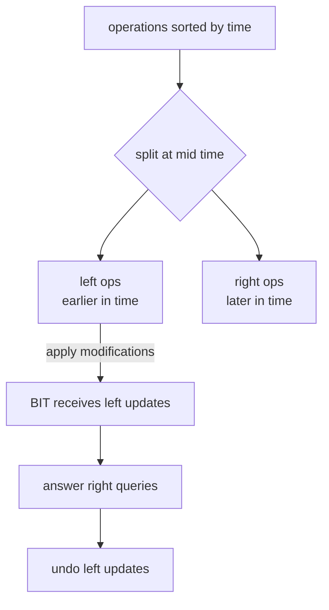
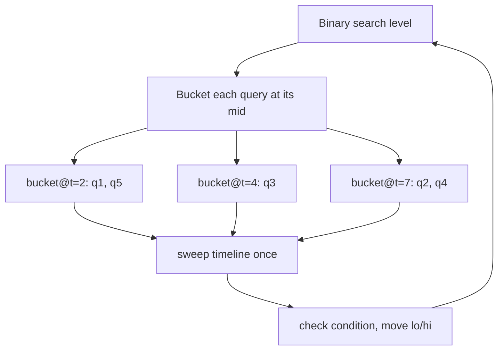
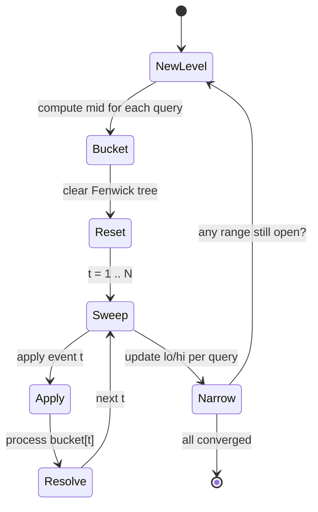
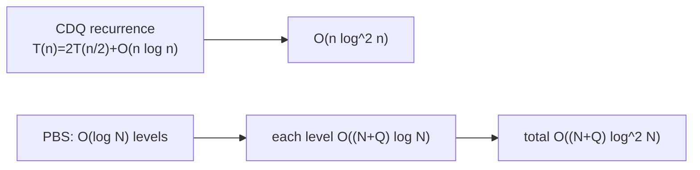

# Divide &amp; Conquer: CDQ Divide and Conquer &amp; Parallel Binary Search

> Two powerful **offline** divide-and-conquer techniques. **CDQ divide and conquer** splits a sequence of points or operations in half, solves each half recursively, and then computes how the **left half contributes to the right half**. **Parallel binary search (PBS)** runs a binary search on the answer for **many queries at once**, sweeping the event timeline a single time per binary-search level.

## Table of Contents

- [Why Offline Divide and Conquer](#why-offline-divide-and-conquer)
- [CDQ Divide and Conquer Idea](#cdq-divide-and-conquer-idea)
- [Canonical 3D Partial Order (Dominance Counting)](#canonical-3d-partial-order-dominance-counting)
- [CDQ for Dynamic Problems](#cdq-for-dynamic-problems)
- [Parallel Binary Search](#parallel-binary-search)
- [Complexity Analysis](#complexity-analysis)
- [Complexity Summary](#complexity-summary)
- [Common Pitfalls](#common-pitfalls)
- [Patterns](#patterns)

## Why Offline Divide and Conquer

Many problems mix **modifications** and **queries** over time, or ask about **multi-dimensional dominance**. When we are allowed to read **all** queries before answering (an *offline* setting), we can reorder work cleverly. The unifying trick:

$$
\text{answer}(q) = \sum_{\text{all earlier work } w} \text{contribution}(w \to q)
$$

Instead of evaluating each pair $(w, q)$ directly in $O(n^2)$, we **split the timeline/array** and only ever combine a *left block* with a *right block*, giving $O(n \log n)$ or $O(n \log^2 n)$.



## CDQ Divide and Conquer Idea

CDQ (named after competitor Chen Danqi) is **divide and conquer on the index/time axis**. Given points $p_1, p_2, \dots, p_n$ already sorted by the **first dimension**, we process a range $[l, r]$:

1. **Divide**: split into $[l, m]$ and $[m+1, r]$.
2. **Conquer**: recurse on each half independently.
3. **Combine (the heart of CDQ)**: compute the contribution of **left-half elements onto right-half elements**. Because every left element has a smaller first dimension than every right element (after the sort), the first dimension is *automatically satisfied* during the combine step — we only need to handle the remaining dimensions.



The combine step is where a Fenwick tree (BIT) or a merge sweep does the heavy lifting. The left-affects-right arrow is the entire intuition:



### CDQ Skeleton

```python
def cdq(l, r):
    if l == r:
        return
    m = (l + r) // 2
    cdq(l, m)            # solve left
    cdq(m + 1, r)        # solve right
    # combine: contribution of [l, m] onto [m+1, r]
    # here both halves are individually sorted by dim2;
    # merge them while a BIT accumulates dim3 from the left.
    i = l
    for j in range(m + 1, r + 1):
        while i <= m and a[i].d2 <= a[j].d2:
            bit_add(a[i].d3, 1)   # left point enters the window
            i += 1
        a[j].ans += bit_query(a[j].d3)  # count left points dominating j
    for k in range(l, i):
        bit_add(a[k].d3, -1)     # roll back the BIT (keep it clean)
    merge_by_d2(l, m, r)         # keep [l, r] sorted by dim2 for parent
```

```cpp
void cdq(int l, int r) {
    if (l == r) return;
    int m = (l + r) / 2;
    cdq(l, m);            // solve left
    cdq(m + 1, r);        // solve right
    // combine: contribution of [l, m] onto [m+1, r]
    // here both halves are individually sorted by dim2;
    // merge them while a BIT accumulates dim3 from the left.
    int i = l;
    for (int j = m + 1; j <= r; ++j) {
        while (i <= m && a[i].d2 <= a[j].d2) {
            bit_add(a[i].d3, 1);   // left point enters the window
            ++i;
        }
        a[j].ans += bit_query(a[j].d3); // count left points dominating j
    }
    for (int k = l; k < i; ++k)
        bit_add(a[k].d3, -1);    // roll back the BIT (keep it clean)
    merge_by_d2(l, m, r);        // keep [l, r] sorted by dim2 for parent
}
```

## Canonical 3D Partial Order (Dominance Counting)

The textbook CDQ problem. Given $n$ points with three attributes $(a, b, c)$, for each point count how many other points $j$ satisfy

$$
a_j \le a_i \;\land\; b_j \le b_i \;\land\; c_j \le c_i .
$$

Three nested dimensions, three layers of technique:

| Dimension | How it is handled |
| --------- | ----------------- |
| 1st ($a$) | **Sort** the whole array once. Recursion guarantees left has smaller $a$. |
| 2nd ($b$) | **CDQ merge** — process left and right in $b$-sorted order. |
| 3rd ($c$) | **BIT** indexed by $c$ — count points with $c_j \le c_i$. |



A subtlety: equal triples must be **deduplicated and weighted**, otherwise points with identical $(a,b,c)$ never count each other inside the combine step (they may land in the same half but the second one is processed after the BIT already cleared). The full self-contained solution lives in the companion problem file.

## CDQ for Dynamic Problems

CDQ also linearizes **modifications + queries over time**. Treat *time* as the first dimension. Each operation is a point:

- A **modification** at time $t$: "value $v$ appears at position $x$."
- A **query** at time $t$: "sum/count over some range."

Split the operation list by time. In the combine step only **left modifications** (earlier in time) can affect **right queries** (later in time), so we apply the left half's modifications, answer the right half's queries, then undo. This converts an online data-structure problem into an offline $O(n \log^2 n)$ sweep.



The key invariant:

$$
\text{answer}(q_{\text{right}}) \mathrel{+}= \sum_{\substack{u \in \text{left} \\ t_u < t_q}} \text{effect}(u \to q)
$$

## Parallel Binary Search

Suppose we have a **monotone timeline of events** and $Q$ queries, each asking *"what is the earliest moment $T_q$ at which my condition becomes true?"*. Each query is individually solvable by binary search on $T$, costing $O(\log N)$ checks, each check replaying events up to a time — that is $O(Q \log N \cdot N)$ total, too slow.

**Parallel binary search** runs all $Q$ binary searches **in lockstep**. At every level:

1. Each still-undecided query has a current midpoint $\text{mid}_q = \lfloor (lo_q + hi_q)/2 \rfloor$.
2. **Bucket** every query into bucket $\text{mid}_q$.
3. **Sweep the timeline once** from time $1$ to $N$. After applying event $t$, process all queries in bucket $t$: evaluate the condition with a Fenwick tree, then move $lo_q$ or $hi_q$.
4. Repeat $O(\log N)$ levels. Each level is a single $O((N + Q)\log N)$ sweep.



The single-sweep-per-level structure:



### Parallel Binary Search Skeleton

```python
def parallel_binary_search(num_events, queries):
    lo = [1] * len(queries)
    hi = [num_events + 1] * len(queries)  # +1 = "never happens"
    changed = True
    while changed:
        changed = False
        buckets = [[] for _ in range(num_events + 2)]
        for q in range(len(queries)):
            if lo[q] < hi[q]:
                mid = (lo[q] + hi[q]) // 2
                buckets[mid].append(q)
                changed = True
        bit_clear()
        for t in range(1, num_events + 1):
            apply_event(t)                 # one event added to the BIT
            for q in buckets[t]:
                if condition_holds(queries[q]):
                    hi[q] = t              # success no later than t
                else:
                    lo[q] = t + 1          # need more events
    return [lo[q] if lo[q] <= num_events else -1 for q in range(len(queries))]
```

```cpp
vector<long long> parallel_binary_search(int num_events,
                                         vector<Query> &queries) {
    int Q = (int)queries.size();
    vector<int> lo(Q, 1), hi(Q, num_events + 1); // +1 = "never happens"
    bool changed = true;
    while (changed) {
        changed = false;
        vector<vector<int>> buckets(num_events + 2);
        for (int q = 0; q < Q; ++q) {
            if (lo[q] < hi[q]) {
                int mid = (lo[q] + hi[q]) / 2;
                buckets[mid].push_back(q);
                changed = true;
            }
        }
        bit_clear();
        for (int t = 1; t <= num_events; ++t) {
            apply_event(t);                // one event added to the BIT
            for (int q : buckets[t]) {
                if (condition_holds(queries[q]))
                    hi[q] = t;             // success no later than t
                else
                    lo[q] = t + 1;         // need more events
            }
        }
    }
    vector<long long> ans(Q);
    for (int q = 0; q < Q; ++q)
        ans[q] = (lo[q] <= num_events) ? lo[q] : -1;
    return ans;
}
```

## Complexity Analysis

For **CDQ**, the recurrence mirrors merge sort but each combine touches a BIT:

$$
T(n) = 2\,T\!\left(\tfrac{n}{2}\right) + O(n \log n) \;\Rightarrow\; T(n) = O(n \log^2 n).
$$

If the combine is a plain two-pointer merge (no BIT) it drops to $O(n \log n)$, exactly merge sort — which is how CDQ counts plain 2D inversions.

For **PBS**, there are $O(\log N)$ levels. Each level performs one timeline sweep applying $N$ events plus resolving $Q$ queries, each event/query costing $O(\log N)$ for Fenwick operations:

$$
O\big((N + Q)\log N \cdot \log N\big) = O\big((N + Q)\log^2 N\big).
$$



## Complexity Summary

| Technique | Time | Space | Notes |
| --------- | ---- | ----- | ----- |
| CDQ 2D inversions (merge only) | $O(n \log n)$ | $O(n)$ | combine is a merge |
| CDQ 3D dominance (BIT) | $O(n \log^2 n)$ | $O(n)$ | sort + merge + BIT |
| CDQ dynamic (time as dim1) | $O(n \log^2 n)$ | $O(n)$ | modifications vs queries |
| Parallel binary search | $O((N + Q) \log^2 N)$ | $O(N + Q)$ | $\log N$ sweeps |
| Naive per-query binary search | $O(Q \cdot N \log N)$ | $O(N)$ | replays per query |

## Common Pitfalls

- **Forgetting to roll back the BIT** after a combine step. Always undo exactly the entries you added (do not call `clear`, which is $O(\text{size})$ and ruins complexity).
- **Wrong tie handling.** Decide upfront whether the dominance uses $\le$ or $<$ on each dimension, and deduplicate identical tuples with multiplicity for 3D partial order.
- **Sorting inside recursion.** Sort by dim1 **once** at the top; let the merge maintain dim2 order. Re-sorting each call destroys the complexity.
- **PBS infinite loop.** Use the half-open invariant $lo < hi$ and ensure each resolved query strictly shrinks its range, with $hi = N+1$ meaning "never".
- **PBS not clearing the Fenwick tree** between levels — every level must start from a clean structure.
- **Stable vs unstable merge.** Use a stable merge so equal dim2 keeps left-before-right ordering, otherwise contributions leak.

## Patterns

- **Three nested constraints** $\Rightarrow$ sort one, CDQ the second, BIT the third.
- **Modifications interleaved with queries, offline** $\Rightarrow$ CDQ with time as the first dimension.
- **Many queries each binary-searchable on a shared monotone timeline** $\Rightarrow$ parallel binary search.
- **"K-th event after which condition holds"** for many independent actors $\Rightarrow$ PBS + Fenwick.
- **Counting inversions as elements appear over time** $\Rightarrow$ CDQ (time, position, value).
- Whenever a per-query binary search would replay the *same* event stream, parallelize it.
