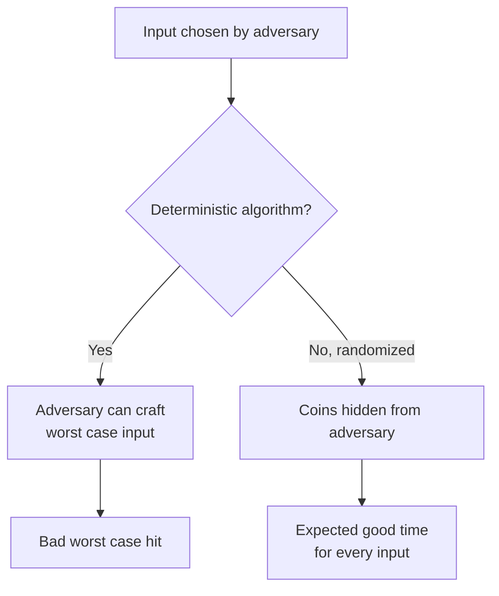
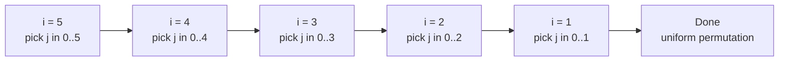
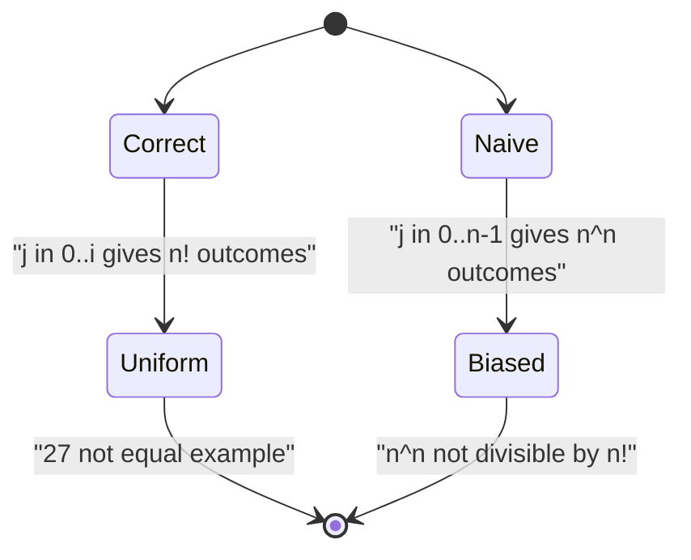
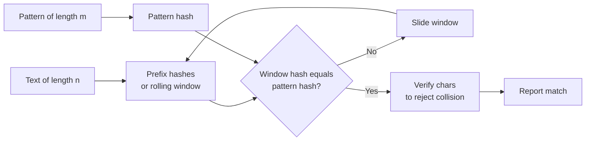
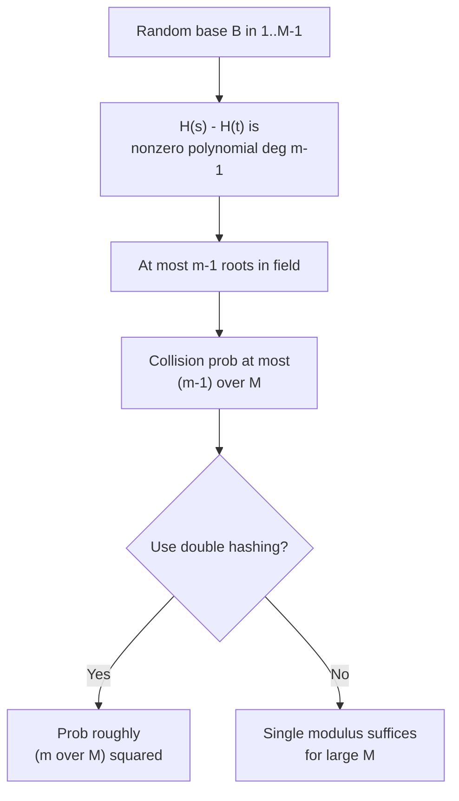
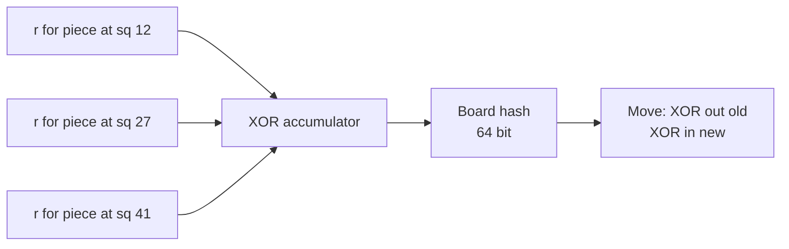
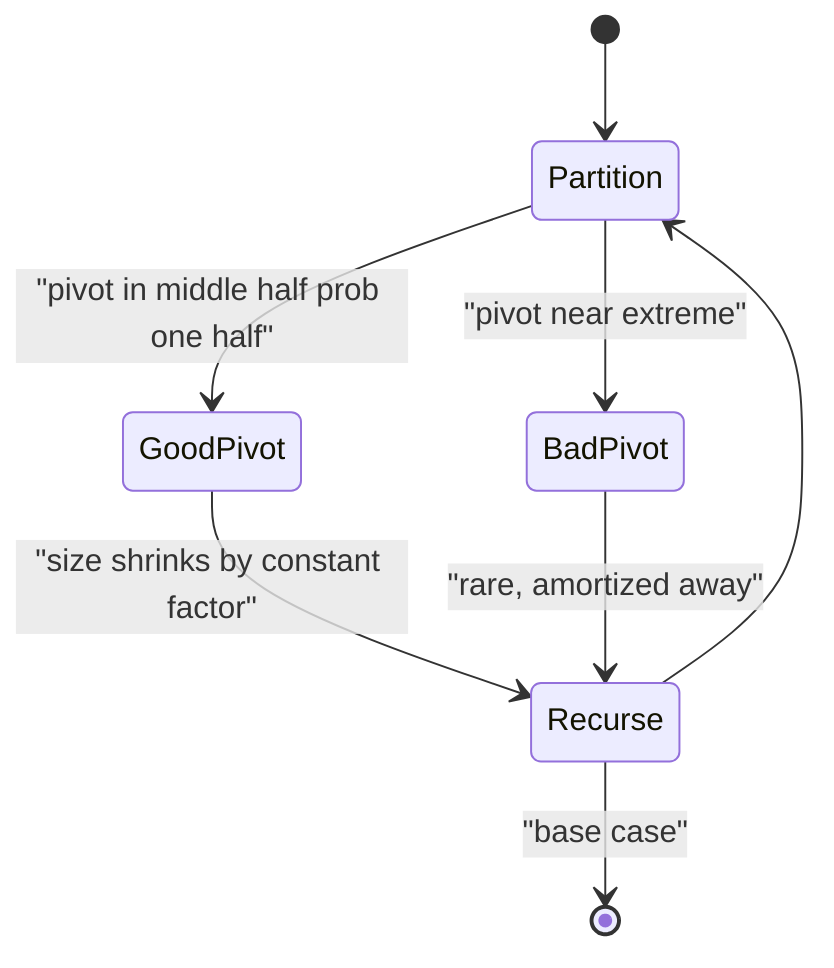
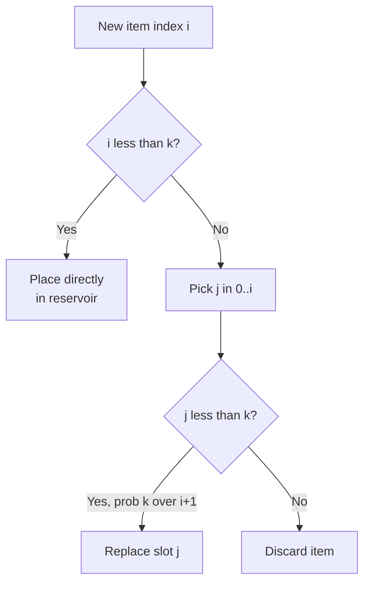
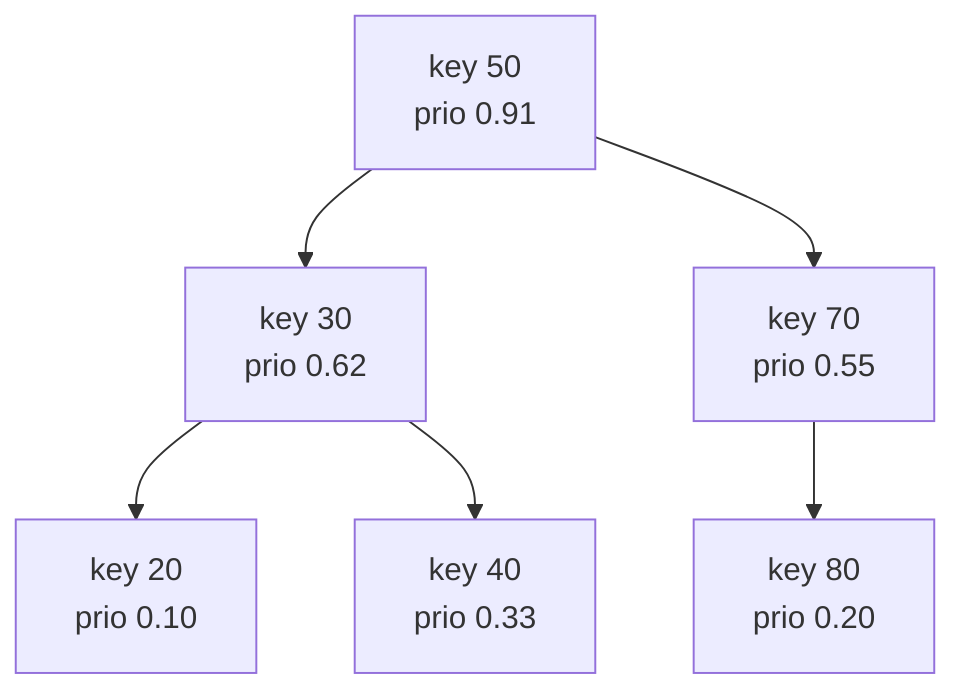
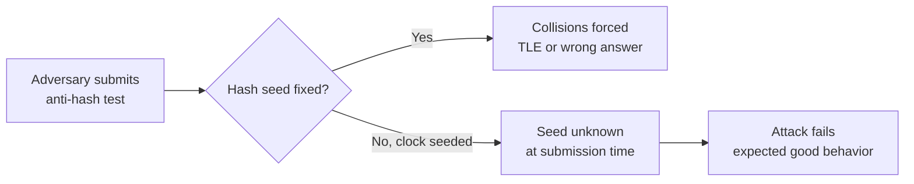

# Randomization: Hashing, Shuffles, and Expected-Time Guarantees

> Randomization is the art of trading a *guaranteed* worst case for an *expected* good case. By injecting controlled randomness we break adversarial inputs, simplify algorithms, and obtain bounds that hold *in expectation* regardless of how the input was chosen. This guide covers shuffling, hashing, sampling, and randomized data structures.

## Table of Contents

1. [Why Randomization Helps](#why-randomization-helps)
2. [The Fisher-Yates Shuffle](#the-fisher-yates-shuffle)
3. [Why the Naive Shuffle Is Biased](#why-the-naive-shuffle-is-biased)
4. [Polynomial and Rolling Hashing](#polynomial-and-rolling-hashing)
5. [Collision Probability](#collision-probability)
6. [Randomized Set Hashing and Zobrist Hashing](#randomized-set-hashing-and-zobrist-hashing)
7. [Randomized Pivots in Quickselect and Quicksort](#randomized-pivots-in-quickselect-and-quicksort)
8. [Reservoir Sampling](#reservoir-sampling)
9. [Treaps: Randomized Binary Search Trees](#treaps-randomized-binary-search-trees)
10. [Defending Against Hash-Hacking](#defending-against-hash-hacking)
11. [Complexity Summary](#complexity-summary)
12. [Common Pitfalls](#common-pitfalls)
13. [Patterns](#patterns)

---

## Why Randomization Helps

There are three distinct reasons to reach for randomness:

- **Breaking adversarial worst cases.** A deterministic algorithm has a fixed worst-case input. An adversary who knows your code can construct it. If your pivot choice is *random*, the adversary cannot predict it, so the expected running time is good *for every input*.
- **Simplicity.** Randomized algorithms are often dramatically simpler than their deterministic counterparts (e.g. a treap versus a red-black tree, or randomized quickselect versus median-of-medians).
- **Expected-time guarantees.** Many problems admit an $O(n)$ expected-time solution whose worst case is worse but astronomically unlikely.

The key shift in mindset: with a deterministic algorithm the *input* is the random variable (and an adversary controls it). With a randomized algorithm the *algorithm's coin flips* are the random variable, and we control those. The expectation is taken over our own coins, so it holds for **every** input.



---

## The Fisher-Yates Shuffle

The Fisher-Yates (a.k.a. Knuth) shuffle produces a **uniformly random permutation** of an array in $O(n)$ time. The invariant is simple: after processing index $i$, the suffix $a[i \ldots n-1]$ is a uniformly random subset placed in uniformly random order, and the prefix is fixed.

The algorithm walks from the last index down to the first. At step $i$ it picks a random index $j$ in $[0, i]$ and swaps $a[i]$ with $a[j]$.

```python
import random

def fisher_yates(a):
    n = len(a)
    for i in range(n - 1, 0, -1):
        j = random.randint(0, i)   # inclusive range [0, i]
        a[i], a[j] = a[j], a[i]
    return a
```

```cpp
#include <bits/stdc++.h>
using namespace std;

mt19937_64 rng(chrono::steady_clock::now().time_since_epoch().count());

void fisher_yates(vector<long long>& a) {
    int n = (int)a.size();
    for (int i = n - 1; i > 0; --i) {
        uniform_int_distribution<int> dist(0, i); // inclusive [0, i]
        int j = dist(rng);
        swap(a[i], a[j]);
    }
}
```

Think of the swap walk as a graph where each node is a position and each step draws one edge to the chosen partner:



### Uniformity Proof

There are $n!$ permutations. The algorithm makes choices with $n \cdot (n-1) \cdots 2 = n!$ equally likely outcomes: at step $i$ there are exactly $i+1$ choices for $j$. The probability of any *specific* sequence of choices is

$$
\frac{1}{n} \cdot \frac{1}{n-1} \cdots \frac{1}{2} = \frac{1}{n!}.
$$

Each distinct sequence of choices yields a distinct permutation, and there are exactly $n!$ sequences and $n!$ permutations, so the map is a bijection. Hence every permutation occurs with probability exactly $\frac{1}{n!}$ — perfectly uniform.

---

## Why the Naive Shuffle Is Biased

A tempting but **wrong** variant swaps $a[i]$ with a random index in the *full* range $[0, n-1]$ at every step:

```python
import random

def naive_shuffle_BAD(a):
    n = len(a)
    for i in range(n):
        j = random.randint(0, n - 1)   # WRONG: full range every time
        a[i], a[j] = a[j], a[i]
    return a
```

```cpp
#include <bits/stdc++.h>
using namespace std;

mt19937_64 rng(chrono::steady_clock::now().time_since_epoch().count());

void naive_shuffle_BAD(vector<long long>& a) {
    int n = (int)a.size();
    for (int i = 0; i < n; ++i) {
        uniform_int_distribution<int> dist(0, n - 1); // WRONG: full range
        int j = dist(rng);
        swap(a[i], a[j]);
    }
}
```

This produces $n^n$ equally likely choice-sequences, but there are only $n!$ permutations. Since $n^n$ is **not divisible** by $n!$ for $n \ge 3$, the permutations *cannot* be equally likely — by the pigeonhole principle some permutations are strictly more probable than others.

For $n = 3$: there are $3^3 = 27$ outcomes spread over $6$ permutations, so $27 / 6 = 4.5$ — fractional, hence impossible to be uniform. Concretely some permutations arise from 4 sequences and others from 5.

$$
n^n \bmod n! \neq 0 \quad \Longrightarrow \quad \text{bias is unavoidable.}
$$



---

## Polynomial and Rolling Hashing

A **polynomial hash** maps a string $s$ of length $m$ to an integer by treating its characters as digits of a base-$B$ number modulo a large prime $M$:

$$
H(s) = \left( \sum_{k=0}^{m-1} s[k] \cdot B^{\,m-1-k} \right) \bmod M.
$$

The *rolling* property lets us slide a window of length $m$ across a text in $O(1)$ per step. Removing the leading character and appending a trailing one:

$$
H_{\text{new}} = \big( (H_{\text{old}} - s[\text{left}] \cdot B^{\,m-1}) \cdot B + s[\text{right}] \big) \bmod M.
$$

```python
def poly_hash(s, base, mod):
    h = 0
    for ch in s:
        h = (h * base + ord(ch)) % mod
    return h
```

```cpp
#include <bits/stdc++.h>
using namespace std;

long long poly_hash(const string& s, long long base, long long mod) {
    long long h = 0;
    for (char ch : s) {
        h = (h * base + (long long)(unsigned char)ch) % mod;
    }
    return h;
}
```

The hashing pipeline for substring search looks like this:



---

## Collision Probability

Two distinct strings collide when $H(s) = H(t)$ but $s \neq t$. For a *fixed* modulus $M$ and a *random* base $B$, the polynomial $H(s) - H(t)$ is a nonzero polynomial of degree at most $m-1$ over the field $\mathbb{Z}_M$. By the Schwartz-Zippel / fundamental-theorem-of-algebra argument, it has at most $m-1$ roots, so the probability a random base hits a root is

$$
\Pr[\text{collision}] \le \frac{m-1}{M}.
$$

Across $q$ comparisons the union bound gives $\Pr[\text{any collision}] \le \frac{q(m-1)}{M}$. With $M \approx 10^{18}$ this is negligible. Using **double hashing** (two independent moduli) squares the safety: the effective collision probability becomes roughly $\left(\frac{m}{M}\right)^2$.



---

## Randomized Set Hashing and Zobrist Hashing

To hash an **unordered set** (where insertion order must not matter) assign each possible element a fixed random 64-bit value $r_x$ and combine them with XOR or addition:

$$
H(S) = \bigoplus_{x \in S} r_x.
$$

XOR is its own inverse, so inserting or deleting an element $x$ is $O(1)$: just XOR $r_x$ in or out. Because the $r_x$ are random, two different sets collide with probability $\approx 2^{-64}$.

**Zobrist hashing** is the same idea applied to board games: each (piece, square) pair gets a random key, and the board hash is the XOR of the keys of all occupied (piece, square) pairs. A move updates the hash with two XORs (remove from old square, add to new square), enabling fast transposition tables.



---

## Randomized Pivots in Quickselect and Quicksort

Quicksort and quickselect degrade to $O(n^2)$ on adversarial inputs (e.g. already-sorted data with a first-element pivot). Choosing the pivot **uniformly at random** makes the expected number of comparisons $O(n \log n)$ for quicksort and $O(n)$ for quickselect, *independent of input order*.

The expected comparison count for randomized quicksort satisfies

$$
\mathbb{E}[C(n)] = (n-1) + \frac{1}{n}\sum_{k=0}^{n-1}\big(\mathbb{E}[C(k)] + \mathbb{E}[C(n-1-k)]\big) = O(n \log n).
$$

Intuitively a random pivot lands in the "good middle half" with probability $\tfrac{1}{2}$, so on average a constant fraction of elements is eliminated per partition.



---

## Reservoir Sampling

Reservoir sampling selects $k$ items uniformly at random from a stream of **unknown length** using $O(k)$ memory. Keep the first $k$ items. For the $i$-th item ($i \ge k$, 0-indexed) replace a random reservoir slot with probability $\frac{k}{i+1}$.

```python
import random

def reservoir_sample(stream, k):
    reservoir = []
    for i, x in enumerate(stream):
        if i < k:
            reservoir.append(x)
        else:
            j = random.randint(0, i)   # inclusive [0, i]
            if j < k:
                reservoir[j] = x
    return reservoir
```

```cpp
#include <bits/stdc++.h>
using namespace std;

mt19937_64 rng(chrono::steady_clock::now().time_since_epoch().count());

vector<long long> reservoir_sample(const vector<long long>& stream, int k) {
    vector<long long> reservoir;
    for (int i = 0; i < (int)stream.size(); ++i) {
        if (i < k) {
            reservoir.push_back(stream[i]);
        } else {
            uniform_int_distribution<int> dist(0, i); // inclusive [0, i]
            int j = dist(rng);
            if (j < k) reservoir[j] = stream[i];
        }
    }
    return reservoir;
}
```

**Why it is uniform (k = 1 case).** Item $i$ becomes the sample with probability $\frac{1}{i+1}$ and survives every later step $t > i$ with probability $\frac{t}{t+1}$. Telescoping:

$$
\frac{1}{i+1} \cdot \prod_{t=i+1}^{n-1} \frac{t}{t+1} = \frac{1}{i+1} \cdot \frac{i+1}{n} = \frac{1}{n}.
$$

Every item ends up with probability exactly $\frac{1}{n}$.



---

## Treaps: Randomized Binary Search Trees

A **treap** is a binary search tree that is *also* a heap on a random priority assigned to each node. Keys obey the BST property; priorities obey the heap property. Because priorities are random, the tree's shape is the shape that would result from inserting keys in a random order — giving expected height $O(\log n)$ **without any explicit rebalancing rules**.

Operations (split, merge, insert, erase) are short and uniform. The randomness in priorities is what defeats adversarial insertion orders that would make a plain BST degenerate into a linked list.



---

## Defending Against Hash-Hacking

Competitive judges often include **anti-hash tests**: inputs specifically constructed to force collisions in `std::unordered_map`, `std::hash`, or fixed-base polynomial hashes. The defense is to make your hash *unpredictable*:

- **Seed with the clock.** Initialize `mt19937_64` with `chrono::steady_clock::now().time_since_epoch().count()` so the seed differs on every run.
- **Random base/mod for string hashes.** Pick the polynomial base randomly in $[256, M)$ at runtime; an adversary cannot precompute a colliding pair.
- **Custom hash for unordered containers.** Wrap the key with a random odd multiplier and a `splitmix64` finalizer to scramble away from the default identity hash that anti-hash tests exploit.



A robust custom hash for `unordered_map`:

```python
# Python's dict is already randomized per-process via PYTHONHASHSEED,
# but for explicit control mix the key with a random 64-bit constant.
import random
_SALT = random.getrandbits(64)

def safe_hash(x):
    z = (x + _SALT) & 0xFFFFFFFFFFFFFFFF
    z = (z ^ (z >> 30)) * 0xBF58476D1CE4E5B9 & 0xFFFFFFFFFFFFFFFF
    z = (z ^ (z >> 27)) * 0x94D049BB133111EB & 0xFFFFFFFFFFFFFFFF
    return z ^ (z >> 31)
```

```cpp
#include <bits/stdc++.h>
using namespace std;

struct SafeHash {
    static uint64_t splitmix64(uint64_t z) {
        z += 0x9E3779B97F4A7C15ULL;
        z = (z ^ (z >> 30)) * 0xBF58476D1CE4E5B9ULL;
        z = (z ^ (z >> 27)) * 0x94D049BB133111EBULL;
        return z ^ (z >> 31);
    }
    size_t operator()(uint64_t x) const {
        static const uint64_t SALT =
            chrono::steady_clock::now().time_since_epoch().count();
        return (size_t)splitmix64(x + SALT);
    }
};
// usage: unordered_map<long long, long long, SafeHash> mp;
```

---

## Complexity Summary

| Technique | Time (expected) | Worst case | Space | Notes |
| --- | --- | --- | --- | --- |
| Fisher-Yates shuffle | $O(n)$ | $O(n)$ | $O(1)$ | Perfectly uniform |
| Polynomial / rolling hash | $O(n + m)$ | $O(nm)$ if all collide | $O(1)$ | Collision $\le \frac{m}{M}$ |
| Set / Zobrist hashing | $O(1)$ per update | $O(1)$ | $O(U)$ keys | Collision $\approx 2^{-64}$ |
| Randomized quickselect | $O(n)$ | $O(n^2)$ | $O(1)$ | Input-order independent |
| Randomized quicksort | $O(n \log n)$ | $O(n^2)$ | $O(\log n)$ | Random pivot |
| Reservoir sampling | $O(n)$ | $O(n)$ | $O(k)$ | Stream of unknown length |
| Treap operations | $O(\log n)$ | $O(n)$ | $O(n)$ | No explicit rebalancing |

---

## Common Pitfalls

- **Naive full-range shuffle.** Swapping with $[0, n-1]$ each step is biased; always restrict to $[0, i]$.
- **Off-by-one in the random range.** `random.randint(a, b)` is *inclusive* on both ends; `uniform_int_distribution<int>(a, b)` is also inclusive. Mismatching this with a half-open assumption breaks uniformity.
- **Fixed hash base/seed.** A hardcoded base invites anti-hash tests. Randomize the base and clock-seed the RNG.
- **Forgetting to verify on hash match.** A hash equality is *probable*, not certain — verify the actual characters when correctness is required.
- **Modular overflow.** In C++ multiply with `long long` and reduce mod a prime below $\sim 4.6 \times 10^{18}$ to avoid overflow, or use `__int128`.
- **Reseeding inside a loop.** Construct the RNG once; re-seeding per call wastes entropy and can correlate outputs.

---

## Patterns

- **"Make the adversary blind."** Whenever a deterministic choice has an exploitable worst case (pivot, hash base, container hash), randomize it with a clock-seeded RNG.
- **"Sample without knowing the size."** Streams or single-pass constraints → reservoir sampling.
- **"Order must not matter."** Hashing multisets/sets → XOR or sum of per-element random keys (Zobrist).
- **"Random priority = balance for free."** Need a balanced BST without complex rotations → treap.
- **"Probable equality, then verify."** Use hashing to filter candidates cheaply, then confirm to eliminate collision risk.
- **"Expected, not worst, is enough."** When the worst case is astronomically unlikely, accept an expected-time guarantee for a much simpler algorithm.
