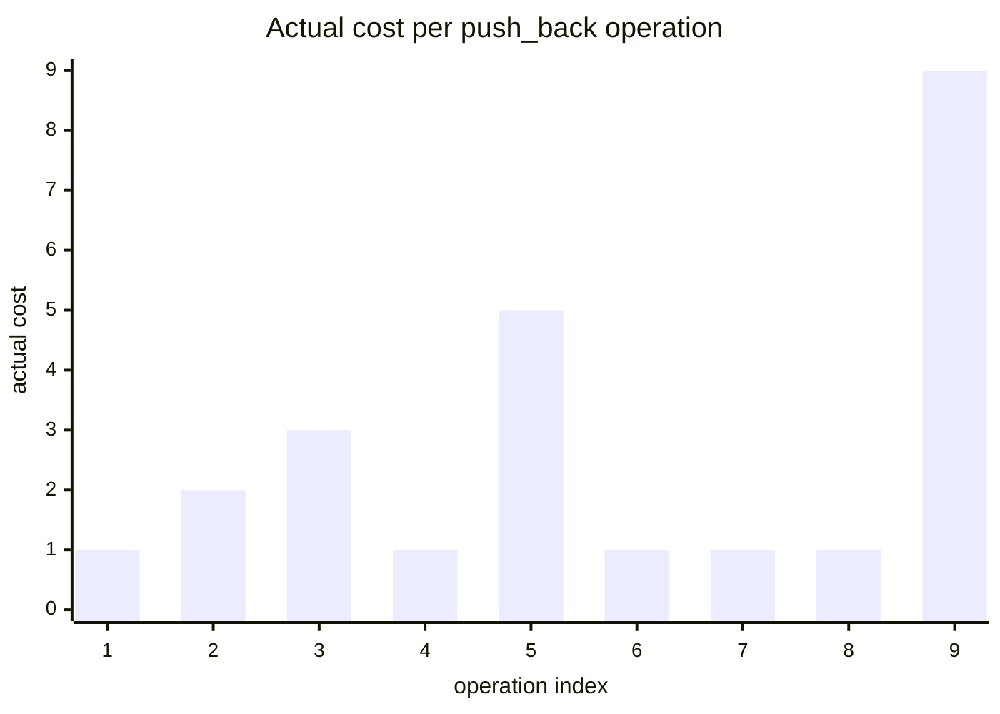
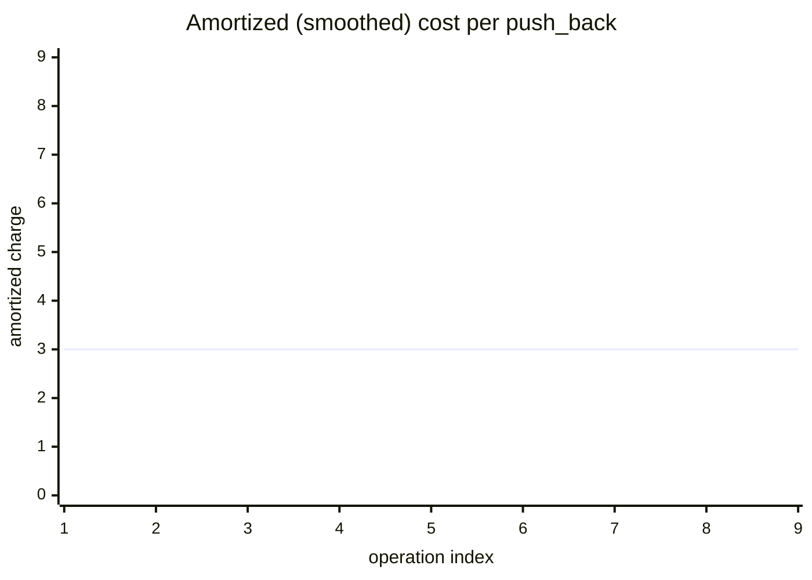
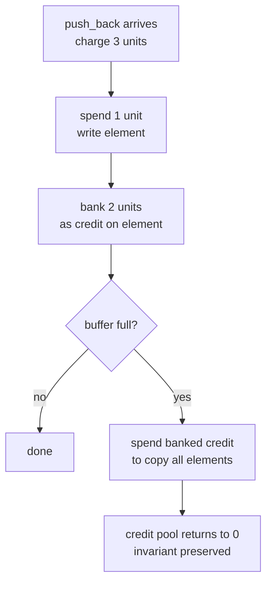
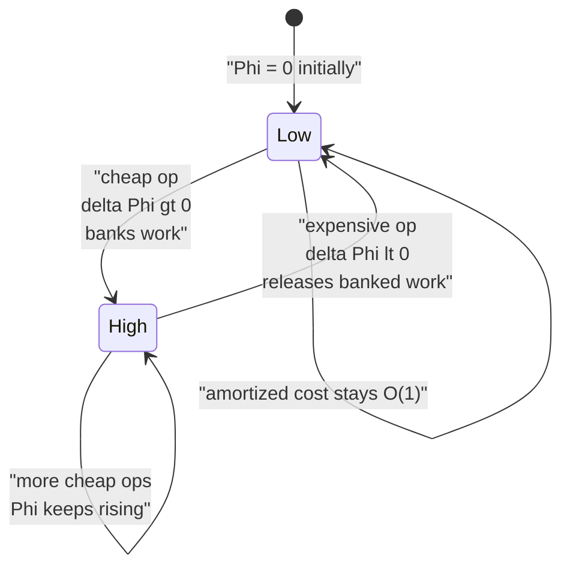
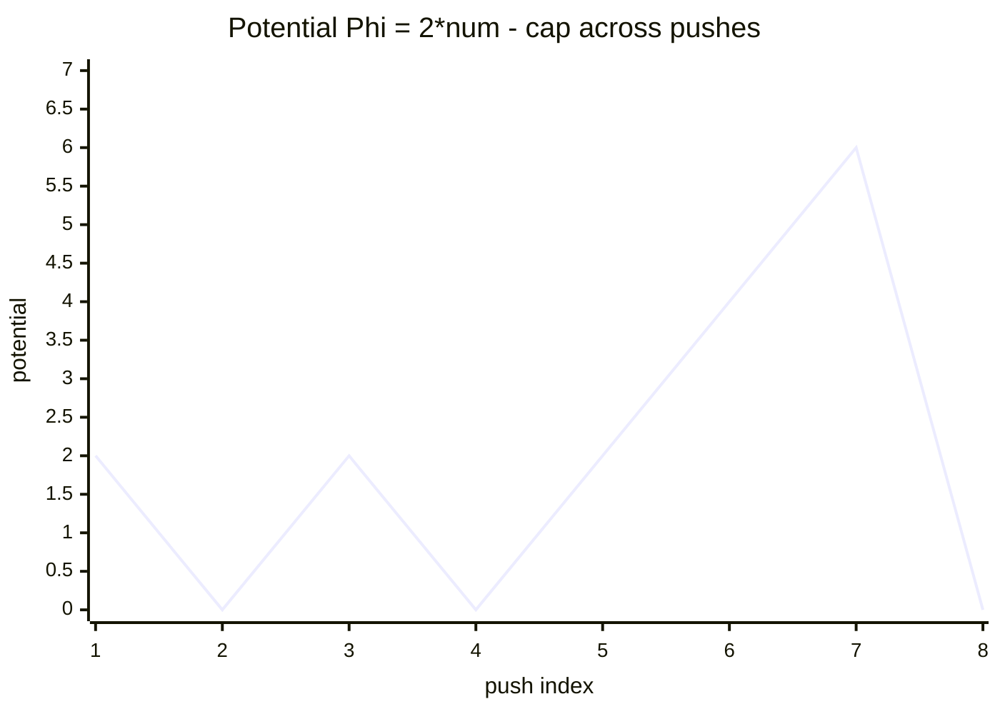
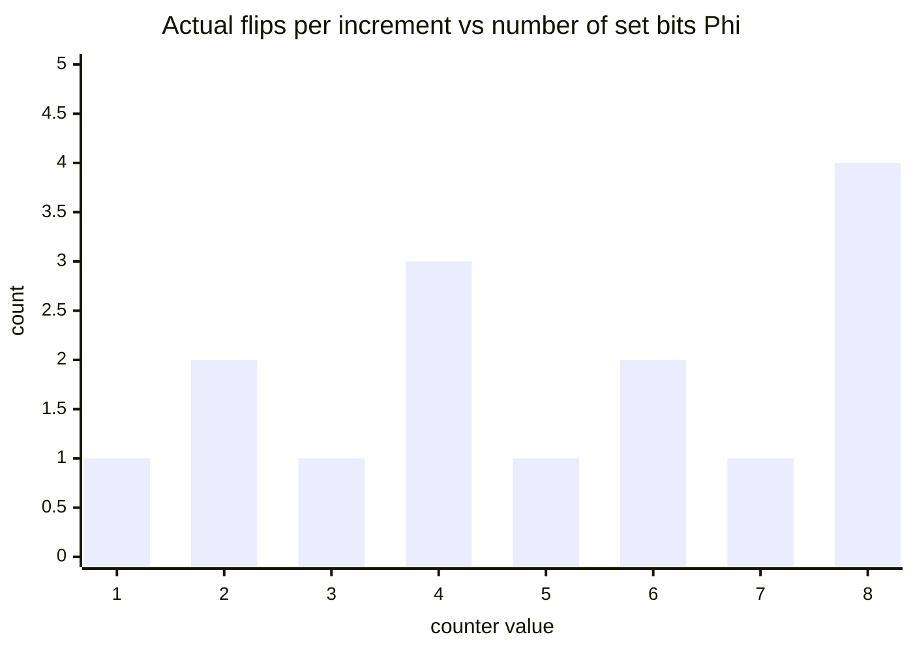
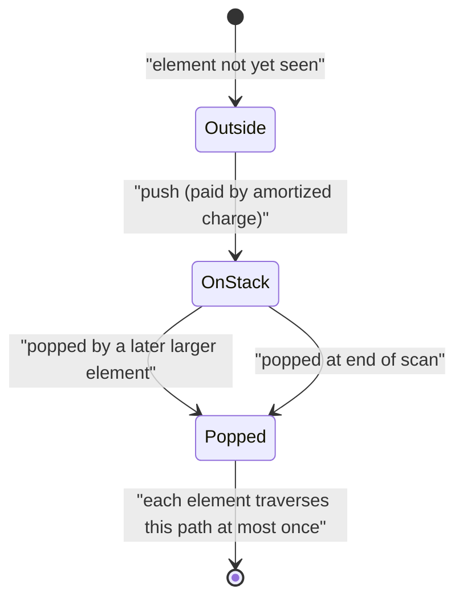
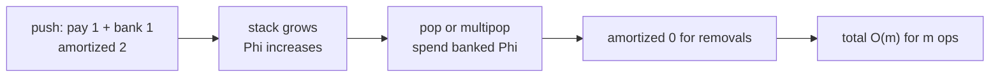

# Amortization &amp; Potential Arguments

> Amortized analysis measures the **average cost per operation over a worst-case sequence** of operations, without invoking probability. A single operation may be expensive, yet if expensive operations are rare enough, the *sequence* is cheap. This guide develops the three classical techniques — aggregate, accounting (banker's), and potential — and applies them rigorously to dynamic arrays, binary counters, and the "each element pushed/popped once" stack argument.

## Table of Contents

1. [What Amortized Analysis Is](#what-amortized-analysis-is)
2. [Why Worst-Case-Per-Operation Is Pessimistic](#why-worst-case-per-operation-is-pessimistic)
3. [Method 1 — Aggregate Analysis](#method-1--aggregate-analysis)
4. [Method 2 — The Accounting (Banker's) Method](#method-2--the-accounting-bankers-method)
5. [Method 3 — The Potential Method](#method-3--the-potential-method)
6. [Worked Example: Dynamic Array Doubling](#worked-example-dynamic-array-doubling)
7. [Worked Example: Binary Counter Increment](#worked-example-binary-counter-increment)
8. [Worked Example: Monotonic Stack / Two Pointers](#worked-example-monotonic-stack--two-pointers)
9. [Worked Example: Multipop Stack](#worked-example-multipop-stack)
10. [Brief Mention: Splay Trees and Union-Find](#brief-mention-splay-trees-and-union-find)
11. [Complexity Summary](#complexity-summary)
12. [Common Pitfalls](#common-pitfalls)
13. [Patterns](#patterns)

## What Amortized Analysis Is

Given a sequence of $m$ operations on a data structure, let $c_1, c_2, \dots, c_m$ be the **actual** costs. The total cost is $\sum_{i=1}^{m} c_i$. The **amortized cost per operation** is defined as

$$\text{amortized cost} = \frac{1}{m}\sum_{i=1}^{m} c_i.$$

This is a *worst-case* guarantee on the average — there is **no randomness**. We assign each operation a charge $\hat{c}_i$ (its amortized cost) such that

$$\sum_{i=1}^{m} \hat{c}_i \ge \sum_{i=1}^{m} c_i,$$

so the total amortized charge upper-bounds the true total. If every $\hat{c}_i = O(1)$, then $m$ operations cost $O(m)$ in total even if some individual $c_i$ is as large as $\Theta(m)$.

```python
class Counter:
    """Tracks actual vs amortized totals to make the invariant concrete."""
    def __init__(self):
        self.actual_total = 0
        self.amortized_total = 0

    def charge(self, actual, amortized):
        self.actual_total += actual
        self.amortized_total += amortized
        # Invariant we must preserve: amortized_total >= actual_total
        assert self.amortized_total >= self.actual_total
```

```cpp
#include <bits/stdc++.h>
using namespace std;

struct Counter {
    // Tracks actual vs amortized totals to make the invariant concrete.
    long long actual_total = 0;
    long long amortized_total = 0;

    void charge(long long actual, long long amortized) {
        actual_total += actual;
        amortized_total += amortized;
        // Invariant we must preserve: amortized_total >= actual_total
        assert(amortized_total >= actual_total);
    }
};
```

## Why Worst-Case-Per-Operation Is Pessimistic

Consider `push_back` on a dynamic array. Most pushes write one slot ($c_i = 1$). Occasionally the buffer is full and we copy all $n$ elements to a buffer of double size ($c_i = n + 1$). A naive worst-case-per-operation bound multiplies the largest single cost by $m$:

$$\text{naive bound} = m \cdot \max_i c_i = m \cdot \Theta(m) = \Theta(m^2).$$

This is wildly pessimistic: the expensive resizes happen only at sizes $1, 2, 4, 8, \dots$, so they are geometrically rare. The true total is $\Theta(m)$.



The spikes occur exactly at powers of two; everything else is the flat baseline of cost 1. Amortization "smooths" these spikes into a constant per-operation charge.



## Method 1 — Aggregate Analysis

In **aggregate analysis** we bound the total cost of the whole sequence directly, then divide by $m$. No per-operation reasoning is needed.

For $n$ `push_back` operations starting from an empty array, copies happen at sizes $1, 2, 4, \dots, 2^{\lfloor \log_2 n \rfloor}$. The total copying work is

$$\sum_{j=0}^{\lfloor \log_2 n \rfloor} 2^{j} \le 2n,$$

plus $n$ unit writes for the elements themselves. Total $\le 3n = O(n)$, so the amortized cost per push is $\le 3 = O(1)$.

```python
def total_cost_aggregate(n):
    """Simulate n push_backs; return the true total cost (writes + copies)."""
    cost = 0
    size = 0
    cap = 1
    for _ in range(n):
        if size == cap:          # buffer full -> resize and copy
            cost += size         # copy `size` old elements
            cap *= 2
        cost += 1                # write the new element
        size += 1
    return cost                  # empirically <= 3n
```

```cpp
#include <bits/stdc++.h>
using namespace std;

long long total_cost_aggregate(long long n) {
    // Simulate n push_backs; return the true total cost (writes + copies).
    long long cost = 0, size = 0, cap = 1;
    for (long long i = 0; i < n; ++i) {
        if (size == cap) {       // buffer full -> resize and copy
            cost += size;        // copy `size` old elements
            cap *= 2;
        }
        cost += 1;               // write the new element
        size += 1;
    }
    return cost;                 // empirically <= 3n
}
```

## Method 2 — The Accounting (Banker's) Method

In the **accounting method** we *overcharge* cheap operations and store the surplus as **credit** on data-structure elements. Expensive operations are paid for by spending stored credit. The rule:

$$\text{stored credit} = \sum_i \hat{c}_i - \sum_i c_i \ge 0 \quad \text{at all times.}$$

For dynamic arrays, charge each `push_back` an amortized $\hat{c} = 3$: one unit pays for writing the new element, and **two units of credit** are stored on it. When the buffer of size $n$ doubles, each of the $n/2$ elements added since the last resize carries 2 credits — exactly enough to pay for copying all $n$ elements (the $n/2$ "old" copied elements were already paid by the previous round's leftover, and the $n/2$ "new" ones each donate their 2 credits to cover the 2 elements that must move).



```python
def accounting_check(n, amortized_charge=3):
    """Verify the credit pool never goes negative with a fixed charge."""
    credit = 0
    size = 0
    cap = 1
    for _ in range(n):
        credit += amortized_charge   # collect amortized charge
        if size == cap:              # resize: pay actual copy cost
            credit -= size
            cap *= 2
        credit -= 1                  # pay to write new element
        size += 1
        if credit < 0:
            return False             # invariant violated
    return True
```

```cpp
#include <bits/stdc++.h>
using namespace std;

bool accounting_check(long long n, long long amortized_charge = 3) {
    // Verify the credit pool never goes negative with a fixed charge.
    long long credit = 0, size = 0, cap = 1;
    for (long long i = 0; i < n; ++i) {
        credit += amortized_charge;  // collect amortized charge
        if (size == cap) {           // resize: pay actual copy cost
            credit -= size;
            cap *= 2;
        }
        credit -= 1;                 // pay to write new element
        size += 1;
        if (credit < 0) return false; // invariant violated
    }
    return true;
}
```

## Method 3 — The Potential Method

The **potential method** is the most general and powerful. We define a **potential function** $\Phi$ that maps each data-structure state $D_i$ (after the $i$-th operation) to a real number, with

$$\Phi(D_0) = 0 \quad\text{and}\quad \Phi(D_i) \ge 0 \text{ for all } i.$$

The **amortized cost** of the $i$-th operation is defined as the actual cost plus the change in potential:

$$\hat{c}_i = c_i + \Phi_i - \Phi_{i-1},$$

where $\Phi_i = \Phi(D_i)$. Summing telescopes the potential terms:

$$\sum_{i=1}^{m} \hat{c}_i = \sum_{i=1}^{m} c_i + \Phi_m - \Phi_0 = \sum_{i=1}^{m} c_i + \Phi_m \ge \sum_{i=1}^{m} c_i,$$

because $\Phi_m \ge 0 = \Phi_0$. So the sum of amortized costs upper-bounds the true total — exactly the guarantee we want. Intuitively, $\Phi$ is "prepaid work" stored in the structure: when an operation is cheap it raises $\Phi$ (banks work); when expensive it releases $\Phi$ to absorb the cost.



The general algorithm to use it:

1. Choose $\Phi$ so that $\Phi_0 = 0$ and $\Phi_i \ge 0$.
2. For each operation type, compute $\hat{c}_i = c_i + \Delta\Phi$.
3. Show every $\hat{c}_i$ is bounded (ideally $O(1)$).

```python
def amortized_cost(actual_cost, phi_before, phi_after):
    r"""Compute \hat{c}_i = c_i + \Phi_i - \Phi_{i-1}."""
    return actual_cost + phi_after - phi_before
```

```cpp
#include <bits/stdc++.h>
using namespace std;

// Compute  c_hat_i = c_i + Phi_i - Phi_{i-1}.
long long amortized_cost(long long actual_cost, long long phi_before, long long phi_after) {
    return actual_cost + phi_after - phi_before;
}
```

## Worked Example: Dynamic Array Doubling

Let the array have `num` stored elements and capacity `cap`. Define the potential

$$\Phi = 2 \cdot \text{num} - \text{cap}.$$

We keep the invariant $\text{num} \ge \text{cap}/2$ (true immediately after any doubling), so $\Phi \ge 0$. Initially an empty array can be modeled with $\Phi_0 = 0$.

**Case A — push without resize** ($\text{num} < \text{cap}$): actual cost $c_i = 1$. After the push, $\text{num}$ increases by 1, $\text{cap}$ unchanged, so $\Delta\Phi = 2$. Then

$$\hat{c}_i = 1 + 2 = 3 = O(1).$$

**Case B — push with resize** (buffer full, $\text{num} = \text{cap}$ before push): actual cost $c_i = \text{num} + 1$ (copy `num` elements plus write one). Capacity goes $\text{cap} \to 2\,\text{cap} = 2\,\text{num}$, and `num` becomes $\text{num} + 1$. Compute the potential before and after:

$$\Phi_{i-1} = 2\,\text{num} - \text{cap} = 2\,\text{num} - \text{num} = \text{num},$$
$$\Phi_i = 2(\text{num}+1) - 2\,\text{num} = 2.$$

Therefore

$$\hat{c}_i = (\text{num} + 1) + (2 - \text{num}) = 3 = O(1).$$

Both cases give amortized cost $3$, so $n$ pushes cost $\le 3n = O(n)$.



```python
class DynamicArray:
    def __init__(self):
        self.data = [None]      # capacity 1
        self.num = 0

    def potential(self):
        return 2 * self.num - len(self.data)

    def push_back(self, x):
        actual = 1
        if self.num == len(self.data):     # full -> double
            actual += self.num             # copy cost
            self.data = self.data + [None] * len(self.data)
        self.data[self.num] = x
        self.num += 1
        return actual                      # amortized is always 3
```

```cpp
#include <bits/stdc++.h>
using namespace std;

struct DynamicArray {
    vector<long long> data;   // acts as the backing buffer
    long long num = 0;
    long long cap = 1;

    DynamicArray() { data.assign(1, 0); }

    long long potential() const { return 2 * num - cap; }

    long long push_back(long long x) {
        long long actual = 1;
        if (num == cap) {                  // full -> double
            actual += num;                 // copy cost
            cap *= 2;
            data.resize(cap, 0);
        }
        data[num] = x;
        num += 1;
        return actual;                     // amortized is always 3
    }
};
```

## Worked Example: Binary Counter Increment

A $k$-bit binary counter supports `increment`. The actual cost of an increment is the number of bits that flip. In the worst case (e.g. `0111 -> 1000`) that is $k+1$ flips, so a naive bound on $n$ increments is $O(nk)$. Amortization shows it is $O(n)$.

**Potential method.** Let $\Phi = b_i$, the number of **1-bits** currently set. Clearly $\Phi_0 = 0$ and $\Phi_i \ge 0$.

An increment that flips $t$ trailing 1-bits to 0 and then sets one 0-bit to 1 has actual cost $c_i = t + 1$. The number of set bits changes by $\Delta\Phi = 1 - t$ (we cleared $t$ ones, set one). Hence

$$\hat{c}_i = (t + 1) + (1 - t) = 2 = O(1).$$

So $n$ increments cost $\le 2n = O(n)$, independent of $k$.

**Aggregate cross-check.** Bit $0$ flips every increment ($n$ times), bit $1$ every other increment ($\lfloor n/2 \rfloor$), bit $j$ every $2^j$ increments. Total flips:

$$\sum_{j=0}^{k-1} \left\lfloor \frac{n}{2^j} \right\rfloor < n \sum_{j=0}^{\infty} \frac{1}{2^j} = 2n.$$

Both methods agree: $O(n)$.



```python
def increment(bits):
    """bits is a list of 0/1, least significant first. Returns flips done."""
    flips = 0
    i = 0
    while i < len(bits) and bits[i] == 1:
        bits[i] = 0          # flip a trailing 1 -> 0
        flips += 1
        i += 1
    if i < len(bits):
        bits[i] = 1          # set the first 0 -> 1
        flips += 1
    return flips             # amortized cost is 2
```

```cpp
#include <bits/stdc++.h>
using namespace std;

long long increment(vector<int>& bits) {
    // bits is 0/1, least significant first. Returns flips done.
    long long flips = 0;
    size_t i = 0;
    while (i < bits.size() && bits[i] == 1) {
        bits[i] = 0;         // flip a trailing 1 -> 0
        flips += 1;
        i += 1;
    }
    if (i < bits.size()) {
        bits[i] = 1;         // set the first 0 -> 1
        flips += 1;
    }
    return flips;            // amortized cost is 2
}
```

## Worked Example: Monotonic Stack / Two Pointers

The "**each element is pushed once and popped once**" argument is amortization in disguise. In a monotonic-stack scan (e.g. next-greater-element), the inner `while` loop can pop many elements in one iteration, so a per-iteration worst-case bound suggests $O(n^2)$. But across the *whole* run each element enters the stack at most once and leaves at most once.

**Potential method.** Let $\Phi = $ the number of elements currently on the stack. $\Phi_0 = 0$, $\Phi \ge 0$.

Processing element $x$: suppose the inner loop pops $p$ elements, then pushes $x$. Actual cost $c_i = p + 1$. Potential change $\Delta\Phi = 1 - p$ (we removed $p$, added $1$). So

$$\hat{c}_i = (p + 1) + (1 - p) = 2 = O(1),$$

giving $O(n)$ over the whole scan regardless of how lopsided individual steps are.



```python
def next_greater(nums):
    """For each i, index of next element to the right that is greater, else -1."""
    n = len(nums)
    ans = [-1] * n
    stack = []                       # holds indices, values decreasing
    for i in range(n):
        while stack and nums[stack[-1]] < nums[i]:
            ans[stack.pop()] = i     # each index popped at most once
        stack.append(i)             # each index pushed exactly once
    return ans
```

```cpp
#include <bits/stdc++.h>
using namespace std;

vector<long long> next_greater(const vector<long long>& nums) {
    // For each i, index of next element to the right that is greater, else -1.
    long long n = (long long)nums.size();
    vector<long long> ans(n, -1);
    vector<long long> stack;             // holds indices, values decreasing
    for (long long i = 0; i < n; ++i) {
        while (!stack.empty() && nums[stack.back()] < nums[i]) {
            ans[stack.back()] = i;       // each index popped at most once
            stack.pop_back();
        }
        stack.push_back(i);              // each index pushed exactly once
    }
    return ans;
}
```

## Worked Example: Multipop Stack

A `MultiStack` supports `push(x)` (cost 1), `pop()` (cost 1), and `multipop(k)` which pops $\min(k, \text{size})$ elements (cost = number actually popped). A single `multipop` can cost up to the current size, suggesting $O(m)$ per call and $O(m^2)$ overall. Amortization fixes this.

**Potential method.** Let $\Phi = $ stack size. $\Phi_0 = 0$, $\Phi \ge 0$.

- `push`: $c_i = 1$, $\Delta\Phi = +1 \Rightarrow \hat{c}_i = 2$.
- `pop`: $c_i = 1$, $\Delta\Phi = -1 \Rightarrow \hat{c}_i = 0$.
- `multipop(k)` popping $p = \min(k, \text{size})$: $c_i = p$, $\Delta\Phi = -p \Rightarrow \hat{c}_i = p - p = 0$.

Every operation has amortized cost $\le 2 = O(1)$, so any sequence of $m$ operations costs $O(m)$. An element can only be popped if it was pushed, which is the same "charge the push, free the pop" intuition.



```python
class MultiStack:
    def __init__(self):
        self.s = []

    def push(self, x):
        self.s.append(x)            # actual 1, amortized 2

    def pop(self):
        if self.s:
            self.s.pop()            # actual 1, amortized 0

    def multipop(self, k):
        popped = 0
        while self.s and popped < k:
            self.s.pop()            # paid for at push time
            popped += 1
        return popped               # actual = popped, amortized 0
```

```cpp
#include <bits/stdc++.h>
using namespace std;

struct MultiStack {
    vector<long long> s;

    void push(long long x) {
        s.push_back(x);             // actual 1, amortized 2
    }

    void pop() {
        if (!s.empty()) s.pop_back(); // actual 1, amortized 0
    }

    long long multipop(long long k) {
        long long popped = 0;
        while (!s.empty() && popped < k) {
            s.pop_back();           // paid for at push time
            popped += 1;
        }
        return popped;              // actual = popped, amortized 0
    }
};
```

## Brief Mention: Splay Trees and Union-Find

Two famous structures whose efficiency is *only* visible through amortization:

- **Splay trees** rotate an accessed node to the root. A single access can be $\Theta(n)$, but with the potential $\Phi = \sum_x \log(\text{size of subtree at } x)$, every access has amortized cost $O(\log n)$. The potential is the sum of "ranks", and the famous *Access Lemma* bounds the telescoped potential drop.
- **Union-Find with union by rank + path compression** has total cost $O(m\,\alpha(n))$ for $m$ operations, where $\alpha$ is the inverse Ackermann function. The proof assigns a potential based on the rank structure; each `find` that compresses a long path pays for itself by reducing future potential. Path compression is precisely a "do expensive cleanup now to make everything later cheap" amortized trade.

```python
def find(parent, x):
    """Union-Find find with path compression: the expensive flattening is amortized."""
    root = x
    while parent[root] != root:
        root = parent[root]
    while parent[x] != root:        # compress: each node points to root
        parent[x], x = root, parent[x]
    return root
```

```cpp
#include <bits/stdc++.h>
using namespace std;

long long find(vector<long long>& parent, long long x) {
    // Union-Find find with path compression: flattening is amortized.
    long long root = x;
    while (parent[root] != root) root = parent[root];
    while (parent[x] != root) {     // compress: each node points to root
        long long nxt = parent[x];
        parent[x] = root;
        x = nxt;
    }
    return root;
}
```

## Complexity Summary

| Structure / Operation | Worst-case single op | Amortized per op | Total for $m$ ops | Technique |
| --- | --- | --- | --- | --- |
| Dynamic array `push_back` | $\Theta(n)$ on resize | $O(1)$ | $O(m)$ | $\Phi = 2\,\text{num} - \text{cap}$ |
| Binary counter `increment` | $\Theta(k)$ | $O(1)$ | $O(m)$ | $\Phi = $ number of 1-bits |
| Monotonic stack scan | $\Theta(n)$ inner loop | $O(1)$ | $O(n)$ | $\Phi = $ stack size |
| Multipop stack | $\Theta(\text{size})$ | $O(1)$ | $O(m)$ | $\Phi = $ stack size |
| Splay tree access | $\Theta(n)$ | $O(\log n)$ | $O(m \log n)$ | $\Phi = \sum \log(\text{subtree})$ |
| Union-Find op | $\Theta(\log n)$ | $O(\alpha(n))$ | $O(m\,\alpha(n))$ | rank-based potential |

## Common Pitfalls

- **Forgetting $\Phi_0 = 0$ or $\Phi_i \ge 0$.** If the potential can go negative, the telescoping inequality $\sum \hat{c}_i \ge \sum c_i$ breaks and the bound is invalid.
- **Confusing amortized with average-case.** Amortized analysis is a *worst-case* guarantee over a sequence; there is no probability distribution involved.
- **Charging credit you have not banked.** In the accounting method the credit pool must stay $\ge 0$ at every step, not just at the end.
- **Assuming amortized bounds give per-operation guarantees.** A single operation can still be slow; amortization only bounds the *total*. Real-time systems may need *de-amortized* (worst-case-per-op) variants.
- **Geometric vs additive growth.** Growing the array by a *constant* increment (e.g. +10) instead of *doubling* destroys the $O(1)$ amortized bound — it becomes $\Theta(n)$ per push amortized. The geometric factor is essential.
- **Mixing operations that the potential does not account for.** If you add a `clear()` that frees credit, re-derive $\Delta\Phi$ for it; do not assume old charges still hold.

## Patterns

- **"Pay forward" with the potential method.** When some operations are cheap and some rare-but-expensive, define $\Phi$ to *rise* on cheap ops and *fall* on expensive ones so the amortized cost is flat.
- **"Each element processed a bounded number of times."** Two pointers, sliding window, and monotonic stacks all reduce to: each element is pushed/added once and popped/removed once $\Rightarrow O(n)$. Recognize this and skip a formal potential when the count argument suffices.
- **Geometric resizing.** Whenever a buffer must grow, multiply its size by a constant factor ($> 1$) to get $O(1)$ amortized append. The same idea de-amortizes hashing rehashes.
- **Potential = "size of the mess."** A reliable first guess for $\Phi$ is a non-negative measure of how much un-cleaned-up work the structure holds (stack height, set bits, subtree ranks). Operations that create mess pay extra; operations that clean it up are free.
- **Cross-check with aggregate.** After a potential-method derivation, verify with a direct aggregate sum (geometric series for resizing/counters). If they disagree, the potential function is wrong.
